# GitHub Actions Workflows - TFG Chatbot

Este directorio contiene los workflows de CI/CD del proyecto. La estrategia está diseñada para tu arquitectura específica con **Podman** y tests que requieren contenedores desplegados.

## 📋 Estrategia de CI

### Principios de Diseño

1. **Tests unitarios rápidos en CI** - Sin contenedores, ejecutan en ~2-5 minutos
2. **Tests de infraestructura manual/nocturno** - Requieren todos los contenedores
3. **Tests de integración programados** - Full E2E, costosos
4. **Builds validados automáticamente** - Cada PR valida que construye
5. **Seguridad continua** - Scans semanales y en cambios de dependencias

## 🚀 Workflows Automáticos (ejecutan en cada PR)

### 1. Code Quality (`lint.yml`)
**Ejecuta en**: Cada push y PR  
**Duración**: ~1-2 minutos  
**Propósito**: Validar calidad de código

```bash
# Checks que ejecuta:
- ruff check .
- black --check .
- isort --check .
- mypy (no falla el build, solo advierte)
```

**Falla el PR si**: Hay errores de lint o formato

### 2. Unit Tests (`unit-tests.yml`)
**Ejecuta en**: Cada push y PR  
**Duración**: ~3-5 minutos  
**Propósito**: Ejecutar tests unitarios rápidos

```bash
# Tests que ejecuta:
Backend:
  cd backend && pytest tests/ -v --cov

RAG Service:  
  cd rag_service && pytest tests/ -m unit -v --cov
```

**Características**:
- ✅ Sin dependencias de contenedores
- ✅ Usa mocks para servicios externos
- ✅ Reporta cobertura a Codecov
- ✅ Cachea dependencias pip

**Falla el PR si**: Algún test unitario falla

### 3. Build Containers (`build-containers.yml`)
**Ejecuta en**: PRs que tocan Dockerfiles o código de servicios  
**Duración**: ~5-7 minutos  
**Propósito**: Validar que los contenedores construyen

```bash
# Valida:
- docker build -f backend/Dockerfile .
- docker build -f rag_service/Dockerfile .
- docker run (smoke test)
```

**Características**:
- ✅ Usa Docker BuildKit con cache
- ✅ Prueba que la imagen arranca
- ✅ Build args (INSTALL_DEV=true)

**Falla el PR si**: Los Dockerfiles tienen errores

### 4. PR Checks (`ci.yml`)
**Ejecuta en**: Cada PR  
**Duración**: Instantáneo  
**Propósito**: Información y resumen

- Muestra info del PR
- Genera resumen con comandos locales
- Lista todos los checks activos

## 🔒 Workflows de Seguridad

### 5. Security (`security.yml`)
**Ejecuta en**:
- PRs que tocan `pyproject.toml` o requirements
- Push a main con cambios de dependencias
- Semanalmente (lunes 8 AM)
- Manual

**Duración**: ~5-8 minutos  
**Propósito**: Detectar vulnerabilidades

```bash
# Herramientas:
- pip-audit (vulnerabilidades conocidas)
- safety check (base de datos de CVEs)
- Trivy (scan de imágenes Docker)
- Test de instalación en Python 3.11 y 3.12
```

**No falla el PR** (continue-on-error: true) pero avisa

### 6. Dependabot (`dependabot.yml`)
**Ejecuta**: Automáticamente cada lunes  
**Propósito**: Mantener dependencias actualizadas

- GitHub Actions
- Python packages (root, backend, rag_service)
- Docker base images

Crea PRs automáticos con actualizaciones

## 🏗️ Workflows Manuales/Nocturnos

### 7. Infrastructure Tests (`infrastructure-tests.yml`)
**Ejecuta en**:
- Manual (workflow_dispatch)
- Nocturn (2 AM UTC)

**Duración**: ~15-20 minutos  
**Propósito**: Validar todos los contenedores funcionan

```bash
# Proceso:
1. docker-compose up -d
2. Esperar que servicios estén healthy
3. Inicializar Ollama (pull model)
4. pytest tests/infrastructure/ -m podman_container
```

**Servicios testeados**:
- MongoDB (10 tests)
- Qdrant (8 tests)
- Ollama (12 tests)
- Backend (4 tests)
- RAG Service (10 tests)
- vLLM (6 tests) - si está habilitado

**Requiere**: 
- `GEMINI_API_KEY` secret configurado
- GitHub Actions runner con Docker

### 8. Integration Tests (`integration-tests.yml`)
**Ejecuta en**:
- Manual (workflow_dispatch)
- Nocturno (3 AM UTC)
- PRs que tocan lógica crítica

**Duración**: ~20-30 minutos  
**Propósito**: Tests E2E completos

```bash
# Proceso:
1. docker-compose up -d (todos los servicios)
2. Esperar readiness
3. pytest tests/integration/ -m integration
```

**Tests incluidos**:
- Conversaciones con el chatbot
- Memoria y contexto
- Uso de herramientas
- Flujo completo RAG (index → search)
- Filtros de metadata
- Upload de archivos

## 🔧 Workflows de Release

### 9. Release (`release.yml`)
**Ejecuta en**: Push de tags `v*`  
**Propósito**: Crear releases en GitHub

```bash
# Cuando haces:
git tag v0.1.5
git push origin v0.1.5

# GitHub crea un release con:
- Tag version
- Release notes desde CHANGELOG.md
```

### 10. Jekyll Pages (`jekyll.yml`)
**Ejecuta en**: Push a main  
**Propósito**: Publicar documentación

Genera el sitio web en GitHub Pages

## 📊 Configuración Requerida

### Secrets de GitHub

Necesitas configurar estos secrets en tu repositorio:

```
Settings → Secrets and variables → Actions → New repository secret
```

**Obligatorios**:
- `GEMINI_API_KEY`: Para infrastructure/integration tests
  - Obtener de: https://aistudio.google.com/app/apikey

**Opcionales**:
- `CODECOV_TOKEN`: Para reportes de cobertura
  - Obtener de: https://codecov.io

### Branch Protection Rules

Recomendado configurar en `main`:

```
Settings → Branches → Add rule
```

- ✅ Require status checks to pass before merging
  - Code Quality
  - Backend Unit Tests
  - RAG Service Unit Tests
  - Build Backend Container
  - Build RAG Service Container
- ✅ Require branches to be up to date before merging
- ✅ Require linear history (opcional)

## 🚦 Estado de los Checks

### ✅ Debe pasar en CADA PR:
- Code Quality (lint, format)
- Unit Tests Backend
- Unit Tests RAG Service
- Build Containers

### ⚠️ Ejecuta pero no falla PR:
- Type checking (mypy)
- Security scans

### 🌙 Manual/Nocturno (no bloquea PRs):
- Infrastructure Tests
- Integration Tests

## 📖 Guía de Uso

### Antes de hacer un PR

```bash
# 1. Lint y formato
ruff check . && black . && isort .

# 2. Tests unitarios
pytest backend/tests/ -m unit -v
pytest rag_service/tests/ -m unit -v

# 3. Build local (con podman)
podman-compose build
```

### Si falla el CI

**Code Quality Failed:**
```bash
# Auto-fix lo que se pueda
ruff check --fix .
black .
isort .

# Commit y push
git add .
git commit -m "fix: apply linting and formatting"
git push
```

**Unit Tests Failed:**
```bash
# Ejecutar localmente para ver el error
pytest backend/tests/ -v -s
pytest rag_service/tests/ -m unit -v -s

# Fix el código y volver a probar
```

**Build Failed:**
```bash
# Probar build local
podman build -t test-backend -f backend/Dockerfile .
podman build -t test-rag -f rag_service/Dockerfile .

# Ver logs si falla
podman logs <container_id>
```

### Ejecutar tests de infraestructura localmente

```bash
# 1. Levantar todos los servicios
podman-compose up -d

# 2. Esperar e inicializar Ollama
./scripts/init_ollama.sh

# 3. Ejecutar tests
pytest tests/infrastructure/ -v -m podman_container

# 4. Limpiar
podman-compose down -v
```

### Ejecutar tests de integración localmente

```bash
# 1. Servicios corriendo (ver arriba)

# 2. Ejecutar tests
pytest tests/integration/ -m integration -v

# 3. Ver logs si falla
podman-compose logs backend
podman-compose logs rag_service
```

## 🔄 Flujo de Trabajo Completo

```mermaid
graph TD
    A[Push/PR a main] --> B{Tipo}
    B -->|PR| C[Code Quality]
    B -->|PR| D[Unit Tests]
    B -->|PR| E[Build Containers]
    C --> F{Todos pasan?}
    D --> F
    E --> F
    F -->|Sí| G[✅ PR puede mergearse]
    F -->|No| H[❌ Fix errores]
    H --> A
    G --> I[Merge a main]
    I --> J[Jekyll Pages]
    I --> K{Hay tag?}
    K -->|Sí| L[Create Release]
    K -->|No| M[Fin]
    L --> M
```



## 🎯 Beneficios de esta Estrategia

### ✅ Ventajas

1. **Rápido feedback en PRs**: ~5-7 minutos
2. **No satura GitHub Actions**: Tests pesados solo nocturnos
3. **Respeta tu arquitectura**: Tests unitarios sin contenedores
4. **Seguridad continua**: Scans automáticos
5. **Dependencias actualizadas**: Dependabot semanal
6. **Flexible**: Infrastructure/Integration manuales cuando necesites

### 📈 Métricas Objetivo

- **PR Check Time**: < 10 minutos
- **Infrastructure Tests**: < 30 minutos
- **Integration Tests**: < 45 minutos
- **False Positives**: < 5%
- **Code Coverage**: > 70% (objetivo)

## 🆘 Troubleshooting

### "Workflow failed pero no sé por qué"

1. Ve a Actions tab
2. Click en el workflow fallido
3. Click en el job rojo
4. Expande el step que falló
5. Lee el error completo

### "Tests pasan localmente pero fallan en CI"

Posibles causas:
- Diferencias Python version (local 3.11 vs CI 3.12)
- Dependencias no instaladas en pyproject.toml
- Paths relativos vs absolutos
- Variables de entorno faltantes

### "Infrastructure tests fallan"

- Verificar que GEMINI_API_KEY secret esté configurado
- Ver logs de contenedores en el workflow
- Probar localmente primero

### "Dependabot crea muchos PRs"

Configurar en `.github/dependabot.yml`:
```yaml
open-pull-requests-limit: 3  # Reducir de 5 a 3
```

## 📚 Referencias

- [GitHub Actions Docs](https://docs.github.com/en/actions)
- [Podman Compose](https://github.com/containers/podman-compose)
- [pytest markers](https://docs.pytest.org/en/stable/example/markers.html)
- [Codecov](https://docs.codecov.com/)

## 🤝 Contribuir

Al modificar workflows:

1. Probar localmente con [act](https://github.com/nektos/act) si es posible
2. Documentar cambios en este README
3. Actualizar tiempos estimados
4. Validar que no rompe branch protection

---

**Última actualización**: 15 de noviembre de 2025  
**Versión**: 1.0.0
