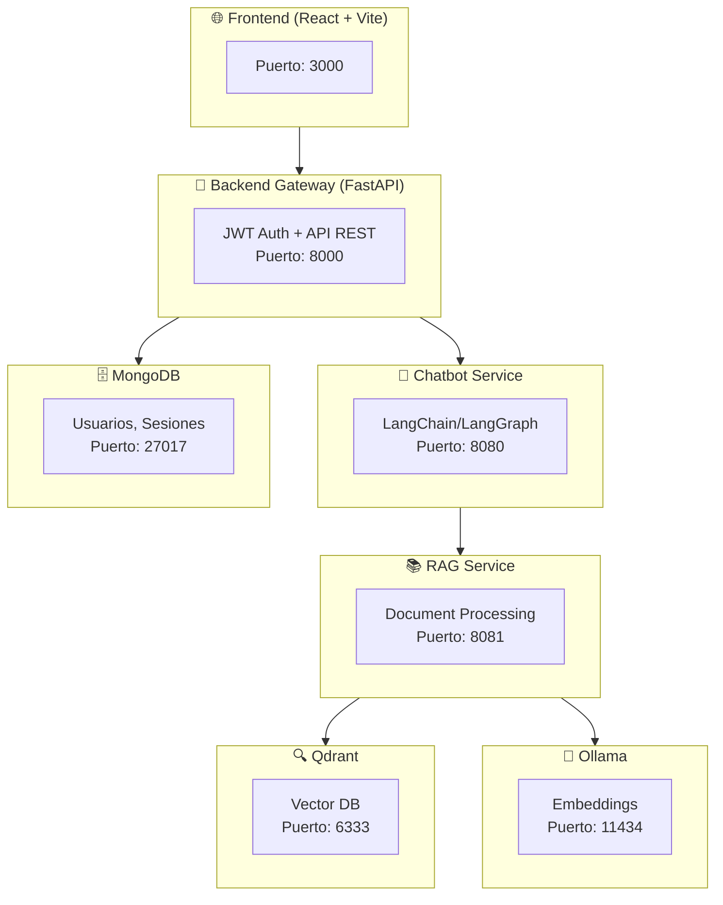

# TFG Chatbot - Agente IA Pedagógico para Entornos Educativos

[](README.md)
[](LICENSE)
[](https://github.com/GabrielFranciscoSM/TFG-Chatbot)
[](https://github.com/GabrielFranciscoSM/TFG-Chatbot/releases)
[](https://gabrielfranciscosm.github.io/TFG-Chatbot/)

## 🚀 Quick Start

Levanta el proyecto en **5 minutos** con Docker Compose.

### 1. Clonar el repositorio

```bash
git clone https://github.com/GabrielFranciscoSM/TFG-Chatbot.git
cd TFG-Chatbot
```

### 2. Configurar variables de entorno

```bash
cp .env.example .env
```

> [!TIP]
> **Las API keys de LLM son opcionales.** Si no configuras una API key (Gemini/Mistral), puedes usar modelos locales con Ollama/vLLM. Para usar Gemini (recomendado), obtén una API key gratuita en [Google AI Studio](https://aistudio.google.com/app/apikey) y añádela a `.env`:
> ```
> LLM_PROVIDER=gemini
> GEMINI_API_KEY=tu-api-key-aqui
> ```

### 3. Levantar los servicios

```bash
docker compose up -d
```

### 4. Descargar el modelo de embeddings (Ollama)

El servicio RAG necesita el modelo `nomic-embed-text` para los embeddings:

```bash
# Opción A: Ejecutar el script de inicialización
./scripts/init_ollama.sh

# Opción B: Descargar manualmente
docker exec ollama-service ollama pull nomic-embed-text
```

### 5. Crear usuarios de demostración

```bash
uv run scripts/seed_users.py
```

> [!NOTE]
> Si no tienes `uv` instalado, puedes ejecutar: `pip install uv` o `pipx install uv`

### ✅ ¡Listo!

Accede a la aplicación:

| Servicio | URL |
|----------|-----|
| **Frontend** | http://localhost:3000 |
| **API Docs (Swagger)** | http://localhost:8000/docs |
| **Phoenix (Observabilidad LLM)** | http://localhost:6006 |
| **Grafana (Métricas)** | http://localhost:3001 |

**Credenciales de demo:**

| Usuario | Contraseña | Rol |
|---------|------------|-----|
| `admin` | `admin123` | Administrador |
| `profesor` | `admin123` | Profesor |
| `estudiante` | `admin123` | Estudiante |

---

## Descripción

**Trabajo de Fin de Grado (TFG)** de Ingeniería Informática que desarrolla un agente conversacional basado en IA orientado a entornos educativos. El proyecto combina los beneficios de los modelos de lenguaje (LLMs) con directrices pedagógicas para crear un tutor inteligente que reduce alucinaciones y favorece el aprendizaje activo del estudiante.

### Objetivos del Proyecto

- **Investigar** la aplicación de LLMs en la educación, mitigando sus riesgos (alucinaciones, respuestas directas sin razonamiento).
- **Desarrollar** un chatbot educativo con herramientas especializadas y memoria conversacional.
- **Implementar** una arquitectura de microservicios moderna con buenas prácticas de desarrollo.
- **Documentar** todo el proceso siguiendo la metodología Scrum.

---

## Arquitectura

El proyecto sigue una **arquitectura de microservicios** orquestada con Docker Compose:



### Servicios

| Servicio | Tecnología | Descripción |
|----------|------------|-------------|
| **Frontend** | React 19, TypeScript, Vite, Tailwind CSS, shadcn/ui | Interfaz de chat y panel de administración |
| **Backend Gateway** | FastAPI, PyMongo, JWT | API REST, autenticación RBAC, proxy a servicios |
| **Chatbot** | FastAPI, LangChain, LangGraph | Agente conversacional con herramientas pedagógicas |
| **RAG Service** | FastAPI, Sentence Transformers | Procesamiento de documentos y búsqueda semántica |
| **Qdrant** | Vector Database | Almacenamiento de embeddings para RAG |
| **Ollama** | LLM Server | Servicio de embeddings local |
| **MongoDB** | NoSQL Database | Persistencia de usuarios, sesiones y guías docentes |

---

## Tecnologías Principales

### Backend (Python 3.13+)
- **Framework API**: FastAPI + Uvicorn
- **IA/LLM**: LangChain, LangGraph, LangChain-Google-GenAI, LangChain-OpenAI
- **Base de datos**: MongoDB (PyMongo), SQLite (memoria del grafo)
- **Vector Store**: Qdrant Client
- **Validación**: Pydantic, Pydantic-Settings

### Frontend (Node.js 20+)
- **Framework**: React 19 + TypeScript
- **Build Tool**: Vite 7
- **Styling**: Tailwind CSS 4, shadcn/ui (Radix UI)
- **Estado/Fetching**: TanStack Query, React Hook Form, Zod
- **Routing**: React Router DOM 7

### Infraestructura
- **Contenedores**: Docker + Docker Compose
- **CI/CD**: GitHub Actions (lint, test, build, security)
- **Calidad de código**: Ruff, Black, isort, MyPy, Biome

---

## Instalación y Ejecución

### Prerrequisitos

- Python 3.13+ y [uv](https://github.com/astral-sh/uv) (gestor de paquetes)
- Node.js 20+ y npm
- Docker y Docker Compose
- Variables de entorno configuradas (ver `.env.example`)

### Con Docker Compose (Recomendado)

```bash
# Clonar el repositorio
git clone https://github.com/GabrielFranciscoSM/TFG-Chatbot.git
cd TFG-Chatbot

# Configurar variables de entorno
cp .env.example .env
# Editar .env con tus credenciales (API keys, MongoDB, etc.)

# Levantar todos los servicios
docker compose up -d

# Ver logs
docker compose logs -f
```

Los servicios estarán disponibles en:
- **Frontend**: http://localhost:3000
- **Backend API**: http://localhost:8000
- **Documentación API (Swagger)**: http://localhost:8000/docs
- **Mongo Express**: http://localhost:8082

### Desarrollo Local

Para ejecutar los servicios Python localmente sin Docker, cada servicio tiene un archivo `__main__.py` que configura el path correctamente:

#### Backend Services

```bash
# Terminal 1: Backend Gateway (puerto 8000)
cd backend && uv run python __main__.py

# Terminal 2: Chatbot Service (puerto 8080)
cd chatbot && uv run python __main__.py

# Terminal 3: RAG Service (puerto 8081)
cd rag_service && uv run python __main__.py
```

> **Nota**: Los servicios Python dependen de MongoDB, Qdrant y Ollama. Para desarrollo local completo, puedes ejecutar solo las dependencias con Docker:
> ```bash
> docker compose up -d mongo qdrant-service ollama-service
> ```

#### Frontend

```bash
cd frontend

# Instalar dependencias
npm install

# Ejecutar en modo desarrollo
npm run dev
```

---

## Testing

El proyecto incluye tests unitarios, de integración e infraestructura.

```bash
# Ejecutar todos los tests
uv run pytest

# Tests con cobertura
uv run pytest --cov

# Tests específicos por servicio
uv run pytest backend/tests/
uv run pytest chatbot/tests/
uv run pytest rag_service/tests/

# Tests de infraestructura
uv run pytest tests/infrastructure/

# Tests del frontend
cd frontend && npm run test
```

### Marcadores de Tests

- `@pytest.mark.unit` - Tests unitarios
- `@pytest.mark.integration` - Tests de integración
- `@pytest.mark.infrastructure` - Tests de infraestructura Docker
- `@pytest.mark.slow` - Tests lentos

---

## Calidad de Código

```bash
# Linting Python (Ruff)
uv run ruff check .

# Formateo (Black + isort)
uv run black .
uv run isort .

# Type checking (MyPy)
uv run mypy .

# Linting/Formateo Frontend (Biome)
cd frontend && npm run check:fix

# Pre-commit hooks
pre-commit install
pre-commit run --all-files
```

---

## Documentación

- **[Documentación del Proyecto](https://gabrielfranciscosm.github.io/TFG-Chatbot/)** - GitHub Pages con Jekyll
- **[Architecture Decision Records (ADRs)](docs/ADR/)** - 29 decisiones arquitectónicas documentadas
- **[API Documentation](http://localhost:8000/docs)** - Swagger/OpenAPI (con servicios ejecutándose)
- **[Daily Scrum](docs/daily%20scrum/)** - Registro diario del desarrollo
- **[Sprint Planning](docs/sprint%20planing/)** - Planificación de sprints
- **[Sprint Retrospective](docs/sprint%20retrospective/)** - Retrospectivas

---

## Metodología de Desarrollo

El proyecto sigue **Scrum** como metodología ágil:

- **Product Backlog**: Historias de usuario en GitHub Issues
- **Milestones**: Sprints con entregables incrementales
- **Daily Scrum**: Documentado en `docs/daily scrum/`
- **Sprint Reviews/Retrospectives**: Documentados en `docs/`
- **CI/CD**: Integración y despliegue continuo con GitHub Actions

### Roadmap

- [x] **Milestone 1**: API de un agente React básico para chatbot
- [x] **Milestone 2**: Agente con herramientas específicas
- [x] **Milestone 3**: Autenticación de usuarios (JWT + RBAC)
- [x] **Milestone 4**: Interfaz educativa completa
- [ ] **Milestone 5**: Logs y monitorización
- [ ] **Milestone 6**: Métricas y dashboard
- [ ] **Milestone 7**: Chatbot con herramientas avanzadas
- [ ] **Milestone 8**: Evaluación y documentación final

---

## Estructura del Repositorio

```
TFG-Chatbot/
├── backend/              # API Gateway (FastAPI)
│   ├── routers/          # Endpoints (auth, users, chat, etc.)
│   ├── tests/            # Tests del gateway
│   └── Dockerfile
├── chatbot/              # Servicio del Chatbot
│   ├── logic/            # Lógica del agente (LangGraph)
│   │   ├── graph.py      # Grafo conversacional
│   │   ├── prompts.py    # Prompts pedagógicos
│   │   └── tools/        # Herramientas del agente
│   ├── tests/
│   └── Dockerfile
├── rag_service/          # Servicio RAG
│   ├── embeddings/       # Gestión de embeddings
│   ├── documents/        # Procesamiento de documentos
│   ├── routes/           # Endpoints RAG
│   ├── tests/
│   └── Dockerfile
├── frontend/             # Frontend React
│   ├── src/
│   │   ├── components/   # Componentes UI (shadcn/ui)
│   │   ├── pages/        # Páginas (chat, admin, login)
│   │   ├── hooks/        # Custom hooks
│   │   └── context/      # React Context (Auth)
│   └── Dockerfile
├── tests/                # Tests de integración/infraestructura
├── docs/                 # Documentación del TFG
│   ├── ADR/              # Architecture Decision Records
│   ├── daily scrum/      # Registro diario
│   └── sprint*/          # Planning y retrospectives
├── scripts/              # Scripts de utilidad
├── docker-compose.yml    # Orquestación de servicios
├── pyproject.toml        # Configuración Python (uv, ruff, etc.)
└── .github/workflows/    # CI/CD pipelines
```

---

## Contribuir

Este es un proyecto académico (TFG), pero las contribuciones son bienvenidas:

1. Abrir **Issues** para reportar bugs o proponer mejoras
2. Crear **Pull Requests** con cambios pequeños y bien documentados
3. Seguir las guías de estilo (ejecutar linters antes de commitear)

---

## Licencia

Este proyecto está licenciado bajo la [Licencia MIT](LICENSE).

---

## Autor y Tutores

**Autor**: Gabriel Francisco Sánchez Muñoz

**Tutores**:
- Pablo García Sánchez
- Nuria Rico Castro

**Universidad**: Universidad de Granada  
**Grado**: Ingeniería Informática  
**Curso académico**: 2024-2025

---

## Agradecimientos

- A los tutores por su guía y apoyo durante el desarrollo
- A la comunidad open source por las herramientas utilizadas
- Las referencias bibliográficas completas se incluirán en la memoria del TFG