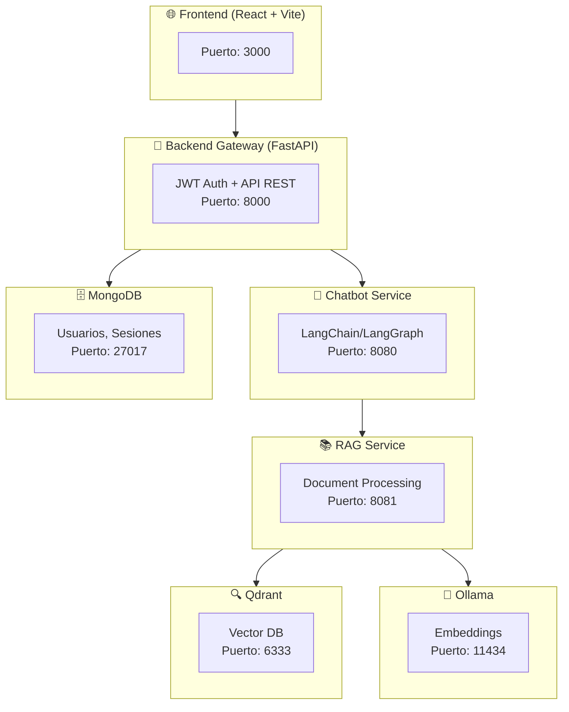

# TFG Chatbot - Agente IA Pedagógico con Clustering de Documentos

[](README.md)
[](LICENSE)
[](https://github.com/GabrielFranciscoSM/TFG-Chatbot)
[](https://github.com/GabrielFranciscoSM/TFG-Chatbot/releases)
[](https://gabrielfranciscosm.github.io/TFG-Chatbot/)

> **Doble Grado TFG**: Este proyecto es un Trabajo de Fin de Grado conjunto para el Doble Grado en Ingeniería Informática y Matemáticas de la Universidad de Granada.
> - **Informática**: Desarrollo de un chatbot pedagógico basado en LLMs con arquitectura de microservicios
> - **Matemáticas**: Investigación e implementación de algoritmos de clustering de documentos (K-Means, Fuzzy C-Means, NMF)

## 🚀 Quick Start

Levanta el proyecto en **5 minutos** con Docker Compose.

### 1. Clonar el repositorio

```bash
git clone https://github.com/GabrielFranciscoSM/TFG-Chatbot.git
cd TFG-Chatbot
```

### 2. Configurar variables de entorno

```bash
cp .env.example .env
```

> [!TIP]
> **Las API keys de LLM son opcionales.** Si no configuras una API key (Gemini/Mistral), puedes usar modelos locales con Ollama/vLLM. Para usar Gemini (recomendado), obtén una API key gratuita en [Google AI Studio](https://aistudio.google.com/app/apikey) y añádela a `.env`:
> ```
> LLM_PROVIDER=gemini
> GEMINI_API_KEY=tu-api-key-aqui
> ```

### 3. Levantar los servicios

```bash
docker compose up -d
```

### 4. Descargar el modelo de embeddings (Ollama)

El servicio RAG necesita el modelo `nomic-embed-text` para los embeddings:

```bash
# Opción A: Ejecutar el script de inicialización
./scripts/init_ollama.sh

# Opción B: Descargar manualmente
docker exec ollama-service ollama pull nomic-embed-text
```

### 5. Crear usuarios de demostración

```bash
uv run scripts/seed_users.py
```

> [!NOTE]
> Si no tienes `uv` instalado, puedes ejecutar: `pip install uv` o `pipx install uv`

### ✅ ¡Listo!

Accede a la aplicación:

| Servicio | URL |
|----------|-----|
| **Frontend** | http://localhost:3000 |
| **API Docs (Swagger)** | http://localhost:8000/docs |
| **Phoenix (Observabilidad LLM)** | http://localhost:6006 |
| **Grafana (Métricas)** | http://localhost:3001 |

**Credenciales de demo:**

| Usuario | Contraseña | Rol |
|---------|------------|-----|
| `admin` | `admin123` | Administrador |
| `profesor` | `admin123` | Profesor |
| `estudiante` | `admin123` | Estudiante |

---

## Descripción

**Trabajo de Fin de Grado (TFG) del Doble Grado en Ingeniería Informática y Matemáticas** de la Universidad de Granada. El proyecto combina dos líneas de trabajo complementarias:

### 🖥️ TFG Informática: Chatbot Pedagógico

Desarrollo de un agente conversacional basado en IA orientado a entornos educativos. Combina los beneficios de los modelos de lenguaje (LLMs) con directrices pedagógicas para crear un tutor inteligente que reduce alucinaciones y favorece el aprendizaje activo del estudiante.

**Objetivos:**
- Investigar la aplicación de LLMs en la educación, mitigando sus riesgos (alucinaciones, respuestas directas sin razonamiento)
- Desarrollar un chatbot educativo con herramientas especializadas y memoria conversacional
- Implementar una arquitectura de microservicios moderna con buenas prácticas de desarrollo
- Documentar todo el proceso siguiendo la metodología Scrum

### 📐 TFG Matemáticas: Clustering de Documentos

Investigación teórica y práctica de algoritmos de clustering aplicados a documentos educativos. El objetivo es clasificar automáticamente las preguntas de los estudiantes por temática y dificultad.

**Algoritmos implementados:**
- **K-Means** con inicialización K-Means++ (Arthur & Vassilvitskii, 2007)
- **Fuzzy C-Means (FCM)** con parámetro de fuzziness m
- **NMF (Non-negative Matrix Factorization)** para topic modeling

**Aplicación al chatbot:**
- Clasificación automática de preguntas por tema
- Estimación de dificultad basada en clustering
- Mejora del sistema RAG mediante agrupación semántica

---

## Arquitectura

El proyecto sigue una **arquitectura de microservicios** orquestada con Docker Compose:



### Servicios

| Servicio | Tecnología | Descripción |
|----------|------------|-------------|
| **Frontend** | React 19, TypeScript, Vite, Tailwind CSS, shadcn/ui | Interfaz de chat y panel de administración |
| **Backend Gateway** | FastAPI, PyMongo, JWT | API REST, autenticación RBAC, proxy a servicios |
| **Chatbot** | FastAPI, LangChain, LangGraph | Agente conversacional con herramientas pedagógicas |
| **RAG Service** | FastAPI, Sentence Transformers | Procesamiento de documentos y búsqueda semántica |
| **Qdrant** | Vector Database | Almacenamiento de embeddings para RAG |
| **Ollama** | LLM Server | Servicio de embeddings local |
| **MongoDB** | NoSQL Database | Persistencia de usuarios, sesiones y guías docentes |

---

## Investigación Matemática (math_investigation/)

El módulo `math_investigation/` contiene la implementación desde cero de los algoritmos de clustering para el TFG de Matemáticas:

### Estructura del Módulo

```
math_investigation/
├── clustering/           # Algoritmos de clustering
│   ├── kmeans.py         # K-Means con K-Means++ initialization
│   ├── fcm.py            # Fuzzy C-Means con parámetro m
│   └── metrics.py        # Métricas: Silhouette, ARI, NMI, FPC
├── topic_modeling/       # Modelado de temas
│   ├── nmf.py            # Non-negative Matrix Factorization
│   └── coherence.py      # Métricas de coherencia de temas
├── nlp/                  # Procesamiento de texto
│   ├── tfidf.py          # TF-IDF vectorizer
│   ├── bow.py            # Bag of Words vectorizer
│   └── embeddings.py     # Embeddings con Ollama
├── visualization/        # Visualización de resultados
├── cli/                  # Scripts de línea de comandos
│   ├── run_clustering.py # Ejecutar experimentos de clustering
│   ├── run_topic_modeling.py
│   └── compare.py        # Comparar algoritmos
└── data/                 # Datasets y resultados
```

### Uso de los Algoritmos

```bash
# Ejecutar clustering K-Means + FCM
python -m math_investigation.cli.run_clustering --k 5 --vectorizer tfidf

# Con embeddings de Ollama
python -m math_investigation.cli.run_clustering --k 5 --vectorizer emb

# Topic modeling con NMF
python -m math_investigation.cli.run_topic_modeling --n-topics 5

# Comparar algoritmos
python -m math_investigation.cli.compare --k-range 3,10 --output results/
```

### Fundamentos Matemáticos

Los algoritmos están implementados siguiendo la teoría desarrollada en la memoria del TFG:

- **K-Means**: Minimiza SSE(S,C) = Σ Σ ||x - c_i||² con convergencia monótona garantizada
- **FCM**: Minimiza J_m(U,C) = Σ Σ (μ_ji)^m ||x_i - c_j||² con m > 1 como parámetro de fuzziness
- **NMF**: Factoriza V ≈ WH con W,H ≥ 0 usando reglas de actualización multiplicativas

---

## Tecnologías Principales

### Backend (Python 3.13+)
- **Framework API**: FastAPI + Uvicorn
- **IA/LLM**: LangChain, LangGraph, LangChain-Google-GenAI, LangChain-OpenAI
- **Base de datos**: MongoDB (PyMongo), SQLite (memoria del grafo)
- **Vector Store**: Qdrant Client
- **Validación**: Pydantic, Pydantic-Settings

### Frontend (Node.js 20+)
- **Framework**: React 19 + TypeScript
- **Build Tool**: Vite 7
- **Styling**: Tailwind CSS 4, shadcn/ui (Radix UI)
- **Estado/Fetching**: TanStack Query, React Hook Form, Zod
- **Routing**: React Router DOM 7

### Infraestructura
- **Contenedores**: Docker + Docker Compose
- **CI/CD**: GitHub Actions (lint, test, build, security)
- **Calidad de código**: Ruff, Black, isort, MyPy, Biome

---

## Testing

El proyecto incluye tests unitarios, de integración e infraestructura.

Para ejecutar los tests unitarios se recomienda el uso del script de ayuda [run_tests.sh](./scripts/run_tests.sh)

```bash
# Ejecutar todos los tests unitarios
./scripts/run_tests.sh all
```

Para ejecutar los tests de integración, usar simplemente pytest en el directorio base del proyecto.

```bash
# Ejecutar todos los tests
uv run pytest

# Tests con cobertura
uv run pytest --cov
```

---

## Calidad de Código

```bash
# Linting Python (Ruff)
uv run ruff check .

# Formateo (Black + isort)
uv run black .
uv run isort .

# Type checking (MyPy)
uv run mypy .

# Linting/Formateo Frontend (Biome)
cd frontend && npm run check:fix

# Pre-commit hooks
pre-commit install
pre-commit run --all-files
```

---

## Documentación

- **[Documentación del Proyecto](https://gabrielfranciscosm.github.io/TFG-Chatbot/)** - GitHub Pages con Jekyll
- **[Architecture Decision Records (ADRs)](docs/ADR/)** - 29 decisiones arquitectónicas documentadas
- **[API Documentation](http://localhost:8000/docs)** - Swagger/OpenAPI (con servicios ejecutándose)
- **[Daily Scrum](docs/daily%20scrum/)** - Registro diario del desarrollo
- **[Sprint Planning](docs/sprint%20planing/)** - Planificación de sprints
- **[Sprint Retrospective](docs/sprint%20retrospective/)** - Retrospectivas

---

## Metodología de Desarrollo

El proyecto sigue **Scrum** como metodología ágil:

- **Product Backlog**: Historias de usuario en GitHub Issues
- **Milestones**: Sprints con entregables incrementales
- **Daily Scrum**: Documentado en `docs/daily scrum/`
- **Sprint Reviews/Retrospectives**: Documentados en `docs/`
- **CI/CD**: Integración y despliegue continuo con GitHub Actions

### Roadmap

- [x] **Milestone 1**: API de un agente React básico para chatbot
- [x] **Milestone 2**: Agente con herramientas específicas
- [x] **Milestone 3**: Autenticación de usuarios (JWT + RBAC)
- [x] **Milestone 4**: Interfaz educativa completa
- [x] **Milestone 5**: Logs y monitorización
- [x] **Milestone 6**: Métricas y dashboard
- [x] **Milestone 7**: Chatbot con herramientas avanzadas
- [x] **Milestone 8**: Evaluación y documentación final

---

## Estructura del Repositorio

```
TFG-Chatbot/
├── backend/              # API Gateway (FastAPI)
│   ├── routers/          # Endpoints (auth, users, chat, etc.)
│   ├── tests/            # Tests del gateway
│   └── Dockerfile
├── chatbot/              # Servicio del Chatbot
│   ├── logic/            # Lógica del agente (LangGraph)
│   │   ├── graph.py      # Grafo conversacional
│   │   ├── prompts.py    # Prompts pedagógicos
│   │   └── tools/        # Herramientas del agente
│   ├── tests/
│   └── Dockerfile
├── rag_service/          # Servicio RAG
│   ├── embeddings/       # Gestión de embeddings
│   ├── documents/        # Procesamiento de documentos
│   ├── routes/           # Endpoints RAG
│   ├── tests/
│   └── Dockerfile
├── frontend/             # Frontend React
│   ├── src/
│   │   ├── components/   # Componentes UI (shadcn/ui)
│   │   ├── pages/        # Páginas (chat, admin, login)
│   │   ├── hooks/        # Custom hooks
│   │   └── context/      # React Context (Auth)
│   └── Dockerfile
├── tests/                # Tests de integración/infraestructura
├── docs/                 # Documentación del TFG
│   ├── ADR/              # Architecture Decision Records
│   ├── daily scrum/      # Registro diario
│   └── sprint*/          # Planning y retrospectives
├── math_investigation/   # TFG Matemáticas: Clustering
│   ├── clustering/       # K-Means, FCM, métricas
│   ├── topic_modeling/   # NMF, coherencia
│   ├── nlp/              # Vectorizers (TF-IDF, BoW, embeddings)
│   ├── visualization/    # Plots y gráficos
│   └── cli/              # Scripts de experimentos
├── notebooks/            # Jupyter notebooks de análisis
├── scripts/              # Scripts de utilidad
├── docker-compose.yml    # Orquestación de servicios
├── pyproject.toml        # Configuración Python (uv, ruff, etc.)
└── .github/workflows/    # CI/CD pipelines
```

---

## Contribuir

Este es un proyecto académico (TFG), pero las contribuciones son bienvenidas:

### Para nuevos colaboradores

1. **Lee la documentación primero**:
   - [ADRs](docs/ADR/) - Explican las decisiones arquitectónicas y su contexto
   - [Copilot Instructions](.github/copilot-instructions.md) - Guía técnica del proyecto
   - [API Docs](http://localhost:8000/docs) - Documentación Swagger (con servicios ejecutándose)

2. **Configura el entorno de desarrollo**:
   ```bash
   # Clonar e instalar
   git clone https://github.com/GabrielFranciscoSM/TFG-Chatbot.git
   cd TFG-Chatbot
   uv venv && source .venv/bin/activate
   uv pip install -e ./backend -e ./rag_service -e ./chatbot -e .
   
   # Pre-commit hooks
   pre-commit install
   ```

3. **Ejecuta los tests antes de hacer cambios**:
   ```bash
   uv run pytest backend/tests/ chatbot/tests/ rag_service/tests/ -v
   ```

### Workflow de contribución

1. Crear un **Issue** describiendo el cambio propuesto
2. Crear una **rama** desde `main` con nombre descriptivo (`feature/...`, `fix/...`)
3. Hacer cambios pequeños y bien documentados
4. Ejecutar **linters y tests** antes de commitear
5. Crear **Pull Request** vinculando al issue

### Estándares de código

- **Python**: Ruff + Black + isort (configurados en `pyproject.toml`)
- **TypeScript**: Biome (configurado en `frontend/biome.json`)
- **Commits**: Mensajes descriptivos en español o inglés
- **Tests**: Cobertura para código nuevo (usar markers `@pytest.mark.unit/integration`)

---

## Licencia

Este proyecto está licenciado bajo la [Licencia MIT](LICENSE).

---

## Autor y Tutores

**Autor**: Gabriel Francisco Sánchez Muñoz

**Tutores**:
- Pablo García Sánchez (Ingeniería Informática)
- Nuria Rico Castro (Matemáticas)

**Universidad**: Universidad de Granada  
**Grado**: Doble Grado en Ingeniería Informática y Matemáticas  
**Curso académico**: 2024-2025

---

## Agradecimientos

- A los tutores por su guía y apoyo durante el desarrollo
- A la comunidad open source por las herramientas utilizadas
- Las referencias bibliográficas completas se incluirán en la memoria del TFG