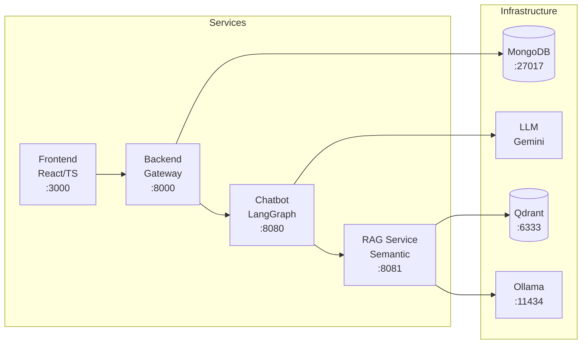

# Developer Guide

Comprehensive documentation for developers and users of the TFG Pedagogical Chatbot project.

## Overview

TFG-Chatbot is a dual-degree thesis project (Computer Science + Mathematics) from the University of Granada:

- **Computer Science TFG**: A pedagogical chatbot using LangGraph for AI orchestration with a microservices architecture
- **Mathematics TFG**: Document clustering research (K-Means, Fuzzy C-Means, NMF) to enhance question classification

## Architecture

The system follows a microservices architecture:

## Quick Links

| Section | Description |
|---------|-------------|
| [Installation](installation.html) | Prerequisites and setup instructions |
| [Quick Start](quickstart.html) | Get running in minutes |
| [Scripts](scripts.html) | Utility scripts reference |
| [Testing](testing.html) | Testing strategies and commands |
| [Configuration](configuration.html) | Environment variables and settings |
| [Monitoring](monitoring.html) | Grafana, Phoenix, and observability |
| [User Guide](user-guide.html) | How to use the web interface |
| [Troubleshooting](troubleshooting.html) | Common issues and solutions |

## Key Technologies

| Component | Technology Stack |
|-----------|-----------------|
| **Frontend** | React 19, TypeScript, Vite, Tailwind CSS, shadcn/ui |
| **Backend Gateway** | FastAPI, PyMongo, JWT, RBAC |
| **Chatbot Agent** | LangChain, LangGraph, Gemini/vLLM |
| **RAG Service** | FastAPI, Sentence Transformers, Qdrant |
| **Databases** | MongoDB (data), Qdrant (vectors), SQLite (checkpoints) |
| **Observability** | Grafana, Prometheus, Loki, Phoenix |
| **Infrastructure** | Docker Compose, GitHub Actions |

