# Release Workflows Guide

This document explains the two automated release workflows available in this project.

## 📋 Table of Contents

- [Overview](#overview)
- [Option 1: Manual Release (Recommended)](#option-1-manual-release-recommended)
- [Option 2: Release Please (Automatic)](#option-2-release-please-automatic)
- [Release Process Flow](#release-process-flow)
- [Best Practices](#best-practices)
- [Troubleshooting](#troubleshooting)

## Overview

We have two workflows for creating releases:

| Workflow | Trigger | Best For | Control Level |
|----------|---------|----------|---------------|
| **Manual Release** | GitHub UI Button | Most releases | Full control |
| **Release Please** | Auto on main push | Continuous delivery | Automated |

Both workflows:
- ✅ Bump version in `pyproject.toml`
- ✅ Update `CHANGELOG.md` automatically
- ✅ Create git tag and GitHub Release
- ✅ Build and publish Docker images to GHCR
- ✅ Generate release notes from commits

## Option 1: Manual Release (Recommended)

### When to Use
- You want full control over release timing
- You need to review changes before release
- You want to add custom release notes
- You're creating a pre-release or beta version

### How to Use

1. **Go to GitHub Actions**
   - Navigate to `Actions` tab in your repository
   - Select `Manual Release` workflow from the left sidebar

2. **Click "Run workflow"**
   - Choose the branch (usually `main`)
   - Fill in the parameters:

   | Parameter | Description | Options |
   |-----------|-------------|---------|
   | **Version bump type** | Which part to increment | `patch` (0.0.1)<br>`minor` (0.1.0)<br>`major` (1.0.0) |
   | **Release notes** | Optional custom notes | Any text you want to add |
   | **Mark as pre-release?** | Is this a beta/RC? | `true` / `false` |
   | **Skip tests** | ⚠️ Not recommended | `true` / `false` |

3. **Click "Run workflow"** button

### What Happens

```mermaid
graph TD
    A[Trigger Workflow] --> B{Skip Tests?}
    B -->|No| C[Run Validation]
    B -->|Yes| D[Skip Validation]
    C --> E[Linting]
    C --> F[Unit Tests]
    C --> G[Docker Build Test]
    E --> H{All Pass?}
    F --> H
    G --> H
    D --> I[Bump Version]
    H -->|Yes| I
    H -->|No| J[❌ Fail]
    I --> K[Generate Changelog]
    K --> L[Update CHANGELOG.md]
    L --> M[Commit & Tag]
    M --> N[Create GitHub Release]
    N --> O[Build Docker Images]
    O --> P[Push to GHCR]
    P --> Q[✅ Done]
```



### Example: Creating a Patch Release

```yaml
# Go to Actions → Manual Release → Run workflow

Version bump type: patch
Release notes: "Fix critical bug in RAG service connection handling"
Mark as pre-release?: false
Skip tests: false
```

This will:
- Bump version from `0.1.4` → `0.1.5`
- Run all tests and validations
- Generate changelog from commits since v0.1.4
- Add your custom notes
- Create tag `v0.1.5`
- Publish Docker images:
  - `ghcr.io/owner/repo/backend:0.1.5`
  - `ghcr.io/owner/repo/backend:latest`
  - `ghcr.io/owner/repo/rag_service:0.1.5`
  - `ghcr.io/owner/repo/rag_service:latest`

### Example: Creating a Pre-release

```yaml
# For beta or release candidate versions

Version bump type: minor
Release notes: "Beta version with experimental RAG improvements"
Mark as pre-release?: true  # ← Important!
Skip tests: false
```

## Option 2: Release Please (Automatic)

> ⚠️ **Setup Required**: Release Please needs additional permissions to create PRs.  
> See [.github/RELEASE_PLEASE_SETUP.md](../../.github/RELEASE_PLEASE_SETUP.md) for configuration steps.

### When to Use
- You follow strict conventional commits
- You want releases on every main merge
- You prefer continuous delivery approach
- You trust automated changelog generation

### How It Works

1. **Automatic PR Creation**
   - On every push to `main`, Release Please analyzes commits
   - If it finds releasable changes, creates/updates a "Release PR"
   - The PR contains:
     - Version bump in `pyproject.toml`
     - Updated `CHANGELOG.md` with grouped commits
     - Preview of what will be released

2. **Merge to Release**
   - Review the Release PR
   - When you merge it → automatic release created
   - Docker images built and published

3. **Commit Convention**
   Release Please uses conventional commits to determine version bump:

   | Commit Type | Version Bump | Example |
   |-------------|--------------|---------|
   | `feat:` | Minor (0.x.0) | `feat(rag): add vector similarity search` |
   | `fix:` | Patch (0.0.x) | `fix(backend): correct timeout handling` |
   | `feat!:` or `BREAKING CHANGE:` | Major (x.0.0) | `feat!: redesign API endpoints` |
   | `chore:`, `docs:`, `style:` | No release | Changes without version bump |

### Example Workflow

```bash
# 1. Make changes with conventional commits
git commit -m "feat(backend): add session management"
git commit -m "fix(rag): resolve embedding cache issue"
git push origin main

# 2. Release Please creates PR automatically
#    Title: "chore(main): release 0.2.0"

# 3. Review the PR - it will show:
#    - Version: 0.1.4 → 0.2.0 (minor bump from feat:)
#    - CHANGELOG:
#      ### Features
#      - add session management
#      ### Bug Fixes  
#      - resolve embedding cache issue

# 4. Merge the PR → Release v0.2.0 created automatically
```

### Customizing Release Please

Edit `.github/release-please-config.json` (create if needed):

```json
{
  "release-type": "python",
  "packages": {
    ".": {
      "changelog-path": "CHANGELOG.md",
      "bump-minor-pre-major": true,
      "bump-patch-for-minor-pre-major": true,
      "extra-files": [
        "backend/pyproject.toml",
        "rag_service/pyproject.toml"
      ]
    }
  }
}
```

## Release Process Flow

### Complete Release Pipeline

```
┌─────────────────────────────────────────────────────────────┐
│                    Development Phase                         │
├─────────────────────────────────────────────────────────────┤
│ 1. Write code with conventional commits                      │
│ 2. Create PR → CI runs (lint, tests, build)                 │
│ 3. Review & merge to main                                    │
└─────────────────────────────────────────────────────────────┘
                            ↓
┌─────────────────────────────────────────────────────────────┐
│                     Release Phase                            │
├─────────────────────────────────────────────────────────────┤
│ OPTION A: Manual Release                                     │
│  • Go to Actions → Manual Release → Run workflow            │
│  • Choose version bump type                                  │
│  • Add custom notes (optional)                               │
│                                                              │
│ OPTION B: Release Please                                     │
│  • Release PR auto-created                                   │
│  • Review changelog & version                                │
│  • Merge PR → release triggered                              │
└─────────────────────────────────────────────────────────────┘
                            ↓
┌─────────────────────────────────────────────────────────────┐
│                  Automated Pipeline                          │
├─────────────────────────────────────────────────────────────┤
│ 1. ✅ Run validation tests (unless skipped)                  │
│ 2. 📝 Bump version in pyproject.toml                         │
│ 3. 📋 Generate/update CHANGELOG.md                           │
│ 4. 💾 Commit changes                                         │
│ 5. 🏷️  Create git tag (e.g., v0.2.0)                        │
│ 6. 📢 Create GitHub Release                                  │
│ 7. 🐳 Build Docker images                                    │
│ 8. 📦 Push to GitHub Container Registry                      │
│ 9. 📊 Generate release summary                               │
└─────────────────────────────────────────────────────────────┘
                            ↓
┌─────────────────────────────────────────────────────────────┐
│                   Post-Release                               │
├─────────────────────────────────────────────────────────────┤
│ • Docker images available at:                                │
│   ghcr.io/owner/repo/backend:0.2.0                          │
│   ghcr.io/owner/repo/rag_service:0.2.0                      │
│                                                              │
│ • GitHub Release with:                                       │
│   - Auto-generated changelog                                 │
│   - Links to container images                                │
│   - Download instructions                                    │
└─────────────────────────────────────────────────────────────┘
```

## Best Practices

### Commit Messages

Use conventional commits for best results:

```bash
# Features (minor version bump)
git commit -m "feat(backend): add user authentication"
git commit -m "feat(rag): implement document chunking"

# Fixes (patch version bump)
git commit -m "fix(api): resolve timeout in search endpoint"
git commit -m "fix(docker): correct environment variable passing"

# Breaking changes (major version bump)
git commit -m "feat!: redesign API response format"
# or
git commit -m "feat: new API design

BREAKING CHANGE: Response format changed from array to object"

# Non-releasing commits
git commit -m "chore: update dependencies"
git commit -m "docs: improve README"
git commit -m "ci: fix workflow syntax"
```

### Version Strategy

| Version | When to Use | Example |
|---------|-------------|---------|
| **Patch** (0.0.x) | Bug fixes, small improvements | 0.1.4 → 0.1.5 |
| **Minor** (0.x.0) | New features, backward compatible | 0.1.5 → 0.2.0 |
| **Major** (x.0.0) | Breaking changes, API redesign | 0.2.0 → 1.0.0 |

### Pre-releases

For beta/RC versions:

```bash
# Manual workflow: check "Mark as pre-release"
# Or use version like: 0.2.0-beta.1

# Pull images with specific tag:
docker pull ghcr.io/owner/repo/backend:0.2.0-beta.1
```

### CHANGELOG Format

Our CHANGELOG follows [Keep a Changelog](https://keepachangelog.com/):

```markdown
## [0.2.0] - 2025-11-15

### Added
- New feature X that does Y
- Support for Z configuration

### Changed
- Updated dependency A to v2.0
- Improved performance of B

### Fixed
- Critical bug in C module
- Memory leak in D component

### Removed
- Deprecated endpoint /old-api
```

## Troubleshooting

### Problem: Tests fail during release

**Solution**:
- Fix the failing tests first
- Or use "Skip tests" option (not recommended for production)

```bash
# Check what would fail:
pytest backend/tests -m "not integration"
pytest rag_service/tests -m "not integration"
```

### Problem: Docker build fails

**Solution**:
- Test build locally first:

```bash
docker build -t backend:test ./backend
docker build -t rag_service:test ./rag_service
```

### Problem: GHCR push permission denied

**Solution**:
- Check repository settings → Actions → General
- Ensure "Read and write permissions" is enabled
- Packages must be set to inherit repository visibility

### Problem: Version conflict / wrong version

**Solution**:
- Manually fix `pyproject.toml` version
- Create hotfix commit
- Run release again

```bash
# Fix version manually
vim pyproject.toml  # Change version = "0.2.1"
git add pyproject.toml
git commit -m "fix: correct version number"
git push
```

### Problem: Want to undo a release

**Solution**:
- Delete the tag and release:

```bash
# Locally
git tag -d v0.2.0
git push origin :refs/tags/v0.2.0

# On GitHub
gh release delete v0.2.0 --yes

# Note: Docker images in GHCR cannot be "unreleased" 
# But you can delete them from Packages page
```

## 🎯 Recommendations

### For This Project

We recommend **Manual Release** workflow because:

1. ✅ **Full control** - You decide when to release
2. ✅ **Validation** - Always runs tests before release
3. ✅ **Flexibility** - Easy to add custom notes
4. ✅ **Clear process** - Explicit action = explicit release
5. ✅ **Pre-release support** - Easy to mark betas

### When to Use Release Please

Consider switching to Release Please when:
- You have 100% conventional commit adherence
- You release multiple times per day
- You want zero manual steps
- Your team is experienced with automated releases

## 📚 Additional Resources

- [Conventional Commits](https://www.conventionalcommits.org/)
- [Semantic Versioning](https://semver.org/)
- [Keep a Changelog](https://keepachangelog.com/)
- [GitHub Container Registry Docs](https://docs.github.com/en/packages/working-with-a-github-packages-registry/working-with-the-container-registry)
- [Release Please Docs](https://github.com/googleapis/release-please)

---

**Need help?** Check the workflow runs in Actions tab for detailed logs.
