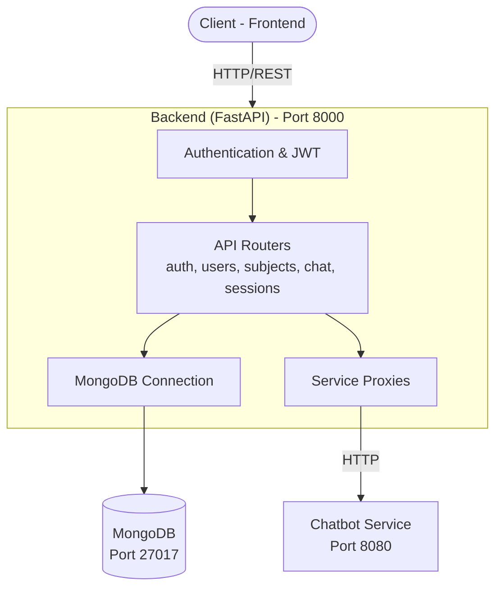

# Backend Service Documentation Index

Complete documentation for the Backend microservice of the TFG-Chatbot system.

## 📚 Documentation Files

### 1. **[README.md](./README.md)** - Overview & Quick Start
Start here for a high-level overview and quick start guide.

**Covers:**
- Service overview and key features
- Directory structure
- Quick start setup (5 minutes)
- API documentation access
- Architecture highlights
- Common tasks
- Troubleshooting

**Read when:** You want a quick introduction to the Backend

---

### 2. **[Architecture.md](./architecture.md)** - System Design & Data Models
Deep dive into how the Backend is designed and structured.

**Covers:**
- High-level architecture diagram
- Core components (API, Configuration, Security, etc.)
- Data models (User, Session, Subject)
- Authentication & Authorization flow
- Design patterns used
- Database design
- Service integration points
- Security considerations
- Performance considerations

**Read when:** You want to understand the system design or add new features

---

### 3. **[API-Endpoints.md](./api-endpoints.md)** - Complete API Reference
Detailed documentation for every API endpoint.

**Covers:**
- Authentication endpoints (register, login)
- User management endpoints
- Subject management endpoints
- Chat endpoints
- Session management endpoints
- Professor-specific endpoints
- Admin endpoints
- System endpoints
- Request/response examples for each
- Error codes and responses
- Examples with cURL, Python, JavaScript

**Read when:** You need to call an endpoint or integrate with the API

---

### 4. **[Authentication.md](./authentication.md)** - Auth & Security Deep Dive
Complete guide to authentication, authorization, and security.

**Covers:**
- JWT concepts and structure
- Password hashing with bcrypt
- Authentication flow (step-by-step)
- Token acquisition and usage
- Role-Based Access Control (RBAC)
- Permission matrix
- Resource-level authorization
- Dependency injection for auth
- Security implementation details
- Common security issues & solutions
- Testing authentication
- Best practices

**Read when:** You need to understand or implement authentication

---

### 5. **[Configuration.md](./configuration.md)** - Environment & Settings
Complete configuration reference for the Backend.

**Covers:**
- Configuration overview
- Environment variables reference:
  - Service URLs
  - MongoDB configuration
  - JWT configuration
  - Logging configuration
- Complete example `.env` file
- Configuration by environment (dev/staging/prod)
- MongoDB connection strings
- Common configuration mistakes
- Validation
- Security best practices
- Debugging configuration

**Read when:** You need to configure the Backend or troubleshoot configuration issues

---

### 6. **[Database.md](./database.md)** - MongoDB Schema & Operations
Complete MongoDB database reference.

**Covers:**
- Database overview and connection
- Collections schema:
  - users collection
  - sessions collection
  - subjects collection
- Field descriptions and indexes
- Query examples for each collection
- Database operations (create, drop, clear)
- Index setup
- Data backup & recovery
- Data validation
- Query patterns and aggregation
- Database performance
- Data migration
- Common issues
- Best practices

**Read when:** You need to understand or work with the database

---

### 7. **[Development.md](./development.md)** - Local Development Setup
Complete guide for developing the Backend locally.

**Covers:**
- Prerequisites and project setup
- Creating virtual environment
- Installing dependencies
- Creating `.env` file
- Starting MongoDB
- Running the development server
- Development workflow
- File structure
- Adding new endpoints
- Writing tests
  - Test fixtures
  - Mocking MongoDB
  - Example tests
- Debugging techniques
- Performance testing
- Code quality (linting, formatting)
- Database operations
- Docker development
- VS Code setup
- Common troubleshooting
- Useful commands

**Read when:** You want to develop locally or contribute code

---

### 8. **[Deployment.md](./deployment.md)** - Production Deployment
Complete guide for deploying the Backend to production.

**Covers:**
- Deployment overview
- Pre-deployment checklist
- Three deployment methods:
  1. Docker Compose (dev/staging)
  2. Docker Container (cloud/Kubernetes)
  3. Traditional Server (VPS/bare metal)
- HTTPS setup (Let's Encrypt)
- Database deployment (MongoDB Atlas)
- Monitoring & logging
- Health checks
- Database backups
- Performance tuning
- Scaling (horizontal & vertical)
- Rollback procedures
- Security hardening
- Troubleshooting production issues

**Read when:** You need to deploy or manage production infrastructure

---

## 🎯 Quick Navigation by Task

### I want to...

**Get Started:**
→ Read [README.md](./README.md) (5 min)

**Understand the System:**
→ Read [Architecture.md](./architecture.md) (20 min)

**Call an API Endpoint:**
→ Read [API-Endpoints.md](./api-endpoints.md) + use Swagger UI at `/docs`

**Work with Authentication:**
→ Read [Authentication.md](./authentication.md)

**Set Up Configuration:**
→ Read [Configuration.md](./configuration.md)

**Query the Database:**
→ Read [Database.md](./database.md)

**Develop Locally:**
→ Read [Development.md](./development.md)

**Deploy to Production:**
→ Read [Deployment.md](./deployment.md)

**Add a New Feature:**
1. Read [Architecture.md](./architecture.md) - understand patterns
2. Read [Development.md](./development.md) - local setup
3. Follow "Adding a New Endpoint" section in [Development.md](./development.md)
4. Read [API-Endpoints.md](./api-endpoints.md) - for reference

---

## 📊 Technology Stack

| Component | Technology | Purpose |
|-----------|-----------|---------|
| Framework | FastAPI | HTTP API framework |
| Server | Uvicorn | ASGI server |
| Database | MongoDB | Data storage |
| Driver | PyMongo | MongoDB driver |
| Auth | JWT + bcrypt | Authentication |
| Validation | Pydantic | Input/output validation |
| Testing | pytest | Unit & integration tests |
| Code Quality | ruff, black, isort | Linting & formatting |
| Monitoring | Prometheus | Metrics collection |
| Docker | Docker & Compose | Containerization |

---

## 🏗️ Architecture at a Glance



---

## 🔑 Key Concepts

### Authentication
Users login with username/password, receive JWT token for stateless authentication.

### Authorization
Three roles (STUDENT, PROFESSOR, ADMIN) control what endpoints are accessible.

### Sessions
Chat sessions are tracked in MongoDB, linked to users and subjects.

### Subjects
Academic subjects with professor, students list, and teaching guide.

### API Gateway Pattern
Backend routes requests to Chatbot and RAG services.

---

## 📝 File Organization

```
backend/
├── __main__.py          # Entry point
├── api.py               # FastAPI app setup
├── config.py            # Configuration
├── security.py          # JWT & password utilities
├── dependencies.py      # FastAPI dependencies
├── routers/             # Endpoints
│   ├── auth.py
│   ├── users.py
│   ├── subjects.py
│   ├── chat.py
│   ├── sessions.py
│   ├── professor.py
│   └── admin.py
├── models/              # Pydantic models
├── db/                  # Database utilities
└── tests/               # Test suite
```

---

## 🚀 Getting Started Checklist

- [ ] Read [README.md](./README.md)
- [ ] Setup local development (see [Development.md](./development.md))
- [ ] Run `uv sync` to install dependencies
- [ ] Start MongoDB
- [ ] Run `uv run python -m backend`
- [ ] Visit http://localhost:8000/docs
- [ ] Try a few endpoints in Swagger UI
- [ ] Read [Architecture.md](./architecture.md) to understand the design
- [ ] Make a small code change and test it

---

## 🐛 Troubleshooting

**Cannot connect to MongoDB:**
→ See "Troubleshooting" in [Development.md](./development.md)

**Getting 401 Unauthorized:**
→ Read "Using Tokens" in [Authentication.md](./authentication.md)

**Configuration issues:**
→ See "Common Configuration Mistakes" in [Configuration.md](./configuration.md)

**Test failures:**
→ See "Testing" section in [Development.md](./development.md)

**Deployment issues:**
→ See "Troubleshooting" in [Deployment.md](./deployment.md)

---

## 📚 Related Documentation

### Parent Documentation
- [Main Services Index](../index.md) - All microservices
- [Project Documentation](../../) - Overall project docs

### Other Services
- [Chatbot Service](../chatbot/README.md)
- [RAG Service](../rag_service/README.md)
- [Frontend](../frontend/README.md)

### Project Resources
- [Architecture Guide](../../guide/architecture.md)
- [ADRs (Architecture Decision Records)](../../ADR/)
- [API Documentation](../../api/)

---

## 🔍 Searching

Use Ctrl+F within each document to search for topics:

- **Configuration**: Search in [Configuration.md](./configuration.md)
- **API endpoints**: Search in [API-Endpoints.md](./api-endpoints.md)
- **Database schema**: Search in [Database.md](./database.md)
- **Development issues**: Search in [Development.md](./development.md)

---

## 🤝 Contributing

When contributing to the Backend service:

1. Follow patterns in [Architecture.md](./architecture.md)
2. Follow setup in [Development.md](./development.md)
3. Add tests (see [Development.md](./development.md) - Testing section)
4. Update relevant documentation
5. Submit PR with clear description

---

## ⚡ Quick Commands

```bash
# Setup
cd backend && uv sync

# Run locally
uv run python -m backend

# Test
uv run pytest tests/ -v

# Code quality
uv run ruff check . && uv run black .

# Docker
docker compose up -d

# Build image
docker build -t tfg-backend:latest .
```

---

## 📞 Getting Help

- **General questions**: Check [README.md](./README.md)
- **Architecture questions**: Read [Architecture.md](./architecture.md)
- **API usage**: Use [API-Endpoints.md](./api-endpoints.md) + Swagger UI at `/docs`
- **Development help**: See [Development.md](./development.md)
- **Configuration help**: Check [Configuration.md](./configuration.md)
- **Database help**: Read [Database.md](./database.md)
- **Deployment help**: Check [Deployment.md](./deployment.md)

---

## 📅 Last Updated

This documentation is maintained alongside the Backend service code. Version: **0.1.0**

For the latest updates, check the main [Backend README.md](./README.md)
