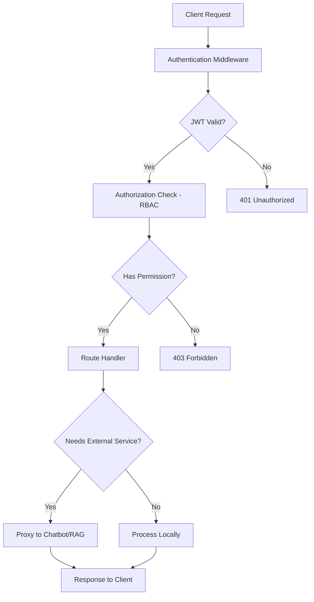
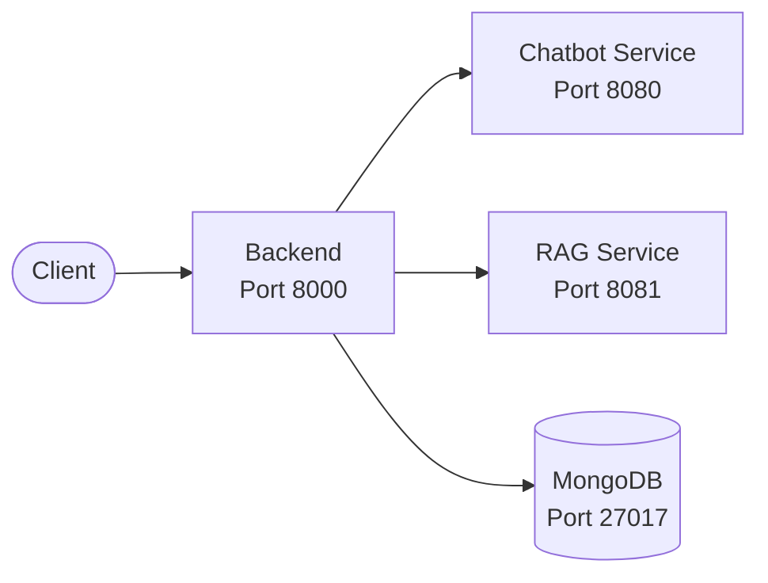

# Backend Service Documentation

The **Backend Service** (also known as the API Gateway) is the central entry point for all client requests in the TFG-Chatbot system. It handles authentication, authorization, session management, and routes requests to the appropriate microservices.

## Quick Overview

| Aspect | Details |
|--------|---------|
| **Technology** | FastAPI, Python 3.13+ |
| **Database** | MongoDB |
| **Port** | 8000 |
| **Purpose** | API Gateway, Auth, Session Management |
| **Container** | Docker (Docker Compose) |

## Directory Structure

```
backend/
├── __main__.py              # Entry point
├── api.py                   # FastAPI application setup
├── config.py                # Configuration management
├── security.py              # JWT, hashing, auth dependencies
├── dependencies.py          # FastAPI dependency injection
├── logging_config.py        # Logging configuration
├── utils.py                 # Utility functions
├── Dockerfile               # Container definition
├── pyproject.toml           # Project metadata & dependencies
├── routers/                 # API endpoints
│   ├── auth.py              # Authentication endpoints
│   ├── users.py             # User profile management
│   ├── subjects.py          # Subject CRUD operations
│   ├── chat.py              # Chatbot service proxy
│   ├── sessions.py          # Session management
│   ├── professor.py         # Professor-specific endpoints
│   └── admin.py             # Admin tools
├── models/                  # Pydantic models
│   ├── admin.py
│   ├── common.py
│   └── professor.py
├── db/                      # Database utilities
│   └── mongo.py             # MongoDB connection
└── tests/                   # Unit & integration tests
```

## Key Features

- **JWT-based Authentication**: Secure token-based user authentication
- **Role-Based Access Control (RBAC)**: Three roles - `student`, `professor`, `admin`
- **API Gateway Pattern**: Proxies requests to chatbot and RAG services
- **Session Management**: Track and manage user chat sessions
- **Subject Management**: Handle academic subjects and enrollment
- **Prometheus Metrics**: Built-in monitoring and observability

## Documentation Files

1. **[README.md](./README.md)** - This file, overview and quick start
2. **[architecture.md](./architecture.md)** - System design, data models, and patterns
3. **[api-endpoints.md](./api-endpoints.md)** - Complete API reference with examples
4. **[authentication.md](./authentication.md)** - Auth flow, JWT, RBAC, security
5. **[configuration.md](./configuration.md)** - Environment variables, settings
6. **[database.md](./database.md)** - MongoDB schema, collections, queries
7. **[development.md](./development.md)** - Setup, running, testing, debugging
8. **[deployment.md](./deployment.md)** - Docker, production considerations

## Quick Start

### Prerequisites

- Python 3.13+
- uv (package manager)
- MongoDB instance (or Docker Compose for full stack)

### Setup

```bash
cd backend
uv sync
```

### Run Locally

```bash
# Install dependencies
uv sync

# Run the service
uv run python -m backend
```

The API will be available at `http://localhost:8000`

### Run Tests

```bash
# Run all tests
uv run pytest tests/

# Run specific test file
uv run pytest tests/unit/test_auth.py -v

# Run with coverage
uv run pytest tests/ --cov=backend
```

### Docker

```bash
# Build image
docker build -t tfg-backend:latest .

# Run container
docker run -p 8000:8000 --env-file .env tfg-backend:latest
```

## API Documentation

Once running, visit:
- **Swagger UI**: http://localhost:8000/docs
- **ReDoc**: http://localhost:8000/redoc

## Architecture Highlights

### Authentication Flow

1. User submits credentials (`/auth/login`)
2. Backend validates against MongoDB
3. JWT token generated and returned
4. Token used in subsequent requests via `Authorization: Bearer <token>`

### Request Flow



### Service Communication



## Key Concepts

### User Roles

- **STUDENT**: Can start chats, take tests, view subjects
- **PROFESSOR**: Can manage subjects, create tests, view analytics
- **ADMIN**: Full system access, user management

### Sessions

Each chat interaction is tracked as a session:
- Tied to specific user and subject
- Thread ID stored for LangGraph checkpointing
- Conversation history maintained

### Subjects

Academic subjects with:
- CRUD operations
- Student enrollment
- Teaching guide (guía docente) integration

## Configuration

Environment variables control behavior:

```env
# Database
MONGODB_URI=mongodb://localhost:27017

# JWT
SECRET_KEY=your-secret-key
ALGORITHM=HS256

# Services
CHATBOT_SERVICE_URL=http://chatbot:8080
RAG_SERVICE_URL=http://rag_service:8081

# Logging
LOG_LEVEL=INFO
```

See [configuration.md](./configuration.md) for complete reference.

## Testing

The project uses pytest with:
- **Unit tests**: Fast, isolated, no external dependencies
- **Integration tests**: Test service communication
- **Markers**: `@pytest.mark.unit`, `@pytest.mark.integration`
- **Fixtures**: Common test data (users, tokens, etc.)

Example:
```bash
# Run only unit tests
uv run pytest tests/ -m unit -v
```

## Common Tasks

### Add a New Endpoint

1. Create a router function in `routers/`
2. Use `@router.get()`, `@router.post()`, etc.
3. Add Pydantic models in `models/` if needed
4. Write tests in `tests/`
5. Register router in `api.py`

### Query MongoDB

```python
from backend.db.mongo import get_db

db = get_db()
users = db["users"].find_one({"email": "user@example.com"})
```

### Generate JWT Token

```python
from backend.security import create_access_token

token = create_access_token(
    data={"sub": user_id, "role": user_role}
)
```

## Troubleshooting

### Cannot Connect to MongoDB

- Ensure MongoDB is running
- Check `MONGODB_URI` in `.env`
- Verify network connectivity in Docker Compose

### JWT Token Expired

- Tokens expire after set duration (see config)
- Client must call `/auth/login` to refresh or get new token

### Service Not Responding

- Check logs: `docker logs tfg-backend`
- Verify service URL environment variables
- Ensure other services are running

## Performance Considerations

- **Database Indexing**: Optimize MongoDB queries with proper indexes
- **Caching**: Consider caching frequently accessed subjects/users
- **Rate Limiting**: Implement if public API
- **Monitoring**: Use Prometheus metrics (`/metrics` endpoint)

## Security Best Practices

- Always use `SECRET_KEY` environment variable
- Validate all user inputs via Pydantic models
- Use `bcrypt` for password hashing
- Implement rate limiting on auth endpoints
- Keep dependencies updated

## Related Services

- **[Chatbot Service](../chatbot/README.md)**: AI agent for question answering
- **[RAG Service](../rag_service/README.md)**: Document indexing and retrieval
- **[Frontend](../frontend/README.md)**: User interface

## Support & Resources

- **Project Root**: [TFG-Chatbot](../../../)
- **Main Documentation**: [docs/](../../)
- **ADRs**: [docs/ADR/](../../ADR/)
- **Architecture Overview**: [docs/guide/architecture.md](../../guide/architecture.md)
