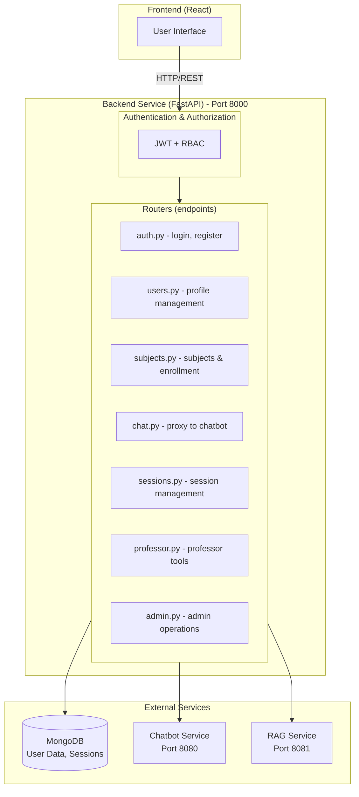
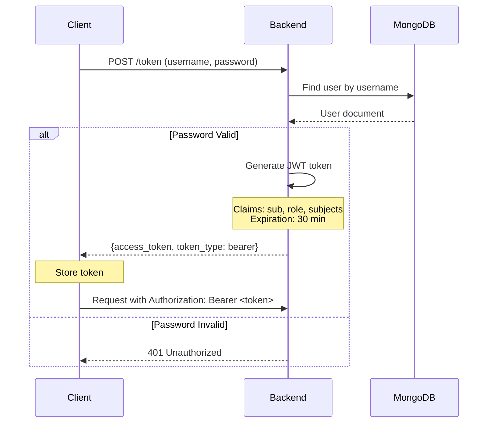
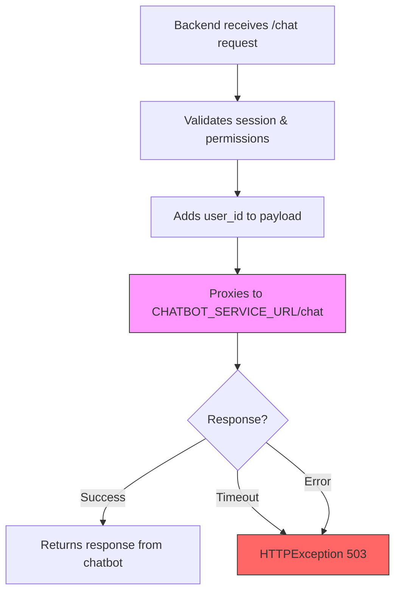

# Backend Architecture

This document describes the architectural design of the Backend service, including data models, design patterns, and how components interact.

## System Architecture

### High-Level Architecture



## Core Components

### 1. API Application (`api.py`)

The main FastAPI application that:
- Registers all routers
- Configures CORS middleware
- Sets up Prometheus instrumentation
- Adds correlation ID middleware for logging
- Exposes health check endpoints

```python
# Key endpoints
GET  /health                  # Health check
GET  /system/info            # System information from chatbot
GET  /metrics                # Prometheus metrics
```

### 2. Configuration (`config.py`)

Uses Pydantic `BaseSettings` for type-safe configuration management.

**Key Settings:**

```python
# Service URLs
chatbot_service_url: str = "http://chatbot:8080"
rag_service_url: str = "http://rag_service:8081"
chatbot_timeout: float = 120.0

# MongoDB
mongo_uri: SecretStr | None
mongo_hostname: str
mongo_port: str = "27017"
mongo_root_username: SecretStr
mongo_root_password: SecretStr
db_name: str = "tfg_chatbot"

# Authentication
secret_key: SecretStr
algorithm: str = "HS256"
access_token_expire_minutes: int = 30
```

All settings are loaded from `.env` file with sensible defaults.

### 3. Security (`security.py`)

Provides cryptographic utilities:

```python
verify_password(plain_password, hashed_password) -> bool
# Verify plain text against bcrypt hash

get_password_hash(password) -> str
# Hash password using bcrypt with salt

create_access_token(data, expires_delta) -> str
# Generate JWT token with optional custom expiration
```

### 4. Dependency Injection (`dependencies.py`)

FastAPI dependencies for common operations:

```python
get_current_user()
# Validates JWT token and returns authenticated UserInDB

get_user(username, collection)
# Queries MongoDB for user by username

get_users_collection()
# Returns MongoDB users collection

get_sessions_collection()
# Returns MongoDB sessions collection

get_db()
# Returns MongoDB database instance
```

### 5. Routers (Endpoints)

#### Authentication (`routers/auth.py`)

```
POST /register
  └─ Create new user account
  
POST /token
  └─ Login with username/password, receive JWT
```

#### Users (`routers/users.py`)

```
GET  /users/me
  └─ Get authenticated user profile
  
PUT  /users/me
  └─ Update user profile
  
GET  /users/{username}
  └─ Get user profile (professor/admin only)
```

#### Subjects (`routers/subjects.py`)

```
# Admin/Professor endpoints
GET  /subjects
  └─ List all subjects
  
POST /subjects
  └─ Create new subject
  
PUT  /subjects/{subject_id}
  └─ Update subject
  
DELETE /subjects/{subject_id}
  └─ Delete subject

# Student endpoints  
GET  /subjects/enrolled
  └─ List subjects student is enrolled in
  
POST /subjects/{subject_id}/enroll
  └─ Enroll in subject
```

#### Chat (`routers/chat.py`)

```
POST /chat
  └─ Send message to chatbot
     ├─ Validates session ownership
     ├─ Auto-creates session if needed
     └─ Proxies to chatbot service
```

#### Sessions (`routers/sessions.py`)

```
GET  /sessions
  └─ List user's chat sessions
  
GET  /sessions/{session_id}
  └─ Get session details & history
  
DELETE /sessions/{session_id}
  └─ Delete session
  
POST /sessions/{session_id}/resume_chat
  └─ Resume test session with answer
```

#### Professor (`routers/professor.py`)

```
GET  /professor/students
  └─ List students (enrolled in professor's subjects)
  
GET  /professor/subjects/{subject_id}/analytics
  └─ Get subject analytics & student performance
```

#### Admin (`routers/admin.py`)

```
GET  /admin/users
  └─ List all users
  
POST /admin/users/{username}/role
  └─ Change user role
```

## Data Models

### User Model

```python
class UserBase:
    username: str              # Unique identifier
    email: str                 # Unique email
    full_name: str
    role: UserRole             # STUDENT | PROFESSOR | ADMIN
    subjects: list[str] = []   # Enrolled/teaching subjects

class UserInDB(UserBase):
    hashed_password: str       # bcrypt hash
    preferences: dict = {}     # User settings
```

### Session Model

```python
{
    "_id": str,                # UUID
    "user_id": str,            # Username
    "title": str,              # Chat title
    "subject": str,            # Subject identifier
    "created_at": datetime,
    "last_active": datetime,
    "thread_id": str,          # LangGraph thread ID (if applicable)
    "message_count": int       # Number of messages
}
```

### Subject Model

```python
{
    "_id": str,                # Subject code (e.g., "INF001")
    "name": str,               # Human-readable name
    "description": str,
    "professor_id": str,       # Username of managing professor
    "students": list[str],     # Enrolled student usernames
    "guide": str,              # Teaching guide content
    "created_at": datetime
}
```

## Authentication & Authorization

### Authentication Flow



### JWT Token Structure

```
Header:
{
  "alg": "HS256",
  "typ": "JWT"
}

Payload:
{
  "sub": "gabriel",          # username
  "role": "STUDENT",
  "subjects": ["INF001"],
  "exp": 1234567890         # Unix timestamp
}

Signature:
HMACSHA256(
  base64(header) + "." + base64(payload),
  secret_key
)
```

### Role-Based Access Control (RBAC)

Three roles with different permissions:

| Endpoint | STUDENT | PROFESSOR | ADMIN |
|----------|---------|-----------|-------|
| POST /token | ✓ | ✓ | ✓ |
| GET /users/me | ✓ | ✓ | ✓ |
| PUT /users/me | ✓ | ✓ | ✓ |
| GET /subjects | ✓ | ✓ | ✓ |
| POST /subjects | ✗ | ✗ | ✓ |
| GET /subjects/enrolled | ✓ | ✓ | ✓ |
| POST /subjects/{id}/enroll | ✓ | ✗ | ✗ |
| POST /chat | ✓ | ✓ | ✓ |
| GET /professor/students | ✗ | ✓ | ✓ |
| GET /admin/users | ✗ | ✗ | ✓ |

## Database Design

### MongoDB Collections

#### users

```javascript
{
  "_id": ObjectId(),
  "username": "gabriel",
  "email": "gabriel@example.com",
  "full_name": "Gabriel Francisco",
  "hashed_password": "$2b$12$...",
  "role": "STUDENT",
  "subjects": ["INF001", "MAT002"],
  "preferences": {
    "theme": "dark",
    "notifications": true
  },
  "created_at": ISODate("2024-01-15T10:30:00Z")
}
```

**Indexes:**
```
username (unique)
email (unique)
```

#### sessions

```javascript
{
  "_id": "session-uuid-123",
  "user_id": "gabriel",
  "title": "Question about algorithms",
  "subject": "INF001",
  "created_at": ISODate("2024-01-15T10:30:00Z"),
  "last_active": ISODate("2024-01-15T11:45:00Z"),
  "thread_id": "thread-456"  // LangGraph checkpoint thread
}
```

**Indexes:**
```
user_id (ascending)
created_at (descending)
```

#### subjects

```javascript
{
  "_id": "INF001",
  "name": "Algorithms",
  "description": "Course on algorithm design",
  "professor_id": "prof_ana",
  "students": ["gabriel", "maria"],
  "guide": "# Teaching Guide...",
  "created_at": ISODate("2024-01-01T00:00:00Z")
}
```

**Indexes:**
```
professor_id (ascending)
```

## Design Patterns

### Dependency Injection

FastAPI's `Depends()` is used throughout for:
- Database access (`get_users_collection()`)
- Authentication (`get_current_user()`)
- Configuration access

```python
async def chat(
    request: Request,
    user: UserInDB = Depends(get_current_user),
    collection = Depends(get_sessions_collection),
):
    # user and collection are injected
```

### Service Proxy Pattern

The backend proxies requests to other services:

```python
# In chat router
async with httpx.AsyncClient() as client:
    response = await client.post(
        f"{settings.chatbot_service_url}/chat",
        json=json_data
    )
```

### Error Handling

Uses FastAPI's `HTTPException` for standardized error responses:

```python
raise HTTPException(
    status_code=401,
    detail="Incorrect username or password",
    headers={"WWW-Authenticate": "Bearer"}
)
```

### Middleware

#### CORS Middleware

Allows requests from:
- `http://localhost:5173` (Vite dev server)
- `http://localhost:3000` (Production container)

#### Correlation ID Middleware

Adds unique correlation ID to each request for logging:
```
X-Correlation-ID: 550e8400-e29b-41d4-a716-446655440000
```

#### Prometheus Instrumentation

Automatically tracks:
- Request count
- Response time
- HTTP status codes

## Session Management

### Session Lifecycle

```
1. User sends /chat request
   ├─ Contains session_id (UUID)
   └─ Contains subject (optional)

2. Backend checks if session exists
   ├─ If yes: Validate ownership, update last_active
   └─ If no: Create new session

3. Session stored in MongoDB with:
   ├─ user_id (owner validation)
   ├─ subject (access control)
   ├─ thread_id (LangGraph checkpoint)
   └─ timestamps

4. Message forwarded to chatbot
   ├─ Includes session_id
   └─ Includes user_id

5. Session stored in LangGraph checkpoint
   ├─ Allows resuming conversations
   └─ Tracks state for complex workflows
```

### Session Access Control

Students can only access their own sessions:

```python
if session["user_id"] != user.username:
    raise HTTPException(status_code=403)
```

Subject enrollment is validated:

```python
if user.role == UserRole.STUDENT and subject not in user.subjects:
    raise HTTPException(status_code=403, detail="Not enrolled")
```

## Integration Points

### Chatbot Service Integration



**Configuration:**
- Timeout: 120 seconds (configurable)
- Error handling: HTTPException 503 on failure

### RAG Service Integration

Integrated through the chatbot service (no direct calls from backend).

## Configuration & Environment

See [configuration.md](./configuration.md) for complete environment variables reference.

## Monitoring & Observability

### Prometheus Metrics

Available at `GET /metrics`:
- Request count by endpoint
- Response time distribution
- HTTP status code distribution

### Correlation IDs

Every request has a unique correlation ID:
- Passed through all services
- Logged with every message
- Useful for distributed tracing

### Logging

Structured JSON logging configured in `logging_config.py`:
```json
{
  "timestamp": "2024-01-15T10:30:45.123Z",
  "level": "INFO",
  "message": "User logged in",
  "user": "gabriel",
  "correlation_id": "550e8400-e29b-41d4-a716-446655440000"
}
```

## Performance Considerations

1. **Database Indexing**: Ensure indexes on frequently queried fields (username, email, user_id)
2. **Connection Pooling**: MongoDB connection is reused
3. **Timeout Configuration**: 120-second timeout for LLM requests allows for slow responses
4. **Async/Await**: All I/O operations are non-blocking
5. **CORS**: Limited to specific origins in production

## Security Considerations

1. **Password Hashing**: Uses bcrypt with salt
2. **JWT Signing**: Uses HS256 with configurable secret
3. **Secret Management**: Sensitive values use `SecretStr`
4. **Input Validation**: Pydantic models validate all inputs
5. **RBAC**: Permissions checked before operations
6. **Session Ownership**: Users can only access their own sessions
7. **Enrollment Validation**: Students can only use subjects they're enrolled in
