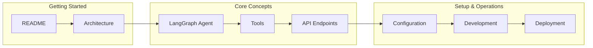
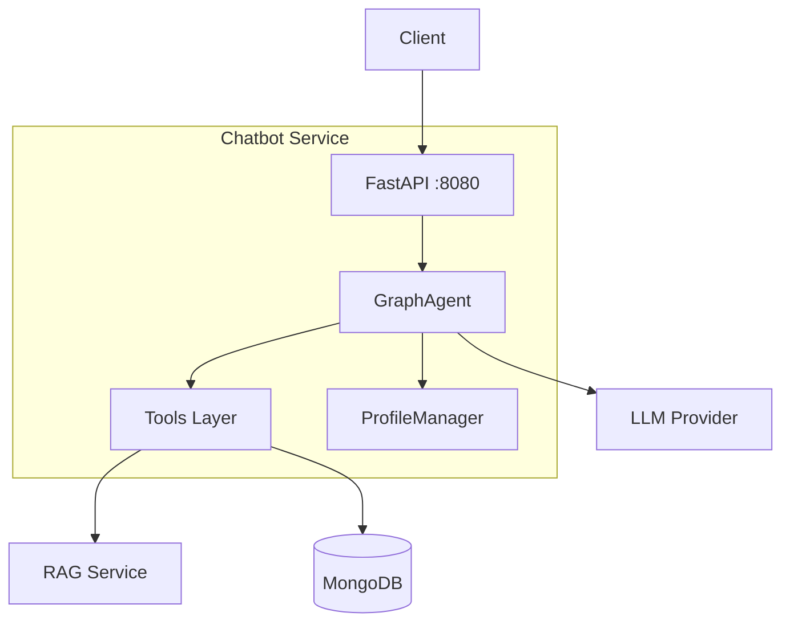

# Chatbot Service Documentation Index

Welcome to the Chatbot Service documentation. This service is the AI orchestration layer of the TFG-Chatbot platform, implementing a LangGraph-powered conversational agent.

## Quick Navigation



## Documentation Structure

### 📚 Overview

| Document | Description | Audience |
|----------|-------------|----------|
| [README](README.md) | Service overview and quick start | Everyone |
| [Architecture](architecture.md) | System design and components | Developers, Architects |

### 🤖 Core Concepts

| Document | Description | Audience |
|----------|-------------|----------|
| [LangGraph Agent](langgraph.md) | State machine, nodes, and flows | AI/ML Engineers |
| [Tools](tools.md) | RAG, teaching guides, test generation | Developers |
| [API Endpoints](api-endpoints.md) | Complete API reference | Frontend, Integration |

### ⚙️ Configuration & Operations

| Document | Description | Audience |
|----------|-------------|----------|
| [Configuration](configuration.md) | Environment variables and settings | DevOps, Developers |
| [Development](development.md) | Local setup, testing, debugging | Developers |
| [Deployment](deployment.md) | Docker, production, monitoring | DevOps, SRE |

---

## Service at a Glance

### What It Does

The Chatbot Service provides:

- 🧠 **Intelligent Conversations** - LangGraph-powered AI responses
- 📚 **RAG Integration** - Search course materials semantically
- 📖 **Teaching Guides** - Access to UGR guías docentes
- 📝 **Interactive Tests** - Generate and evaluate quiz sessions
- 📊 **Student Profiles** - Track learning progress

### Architecture



### Key Technologies

| Component | Technology |
|-----------|------------|
| Framework | FastAPI |
| AI Orchestration | LangGraph |
| LLM Clients | LangChain (OpenAI, Google, Mistral) |
| Database | MongoDB |
| State Persistence | SQLite (LangGraph) |
| Observability | Phoenix + Prometheus |

---

## Common Tasks

### For Developers

| Task | Document |
|------|----------|
| Set up local development | [Development](development.md#quick-start) |
| Add a new tool | [Tools](tools.md#adding-new-tools) |
| Modify agent behavior | [LangGraph](langgraph.md#graph-nodes) |
| Run tests | [Development](development.md#testing) |

### For DevOps

| Task | Document |
|------|----------|
| Configure environment | [Configuration](configuration.md) |
| Deploy with Docker | [Deployment](deployment.md#docker-deployment) |
| Set up monitoring | [Deployment](deployment.md#monitoring) |
| Troubleshoot issues | [Deployment](deployment.md#troubleshooting) |

### For API Consumers

| Task | Document |
|------|----------|
| Send chat messages | [API](api-endpoints.md#post-chat) |
| Handle test sessions | [API](api-endpoints.md#post-resume_chat) |
| Get conversation history | [API](api-endpoints.md#get-historysession_id) |
| Access analytics | [API](api-endpoints.md#analytics-endpoints) |

---

## API Quick Reference

### Chat Endpoints

```bash
# Send message
POST /chat
{
    "query": "¿Qué es Docker?",
    "id": "session-123",
    "asignatura": "iv"
}

# Resume test
POST /resume_chat
{
    "id": "session-123",
    "user_response": "Un contenedor es..."
}

# Get history
GET /history/{session_id}
```

### Tool Endpoints

```bash
# Scrape teaching guide
POST /scrape_guia
{
    "html_content": "<html>...</html>",
    "subject_override": "iv"
}
```

### Analytics Endpoints

```bash
# Get student profile
GET /profiles/{user_id}

# Get conversations
GET /conversations?user_id=student123&limit=100

# Get statistics
GET /conversations/stats?subject=iv
```

---

## Configuration Quick Reference

```bash
# Essential settings
LLM_PROVIDER=gemini              # gemini | mistral | vllm
GEMINI_API_KEY=your-key          # Required for gemini
RAG_SERVICE_URL=http://rag:8081  # RAG service
MONGO_HOSTNAME=mongodb           # MongoDB host

# Optional
PHOENIX_ENABLED=true             # Observability
DIFFICULTY_USE_HEURISTICS=true   # Fast difficulty classification
```

---

## Glossary

| Term | Definition |
|------|------------|
| **GraphAgent** | Main LangGraph state machine for conversations |
| **Tool** | LangChain tool the agent can call |
| **Checkpoint** | Saved conversation state in SQLite |
| **Interrupt** | LangGraph pause waiting for user input |
| **RAG** | Retrieval-Augmented Generation |
| **Guía Docente** | UGR teaching guide document |
| **Thread ID** | Unique identifier for a conversation session |

---

## Related Services

| Service | Port | Documentation |
|---------|------|---------------|
| Backend | 8000 | [Backend Docs](../backend/README.md) |
| RAG Service | 8081 | [RAG Docs](../rag_service/README.md) |
| Frontend | 5173 | [Frontend Docs](../frontend/README.md) |

---

## Getting Help

1. **Check documentation** - Start with relevant doc above
2. **Review ADRs** - Architecture decisions in `docs/ADR/`
3. **Run tests** - Verify your setup works
4. **Check logs** - Enable DEBUG logging for details

---

## Document Maintenance

| Document | Last Updated | Status |
|----------|--------------|--------|
| README.md | Current | ✅ |
| architecture.md | Current | ✅ |
| api-endpoints.md | Current | ✅ |
| configuration.md | Current | ✅ |
| langgraph.md | Current | ✅ |
| tools.md | Current | ✅ |
| development.md | Current | ✅ |
| deployment.md | Current | ✅ |
