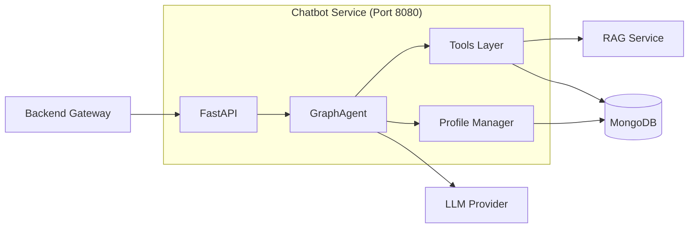
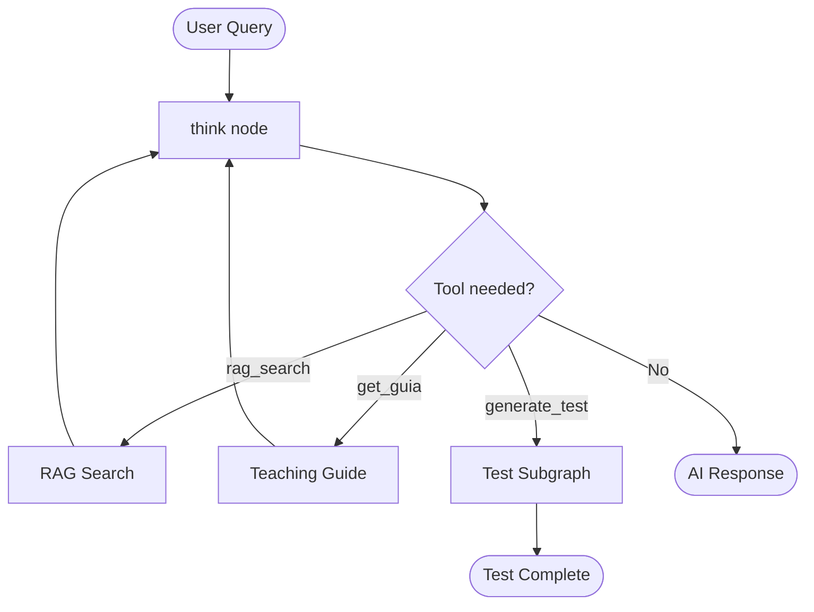
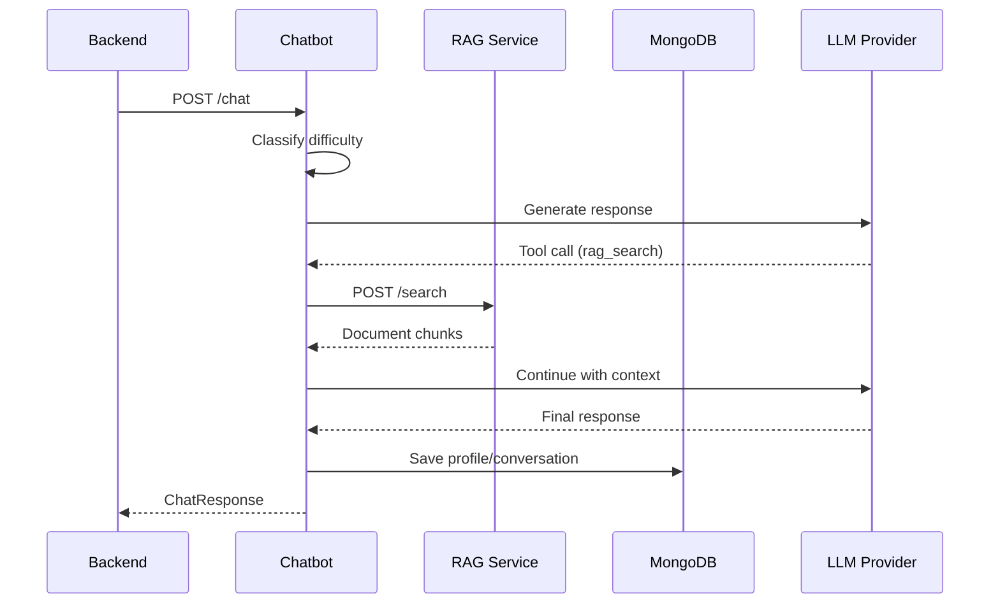

# Chatbot Service

The **Chatbot Service** is the AI orchestration layer of the TFG-Chatbot platform. It implements a LangGraph-powered conversational agent that provides intelligent, pedagogically-aware responses to students studying university courses.

## Overview



## Key Features

| Feature | Description |
|---------|-------------|
| **LangGraph Agent** | State machine-based conversation orchestration |
| **Multi-LLM Support** | Gemini, Mistral, and vLLM providers |
| **RAG Integration** | Semantic search over course documents |
| **Teaching Guides** | Structured access to UGR guías docentes |
| **Interactive Tests** | Question-answer sessions with interrupts |
| **Adaptive Prompts** | Difficulty-aware response generation |
| **Student Profiles** | Learning progress tracking in MongoDB |
| **Observability** | Phoenix/OpenInference tracing + Prometheus |

## Quick Start

### With Docker Compose (Recommended)

```bash
# Start the full stack
docker compose up -d chatbot

# View logs
docker compose logs -f chatbot
```

### Local Development

```bash
# Install with uv
uv pip install -e ./chatbot

# Set environment variables
export LLM_PROVIDER=gemini
export GEMINI_API_KEY=your-key

# Run the service
uvicorn chatbot.api:app --host 0.0.0.0 --port 8080 --reload
```

## API Endpoints

| Method | Endpoint | Description |
|--------|----------|-------------|
| `POST` | `/chat` | Send a message to the chatbot |
| `POST` | `/resume_chat` | Resume an interrupted test session |
| `GET` | `/history/{session_id}` | Get conversation history |
| `POST` | `/scrape_guia` | Parse and store a teaching guide |
| `GET` | `/profiles/{user_id}` | Get student knowledge profile |
| `GET` | `/conversations` | Get conversation history for analysis |
| `GET` | `/system/info` | Get LLM provider information |
| `GET` | `/health` | Health check endpoint |

## Architecture Highlights

### LangGraph State Machine

The chatbot uses LangGraph's `StateGraph` to orchestrate conversations:



### Tool System

Three primary tools available to the agent:

1. **`rag_search`** - Semantic search in document database
2. **`get_guia`** - Teaching guide information retrieval
3. **`generate_test`** - Interactive test generation

### Adaptive Difficulty

The chatbot classifies question complexity and adapts responses:

| Level | Description | Prompt Style |
|-------|-------------|--------------|
| **Basic** | Definitions, simple facts | Simple language, many examples |
| **Intermediate** | Application, relationships | Technical terms, practical use cases |
| **Advanced** | Analysis, synthesis | Full complexity, research references |

## Configuration

Key environment variables:

```bash
# LLM Provider (gemini | mistral | vllm)
LLM_PROVIDER=gemini
GEMINI_API_KEY=your-key
GEMINI_MODEL=gemini-2.5-flash

# Service URLs
RAG_SERVICE_URL=http://rag_service:8081
BACKEND_SERVICE_URL=http://backend:8000

# MongoDB
MONGO_HOSTNAME=mongodb
MONGO_PORT=27017

# Observability
PHOENIX_ENABLED=true
PHOENIX_HOST=phoenix
```

## Documentation

| Document | Description |
|----------|-------------|
| [Architecture](architecture.md) | System design and component overview |
| [API Endpoints](api-endpoints.md) | Complete API reference |
| [Configuration](configuration.md) | Environment variables and settings |
| [LangGraph Agent](langgraph.md) | Agent design and state machine |
| [Tools](tools.md) | Tool implementations and usage |
| [Development](development.md) | Local setup and testing |
| [Deployment](deployment.md) | Docker and production deployment |

## Technology Stack

- **Framework**: FastAPI 0.115+
- **AI Orchestration**: LangGraph 0.3+
- **LLM Clients**: LangChain (OpenAI, Google, Mistral)
- **Database**: MongoDB (via PyMongo)
- **State Persistence**: SQLite (LangGraph checkpointer)
- **Observability**: Phoenix + OpenInference, Prometheus
- **Python**: 3.12+

## Service Communication



## Related Services

- [Backend Service](../backend/README.md) - API gateway and authentication
- [RAG Service](../rag_service/README.md) - Document indexing and search
