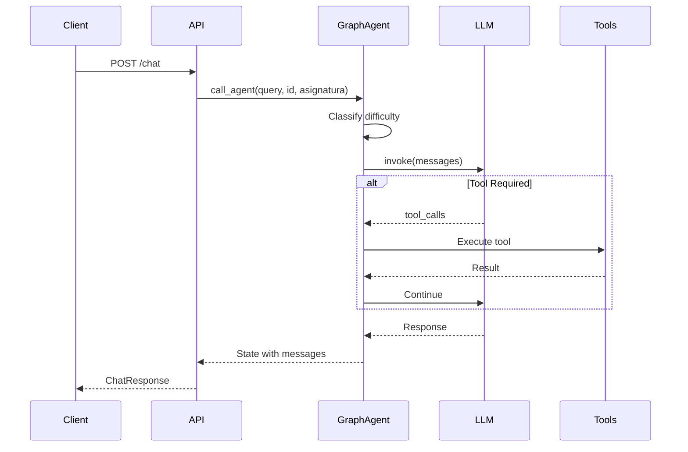
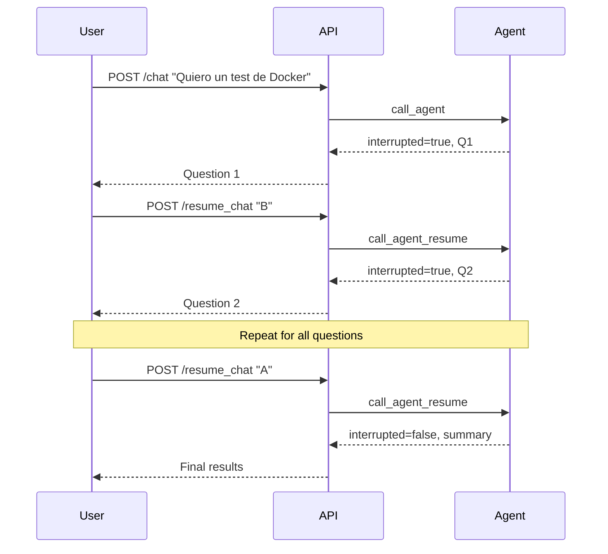

# Chatbot API Endpoints

Complete reference for all Chatbot Service API endpoints.

## Base URL

- **Development**: `http://localhost:8080`
- **Docker Compose**: `http://chatbot:8080`

## Authentication

The Chatbot Service does **not** implement authentication directly. It relies on the Backend gateway to authenticate requests and forward user information via request parameters (`user_id`).

---

## General Endpoints

### GET /

**Summary**: Get API information and available endpoints.

**Response**:

```json
{
    "name": "TFG Chatbot API",
    "version": "1.0.0",
    "description": "API for interacting with an intelligent chatbot powered by GraphAgent",
    "status": "running",
    "endpoints": {
        "health": "/health - Health check endpoint",
        "chat": "/chat - Send messages to the chatbot",
        "docs": "/docs - Interactive API documentation (Swagger UI)",
        "redoc": "/redoc - Alternative API documentation (ReDoc)"
    }
}
```

---

### GET /health

**Summary**: Health check endpoint.

**Response**:

```json
{
    "message": "Hello World"
}
```

**Status Codes**:
- `200` - Service is healthy

---

### GET /system/info

**Summary**: Get LLM provider and system information.

**Response**:

```json
{
    "version": "1.0.0",
    "llm_provider": "Gemini",
    "llm_model": "gemini-2.5-flash",
    "status": "operational"
}
```

Provider display names:
- `gemini` → "Gemini"
- `mistral` → "Mistral AI"
- `vllm` → "vLLM (Local)"

---

## Chatbot Endpoints

### POST /chat

**Summary**: Send a message to the chatbot and receive an intelligent response.

The chatbot uses GraphAgent to orchestrate conversations, which includes:
- Understanding user intent
- Searching for relevant information using RAG
- Consulting teaching guides stored in MongoDB
- Generating appropriate responses
- Managing interactive test sessions with interrupts

**Request Body**:

| Field | Type | Required | Description |
|-------|------|----------|-------------|
| `query` | string | ✅ | The user's message |
| `id` | string | ✅ | Session/thread identifier |
| `asignatura` | string | ❌ | Subject context (e.g., "iv", "DS") |
| `user_id` | string | ❌ | User identifier for profile tracking |

**Example Request**:

```json
{
    "query": "¿Qué es integración continua?",
    "id": "session_abc123",
    "asignatura": "iv",
    "user_id": "student123"
}
```

**Response** (normal):

```json
{
    "message": {
        "type": "ai",
        "content": "La integración continua (CI) es una práctica de desarrollo de software..."
    },
    "interrupted": false,
    "interrupt_info": null
}
```

**Response** (test interrupt):

```json
{
    "message": {
        "type": "ai",
        "content": "📝 Pregunta 1/5\n\n¿Qué herramienta se usa para CI/CD?"
    },
    "interrupted": true,
    "interrupt_info": {
        "action": "answer_question",
        "question_num": 1,
        "total_questions": 5,
        "question_text": "¿Qué herramienta se usa para CI/CD?"
    }
}
```

**Status Codes**:
- `200` - Successful response
- `422` - Validation error

**Sequence Diagram**:



---

### POST /resume_chat

**Summary**: Resume an interrupted test session with the user's answer.

When the chatbot initiates a test session, it interrupts waiting for user input. Use this endpoint to provide answers and continue the test.

**Request Body**:

| Field | Type | Required | Description |
|-------|------|----------|-------------|
| `id` | string | ✅ | Thread ID of the interrupted session |
| `user_response` | string | ✅ | User's answer to the current question |

**Example Request**:

```json
{
    "id": "session_abc123",
    "user_response": "B"
}
```

**Response** (next question):

```json
{
    "message": {
        "type": "ai",
        "content": "📝 Pregunta 2/5\n\n¿Qué es Docker?"
    },
    "interrupted": true,
    "interrupt_info": {
        "action": "answer_question",
        "question_num": 2,
        "total_questions": 5,
        "question_text": "¿Qué es Docker?"
    }
}
```

**Response** (test completed):

```json
{
    "message": {
        "type": "ai",
        "content": "¡Test completado! 🎉\n\nTu puntuación: 4/5 (80%)\n\n..."
    },
    "interrupted": false,
    "interrupt_info": null
}
```

**Test Session Flow**:



---

### GET /history/{session_id}

**Summary**: Retrieve conversation history for a session.

**Path Parameters**:

| Parameter | Type | Description |
|-----------|------|-------------|
| `session_id` | string | Thread ID of the conversation |

**Response**:

```json
{
    "messages": [
        {
            "type": "human",
            "content": "¿Qué es Docker?"
        },
        {
            "type": "ai",
            "content": "Docker es una plataforma de contenedores..."
        },
        {
            "type": "human",
            "content": "¿Cómo se crea un contenedor?"
        },
        {
            "type": "ai",
            "content": "Para crear un contenedor usamos el comando..."
        }
    ]
}
```

**Notes**:
- Returns empty list if no history exists
- History is persisted in SQLite checkpointer
- Only includes `human` and `ai` message types

---

## Tools Endpoints

### POST /scrape_guia

**Summary**: Parse a UGR teaching guide HTML and store it in MongoDB.

This endpoint processes the HTML content of a teaching guide (guía docente) from the University of Granada, extracts structured information, and stores it for quick retrieval.

**Request Body**:

| Field | Type | Required | Description |
|-------|------|----------|-------------|
| `html_content` | string | ✅ | Raw HTML content of the guía |
| `url` | string | ❌ | Original URL of the guía |
| `subject_override` | string | ❌ | Override subject key for storage |

**Example Request**:

```json
{
    "html_content": "<html>...</html>",
    "url": "https://grados.ugr.es/...",
    "subject_override": "infraestructura-virtual"
}
```

**Response** (success):

```json
{
    "status": "ok",
    "subject": "infraestructura-virtual",
    "upserted_id": "507f1f77bcf86cd799439011",
    "detail": {
        "matched_count": 0,
        "modified_count": 0,
        "upserted_id": "507f1f77bcf86cd799439011"
    }
}
```

**Response** (error):

```json
{
    "status": "error",
    "subject": null,
    "upserted_id": null,
    "detail": {
        "error": "No subject found in parsed guia"
    }
}
```

**Extracted Fields**:
- Course name, code, credits
- Competencies and learning objectives
- Course content and topics
- Teaching methodology
- Evaluation criteria
- Bibliography

---

## Analytics Endpoints

### GET /profiles/{user_id}

**Summary**: Get student knowledge profile for analysis.

Returns the student's learning profile including difficulty distribution, subject mastery levels, recent interactions, and test performance.

**Path Parameters**:

| Parameter | Type | Description |
|-----------|------|-------------|
| `user_id` | string | User identifier |

**Response**:

```json
{
    "user_id": "student123",
    "created_at": "2024-01-15T10:30:00Z",
    "updated_at": "2024-01-20T14:45:00Z",
    "total_interactions": 42,
    "total_tests_taken": 3,
    "difficulty_distribution": {
        "basic": 15,
        "intermediate": 20,
        "advanced": 7
    },
    "subject_mastery": {
        "iv": {
            "docker": {
                "interactions_count": 8,
                "level": 0.75,
                "correct_answers": 6,
                "total_test_questions": 8,
                "last_interaction": "2024-01-20T14:45:00Z"
            }
        }
    },
    "recent_interactions": [
        {
            "timestamp": "2024-01-20T14:45:00Z",
            "query": "¿Qué es Docker Compose?",
            "difficulty": "intermediate",
            "topic": "docker",
            "subject": "iv",
            "was_test": false,
            "test_score": null
        }
    ]
}
```

**Status Codes**:
- `200` - Profile found
- `404` - Profile not found

---

### POST /profiles/batch

**Summary**: Get multiple student profiles in a single request.

**Request Body**:

```json
["student1", "student2", "student3"]
```

**Response**:

```json
[
    {
        "user_id": "student1",
        "total_interactions": 42,
        ...
    },
    {
        "user_id": "student2",
        "total_interactions": 28,
        ...
    }
]
```

**Notes**:
- Users without profiles are omitted from response
- Useful for dashboard views

---

### GET /conversations

**Summary**: Retrieve full conversation turns for analysis.

**Query Parameters**:

| Parameter | Type | Default | Description |
|-----------|------|---------|-------------|
| `user_id` | string | null | Filter by user |
| `session_id` | string | null | Filter by session |
| `limit` | int | 100 | Maximum turns to return |

**Response**:

```json
[
    {
        "session_id": "session_abc123",
        "query": "¿Qué es Docker?",
        "answer": "Docker es una plataforma...",
        "user_id": "student123",
        "subject": "iv",
        "difficulty": "basic",
        "latency_ms": 1250.5,
        "timestamp": "2024-01-20T14:45:00Z",
        "was_test": false
    }
]
```

---

### GET /conversations/stats

**Summary**: Get aggregated conversation statistics.

**Query Parameters**:

| Parameter | Type | Description |
|-----------|------|-------------|
| `user_ids` | string | Comma-separated user IDs |
| `subject` | string | Filter by subject |

**Example**: `/conversations/stats?user_ids=student1,student2&subject=iv`

**Response**:

```json
{
    "total_conversations": 156,
    "unique_users": 12,
    "unique_sessions": 45,
    "difficulty_distribution": {
        "basic": 45,
        "intermediate": 78,
        "advanced": 33
    },
    "avg_latency_ms": 1850.5,
    "test_conversations": 23
}
```

---

## Data Models

### ChatRequest

```python
class ChatRequest(BaseModel):
    query: str          # User's message
    id: str             # Session identifier
    asignatura: str | None = None  # Subject context
    user_id: str | None = None     # User ID for tracking
```

### ChatResponse

```python
class ChatResponse(BaseModel):
    message: ChatMessage | None      # AI response
    interrupted: bool = False        # Waiting for input?
    interrupt_info: InterruptInfo | None = None
```

### ChatMessage

```python
class ChatMessage(BaseModel):
    type: str      # "ai", "human", "tool", "system"
    content: str   # Message text
```

### InterruptInfo

```python
class InterruptInfo(BaseModel):
    action: str           # e.g., "answer_question"
    question_num: int     # Current question (1-indexed)
    total_questions: int  # Total in test
    question_text: str    # The question
```

### ResumeRequest

```python
class ResumeRequest(BaseModel):
    id: str              # Thread ID
    user_response: str   # User's answer
```

### ScrapeRequest

```python
class ScrapeRequest(BaseModel):
    html_content: str              # Raw HTML
    url: str | None = None         # Original URL
    subject_override: str | None = None  # Override subject key
```

---

## Error Responses

### Validation Error (422)

```json
{
    "detail": [
        {
            "type": "missing",
            "loc": ["body", "query"],
            "msg": "Field required"
        }
    ]
}
```

### Not Found (404)

```json
{
    "detail": "Profile not found"
}
```

### Internal Error (500)

```json
{
    "detail": "Internal server error"
}
```

---

## Metrics Endpoint

### GET /metrics

**Summary**: Prometheus metrics endpoint (auto-generated).

Exposes metrics including:
- `http_requests_total` - Request count by method/path/status
- `http_request_duration_seconds` - Request latency histogram
- `http_requests_in_progress` - Current active requests

---

## OpenAPI Documentation

- **Swagger UI**: `http://localhost:8080/docs`
- **ReDoc**: `http://localhost:8080/redoc`
- **OpenAPI JSON**: `http://localhost:8080/openapi.json`

---

## Rate Limits

The Chatbot Service does not implement rate limiting directly. Rate limiting should be configured at:
- The Backend gateway (recommended)
- Load balancer/reverse proxy

---

## Related Documentation

- [Architecture](architecture.md) - System design
- [LangGraph Agent](langgraph.md) - Agent internals
- [Tools](tools.md) - Tool documentation
- [Configuration](configuration.md) - Environment variables
