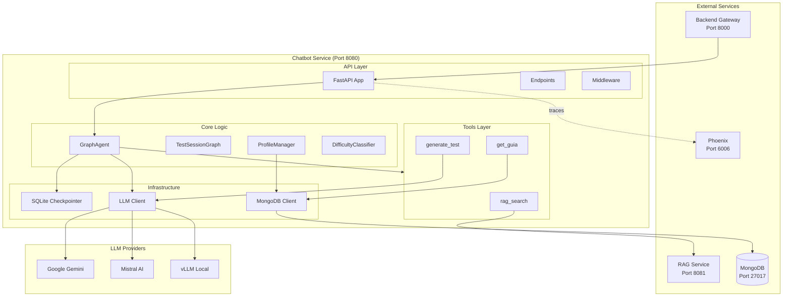
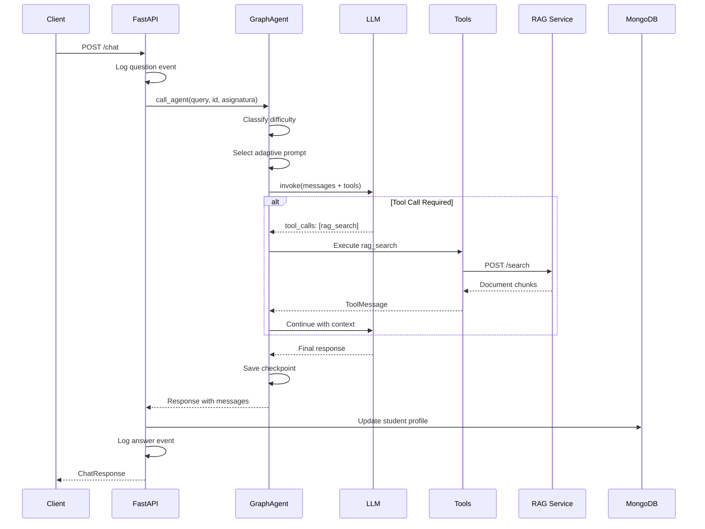
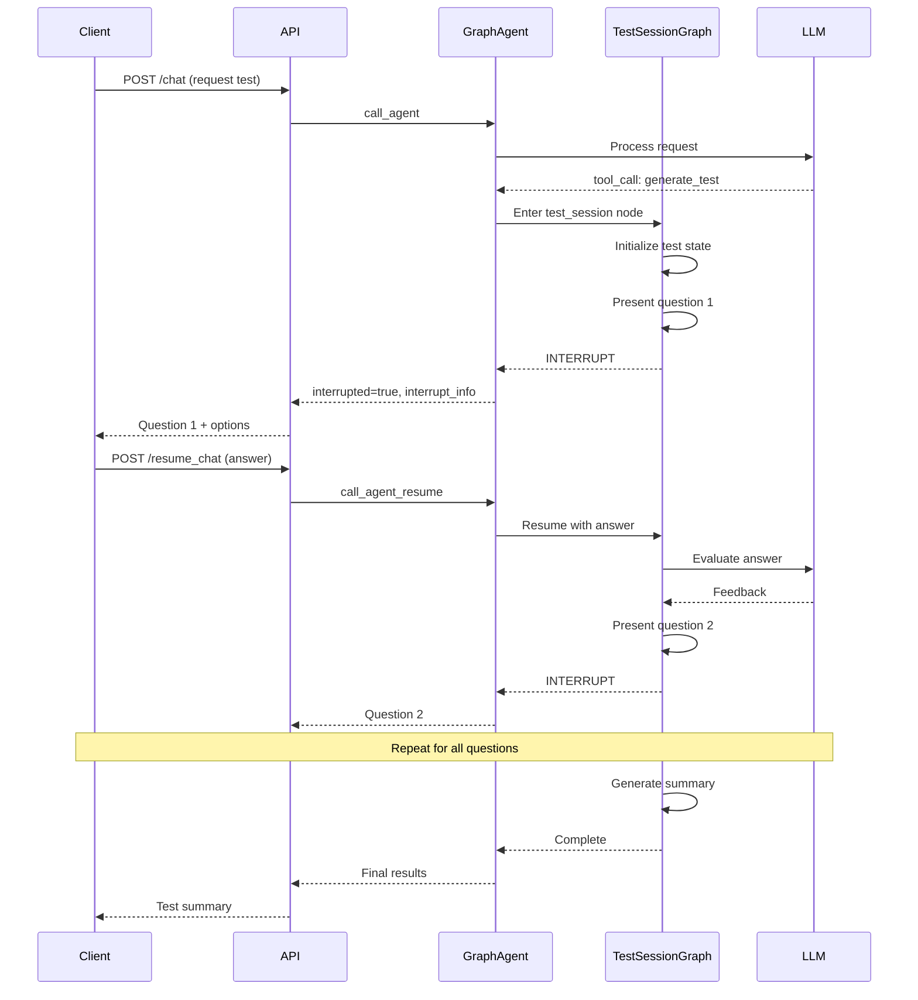
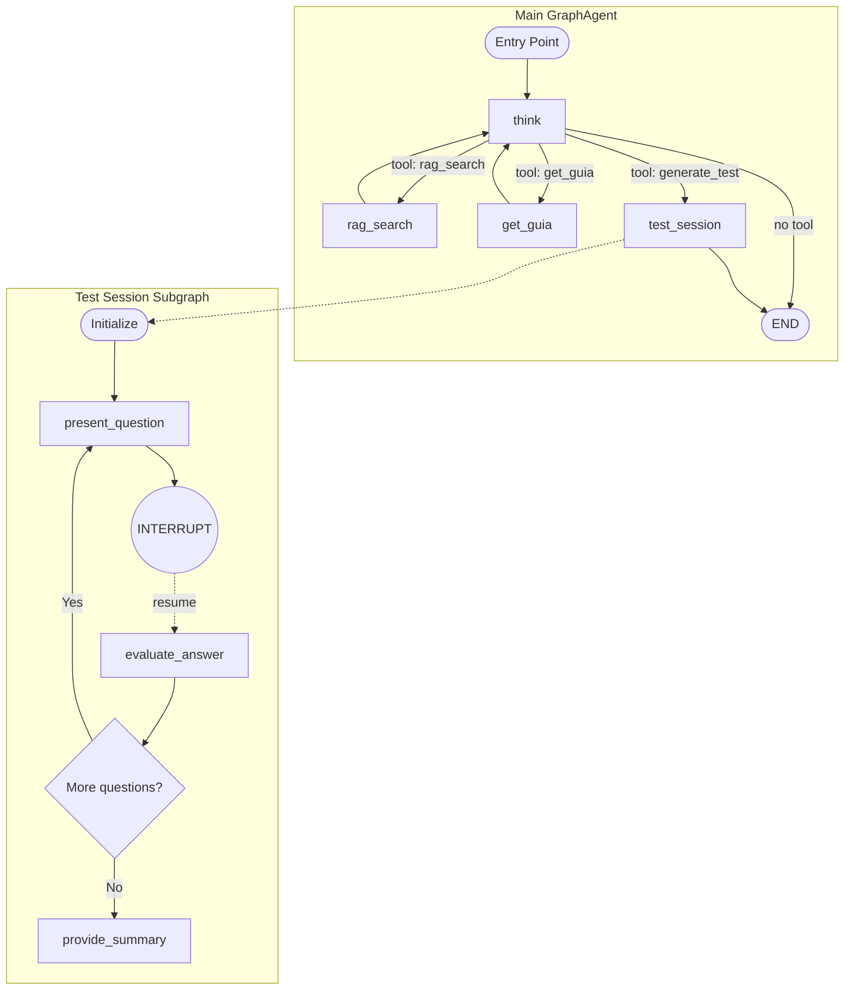
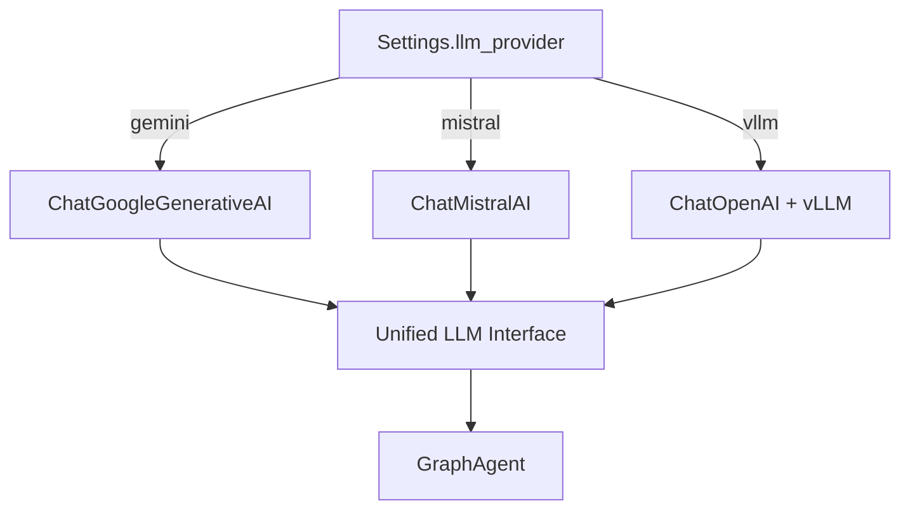
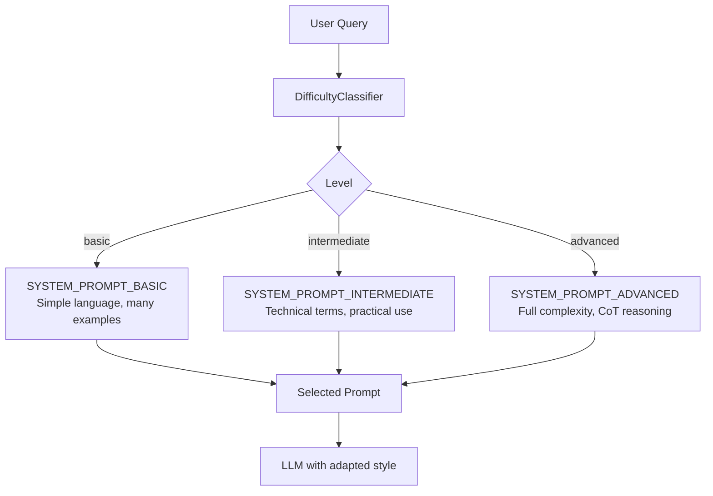
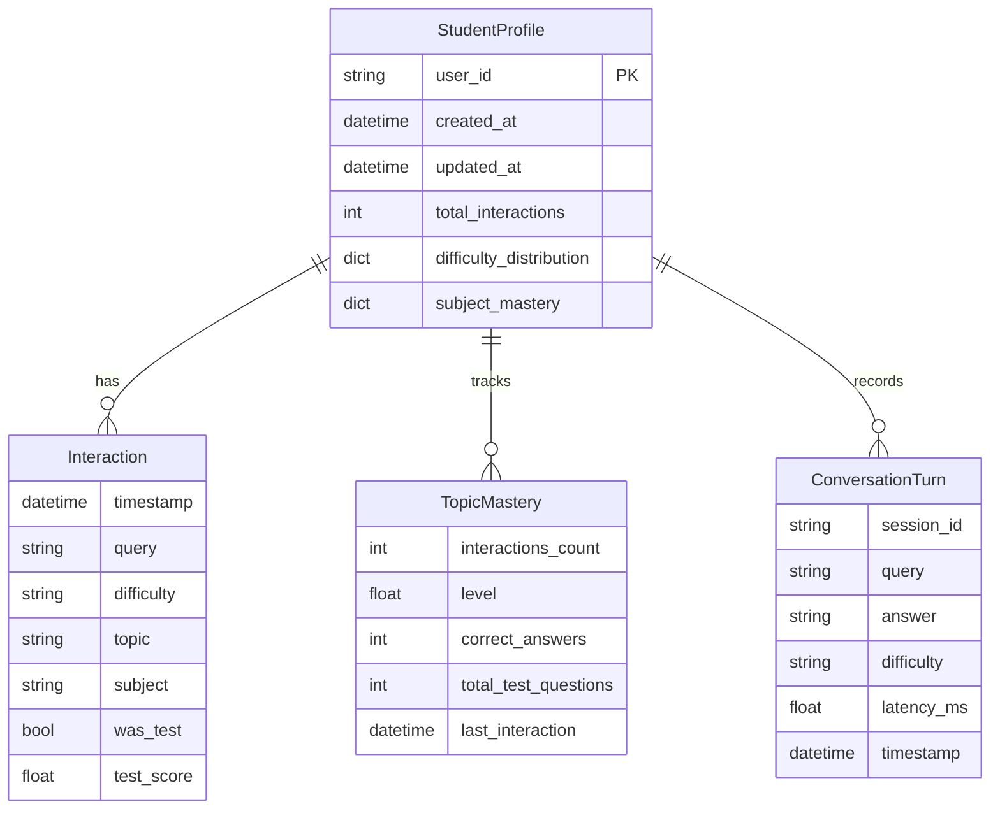
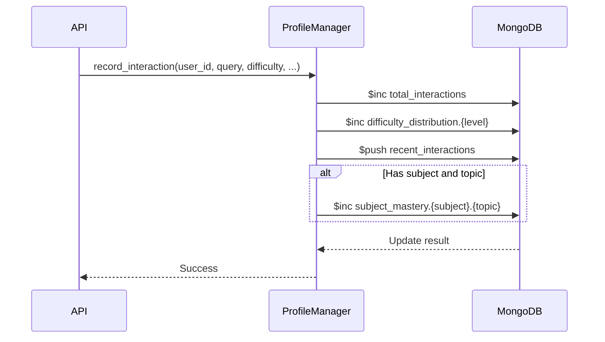
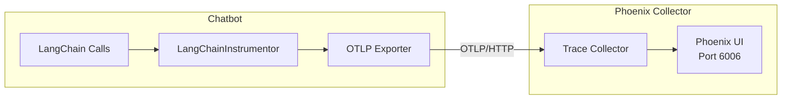
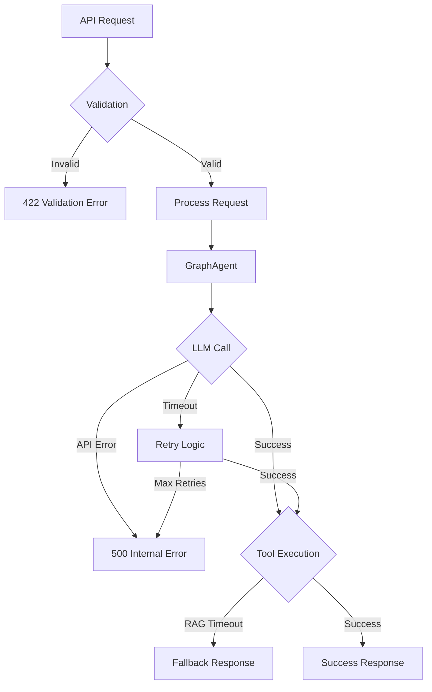

# Chatbot Service Architecture

This document describes the architecture of the Chatbot Service, a LangGraph-powered AI agent that orchestrates conversations with students.

## System Architecture



## Component Overview

### API Layer

The API layer handles HTTP requests and coordinates with the core logic.

| Component | File | Responsibility |
|-----------|------|----------------|
| **FastAPI App** | `api.py` | Application setup, middleware, endpoints |
| **Models** | `models.py` | Request/Response Pydantic models |
| **Config** | `config.py` | Environment-based settings |

### Core Logic

The brain of the chatbot service:

| Component | File | Responsibility |
|-----------|------|----------------|
| **GraphAgent** | `logic/graph.py` | Main LangGraph state machine |
| **TestSessionGraph** | `logic/testGraph.py` | Interactive test subgraph |
| **ProfileManager** | `logic/profile_manager.py` | Student progress tracking |
| **DifficultyClassifier** | `logic/difficulty.py` | Question complexity analysis |
| **Prompts** | `logic/prompts.py` | System prompts per difficulty |

### Tools Layer

LangChain tools for agent capabilities:

| Tool | File | Description |
|------|------|-------------|
| **rag_search** | `logic/tools/rag.py` | Semantic search via RAG service |
| **get_guia** | `logic/tools/guia.py` | Teaching guide retrieval |
| **generate_test** | `logic/tools/test_gen.py` | Test question generation |

### Infrastructure

Supporting services and clients:

| Component | File | Description |
|-----------|------|-------------|
| **MongoDBClient** | `db/mongo.py` | MongoDB connection wrapper |
| **SQLite Checkpointer** | LangGraph | Conversation state persistence |
| **Instrumentation** | `instrumentation.py` | Phoenix/OpenTelemetry setup |

## Data Flow

### Chat Request Flow



### Test Session Flow



## State Management

### SubjectState Schema

The main state object that flows through the graph:

```python
class SubjectState(MessagesState):
    # Core conversation
    messages: list[BaseMessage]  # Inherited
    asignatura: str | None       # Current subject
    context: list[dict] | None   # RAG results
    
    # Difficulty classification
    thinking: str | None         # CoT reasoning (advanced)
    query_difficulty: str | None # basic/intermediate/advanced
    
    # Test session (shared with TestSessionState)
    topic: str | None
    num_questions: int | None
    difficulty: str | None
    questions: list[MultipleChoiceTest] | None
    current_question_index: int | None
    user_answers: list[str] | None
    feedback_history: list[str] | None
    scores: list[bool] | None
    pending_feedback: str | None
```

### Checkpoint Persistence

LangGraph uses SQLite for conversation state:

```
chatbot/storage/checkpoints.db
```

Each thread (identified by `thread_id`) maintains:
- Full message history
- Tool call/response pairs
- Test session progress
- Context from RAG searches

## LangGraph Architecture

### Graph Structure



### Node Functions

| Node | Function | Description |
|------|----------|-------------|
| `think` | `GraphAgent.think()` | Main reasoning, tool selection |
| `rag_search` | `GraphAgent.rag_search()` | Execute RAG tool |
| `get_guia` | `GraphAgent.get_guia()` | Execute guia tool |
| `test_session` | Compiled subgraph | Handle interactive tests |

### Conditional Routing

```python
def should_continue(state: SubjectState):
    last_message = state["messages"][-1]
    
    if hasattr(last_message, "tool_calls") and last_message.tool_calls:
        return last_message.tool_calls[0]["name"]  # Route to tool node
    else:
        return END  # Conversation complete
```

## LLM Provider Architecture

### Multi-Provider Support



### Provider Configuration

| Provider | Class | Configuration |
|----------|-------|---------------|
| **Gemini** | `ChatGoogleGenerativeAI` | `GEMINI_API_KEY`, `GEMINI_MODEL` |
| **Mistral** | `ChatMistralAI` | `MISTRAL_API_KEY`, `MISTRAL_MODEL` |
| **vLLM** | `ChatOpenAI` | `VLLM_HOST`, `VLLM_PORT`, `MODEL_PATH` |

## Adaptive Prompting

### Difficulty-Based Prompt Selection



### Classification Methods

1. **Heuristic-Based** (Fast, no latency)
   - Keyword matching ("qué es" → basic)
   - Pattern recognition (regex)
   
2. **Embedding-Based** (More accurate)
   - Semantic similarity to trained centroids
   - Requires embedding model

## Student Profile System

### Profile Data Model



### Profile Update Flow



## Observability Architecture

### Tracing with Phoenix



### Metrics with Prometheus

```mermaid
flowchart LR
    subgraph Chatbot
        FastAPI[FastAPI App]
        Instrumentator[prometheus-fastapi-instrumentator]
        Metrics[/metrics endpoint]
    end
    
    subgraph Monitoring
        Prometheus[Prometheus]
        Grafana[Grafana]
    end
    
    FastAPI --> Instrumentator
    Instrumentator --> Metrics
    Prometheus -->|scrape| Metrics
    Grafana --> Prometheus
```

## Error Handling

### Error Flow



### Error Categories

| Category | Handling | User Message |
|----------|----------|--------------|
| **Validation** | FastAPI automatic | Field-specific errors |
| **LLM Errors** | Retry with backoff | "Temporary issue, please retry" |
| **Tool Errors** | Graceful fallback | Continue without tool result |
| **DB Errors** | Log and continue | Non-blocking for chat |

## Security Considerations

### API Security

- **No direct authentication** - Relies on Backend gateway
- **Input validation** - Pydantic models
- **Rate limiting** - Configured at gateway level
- **Correlation IDs** - Request tracing

### Data Security

- **API keys as SecretStr** - Never logged
- **MongoDB auth** - Username/password authentication
- **Non-root container** - Runs as `appuser` (UID 1000)

## File Structure

```
chatbot/
├── __init__.py
├── __main__.py           # CLI entry point
├── api.py                # FastAPI application
├── config.py             # Settings with pydantic-settings
├── models.py             # API request/response models
├── events.py             # Event logging
├── instrumentation.py    # Phoenix setup
├── logging_config.py     # Structured logging
├── Dockerfile
├── pyproject.toml
│
├── db/
│   └── mongo.py          # MongoDB client wrapper
│
├── logic/
│   ├── graph.py          # Main GraphAgent
│   ├── testGraph.py      # Test session subgraph
│   ├── prompts.py        # System prompts
│   ├── difficulty.py     # Difficulty classifier
│   ├── profile_manager.py
│   │
│   ├── models/
│   │   ├── __init__.py
│   │   ├── tool_models.py
│   │   └── student_profile.py
│   │
│   └── tools/
│       ├── __init__.py
│       ├── tools.py      # Tool registry
│       ├── rag.py        # RAG search tool
│       ├── guia.py       # Teaching guide tool
│       ├── test_gen.py   # Test generation tool
│       └── utils.py      # Tool utilities
│
├── storage/
│   └── checkpoints.db    # LangGraph state (generated)
│
└── tests/
    ├── conftest.py
    ├── test_graph.py
    ├── test_testGraph.py
    ├── test_difficulty.py
    └── ...
```

## Related Documentation

- [API Endpoints](api-endpoints.md) - Complete endpoint reference
- [LangGraph Agent](langgraph.md) - Detailed agent documentation
- [Tools](tools.md) - Tool implementations
- [Configuration](configuration.md) - All settings
