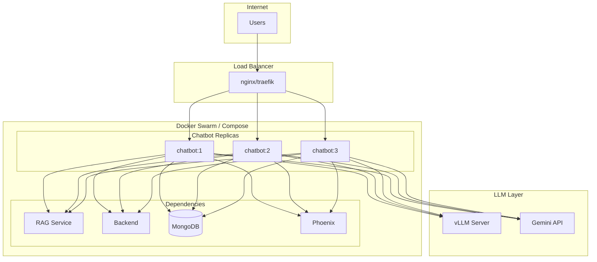
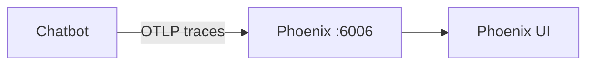

# Chatbot Deployment Guide

This guide covers deploying the Chatbot Service in various environments.

## Deployment Options

| Option | Best For | Complexity |
|--------|----------|------------|
| Docker Compose | Development, small deployments | Low |
| Kubernetes | Production, scalability | High |
| Standalone | Testing, debugging | Low |

---

## Docker Deployment

### Dockerfile Overview

```dockerfile
# Multi-stage build for smaller images
FROM python:3.12-slim AS builder
WORKDIR /build

# Install dependencies
COPY chatbot/pyproject.toml chatbot/
RUN pip install --no-cache-dir ./chatbot

# Runtime stage
FROM python:3.12-slim
WORKDIR /app

# Copy from builder
COPY --from=builder /usr/local/lib/python3.12/site-packages /usr/local/lib/python3.12/site-packages
COPY chatbot chatbot/

# Security: non-root user
RUN useradd -m -u 1000 appuser && chown -R appuser:appuser /app
USER appuser

EXPOSE 8080
CMD ["uvicorn", "chatbot.api:app", "--host", "0.0.0.0", "--port", "8080"]
```

### Build the Image

```bash
# Standard build
docker build -f chatbot/Dockerfile -t tfg-chatbot:latest .

# With dev dependencies
docker build -f chatbot/Dockerfile -t tfg-chatbot:dev \
  --build-arg INSTALL_DEV=true .
```

### Run Standalone Container

```bash
docker run -d \
  --name chatbot \
  -p 8080:8080 \
  -e LLM_PROVIDER=gemini \
  -e GEMINI_API_KEY=${GEMINI_API_KEY} \
  -e RAG_SERVICE_URL=http://host.docker.internal:8081 \
  -e MONGO_HOSTNAME=host.docker.internal \
  tfg-chatbot:latest
```

---

## Docker Compose Deployment

### Service Definition

```yaml
# docker-compose.yml
services:
  chatbot:
    build:
      context: .
      dockerfile: chatbot/Dockerfile
      args:
        INSTALL_DEV: "${INSTALL_DEV:-false}"
    ports:
      - "8080:8080"
    environment:
      # LLM Configuration
      - LLM_PROVIDER=${LLM_PROVIDER:-gemini}
      - GEMINI_API_KEY=${GEMINI_API_KEY}
      - GEMINI_MODEL=${GEMINI_MODEL:-gemini-2.5-flash}
      
      # Service URLs
      - RAG_SERVICE_URL=http://rag_service:8081
      - BACKEND_SERVICE_URL=http://backend:8000
      
      # MongoDB
      - MONGO_HOSTNAME=mongodb
      - MONGO_PORT=27017
      - MONGO_ROOT_USERNAME=${MONGO_ROOT_USERNAME}
      - MONGO_ROOT_PASSWORD=${MONGO_ROOT_PASSWORD}
      - MONGO_AUTH_DB=admin
      - DB_NAME=tfg_chatbot
      
      # Observability
      - PHOENIX_ENABLED=${PHOENIX_ENABLED:-true}
      - PHOENIX_HOST=phoenix
      - PHOENIX_PORT=6006
    
    depends_on:
      mongodb:
        condition: service_healthy
      rag_service:
        condition: service_started
    
    volumes:
      - chatbot_storage:/app/chatbot/storage
    
    networks:
      - tfg-network
    
    healthcheck:
      test: ["CMD", "curl", "-f", "http://localhost:8080/health"]
      interval: 30s
      timeout: 10s
      retries: 3
      start_period: 40s

volumes:
  chatbot_storage:
    driver: local

networks:
  tfg-network:
    driver: bridge
```

### Start Services

```bash
# Start chatbot and dependencies
docker compose up -d chatbot

# View logs
docker compose logs -f chatbot

# Rebuild after changes
docker compose build chatbot
docker compose up -d chatbot
```

### Full Stack

```bash
# Start all services
docker compose up -d

# Services started:
# - mongodb (27017)
# - qdrant (6333)
# - phoenix (6006)
# - rag_service (8081)
# - backend (8000)
# - chatbot (8080)
# - frontend (5173)
```

---

## Production Configuration

### Environment Variables

```bash
# .env.production

# =============================================================================
# LLM Configuration
# =============================================================================
LLM_PROVIDER=vllm
VLLM_HOST=vllm-openai
VLLM_MAIN_PORT=8000
MODEL_PATH=/models/Qwen--Qwen2.5-7B-Instruct

# =============================================================================
# Service URLs (Internal Docker network)
# =============================================================================
RAG_SERVICE_URL=http://rag_service:8081
BACKEND_SERVICE_URL=http://backend:8000

# =============================================================================
# MongoDB (Authenticated)
# =============================================================================
MONGO_HOSTNAME=mongodb
MONGO_PORT=27017
MONGO_ROOT_USERNAME=admin
MONGO_ROOT_PASSWORD=${MONGO_ROOT_PASSWORD}
MONGO_AUTH_DB=admin
DB_NAME=tfg_chatbot

# =============================================================================
# Observability
# =============================================================================
PHOENIX_ENABLED=true
PHOENIX_HOST=phoenix
PHOENIX_PORT=6006
PHOENIX_PROJECT_NAME=tfg-chatbot-prod

# =============================================================================
# Difficulty Classifier
# =============================================================================
DIFFICULTY_CENTROIDS_PATH=/app/data/difficulty_centroids.json
DIFFICULTY_EMBEDDING_DIM=768
DIFFICULTY_USE_HEURISTICS=true
```

### Resource Limits

```yaml
# docker-compose.prod.yml
services:
  chatbot:
    deploy:
      resources:
        limits:
          cpus: '2.0'
          memory: 4G
        reservations:
          cpus: '0.5'
          memory: 512M
      restart_policy:
        condition: on-failure
        delay: 5s
        max_attempts: 3
```

### Scaling

```bash
# Scale to multiple replicas
docker compose up -d --scale chatbot=3

# Note: Requires load balancer in front
```

---

## Architecture Diagram



---

## Health Checks

### Endpoints

| Endpoint | Purpose | Expected Response |
|----------|---------|-------------------|
| `/health` | Basic health check | `{"message": "Hello World"}` |
| `/system/info` | LLM configuration | `{"llm_provider": "...", "status": "operational"}` |
| `/metrics` | Prometheus metrics | Metrics text |

### Docker Health Check

```yaml
healthcheck:
  test: ["CMD", "curl", "-f", "http://localhost:8080/health"]
  interval: 30s
  timeout: 10s
  retries: 3
  start_period: 40s
```

### Kubernetes Probes

```yaml
livenessProbe:
  httpGet:
    path: /health
    port: 8080
  initialDelaySeconds: 30
  periodSeconds: 10

readinessProbe:
  httpGet:
    path: /health
    port: 8080
  initialDelaySeconds: 5
  periodSeconds: 5
```

---

## Monitoring

### Prometheus Metrics

The service exposes metrics at `/metrics`:

```
# Request metrics
http_requests_total{method="POST",path="/chat",status="200"} 1234
http_request_duration_seconds_bucket{le="0.5"} 100
http_requests_in_progress 5

# Python metrics
python_gc_objects_collected_total
process_cpu_seconds_total
```

### Prometheus Configuration

```yaml
# prometheus.yml
scrape_configs:
  - job_name: 'chatbot'
    static_configs:
      - targets: ['chatbot:8080']
    metrics_path: /metrics
    scrape_interval: 15s
```

### Phoenix Tracing

LLM calls are traced to Phoenix:



View traces at: `http://localhost:6006`

### Grafana Dashboard

Import dashboard for:
- Request latency percentiles
- Error rates
- LLM response times
- MongoDB operations

---

## Logging

### Structured Logging

Logs are in JSON format:

```json
{
    "timestamp": "2024-01-20T10:30:00Z",
    "level": "INFO",
    "message": "Chat request processed",
    "correlation_id": "abc-123",
    "session_id": "user-session",
    "latency_ms": 1250
}
```

### Log Aggregation

```yaml
# promtail-config.yml
scrape_configs:
  - job_name: chatbot
    static_configs:
      - targets:
          - localhost
        labels:
          job: chatbot
          __path__: /var/log/chatbot/*.log
```

### Log Levels

Set via environment:

```bash
LOG_LEVEL=INFO  # Production
LOG_LEVEL=DEBUG # Debugging
```

---

## Security

### Non-Root Container

```dockerfile
RUN useradd -m -u 1000 appuser && chown -R appuser:appuser /app
USER appuser
```

### Secret Management

**Never commit secrets!**

```bash
# Use environment variables
export GEMINI_API_KEY=...

# Or Docker secrets
echo "api-key" | docker secret create gemini_api_key -

# Reference in compose
services:
  chatbot:
    secrets:
      - gemini_api_key
```

### Network Security

```yaml
# Restrict network access
networks:
  tfg-network:
    driver: bridge
    internal: true  # No external access
```

### API Security

- **No direct auth** - Relies on Backend gateway
- **Rate limiting** - Configure at gateway/LB
- **Input validation** - Pydantic models

---

## Troubleshooting

### Container Won't Start

```bash
# Check logs
docker compose logs chatbot

# Common issues:
# - Missing API keys
# - MongoDB connection failed
# - Port already in use
```

### LLM Errors

```bash
# Check configuration
docker compose exec chatbot env | grep -E "LLM|GEMINI|MISTRAL"

# Test LLM connection
curl http://localhost:8080/system/info
```

### Database Issues

```bash
# Check MongoDB connection
docker compose exec chatbot python -c "
from chatbot.db.mongo import MongoDBClient
client = MongoDBClient()
client.connect()
print('Connected!')
"
```

### Checkpoint Errors

```bash
# Remove corrupted checkpoints
docker compose exec chatbot rm -f /app/chatbot/storage/checkpoints.db*

# Restart
docker compose restart chatbot
```

### Memory Issues

```bash
# Check memory usage
docker stats chatbot

# Increase limits in compose
deploy:
  resources:
    limits:
      memory: 4G
```

---

## Backup and Recovery

### Checkpoint Database

```bash
# Backup checkpoints
docker compose exec chatbot tar -czf /tmp/checkpoints.tar.gz /app/chatbot/storage/

# Copy to host
docker compose cp chatbot:/tmp/checkpoints.tar.gz ./backups/

# Restore
docker compose cp ./backups/checkpoints.tar.gz chatbot:/tmp/
docker compose exec chatbot tar -xzf /tmp/checkpoints.tar.gz -C /
```

### MongoDB Data

```bash
# Backup
docker compose exec mongodb mongodump --out=/dump

# Restore
docker compose exec mongodb mongorestore /dump
```

---

## Rollback Procedure

```bash
# Tag current version before deploy
docker tag tfg-chatbot:latest tfg-chatbot:previous

# Deploy new version
docker compose build chatbot
docker compose up -d chatbot

# If issues, rollback
docker tag tfg-chatbot:previous tfg-chatbot:latest
docker compose up -d chatbot
```

---

## CI/CD Integration

### GitHub Actions Example

```yaml
name: Deploy Chatbot

on:
  push:
    branches: [main]
    paths: ['chatbot/**']

jobs:
  deploy:
    runs-on: ubuntu-latest
    steps:
      - uses: actions/checkout@v4
      
      - name: Build image
        run: docker build -f chatbot/Dockerfile -t tfg-chatbot:${{ github.sha }} .
      
      - name: Push to registry
        run: |
          docker tag tfg-chatbot:${{ github.sha }} registry.example.com/tfg-chatbot:${{ github.sha }}
          docker push registry.example.com/tfg-chatbot:${{ github.sha }}
      
      - name: Deploy
        run: |
          ssh deploy@server "cd /app && docker compose pull chatbot && docker compose up -d chatbot"
```

---

## Related Documentation

- [Configuration](configuration.md) - Environment variables
- [Architecture](architecture.md) - System design
- [Development](development.md) - Local setup
