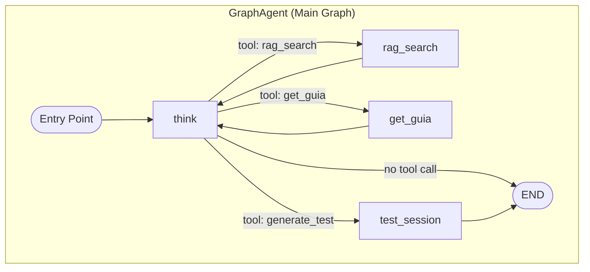
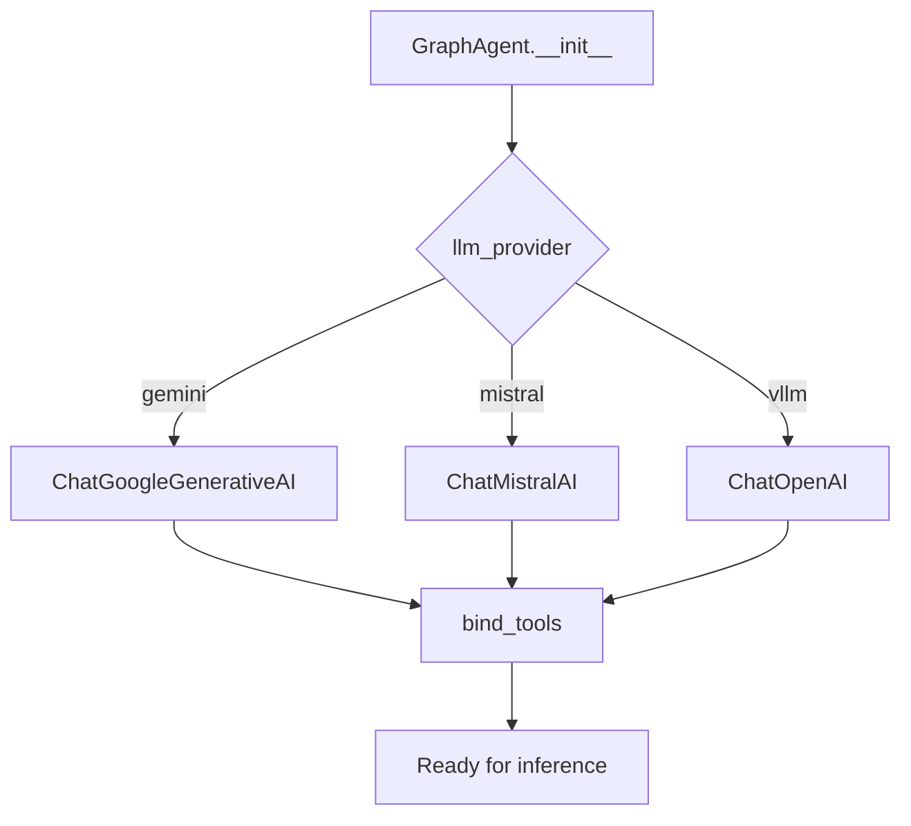
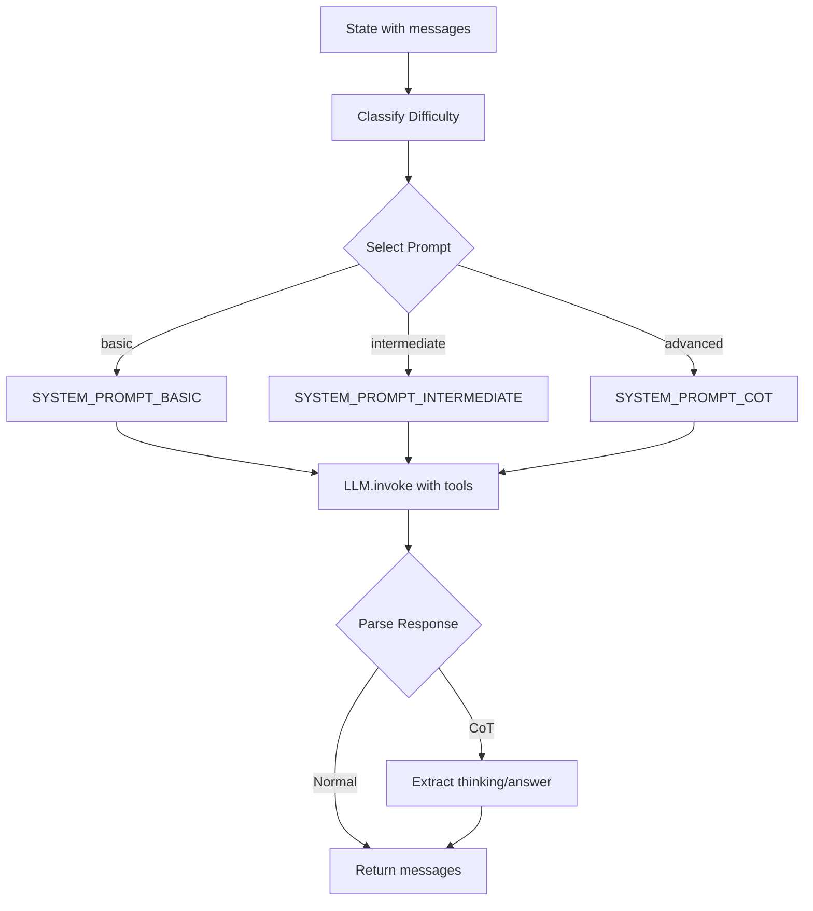
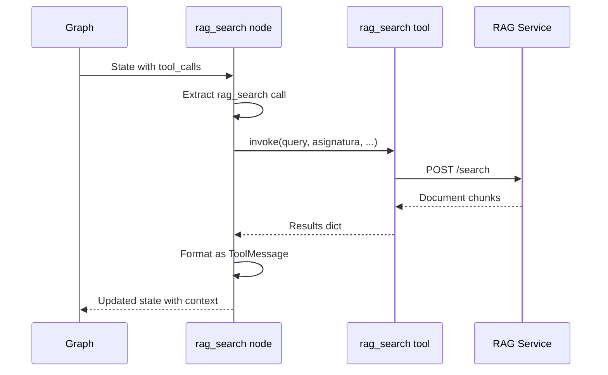
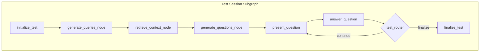
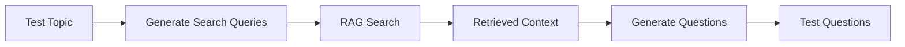

# LangGraph Agent Documentation

This document provides in-depth documentation of the LangGraph-based conversational agent that powers the Chatbot Service.

## Overview

The chatbot uses [LangGraph](https://langchain-ai.github.io/langgraph/) to orchestrate conversations as a state machine. This enables:

- **Tool calling**: Automatic selection and execution of tools
- **State persistence**: Conversation continuity across requests
- **Human-in-the-loop**: Interactive test sessions with interrupts
- **Complex flows**: Multi-step reasoning and branching logic

## Architecture



## State Management

### SubjectState

The main state object that flows through the graph:

```python
class SubjectState(MessagesState):
    """State schema for the conversational agent graph."""
    
    # Inherited from MessagesState
    messages: list[BaseMessage]
    
    # Subject/course context
    asignatura: str | None
    
    # RAG results
    context: list[dict[str, Any]] | None
    
    # Chain-of-Thought reasoning (advanced queries)
    thinking: str | None
    
    # Difficulty classification
    query_difficulty: str | None
    
    # Test session fields (shared with test subgraph)
    topic: str | None
    num_questions: int | None
    difficulty: str | None
    questions: list[MultipleChoiceTest] | None
    current_question_index: int | None
    user_answers: list[str] | None
    feedback_history: list[str] | None
    scores: list[bool] | None
    pending_feedback: str | None
```

### State Field Descriptions

| Field | Type | Description |
|-------|------|-------------|
| `messages` | `list[BaseMessage]` | Full conversation history |
| `asignatura` | `str` | Current subject (e.g., "iv", "DS") |
| `context` | `list[dict]` | Retrieved document chunks from RAG |
| `thinking` | `str` | CoT reasoning (advanced queries only) |
| `query_difficulty` | `str` | Classified level: basic/intermediate/advanced |
| `topic` | `str` | Test session topic |
| `num_questions` | `int` | Total questions in test |
| `questions` | `list` | Generated test questions |
| `current_question_index` | `int` | Current question position (0-indexed) |
| `user_answers` | `list[str]` | User's answers to test questions |
| `scores` | `list[bool]` | Correct/incorrect for each answer |

---

## GraphAgent Class

### Initialization

```python
class GraphAgent:
    def __init__(
        self,
        *,
        llm_provider: Literal["vllm", "gemini", "mistral"] = "vllm",
        vllm_port: str | None = None,
        model_dir: str | None = None,
        openai_api_key: str = "EMPTY",
        gemini_api_key: str | None = None,
        gemini_model: str | None = None,
        mistral_api_key: str | None = None,
        mistral_model: str | None = None,
        temperature: float = 0.1,
    ):
        """Initialize GraphAgent with configurable LLM provider."""
```

**Design Decision**: A single `GraphAgent` instance is created at application startup and reused for all requests. This ensures:
- Consistent checkpoint access
- Efficient resource usage
- Proper conversation state restoration

### LLM Provider Selection



```python
def _get_llm(self, temperature: float | None = None):
    """Get configured LLM instance based on provider."""
    if self.llm_provider == "gemini":
        return ChatGoogleGenerativeAI(
            model=self.gemini_model,
            google_api_key=self.gemini_api_key,
            temperature=temp,
        )
    elif self.llm_provider == "mistral":
        return ChatMistralAI(
            model=self.mistral_model,
            mistral_api_key=self.mistral_api_key,
            temperature=temp,
        )
    else:  # vllm
        return ChatOpenAI(
            model=self.model_name,
            openai_api_key=self.openai_api_key,
            openai_api_base=self.vllm_url,
            temperature=temp,
        )
```

---

## Graph Nodes

### Think Node

The main reasoning node that processes user messages and decides actions.

```python
def think(self, state: SubjectState):
    """Main reasoning node with adaptive Chain-of-Thought."""
```

**Responsibilities**:
1. Classify query difficulty
2. Select appropriate system prompt
3. Invoke LLM with tools bound
4. Parse CoT response (if advanced query)



**Adaptive Prompting**:

```python
# Classify difficulty
difficulty_result = classify_difficulty_detailed(last_user_message)
query_difficulty = difficulty_result.level.value
use_cot = difficulty_result.level == DifficultyLevel.ADVANCED

# Select prompt
if use_cot:
    system_prompt = SYSTEM_PROMPT_COT.format(asignatura=asignatura)
elif query_difficulty:
    system_prompt = get_adaptive_prompt(query_difficulty, asignatura)
else:
    system_prompt = get_adaptive_prompt("intermediate", asignatura)
```

**CoT Parsing** (for advanced queries):

```python
if use_cot:
    # Extract <thinking>...</thinking>
    thinking_match = re.search(r"<thinking>(.*?)</thinking>", content, re.DOTALL)
    if thinking_match:
        result["thinking"] = thinking_match.group(1).strip()
    
    # Extract <answer>...</answer>
    answer_match = re.search(r"<answer>(.*?)</answer>", content, re.DOTALL)
    if answer_match:
        clean_answer = answer_match.group(1).strip()
        result["messages"] = [AIMessage(content=clean_answer)]
```

---

### RAG Search Node

Executes semantic search against the RAG service.

```python
def rag_search(self, state: SubjectState):
    """RAG search node - semantic search over document database."""
```

**Flow**:



```python
def rag_search(self, state: SubjectState):
    tools = get_tools()
    rag_tool = next((tool for tool in tools if tool.name == "rag_search"), None)
    
    # Extract tool calls from last message
    tool_calls = getattr(last_message, "tool_calls", [])
    
    tool_messages = []
    for tc in tool_calls:
        if tc["name"] == "rag_search":
            rag_result = rag_tool.invoke(tc["args"])
            results = rag_result.get("results", [])
            
            # Format context
            content = "This is chunks of context:\n"
            for result in results:
                content += f"\n- {result['content']}\n"
                state["context"].append({
                    "content": result["content"],
                    "metadata": result["metadata"]
                })
            
            tool_messages.append(ToolMessage(content=content, tool_call_id=tc["id"]))
    
    return {"messages": tool_messages}
```

---

### Get Guia Node

Retrieves teaching guide information from MongoDB.

```python
def get_guia(self, state: SubjectState):
    """Teaching guide retrieval node."""
```

**Important**: The `asignatura` is injected from state into tool args:

```python
for tc in tool_calls:
    if tc["name"] == "get_guia":
        args = tc["args"]
        args["asignatura"] = state.get("asignatura")  # Inject from state
        content = guia_tool.invoke(args)
```

---

### Conditional Routing

```python
def should_continue(self, state: SubjectState):
    """Decide if agent should continue to tools or end."""
    last_message = state["messages"][-1]
    
    if hasattr(last_message, "tool_calls") and last_message.tool_calls:
        return last_message.tool_calls[0]["name"]  # Route to tool node
    else:
        return END  # Conversation complete
```

**Routing Map**:

```python
graph_builder.add_conditional_edges(
    "agent",
    self.should_continue,
    {
        "rag_search": "rag_search",
        "get_guia": "get_guia",
        "generate_test": "test_session",
        END: END,
    },
)
```

---

## Graph Construction

```python
def build_graph(self):
    """Build and compile the agent graph."""
    from chatbot.logic.testGraph import create_test_subgraph
    
    graph_builder = StateGraph(SubjectState)
    
    # Build test subgraph
    test_subgraph = create_test_subgraph(
        llm_provider=self.llm_provider,
        # ... pass LLM config
    )
    
    # Add nodes
    graph_builder.add_node("agent", self.think)
    graph_builder.add_node("rag_search", self.rag_search)
    graph_builder.add_node("get_guia", self.get_guia)
    graph_builder.add_node("test_session", test_subgraph)
    
    # Set entry point
    graph_builder.set_entry_point("agent")
    
    # Add edges
    graph_builder.add_conditional_edges("agent", self.should_continue, {...})
    graph_builder.add_edge("rag_search", "agent")
    graph_builder.add_edge("get_guia", "agent")
    graph_builder.add_edge("test_session", END)
    
    # Setup checkpointer
    conn = sqlite3.connect(checkpoint_path, check_same_thread=False)
    memory = SqliteSaver(conn)
    
    self._graph = graph_builder.compile(checkpointer=memory)
```

---

## Checkpoint Persistence

### SQLite Storage

Conversation state is persisted in SQLite:

```
chatbot/storage/checkpoints.db
```

**Per-thread storage**:
- Each conversation has a unique `thread_id`
- Full message history is preserved
- Tool call/response pairs are tracked
- Test session progress is maintained

### State Restoration

```python
def call_agent(self, query: str, id: str, asignatura: str | None = None):
    """Call agent - state is automatically restored from checkpoint."""
    state = {
        "messages": [HumanMessage(content=query)],
        "asignatura": asignatura,
        "context": [],
    }
    config = {"configurable": {"thread_id": id}}
    
    # LangGraph automatically restores previous state for this thread_id
    return self._graph.invoke(state, config=config)
```

---

## Test Session Subgraph

The test session uses a separate subgraph with human-in-the-loop interrupts.

### TestSessionState

```python
class TestSessionState(MessagesState):
    """State shared with parent graph."""
    topic: str
    num_questions: int
    difficulty: str | None
    asignatura: str | None
    questions: list[MultipleChoiceTest]
    current_question_index: int
    user_answers: list[str]
    feedback_history: list[str]
    scores: list[bool]
    pending_feedback: str | None
```

### Subgraph Structure



### Interrupt Mechanism

```python
def answer_question(self, state: TestSessionState):
    """Wait for user answer - INTERRUPT happens here."""
    
    # Build interrupt payload
    interrupt_payload = {
        "action": "answer_question",
        "question_num": idx + 1,
        "total_questions": state.get("num_questions"),
        "question_text": question_text,
    }
    
    # INTERRUPT: Execution pauses here
    user_answer = interrupt(interrupt_payload)
    
    # When resumed with user's answer:
    feedback, is_correct = self.evaluate_answer_with_llm(...)
    
    return {
        "user_answers": updated_answers,
        "scores": updated_scores,
        "current_question_index": idx + 1,
        # ...
    }
```

### Resume Flow

```python
def call_agent_resume(self, id: str, resume_value: str):
    """Resume an interrupted execution."""
    from langgraph.types import Command
    
    config = {"configurable": {"thread_id": id}}
    
    # Resume with user's answer
    return self._graph.invoke(Command(resume=resume_value), config=config)
```

---

## Proactive RAG for Tests

The test subgraph proactively retrieves context before generating questions:



```python
def generate_queries_node(self, state: TestSessionState):
    """Generate search queries for RAG."""
    prompt = TEST_QUERY_GENERATION_PROMPT.format(topic=topic, num_queries=3)
    response = llm.invoke(prompt)
    queries = json.loads(response_text)  # ["query1", "query2", "query3"]
    return {"queries": queries}

def retrieve_context_node(self, state: TestSessionState):
    """Execute RAG searches."""
    for query in queries:
        result = rag_search.func(query=query, asignatura=asignatura, top_k=3)
        all_context.extend(result.get("results", []))
    return {"context": all_context}
```

---

## Answer Evaluation

Test answers are evaluated using the LLM:

```python
def evaluate_answer_with_llm(self, question, user_answer, state):
    """Evaluate user's answer using LLM."""
    
    # Format RAG context
    rag_context = state.get("context", [])
    formatted_context = self._format_rag_context(rag_context)
    
    # Build evaluation prompt
    evaluation_prompt = TEST_EVALUATION_PROMPT.format(
        topic=state["topic"],
        question_text=question_text,
        user_answer=user_answer,
        correct_answer_hint=correct_answer_hint,
        rag_context=formatted_context,
    )
    
    response = self.llm.invoke(evaluation_prompt)
    
    # Parse: Is answer correct? What's the feedback?
    # ...
    return feedback, is_correct
```

---

## API Integration

### Main Chat Endpoint

```python
# api.py
agente = GraphAgent(llm_provider=settings.llm_provider)

@app.post("/chat")
async def chat(chat_request: ChatRequest):
    respuesta = agente.call_agent(
        query=chat_request.query,
        id=chat_request.id,
        asignatura=chat_request.asignatura,
    )
    
    # Check for interrupt
    if "__interrupt__" in respuesta and respuesta["__interrupt__"]:
        interrupt_data = respuesta["__interrupt__"][0].value
        return ChatResponse(
            message=last_ai_message,
            interrupted=True,
            interrupt_info=InterruptInfo(**interrupt_data),
        )
    
    return ChatResponse(message=last_ai_message, interrupted=False)
```

### Resume Endpoint

```python
@app.post("/resume_chat")
async def resume_chat(resume_request: ResumeRequest):
    respuesta = agente.call_agent_resume(
        id=resume_request.id,
        resume_value=resume_request.user_response,
    )
    # ... handle response
```

---

## Error Handling

### Tool Node Errors

```python
def rag_search(self, state: SubjectState):
    try:
        rag_result = rag_tool.invoke(args)
    except requests.exceptions.Timeout:
        return {"context": [], "messages": [
            ToolMessage(content="RAG service timeout", tool_call_id=tc["id"])
        ]}
```

### Missing State

```python
def present_question(self, state: TestSessionState):
    if not questions:
        print(f"ERROR: No questions in state!")
        return {}  # Let router handle
    
    if idx >= len(questions):
        print(f"ERROR: Index {idx} out of range")
        return {}
```

---

## Adding New Tools

1. **Create tool with @tool decorator**:

```python
# chatbot/logic/tools/new_tool.py
from langchain.tools import tool

@tool
def my_new_tool(arg1: str, arg2: int = 5) -> str:
    """Tool description for the LLM."""
    # Implementation
    return result
```

2. **Add to AVAILABLE_TOOLS**:

```python
# chatbot/logic/tools/tools.py
from chatbot.logic.tools.new_tool import my_new_tool

AVAILABLE_TOOLS = [
    get_guia,
    rag_search,
    generate_test,
    my_new_tool,  # Add here
]
```

3. **Add node in graph builder**:

```python
# chatbot/logic/graph.py
def build_graph(self):
    graph_builder.add_node("my_new_tool", self.my_new_tool_node)
```

4. **Add edge mapping**:

```python
graph_builder.add_conditional_edges(
    "agent",
    self.should_continue,
    {
        "rag_search": "rag_search",
        "get_guia": "get_guia",
        "generate_test": "test_session",
        "my_new_tool": "my_new_tool",  # Add mapping
        END: END,
    },
)
graph_builder.add_edge("my_new_tool", "agent")  # Return to think
```

---

## Related Documentation

- [Architecture](architecture.md) - System overview
- [Tools](tools.md) - Tool implementations
- [API Endpoints](api-endpoints.md) - API reference
