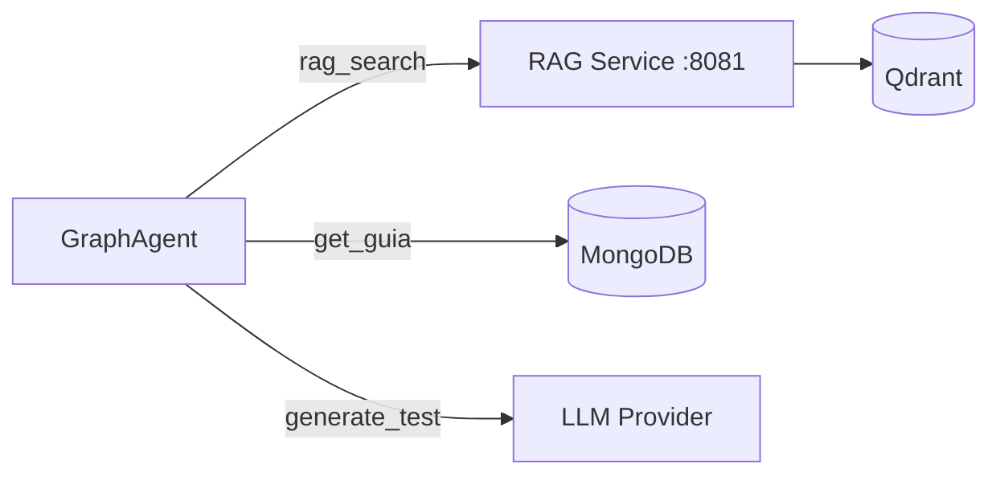
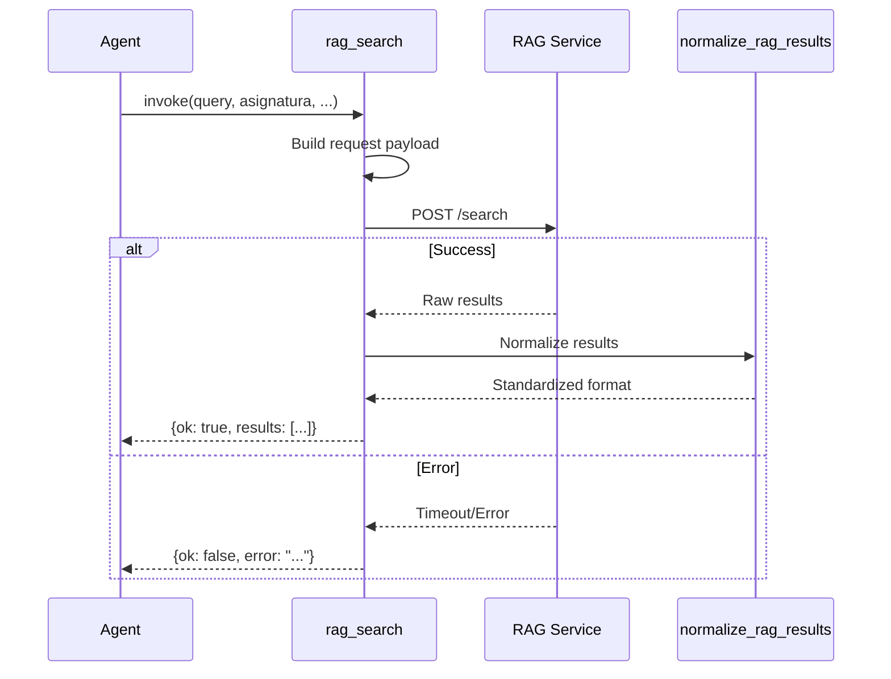
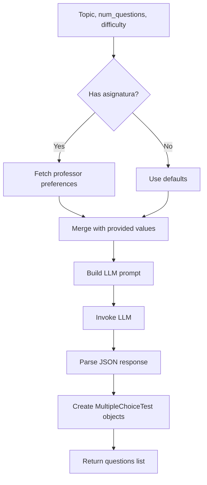

# Chatbot Tools Documentation

This document covers all tools available to the LangGraph agent.

## Overview

The chatbot agent has access to three primary tools:

| Tool | Purpose | Data Source |
|------|---------|-------------|
| `rag_search` | Semantic document search | RAG Service + Qdrant |
| `get_guia` | Teaching guide retrieval | MongoDB |
| `generate_test` | Test question generation | LLM |



## Tool Registry

Tools are registered in `chatbot/logic/tools/tools.py`:

```python
from chatbot.logic.tools.guia import get_guia
from chatbot.logic.tools.rag import rag_search
from chatbot.logic.tools.test_gen import generate_test

AVAILABLE_TOOLS = [
    get_guia,
    rag_search,
    generate_test,
]

def get_tools():
    """Returns all available tools for the agent."""
    return AVAILABLE_TOOLS
```

---

## rag_search

Performs semantic search against the RAG service to find relevant document chunks.

### Location

`chatbot/logic/tools/rag.py`

### Signature

```python
@tool(args_schema=RagQueryInput)
def rag_search(
    query: str,
    asignatura: str | None = None,
    tipo_documento: str | None = None,
    top_k: int | None = None,
) -> dict[str, Any]:
    """Perform a semantic search against the external RAG service."""
```

### Parameters

| Parameter | Type | Required | Default | Description |
|-----------|------|----------|---------|-------------|
| `query` | string | ✅ | - | Search query text |
| `asignatura` | string | ❌ | None | Filter by subject |
| `tipo_documento` | string | ❌ | None | Filter by document type |
| `top_k` | int | ❌ | None | Limit number of results |

### Input Schema

```python
class RagQueryInput(BaseModel):
    query: str = Field(..., description="Search query text")
    asignatura: str | None = Field(None, description="Subject filter")
    tipo_documento: str | None = Field(None, description="Document type filter")
    top_k: int | None = Field(None, description="Max results")
```

### Return Value

```python
# Success
{
    "ok": True,
    "query": "What is Docker?",
    "total_results": 5,
    "results": [
        {
            "content": "Docker is a platform...",
            "metadata": {
                "source": "docker-intro.md",
                "asignatura": "iv"
            },
            "score": 0.92
        },
        # ...
    ]
}

# Error
{
    "ok": False,
    "error": "RAG service timeout"
}
```

### Implementation Flow



### Error Handling

The tool handles several error types:

```python
except requests.exceptions.Timeout:
    return {"ok": False, "error": f"RAG service timeout"}
except requests.exceptions.ConnectionError:
    return {"ok": False, "error": f"Cannot connect to RAG service"}
except requests.exceptions.RequestException:
    return {"ok": False, "error": f"Error contacting RAG service"}
except Exception:
    return {"ok": False, "error": f"Unexpected error"}
```

### Result Normalization

Results are normalized using utility functions in `utils.py`:

```python
def normalize_rag_results(data: Any) -> list[dict[str, Any]]:
    """Normalize RAG results to consistent format."""
    # Handles various response formats
    # Extracts: content, metadata, score
```

---

## get_guia

Retrieves teaching guide (guía docente) information from MongoDB.

### Location

`chatbot/logic/tools/guia.py`

### Signature

```python
@tool(args_schema=SubjectLookupInput)
def get_guia(
    asignatura: str | None = None,
    key: SubjectDataKey | None = None,
) -> str:
    """Retrieve a stored guia document for the agent's current subject."""
```

### Parameters

| Parameter | Type | Required | Description |
|-----------|------|----------|-------------|
| `asignatura` | string | ❌ | Subject identifier (injected from state) |
| `key` | SubjectDataKey | ❌ | Specific field to retrieve |

### SubjectDataKey Enum

```python
class SubjectDataKey(str, Enum):
    """Keys for specific guia sections."""
    COMPETENCIAS = "competencias"
    OBJETIVOS = "objetivos"
    CONTENIDOS = "breve_descripción_de_contenidos"
    METODOLOGIA = "metodología_docente"
    EVALUACION = "sistema_de_evaluación"
    BIBLIOGRAFIA = "bibliografía_fundamental"
    PROFESORADO = "profesorado"
    # ... and more
```

### Return Value

**Without key** (returns summary):

```json
{
    "subject": "infraestructura-virtual",
    "asignatura": "Infraestructura Virtual",
    "grado": "Grado en Ingeniería Informática",
    "curso": "4º",
    "url": "https://grados.ugr.es/...",
    "brief_description": ["Contenedor Docker", "CI/CD", "Cloud"]
}
```

**With key** (returns specific section):

```json
["Competencia 1", "Competencia 2", "Competencia 3"]
```

### Implementation

```python
def get_guia(asignatura: str | None = None, key: SubjectDataKey | None = None) -> str:
    if not asignatura:
        return "No guia found for subject"
    
    client = MongoDBClient()
    client.connect()
    doc = client.find_by_subject("guias", asignatura)
    client.close()
    
    if not doc:
        return f"No guia found for subject: {asignatura}"
    
    if key:
        value = navigate_nested_dict(doc, key.value)
        if value is None:
            return f"Key '{key.value}' not present"
        return json.dumps(value, ensure_ascii=False)
    
    summary = _build_guia_summary(doc)
    return json.dumps(summary, ensure_ascii=False)
```

### State Injection

**Important**: The `asignatura` is automatically injected from state in the graph node:

```python
# In GraphAgent.get_guia():
args["asignatura"] = state.get("asignatura")  # Inject from state
content = guia_tool.invoke(args)
```

---

## generate_test

Generates interactive test questions on a topic using the LLM.

### Location

`chatbot/logic/tools/test_gen.py`

### Signature

```python
@tool(args_schema=TestGenerationInput)
def generate_test(
    topic: str,
    num_questions: int | None = None,
    difficulty: str | None = None,
    context: str | None = None,
    asignatura: str | None = None,
) -> list[MultipleChoiceTest]:
    """Generate review questions on a given topic."""
```

### Parameters

| Parameter | Type | Required | Default | Description |
|-----------|------|----------|---------|-------------|
| `topic` | string | ✅ | - | Topic for questions |
| `num_questions` | int | ❌ | 5 | Number of questions (1-10) |
| `difficulty` | string | ❌ | "medium" | easy/medium/hard |
| `context` | string | ❌ | None | Additional context |
| `asignatura` | string | ❌ | None | Subject for preferences |

### Input Schema

```python
class TestGenerationInput(BaseModel):
    topic: str = Field(..., description="Topic for questions")
    num_questions: int | None = Field(None, ge=1, le=10)
    difficulty: str | None = Field(None, pattern="^(easy|medium|hard)$")
    context: str | None = Field(None, description="RAG context")
    asignatura: str | None = Field(None, description="Subject")
```

### Return Value

```python
[
    MultipleChoiceTest(
        question=Question(
            question_text="¿Qué es Docker?",
            difficulty="medium"
        ),
        options=[]  # Empty for open-ended review
    ),
    # ... more questions
]
```

### Professor Preferences

The tool fetches professor-configured defaults:

```python
def _get_professor_preferences(subject: str) -> dict:
    """Fetch test preferences from backend."""
    url = f"{settings.backend_service_url}/users/subject/{subject}/preferences"
    response = requests.get(url, timeout=5)
    
    if response.status_code == 200:
        return response.json()
    
    return {
        "default_test_questions": 5,
        "default_test_difficulty": "medium",
    }
```

### Generation Flow



### LLM Prompt

```python
TEST_GENERATION_PROMPT = """Generate {num_questions} review questions about {topic}.

Difficulty: {difficulty}
Context: {context}

Return as JSON array:
[
    {
        "question_text": "Question here?",
        "difficulty": "medium"
    }
]
"""
```

### Error Handling

Returns a fallback question on error:

```python
except Exception as e:
    logger.exception(f"Error generating test: {e}")
    return [
        MultipleChoiceTest(
            question=Question(
                question_text=f"¿Qué has aprendido sobre {topic}?",
                difficulty="medium",
            ),
            options=[],
        )
    ]
```

---

## Utility Functions

### utils.py

Helper functions for tool implementations:

#### navigate_nested_dict

```python
def navigate_nested_dict(data: dict, path: str) -> Any | None:
    """Navigate dictionary with dot notation.
    
    Example:
        navigate_nested_dict(doc, "competencias.generales")
    """
```

#### normalize_rag_results

```python
def normalize_rag_results(data: Any) -> list[dict[str, Any]]:
    """Normalize RAG results to consistent format."""
```

#### extract_content_from_result

```python
def extract_content_from_result(result: dict) -> str | None:
    """Extract content using common field names."""
    return (
        result.get("content")
        or result.get("text")
        or result.get("snippet")
        or result.get("payload")
    )
```

#### extract_metadata_from_result

```python
def extract_metadata_from_result(result: dict) -> dict:
    """Extract and normalize metadata."""
```

#### extract_score_from_result

```python
def extract_score_from_result(result: dict) -> float | None:
    """Extract score/similarity from result."""
```

---

## Data Models

### RagQueryInput

```python
class RagQueryInput(BaseModel):
    query: str = Field(..., description="Search query text")
    asignatura: str | None = Field(None, description="Subject filter")
    tipo_documento: str | None = Field(None, description="Document type")
    top_k: int | None = Field(None, description="Max results")
```

### SubjectLookupInput

```python
class SubjectLookupInput(BaseModel):
    asignatura: str | None = Field(None, description="Subject identifier")
    key: SubjectDataKey | None = Field(None, description="Specific key")
```

### TestGenerationInput

```python
class TestGenerationInput(BaseModel):
    topic: str = Field(..., description="Topic for questions")
    num_questions: int | None = Field(None, ge=1, le=10)
    difficulty: str | None = Field(None)
    context: str | None = Field(None)
    asignatura: str | None = Field(None)
```

### Question

```python
class Question(BaseModel):
    question_text: str
    difficulty: str = "medium"
```

### MultipleChoiceTest

```python
class MultipleChoiceTest(BaseModel):
    question: Question
    options: list[Answer] = []
```

---

## Adding New Tools

### Step 1: Create Tool File

```python
# chatbot/logic/tools/my_tool.py
from langchain.tools import tool
from pydantic import BaseModel, Field

class MyToolInput(BaseModel):
    arg1: str = Field(..., description="Description")
    arg2: int = Field(5, description="Optional arg")

@tool(args_schema=MyToolInput)
def my_tool(arg1: str, arg2: int = 5) -> dict:
    """Tool description for the LLM to understand when to use it."""
    # Implementation
    return {"result": "..."}
```

### Step 2: Register Tool

```python
# chatbot/logic/tools/tools.py
from chatbot.logic.tools.my_tool import my_tool

AVAILABLE_TOOLS = [
    get_guia,
    rag_search,
    generate_test,
    my_tool,  # Add here
]
```

### Step 3: Add Graph Node

```python
# chatbot/logic/graph.py
def my_tool_node(self, state: SubjectState):
    """Execute my_tool."""
    tools = get_tools()
    my_tool = next((t for t in tools if t.name == "my_tool"), None)
    
    # Extract tool calls and execute
    # Return ToolMessage
```

### Step 4: Add Routing

```python
# In build_graph():
graph_builder.add_node("my_tool", self.my_tool_node)
graph_builder.add_conditional_edges(
    "agent",
    self.should_continue,
    {
        # ... existing
        "my_tool": "my_tool",
        END: END,
    },
)
graph_builder.add_edge("my_tool", "agent")
```

---

## Testing Tools

### Unit Tests

```python
# chatbot/tests/test_tools.py
def test_rag_search_success(mock_requests):
    mock_requests.post.return_value.json.return_value = {...}
    
    result = rag_search.func(query="test", asignatura="iv")
    
    assert result["ok"] is True
    assert len(result["results"]) > 0

def test_get_guia_not_found(mock_mongo):
    mock_mongo.find_by_subject.return_value = None
    
    result = get_guia.func(asignatura="nonexistent")
    
    assert "No guia found" in result
```

### Integration Tests

```python
@pytest.mark.integration
def test_rag_search_real():
    """Test against real RAG service."""
    result = rag_search.func(query="Docker", top_k=3)
    
    assert result["ok"] is True
```

---

## Related Documentation

- [LangGraph Agent](langgraph.md) - How tools integrate with the graph
- [Architecture](architecture.md) - System overview
- [API Endpoints](api-endpoints.md) - API that uses tools
