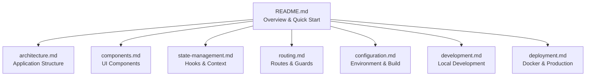

# Frontend Documentation Index

Quick navigation for the Frontend service documentation.

## 📚 Documentation Map



## 📖 Document Descriptions

| Document | Description | When to Read |
|----------|-------------|--------------|
| [README.md](README.md) | Service overview, features, quick start | First introduction |
| [architecture.md](architecture.md) | Component structure, data flow, design patterns | Understanding the codebase |
| [components.md](components.md) | UI components, props, usage examples | Building features |
| [state-management.md](state-management.md) | Context, hooks, TanStack Query | Managing data |
| [routing.md](routing.md) | Routes, guards, navigation | Adding pages |
| [configuration.md](configuration.md) | Env vars, Vite, TypeScript, Tailwind | Setup & config |
| [development.md](development.md) | Local setup, testing, workflow | Day-to-day development |
| [deployment.md](deployment.md) | Docker, nginx, production | Deploying changes |

## 🔍 Quick Reference

### Tech Stack
- **React 19** + **TypeScript 5.9**
- **Vite 7** build tool
- **TanStack Query** for server state
- **React Router DOM 7** for routing
- **Tailwind CSS 4** + **shadcn/ui**
- **Vitest** for testing

### Key Files

| File | Purpose |
|------|---------|
| `src/App.tsx` | Root component with routing |
| `src/context/AuthContext.tsx` | Authentication state |
| `src/lib/api.ts` | Axios instance |
| `src/hooks/useChat.ts` | Chat functionality |
| `src/hooks/useSessions.ts` | Session management |
| `nginx.conf` | Production server config |
| `Dockerfile` | Container build |

### User Roles

| Role | Default Route | Features |
|------|---------------|----------|
| Student | `/chat` | Chat, sessions, tests |
| Professor | `/dashboard` | Dashboard, documents, students |
| Admin | `/admin` | User management, subjects |

### Environment Variables

| Variable | Development | Production |
|----------|-------------|------------|
| `VITE_API_URL` | `http://localhost:8000` | `/api` |

## 🚀 Common Tasks

### Start Development
```bash
cd frontend
npm install
npm run dev
```

### Run Tests
```bash
npm run test
npm run test -- --coverage
```

### Build for Production
```bash
npm run build
```

### Deploy with Docker
```bash
docker compose up -d frontend
```

## 📁 Directory Structure

```
frontend/
├── src/
│   ├── components/
│   │   ├── ui/           # Base UI components
│   │   ├── chat/         # Chat components
│   │   ├── dashboard/    # Dashboard components
│   │   └── layout/       # Layout & guards
│   ├── context/          # React contexts
│   ├── hooks/            # Custom hooks
│   ├── lib/              # Utilities
│   ├── pages/            # Page components
│   ├── types/            # TypeScript types
│   └── App.tsx           # Root component
├── Dockerfile            # Container build
├── nginx.conf            # Production server
└── package.json          # Dependencies
```

## 🔗 Related Documentation

- [Backend Service](../backend/README.md) - API gateway
- [Chatbot Service](../chatbot/README.md) - AI agent
- [Services Overview](../index.md) - All services

---

*Last updated: 2025*
