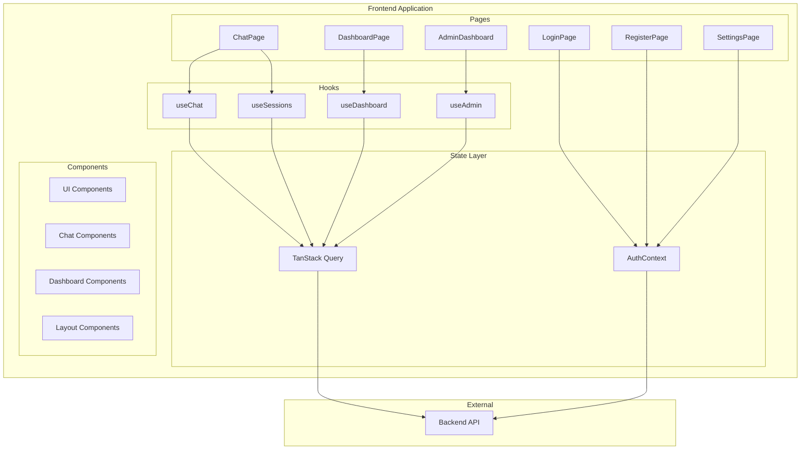
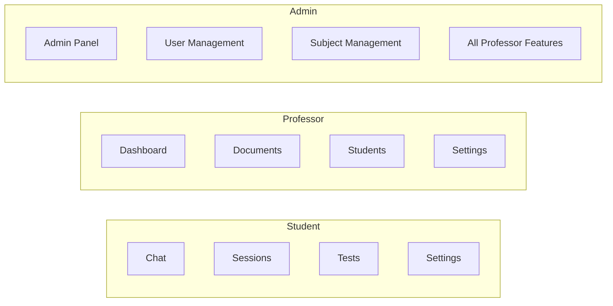

# Frontend Service

The **Frontend Service** is the user-facing React application for the TFG Pedagogical Chatbot. Built with React 19, TypeScript, and modern tooling, it provides an intuitive interface for students to interact with the AI tutor, professors to manage their courses, and administrators to oversee the platform.

## Overview

| Property | Value |
|----------|-------|
| **Framework** | React 19 + TypeScript 5.9 |
| **Build Tool** | Vite 7 |
| **Styling** | Tailwind CSS 4 + shadcn/ui |
| **State Management** | TanStack Query + React Context |
| **Routing** | React Router DOM 7 |
| **Port (dev)** | 5173 |
| **Port (prod)** | 80 (nginx) |

## Quick Start

### Prerequisites

- Node.js 20+
- npm or pnpm

### Development

```bash
# Navigate to frontend directory
cd frontend

# Install dependencies
npm install

# Start development server
npm run dev
```

The app will be available at `http://localhost:5173`.

### Production Build

```bash
# Build for production
npm run build

# Preview production build
npm run preview
```

## Architecture Diagram



## Key Features

### 🎓 Student Features
- **Interactive Chat** - Real-time conversation with the AI pedagogical tutor
- **Session Management** - Create, switch, and manage chat sessions by subject
- **Test Mode** - Interactive tests with immediate feedback
- **Message History** - Full conversation history with markdown rendering

### 📚 Professor Features
- **Course Dashboard** - Overview of assigned subjects and statistics
- **Document Management** - Upload, organize, and manage course materials
- **Student Progress** - Track student interactions and test performance
- **Analytics** - Session counts, activity charts, and topic distribution

### 🔧 Admin Features
- **User Management** - Create, promote, and manage users
- **Subject Management** - Create subjects and assign professors
- **Enrollment** - Batch enroll students in subjects
- **Platform Statistics** - Overall platform usage and metrics

## Project Structure

```
frontend/
├── public/              # Static assets
├── src/
│   ├── assets/          # Images, fonts
│   ├── components/
│   │   ├── ui/          # shadcn/ui components (button, card, dialog...)
│   │   ├── chat/        # Chat-specific components
│   │   ├── dashboard/   # Professor dashboard components
│   │   └── layout/      # Layout and route guards
│   ├── context/         # React contexts (AuthContext)
│   ├── hooks/           # Custom hooks (useChat, useSessions...)
│   ├── lib/             # Utilities (api, errors, utils)
│   ├── pages/           # Page components organized by feature
│   │   ├── admin/
│   │   ├── auth/
│   │   ├── chat/
│   │   ├── dashboard/
│   │   └── settings/
│   ├── types/           # TypeScript type definitions
│   ├── App.tsx          # Root component with routing
│   └── main.tsx         # Entry point
├── .env.development     # Development environment
├── .env.production      # Production environment
├── Dockerfile           # Multi-stage Docker build
├── nginx.conf           # Production nginx configuration
├── package.json
├── vite.config.ts
├── vitest.config.ts
├── tsconfig.json
└── biome.json           # Linting/formatting config
```

## Technology Stack

| Category | Technology | Purpose |
|----------|------------|---------|
| **Core** | React 19 | UI library with concurrent features |
| **Language** | TypeScript 5.9 | Type safety and developer experience |
| **Build** | Vite 7 | Fast bundling and HMR |
| **Routing** | React Router DOM 7 | Client-side routing with guards |
| **Server State** | TanStack Query | Caching, fetching, synchronization |
| **Forms** | React Hook Form + Zod | Form handling and validation |
| **HTTP** | Axios | API requests with interceptors |
| **Styling** | Tailwind CSS 4 | Utility-first CSS |
| **Components** | Radix UI + shadcn/ui | Accessible component primitives |
| **Icons** | Lucide React | Modern icon set |
| **Markdown** | react-markdown | Render AI responses |
| **Testing** | Vitest + Testing Library | Unit and component tests |
| **Linting** | Biome | Fast linting and formatting |

## User Roles

The application supports three distinct user roles with different permissions:



| Role | Access |
|------|--------|
| **Student** | Chat, sessions, tests, settings |
| **Professor** | Dashboard, documents, student progress, settings |
| **Admin** | All features + user/subject management |

## Documentation Index

- [Architecture](architecture.md) - Application architecture and patterns
- [Components](components.md) - UI component library documentation
- [State Management](state-management.md) - Context, hooks, and TanStack Query
- [Routing](routing.md) - Route structure and guards
- [Configuration](configuration.md) - Environment and build configuration
- [Development](development.md) - Local setup and development workflow
- [Deployment](deployment.md) - Docker and production deployment

## Related Documentation

- [Backend Service](../backend/README.md) - API gateway
- [Chatbot Service](../chatbot/README.md) - LangGraph AI agent
- [Services Overview](../index.md) - All services

---

*This documentation is part of the TFG Chatbot project - a dual degree thesis (Computer Science + Mathematics) at the University of Granada.*
