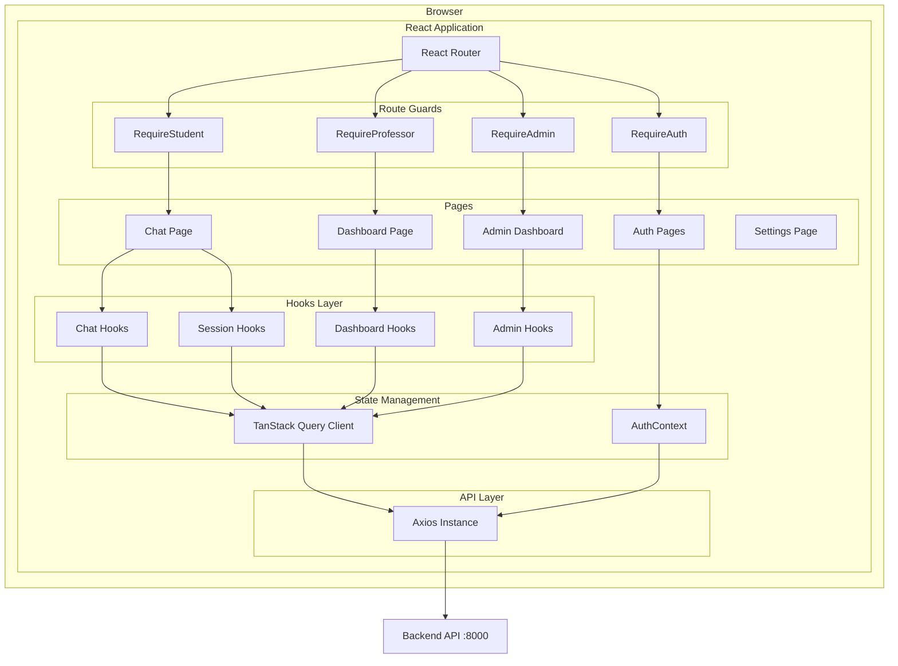
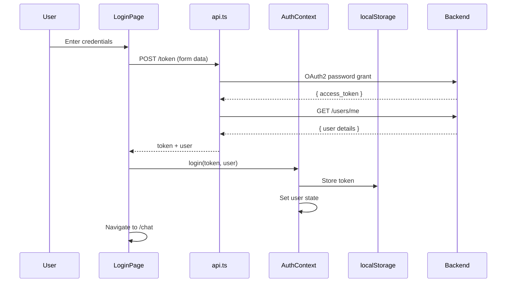
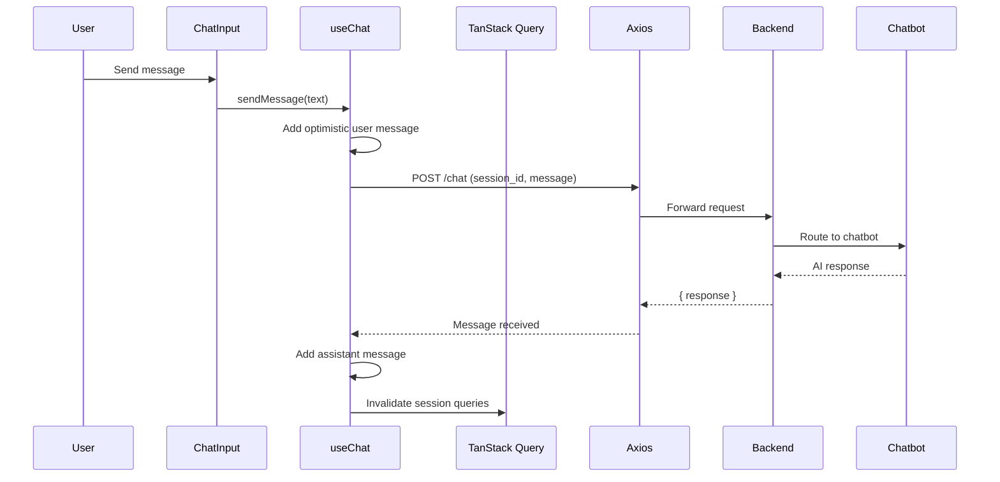
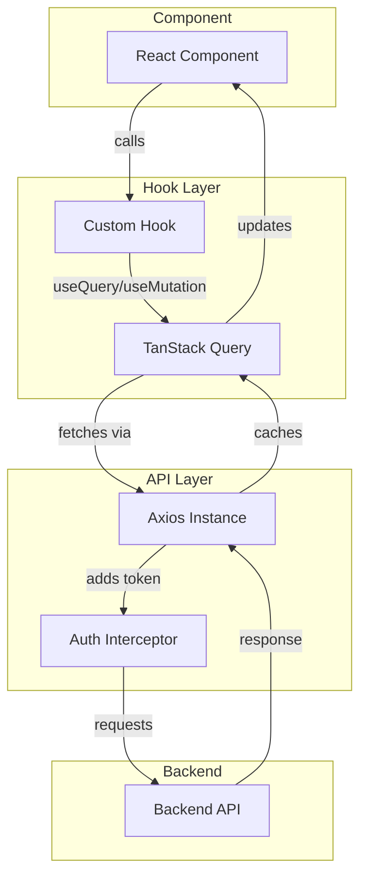
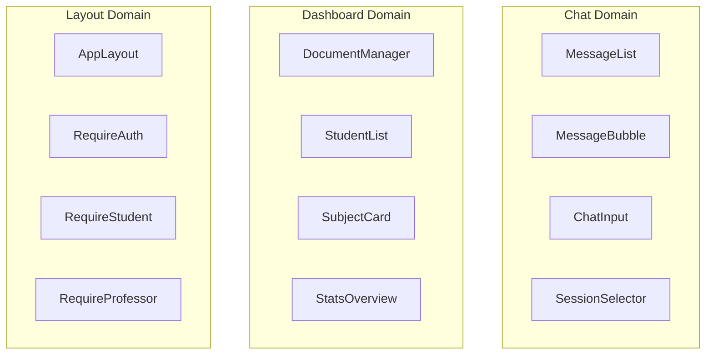
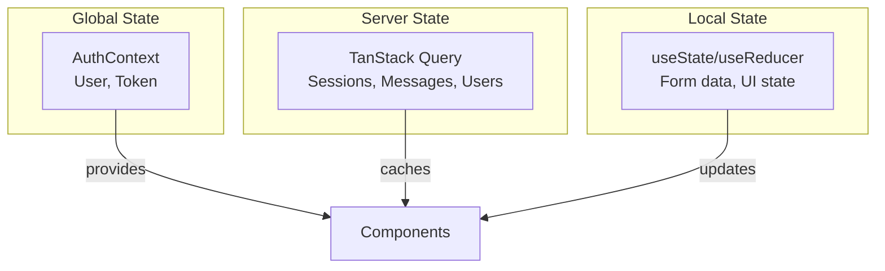

# Frontend Architecture

This document describes the architecture of the Frontend service, including component structure, data flow patterns, and design decisions.

## High-Level Architecture



## Design Principles

### 1. Component-Driven Architecture

The application follows a component-driven approach with clear separation of concerns:

- **Pages** - Route-level components that compose features
- **Components** - Reusable UI elements organized by domain
- **Hooks** - Business logic extracted into reusable hooks
- **Context** - Global state shared across the component tree

### 2. Colocation

Related code is colocated by feature:

```
pages/
├── chat/
│   └── ChatPage.tsx          # Chat feature page
├── dashboard/
│   └── DashboardPage.tsx     # Professor dashboard
└── admin/
    └── AdminDashboard.tsx    # Admin panel

components/
├── chat/                     # Chat-specific components
├── dashboard/                # Dashboard-specific components
└── ui/                       # Shared UI primitives
```

### 3. Type Safety

TypeScript is used throughout with strict mode enabled:

```typescript
// Types are defined in dedicated files
// src/types/chat.ts
export interface Message {
  id: string;
  role: "user" | "assistant";
  content: string;
  timestamp: Date;
}

export interface Session {
  id: string;
  title: string;
  asignatura: string;
  created_at: string;
  updated_at: string;
}
```

## Data Flow

### Authentication Flow



### Chat Message Flow



### Data Fetching Pattern



## Layer Responsibilities

### Pages Layer

Pages are route-level components that:
- Compose multiple components
- Handle page-level state
- Coordinate between features
- Define page layout

```tsx
// Example: ChatPage.tsx
export default function ChatPage() {
  const { user } = useAuth();
  const { data: sessions } = useSessions();
  const [activeSessionId, setActiveSessionId] = useState<string | null>(null);
  
  // Compose components
  return (
    <div className="flex h-full">
      <SessionSelector sessions={sessions} onSelect={setActiveSessionId} />
      <ChatInterface sessionId={activeSessionId} subject={user?.subjects[0]} />
    </div>
  );
}
```

### Hooks Layer

Custom hooks encapsulate:
- API calls via TanStack Query
- Business logic
- State transformations
- Side effects

```tsx
// Example: useChat.ts
export function useChat(sessionId: string | null) {
  const [messages, setMessages] = useState<Message[]>([]);
  const [isLoading, setIsLoading] = useState(false);

  const sendMessage = async (content: string) => {
    // Add optimistic message
    // Call API
    // Handle response
  };

  return { messages, sendMessage, isLoading };
}
```

### API Layer

The API layer consists of:
- **Axios instance** with base URL configuration
- **Auth interceptor** for automatic token injection
- **Error handling** utilities

```typescript
// src/lib/api.ts
const api = axios.create({
  baseURL: import.meta.env.VITE_API_URL,
  headers: { "Content-Type": "application/json" },
});

api.interceptors.request.use((config) => {
  const token = localStorage.getItem("token");
  if (token) {
    config.headers.Authorization = `Bearer ${token}`;
  }
  return config;
});
```

### Context Layer

React Context provides global state:
- **AuthContext** - User authentication state
- No additional global stores needed (TanStack Query handles server state)

```tsx
// src/context/AuthContext.tsx
interface AuthContextType {
  user: User | null;
  token: string | null;
  login: (token: string, user: User) => void;
  logout: () => void;
  isAuthenticated: boolean;
}
```

## Component Categories

### UI Components (`components/ui/`)

Base components from shadcn/ui following Radix UI primitives:

| Component | Purpose |
|-----------|---------|
| `Button` | Interactive button with variants |
| `Card` | Content container with header/footer |
| `Dialog` | Modal dialogs |
| `Form` | Form handling with react-hook-form |
| `Input` | Text input fields |
| `Select` | Dropdown selection |
| `Table` | Data tables |
| `Tabs` | Tabbed navigation |

### Domain Components

Components organized by feature domain:



### Layout Components

Control application structure and access:

| Component | Purpose |
|-----------|---------|
| `AppLayout` | Main application shell with sidebar |
| `RequireAuth` | Redirects unauthenticated users |
| `RequireStudent` | Restricts to student role |
| `RequireProfessor` | Restricts to professor/admin roles |
| `RequireAdmin` | Restricts to admin role |
| `PublicRoute` | Prevents authenticated users from accessing login |
| `DefaultRedirect` | Redirects to role-appropriate page |

## State Management Strategy



| State Type | Tool | Examples |
|------------|------|----------|
| **Authentication** | React Context | User, token, login/logout |
| **Server Data** | TanStack Query | Sessions, messages, documents |
| **UI State** | useState | Modal open, selected tab |
| **Form State** | React Hook Form | Input values, validation |

## Error Handling

### API Errors

```typescript
// src/lib/errors.ts
export function getErrorMessage(error: unknown, fallback: string): string {
  if (isApiError(error)) {
    return error.response?.data?.detail || 
           error.response?.data?.message || 
           fallback;
  }
  if (error instanceof Error) {
    return error.message;
  }
  return fallback;
}
```

### Error Display

Errors are displayed using toast notifications:

```tsx
import { toast } from "sonner";

try {
  await api.post("/chat", data);
  toast.success("Mensaje enviado");
} catch (error) {
  toast.error(getErrorMessage(error, "Error al enviar mensaje"));
}
```

## Performance Patterns

### Query Caching

TanStack Query provides automatic caching:

```tsx
export function useSessions() {
  return useQuery({
    queryKey: ["sessions"],
    queryFn: fetchSessions,
    staleTime: 30_000, // 30 seconds
  });
}
```

### Optimistic Updates

Chat uses optimistic updates for instant feedback:

```tsx
const sendMessage = async (content: string) => {
  // Immediately add user message to UI
  setMessages(prev => [...prev, userMessage]);
  
  try {
    const response = await api.post("/chat", { message: content });
    // Add real assistant response
    setMessages(prev => [...prev, assistantMessage]);
  } catch {
    // Remove optimistic message on error
    setMessages(prev => prev.filter(m => m.id !== userMessage.id));
  }
};
```

### Code Splitting

Routes are lazily loaded for better initial load:

```tsx
const ChatPage = lazy(() => import("./pages/chat/ChatPage"));
const DashboardPage = lazy(() => import("./pages/dashboard/DashboardPage"));
```

## Security Considerations

### Token Storage

JWT tokens are stored in localStorage:
- ✅ Persists across sessions
- ⚠️ Vulnerable to XSS (mitigated by CSP in production)

### Auth Interceptor

All API requests automatically include the auth token:

```typescript
api.interceptors.request.use((config) => {
  const token = localStorage.getItem("token");
  if (token) {
    config.headers.Authorization = `Bearer ${token}`;
  }
  return config;
});
```

### Route Protection

Multiple layers of route guards ensure proper access:

```tsx
<Route element={<RequireAuth />}>
  <Route element={<RequireStudent />}>
    <Route path="/chat" element={<ChatPage />} />
  </Route>
</Route>
```

## Related Documentation

- [Components](components.md) - Detailed component documentation
- [State Management](state-management.md) - Hooks and state patterns
- [Routing](routing.md) - Route structure and guards
- [Configuration](configuration.md) - Environment setup
