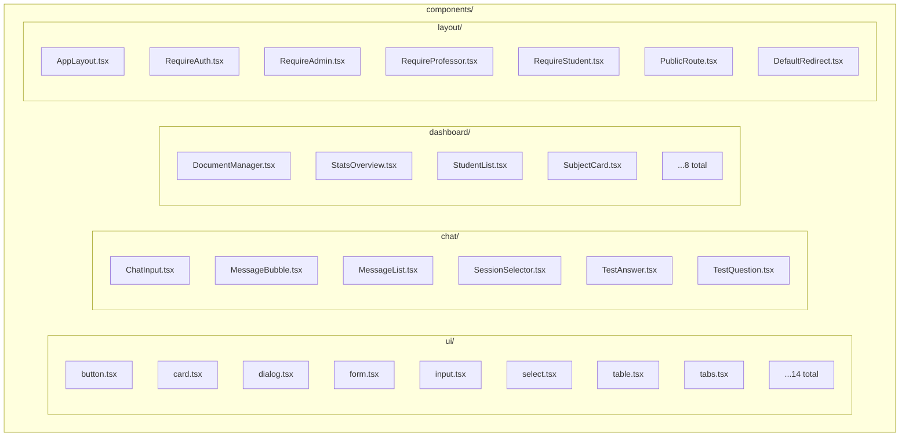
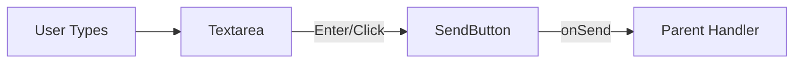
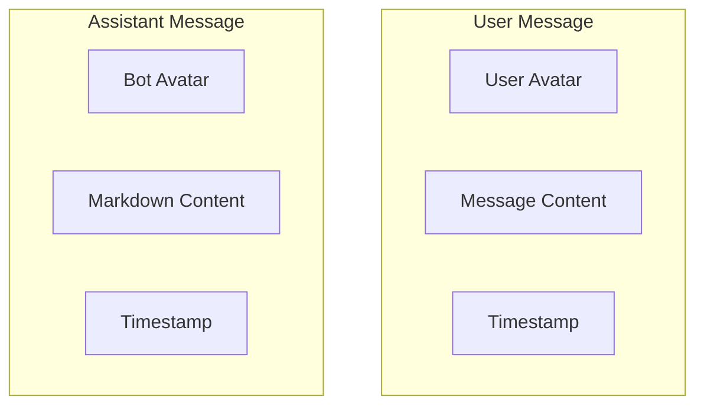
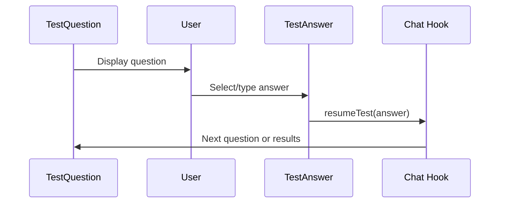
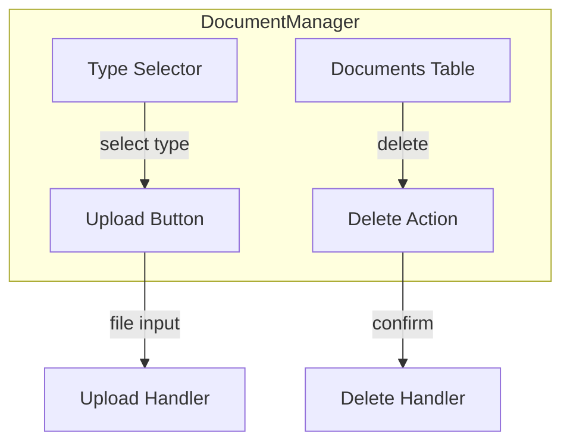
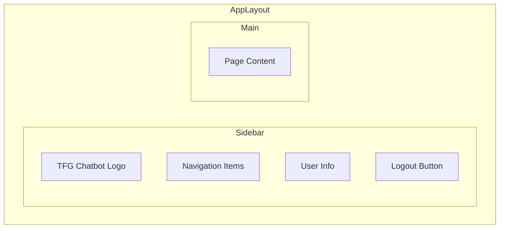

# Frontend Components

This document provides comprehensive documentation for all components in the Frontend service, organized by domain and purpose.

## Component Organization



---

## UI Components (`components/ui/`)

These are base components following the shadcn/ui pattern, built on Radix UI primitives.

### Button

Interactive button component with multiple variants.

```tsx
import { Button } from "@/components/ui/button";

// Variants
<Button variant="default">Primary</Button>
<Button variant="secondary">Secondary</Button>
<Button variant="outline">Outline</Button>
<Button variant="ghost">Ghost</Button>
<Button variant="destructive">Destructive</Button>
<Button variant="link">Link</Button>

// Sizes
<Button size="sm">Small</Button>
<Button size="default">Default</Button>
<Button size="lg">Large</Button>
<Button size="icon"><Icon /></Button>

// States
<Button disabled>Disabled</Button>
<Button asChild><Link to="/page">As Link</Link></Button>
```

### Card

Content container with optional header and footer.

```tsx
import { Card, CardHeader, CardTitle, CardDescription, CardContent, CardFooter } from "@/components/ui/card";

<Card>
  <CardHeader>
    <CardTitle>Card Title</CardTitle>
    <CardDescription>Card description text</CardDescription>
  </CardHeader>
  <CardContent>
    Main content goes here
  </CardContent>
  <CardFooter>
    <Button>Action</Button>
  </CardFooter>
</Card>
```

### Dialog

Modal dialog for confirmations and forms.

```tsx
import {
  Dialog,
  DialogTrigger,
  DialogContent,
  DialogHeader,
  DialogTitle,
  DialogDescription,
  DialogFooter,
} from "@/components/ui/dialog";

<Dialog>
  <DialogTrigger asChild>
    <Button>Open Dialog</Button>
  </DialogTrigger>
  <DialogContent>
    <DialogHeader>
      <DialogTitle>Dialog Title</DialogTitle>
      <DialogDescription>Description text</DialogDescription>
    </DialogHeader>
    <div>Dialog content</div>
    <DialogFooter>
      <Button>Confirm</Button>
    </DialogFooter>
  </DialogContent>
</Dialog>
```

### Form

Integration with React Hook Form for form handling.

```tsx
import { Form, FormField, FormItem, FormLabel, FormControl, FormMessage } from "@/components/ui/form";
import { useForm } from "react-hook-form";
import { zodResolver } from "@hookform/resolvers/zod";
import { z } from "zod";

const schema = z.object({
  email: z.string().email(),
});

function MyForm() {
  const form = useForm({
    resolver: zodResolver(schema),
    defaultValues: { email: "" },
  });

  return (
    <Form {...form}>
      <form onSubmit={form.handleSubmit(onSubmit)}>
        <FormField
          control={form.control}
          name="email"
          render={({ field }) => (
            <FormItem>
              <FormLabel>Email</FormLabel>
              <FormControl>
                <Input {...field} />
              </FormControl>
              <FormMessage />
            </FormItem>
          )}
        />
      </form>
    </Form>
  );
}
```

### Select

Dropdown selection component.

```tsx
import { Select, SelectTrigger, SelectValue, SelectContent, SelectItem } from "@/components/ui/select";

<Select value={value} onValueChange={setValue}>
  <SelectTrigger>
    <SelectValue placeholder="Select option" />
  </SelectTrigger>
  <SelectContent>
    <SelectItem value="option1">Option 1</SelectItem>
    <SelectItem value="option2">Option 2</SelectItem>
  </SelectContent>
</Select>
```

### Table

Data table with headers and rows.

```tsx
import { Table, TableHeader, TableBody, TableRow, TableHead, TableCell } from "@/components/ui/table";

<Table>
  <TableHeader>
    <TableRow>
      <TableHead>Name</TableHead>
      <TableHead>Email</TableHead>
    </TableRow>
  </TableHeader>
  <TableBody>
    {users.map(user => (
      <TableRow key={user.id}>
        <TableCell>{user.name}</TableCell>
        <TableCell>{user.email}</TableCell>
      </TableRow>
    ))}
  </TableBody>
</Table>
```

### Tabs

Tabbed navigation component.

```tsx
import { Tabs, TabsList, TabsTrigger, TabsContent } from "@/components/ui/tabs";

<Tabs defaultValue="tab1">
  <TabsList>
    <TabsTrigger value="tab1">Tab 1</TabsTrigger>
    <TabsTrigger value="tab2">Tab 2</TabsTrigger>
  </TabsList>
  <TabsContent value="tab1">Content 1</TabsContent>
  <TabsContent value="tab2">Content 2</TabsContent>
</Tabs>
```

### Complete UI Components List

| Component | File | Purpose |
|-----------|------|---------|
| `Button` | button.tsx | Interactive button |
| `Card` | card.tsx | Content container |
| `Dialog` | dialog.tsx | Modal dialogs |
| `AlertDialog` | alert-dialog.tsx | Confirmation dialogs |
| `DropdownMenu` | dropdown-menu.tsx | Dropdown menus |
| `Form` | form.tsx | Form with validation |
| `Input` | input.tsx | Text input |
| `Label` | label.tsx | Form labels |
| `Select` | select.tsx | Dropdown selection |
| `Sonner` | sonner.tsx | Toast notifications |
| `Table` | table.tsx | Data tables |
| `Tabs` | tabs.tsx | Tabbed navigation |
| `Badge` | badge.tsx | Status indicators |
| `Progress` | progress.tsx | Progress bars |

---

## Chat Components (`components/chat/`)

Components specific to the chat interface.

### ChatInput

Text input with send button for composing messages.



**Props:**
| Prop | Type | Description |
|------|------|-------------|
| `onSend` | `(message: string) => void` | Callback when message sent |
| `isLoading` | `boolean` | Disables input during API call |
| `disabled` | `boolean` | Disables the input entirely |
| `placeholder` | `string` | Input placeholder text |

**Features:**
- Auto-resizing textarea (max 150px height)
- Enter to send (Shift+Enter for newline)
- Loading state with spinner
- Disabled state support

```tsx
<ChatInput
  onSend={(msg) => sendMessage(msg)}
  isLoading={isSending}
  placeholder="Escribe tu mensaje..."
/>
```

### MessageList

Scrollable container for displaying chat messages.

**Props:**
| Prop | Type | Description |
|------|------|-------------|
| `messages` | `Message[]` | Array of messages to display |
| `isLoading` | `boolean` | Shows typing indicator |

**Features:**
- Auto-scroll to bottom on new messages
- Empty state with welcome message
- Animated typing indicator
- Smooth scroll behavior

```tsx
<MessageList
  messages={chatMessages}
  isLoading={isWaitingForResponse}
/>
```

### MessageBubble

Individual message display with user/assistant styling.



**Props:**
| Prop | Type | Description |
|------|------|-------------|
| `message` | `Message` | Message object with role and content |

**Features:**
- Different styling for user vs assistant
- Markdown rendering for assistant messages
- Code syntax highlighting via rehype-highlight
- Timestamp display
- Avatar icons (User/Bot)

```tsx
<MessageBubble message={{
  id: "1",
  role: "assistant",
  content: "# Hello\nI can render **markdown**!",
  timestamp: new Date()
}} />
```

### SessionSelector

Sidebar component for selecting and managing chat sessions.

**Props:**
| Prop | Type | Description |
|------|------|-------------|
| `sessions` | `Session[]` | Available sessions |
| `activeId` | `string \| null` | Currently selected session |
| `onSelect` | `(id: string) => void` | Selection callback |
| `onNew` | `() => void` | Create new session |
| `onDelete` | `(id: string) => void` | Delete session |

**Features:**
- List of sessions with titles
- Active session highlighting
- Create new session button
- Delete session with confirmation

### TestQuestion / TestAnswer

Components for interactive test mode.



**TestQuestion Props:**
| Prop | Type | Description |
|------|------|-------------|
| `question` | `string` | Question text |
| `options` | `string[]` | Multiple choice options (optional) |
| `questionNumber` | `number` | Current question number |
| `totalQuestions` | `number` | Total questions in test |

**TestAnswer Props:**
| Prop | Type | Description |
|------|------|-------------|
| `onSubmit` | `(answer: string) => void` | Answer submission callback |
| `isLoading` | `boolean` | Submission in progress |

---

## Dashboard Components (`components/dashboard/`)

Components for the professor dashboard interface.

### DocumentManager

Upload and manage course documents.



**Props:**
| Prop | Type | Description |
|------|------|-------------|
| `documents` | `DocumentInfo[]` | List of documents |
| `subject` | `string` | Current subject name |
| `isLoading` | `boolean` | Loading state |
| `isUploading` | `boolean` | Upload in progress |
| `onUpload` | `(file, type, autoIndex) => Promise` | Upload callback |
| `onDelete` | `(filePath: string) => Promise` | Delete callback |

**Document Types:**
- `teoria` - Theory materials
- `ejercicios` - Exercises
- `examenes` - Past exams
- `practicas` - Lab materials
- `otros` - Other materials

### StatsOverview

Dashboard statistics display with charts.

**Props:**
| Prop | Type | Description |
|------|------|-------------|
| `stats` | `DashboardStats` | Statistics data |
| `isLoading` | `boolean` | Loading state |

**Displays:**
- Total students count
- Total sessions count
- Total documents count
- Sessions per subject breakdown
- Activity chart (last 7 days)

### StudentList

Table of enrolled students.

**Props:**
| Prop | Type | Description |
|------|------|-------------|
| `students` | `StudentInfo[]` | List of students |
| `subject` | `string` | Subject name |
| `isLoading` | `boolean` | Loading state |

**Features:**
- Student username and email
- Enrollment status
- Link to student progress

### SubjectCard

Card displaying subject information.

**Props:**
| Prop | Type | Description |
|------|------|-------------|
| `subject` | `SubjectInfo` | Subject data |
| `onSelect` | `() => void` | Selection callback |
| `isSelected` | `boolean` | Selection state |

**Displays:**
- Subject display name
- Student count
- Document count
- Selection highlight

### StudentProgressTable

Detailed student progress view.

**Props:**
| Prop | Type | Description |
|------|------|-------------|
| `progress` | `StudentProgress[]` | Progress data |
| `subject` | `string` | Subject name |

**Displays:**
- Interaction counts
- Difficulty distribution (basic/intermediate/advanced)
- Test scores
- Topic mastery levels
- Last activity date

---

## Layout Components (`components/layout/`)

Components controlling application structure and access.

### AppLayout

Main application shell with navigation sidebar.



**Features:**
- Responsive sidebar (collapsible on mobile)
- Role-based navigation filtering
- User info display
- Logout functionality
- Mobile hamburger menu

**Navigation Items:**
| Route | Label | Icon | Roles |
|-------|-------|------|-------|
| `/chat` | Chat | MessageSquare | student |
| `/dashboard` | Mis Clases | GraduationCap | professor, admin |
| `/admin` | Admin | LayoutDashboard | admin |
| `/settings` | Configuración | Settings | all |

### RequireAuth

Route guard that requires authentication.

```tsx
<Route element={<RequireAuth />}>
  <Route path="/chat" element={<ChatPage />} />
</Route>
```

**Behavior:**
- Checks `isAuthenticated` from AuthContext
- Redirects to `/login` if not authenticated
- Renders `<Outlet />` if authenticated

### RequireStudent

Route guard requiring student role.

```tsx
<Route element={<RequireStudent />}>
  <Route path="/chat" element={<ChatPage />} />
</Route>
```

**Behavior:**
- Checks if user role is `student`
- Redirects to `/dashboard` or `/admin` if professor/admin
- Renders `<Outlet />` if student

### RequireProfessor

Route guard requiring professor or admin role.

```tsx
<Route element={<RequireProfessor />}>
  <Route path="/dashboard" element={<DashboardPage />} />
</Route>
```

**Behavior:**
- Checks if user role is `professor` or `admin`
- Redirects to `/chat` if student
- Renders `<Outlet />` if authorized

### RequireAdmin

Route guard requiring admin role.

```tsx
<Route element={<RequireAdmin />}>
  <Route path="/admin" element={<AdminDashboard />} />
</Route>
```

**Behavior:**
- Checks if user role is `admin`
- Redirects based on actual role if not admin
- Renders `<Outlet />` if admin

### PublicRoute

Prevents authenticated users from accessing public pages.

```tsx
<Route element={<PublicRoute />}>
  <Route path="/login" element={<LoginPage />} />
</Route>
```

**Behavior:**
- Checks if user is authenticated
- Redirects to appropriate page if already logged in
- Renders `<Outlet />` if not authenticated

### DefaultRedirect

Redirects users to their role-appropriate default page.

```tsx
<Route path="/" element={<DefaultRedirect />} />
```

**Redirect Logic:**
| Role | Redirect To |
|------|-------------|
| student | `/chat` |
| professor | `/dashboard` |
| admin | `/admin` |
| not logged in | `/login` |

---

## Component Best Practices

### 1. Props Interface Definition

Always define TypeScript interfaces for props:

```tsx
interface MyComponentProps {
  title: string;
  items: Item[];
  onSelect?: (item: Item) => void;
  isLoading?: boolean;
}

export function MyComponent({ title, items, onSelect, isLoading = false }: MyComponentProps) {
  // ...
}
```

### 2. Composition Over Inheritance

Use composition patterns:

```tsx
// Good - composable
<Card>
  <CardHeader>
    <CardTitle>{title}</CardTitle>
  </CardHeader>
  <CardContent>{children}</CardContent>
</Card>

// Avoid - monolithic
<ComplexCard title={title} content={children} hasHeader={true} />
```

### 3. Styling with cn()

Use the `cn()` utility for conditional classes:

```tsx
import { cn } from "@/lib/utils";

<div className={cn(
  "base-classes",
  isActive && "active-classes",
  variant === "primary" ? "primary-classes" : "secondary-classes"
)} />
```

### 4. Event Handler Naming

Use `handle` prefix for internal handlers, `on` prefix for props:

```tsx
interface Props {
  onSubmit: (data: Data) => void;
}

function Form({ onSubmit }: Props) {
  const handleSubmit = (e: FormEvent) => {
    e.preventDefault();
    onSubmit(formData);
  };
  
  return <form onSubmit={handleSubmit}>...</form>;
}
```

---

## Related Documentation

- [Architecture](architecture.md) - Overall application structure
- [State Management](state-management.md) - Hooks and data fetching
- [Routing](routing.md) - Route configuration
