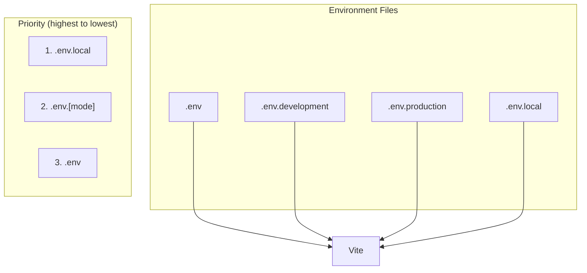
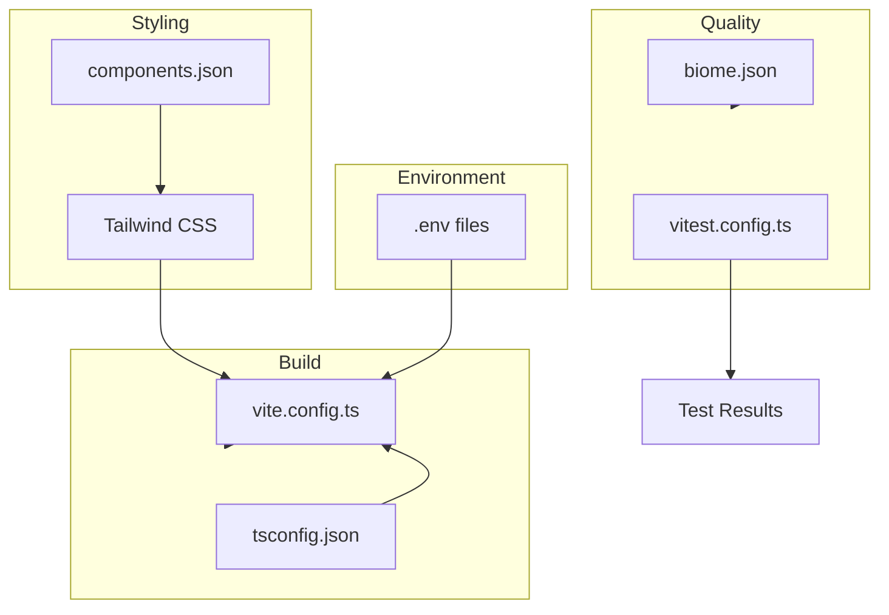

# Frontend Configuration

This document describes all configuration options for the Frontend service, including environment variables, build configuration, and tooling setup.

## Environment Variables

### Overview

The application uses Vite's environment variable system. Variables must be prefixed with `VITE_` to be exposed to the client.



### Environment Files

| File | Purpose | Git Ignored |
|------|---------|-------------|
| `.env` | Shared defaults | No |
| `.env.development` | Development settings | No |
| `.env.production` | Production settings | No |
| `.env.local` | Local overrides | Yes |

### Variables Reference

| Variable | Description | Development | Production |
|----------|-------------|-------------|------------|
| `VITE_API_URL` | Backend API base URL | `http://localhost:8000` | `/api` |

### Development Configuration

```dotenv
# .env.development
VITE_API_URL=http://localhost:8000
```

### Production Configuration

```dotenv
# .env.production
VITE_API_URL=/api
```

The production `/api` path is handled by nginx reverse proxy.

### Usage in Code

```typescript
// Access environment variables
const apiUrl = import.meta.env.VITE_API_URL;

// Type-safe access
/// <reference types="vite/client" />
interface ImportMetaEnv {
  readonly VITE_API_URL: string;
}

interface ImportMeta {
  readonly env: ImportMetaEnv;
}
```

---

## Vite Configuration

### Main Configuration

```typescript
// vite.config.ts
import path from "node:path";
import tailwindcss from "@tailwindcss/vite";
import react from "@vitejs/plugin-react";
import { defineConfig } from "vite";

export default defineConfig({
  plugins: [
    react(),
    tailwindcss(),
  ],
  resolve: {
    alias: {
      "@": path.resolve(__dirname, "./src"),
    },
  },
});
```

### Path Aliases

The `@` alias maps to `src/` for cleaner imports:

```typescript
// Instead of:
import { Button } from "../../components/ui/button";

// Use:
import { Button } from "@/components/ui/button";
```

### Development Server

```bash
# Default port: 5173
npm run dev

# Custom port
npm run dev -- --port 3000
```

---

## TypeScript Configuration

### Base Configuration

```json
// tsconfig.json
{
  "compilerOptions": {
    "target": "ES2020",
    "useDefineForClassFields": true,
    "lib": ["ES2020", "DOM", "DOM.Iterable"],
    "module": "ESNext",
    "skipLibCheck": true,

    /* Bundler mode */
    "moduleResolution": "Bundler",
    "allowImportingTsExtensions": true,
    "isolatedModules": true,
    "moduleDetection": "force",
    "noEmit": true,
    "jsx": "react-jsx",

    /* Linting */
    "strict": true,
    "noUnusedLocals": true,
    "noUnusedParameters": true,
    "noFallthroughCasesInSwitch": true,
    "noUncheckedSideEffectImports": true,

    /* Paths */
    "baseUrl": ".",
    "paths": {
      "@/*": ["./src/*"]
    }
  },
  "include": ["src"]
}
```

### App Configuration

```json
// tsconfig.app.json
{
  "extends": "./tsconfig.json",
  "compilerOptions": {
    "tsBuildInfoFile": "./node_modules/.tmp/tsconfig.app.tsbuildinfo"
  },
  "include": ["src"]
}
```

### Test Configuration

```json
// tsconfig.test.json
{
  "extends": "./tsconfig.json",
  "compilerOptions": {
    "types": ["vitest/globals", "@testing-library/jest-dom"]
  },
  "include": ["src/**/*.test.ts", "src/**/*.test.tsx", "src/__test-utils__"]
}
```

---

## Tailwind CSS Configuration

Tailwind CSS 4 uses the new Vite plugin approach:

```typescript
// vite.config.ts
import tailwindcss from "@tailwindcss/vite";

export default defineConfig({
  plugins: [
    react(),
    tailwindcss(),
  ],
});
```

### CSS Entry Point

```css
/* src/index.css */
@import "tailwindcss";

/* Custom styles */
@layer base {
  :root {
    --background: 0 0% 100%;
    --foreground: 222.2 84% 4.9%;
    /* ... shadcn/ui CSS variables */
  }
}
```

### shadcn/ui Configuration

```json
// components.json
{
  "$schema": "https://ui.shadcn.com/schema.json",
  "style": "default",
  "rsc": false,
  "tsx": true,
  "tailwind": {
    "config": "tailwind.config.js",
    "css": "src/index.css",
    "baseColor": "slate",
    "cssVariables": true
  },
  "aliases": {
    "components": "@/components",
    "utils": "@/lib/utils"
  }
}
```

### Utility Function

```typescript
// src/lib/utils.ts
import { type ClassValue, clsx } from "clsx";
import { twMerge } from "tailwind-merge";

export function cn(...inputs: ClassValue[]) {
  return twMerge(clsx(inputs));
}
```

---

## Biome Configuration

Biome handles linting and formatting.

```json
// biome.json
{
  "$schema": "https://biomejs.dev/schemas/2.3.8/schema.json",
  "vcs": {
    "enabled": true,
    "clientKind": "git",
    "useIgnoreFile": true
  },
  "files": {
    "includes": [
      "**/*.ts",
      "**/*.tsx",
      "**/*.js",
      "**/*.jsx",
      "**/*.json",
      "!!**/dist",
      "!!**/node_modules",
      "!!src/components/ui"  // Exclude shadcn components
    ]
  },
  "formatter": {
    "enabled": true,
    "indentStyle": "space",
    "indentWidth": 2,
    "lineWidth": 100
  },
  "linter": {
    "enabled": true,
    "rules": {
      "recommended": true,
      "correctness": {
        "noUnusedVariables": "warn",
        "noUnusedImports": "warn"
      },
      "style": {
        "noNonNullAssertion": "off"
      },
      "suspicious": {
        "noExplicitAny": "warn"
      },
      "a11y": {
        "noStaticElementInteractions": "off",
        "useKeyWithClickEvents": "off"
      }
    }
  },
  "javascript": {
    "formatter": {
      "quoteStyle": "double",
      "semicolons": "always"
    }
  },
  "css": {
    "parser": {
      "cssModules": true
    },
    "linter": {
      "enabled": false
    }
  },
  "assist": {
    "enabled": true,
    "actions": {
      "source": {
        "organizeImports": "on"
      }
    }
  }
}
```

### Commands

```bash
# Check linting
npx @biomejs/biome check .

# Fix auto-fixable issues
npx @biomejs/biome check --fix .

# Format code
npx @biomejs/biome format --write .
```

---

## Testing Configuration

### Vitest Configuration

```typescript
// vitest.config.ts
import path from "node:path";
import react from "@vitejs/plugin-react";
import { defineConfig } from "vitest/config";

export default defineConfig({
  plugins: [react()],
  test: {
    globals: true,
    environment: "jsdom",
    setupFiles: ["./src/__test-utils__/setup.ts"],
    include: ["src/**/*.{test,spec}.{js,mjs,cjs,ts,mts,cts,jsx,tsx}"],
    coverage: {
      provider: "v8",
      reporter: ["text", "json", "html"],
      exclude: [
        "node_modules/",
        "src/test/",
        "src/components/ui/", // Exclude shadcn components
        "**/*.d.ts",
      ],
    },
  },
  resolve: {
    alias: {
      "@": path.resolve(__dirname, "./src"),
    },
  },
});
```

### Test Setup

```typescript
// src/__test-utils__/setup.ts
import "@testing-library/jest-dom";

// Mock matchMedia for responsive tests
Object.defineProperty(window, "matchMedia", {
  writable: true,
  value: vi.fn().mockImplementation((query) => ({
    matches: false,
    media: query,
    onchange: null,
    addListener: vi.fn(),
    removeListener: vi.fn(),
    addEventListener: vi.fn(),
    removeEventListener: vi.fn(),
    dispatchEvent: vi.fn(),
  })),
});
```

### Commands

```bash
# Run tests
npm run test

# Watch mode
npm run test -- --watch

# Coverage
npm run test -- --coverage
```

---

## Package Scripts

```json
// package.json scripts
{
  "scripts": {
    "dev": "vite",
    "build": "tsc -b && vite build",
    "lint": "eslint .",
    "preview": "vite preview",
    "test": "vitest"
  }
}
```

| Script | Description |
|--------|-------------|
| `dev` | Start development server |
| `build` | TypeScript check + production build |
| `lint` | Run ESLint |
| `preview` | Preview production build |
| `test` | Run tests with Vitest |

---

## API Configuration

### Axios Instance

```typescript
// src/lib/api.ts
import axios from "axios";

const api = axios.create({
  baseURL: import.meta.env.VITE_API_URL,
  headers: {
    "Content-Type": "application/json",
  },
});

// Auth interceptor
api.interceptors.request.use((config) => {
  const token = localStorage.getItem("token");
  if (token) {
    config.headers.Authorization = `Bearer ${token}`;
  }
  return config;
});

export default api;
```

### Request Timeout

```typescript
const api = axios.create({
  baseURL: import.meta.env.VITE_API_URL,
  timeout: 30000, // 30 seconds
});
```

---

## Production Build

### Build Output

```bash
npm run build
```

Output structure:
```
dist/
├── index.html
├── assets/
│   ├── index-[hash].js
│   ├── index-[hash].css
│   └── ...chunks
└── favicon.ico
```

### Build Optimization

Vite automatically:
- Tree-shakes unused code
- Minifies JavaScript and CSS
- Splits code into chunks
- Generates hashed filenames for caching

### Preview Production Build

```bash
npm run preview
```

---

## Configuration Summary



---

## Related Documentation

- [Development](development.md) - Local development setup
- [Deployment](deployment.md) - Production deployment
- [Architecture](architecture.md) - Application structure
