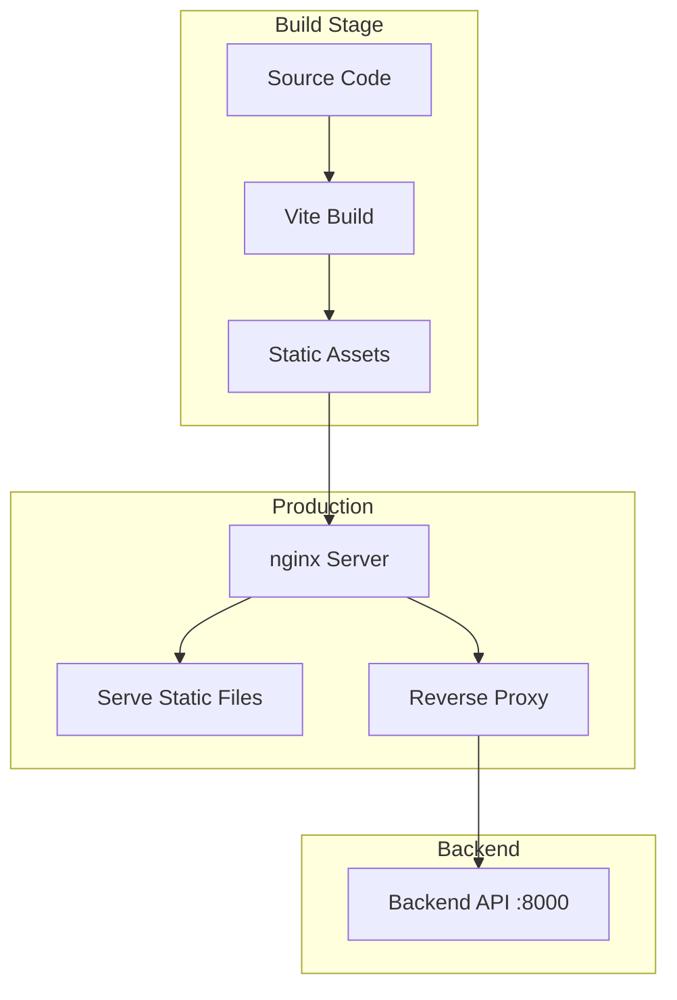
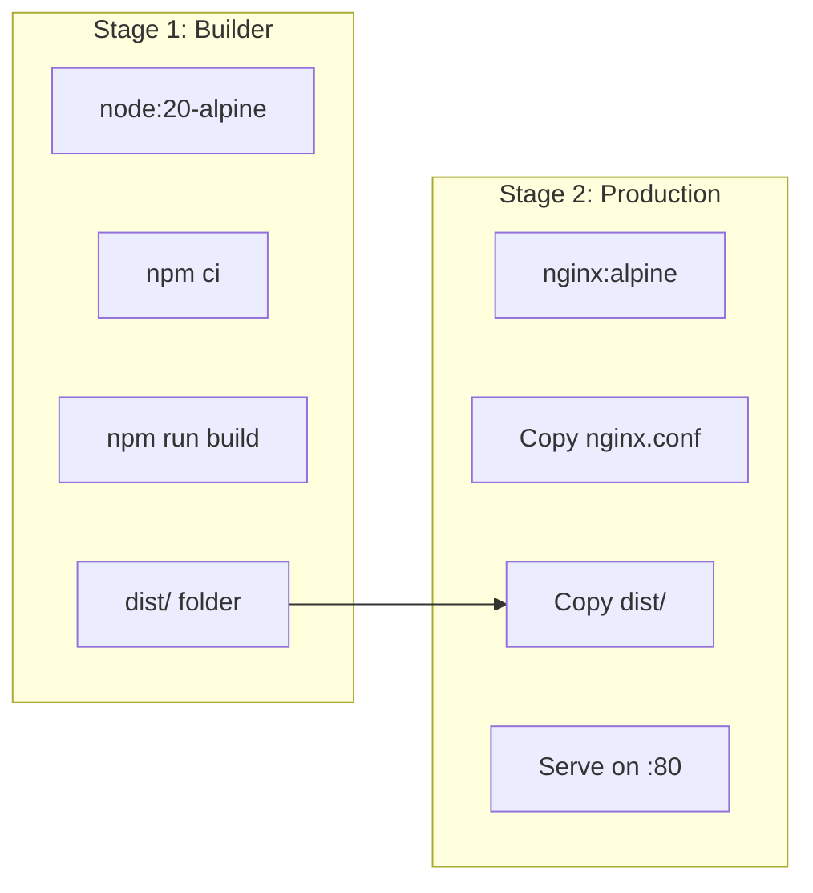
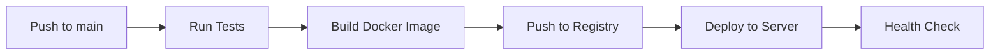
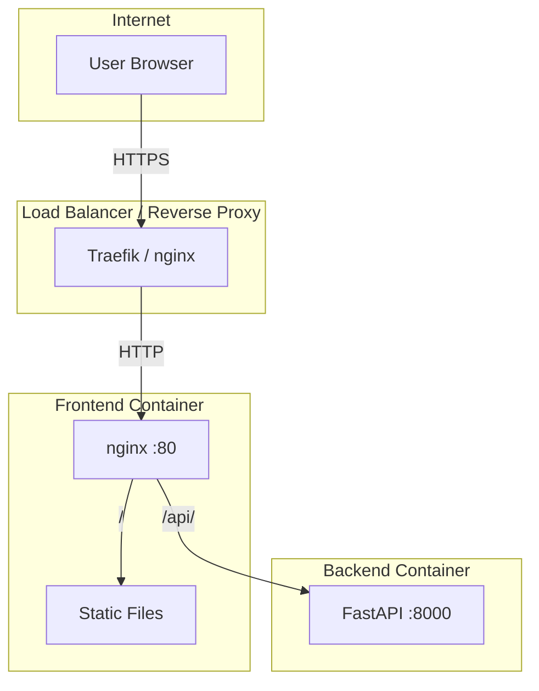

# Frontend Deployment

This document describes how to deploy the Frontend service to production, including Docker configuration, nginx setup, and deployment strategies.

## Deployment Overview



## Docker Build

### Dockerfile

The frontend uses a multi-stage Docker build:

```dockerfile
# frontend/Dockerfile

# Stage 1: Build
FROM node:20-alpine AS builder

WORKDIR /app

# Install dependencies first (cache layer)
COPY package*.json ./
RUN npm ci

# Copy source and build
COPY . .
RUN npm run build

# Stage 2: Production
FROM nginx:alpine

# Copy nginx configuration
COPY nginx.conf /etc/nginx/conf.d/default.conf

# Copy built assets from builder
COPY --from=builder /app/dist /usr/share/nginx/html

# Expose port
EXPOSE 80

CMD ["nginx", "-g", "daemon off;"]
```

### Build Stages Explained



**Benefits:**
- Final image ~25MB (nginx:alpine)
- No Node.js in production
- Build dependencies not included
- Cached npm install layer

### Build Commands

```bash
# Build image
docker build -t tfg-frontend:latest ./frontend

# Build with specific tag
docker build -t tfg-frontend:v1.0.0 ./frontend

# Build with cache busting
docker build --no-cache -t tfg-frontend:latest ./frontend
```

---

## nginx Configuration

### Production Configuration

```nginx
# frontend/nginx.conf

server {
    listen 80;
    server_name localhost;
    root /usr/share/nginx/html;
    index index.html;

    # Gzip compression
    gzip on;
    gzip_types text/plain text/css application/json application/javascript text/xml application/xml;
    gzip_min_length 1000;

    # Security headers
    add_header X-Frame-Options "SAMEORIGIN" always;
    add_header X-Content-Type-Options "nosniff" always;
    add_header X-XSS-Protection "1; mode=block" always;

    # API proxy - forward to backend
    location /api/ {
        proxy_pass http://backend:8000/;
        proxy_http_version 1.1;
        proxy_set_header Host $host;
        proxy_set_header X-Real-IP $remote_addr;
        proxy_set_header X-Forwarded-For $proxy_add_x_forwarded_for;
        proxy_set_header X-Forwarded-Proto $scheme;
        
        # WebSocket support (if needed)
        proxy_set_header Upgrade $http_upgrade;
        proxy_set_header Connection "upgrade";
        
        # Timeouts for long-running AI requests
        proxy_read_timeout 300s;
        proxy_connect_timeout 75s;
    }

    # Static assets with caching
    location /assets/ {
        expires 1y;
        add_header Cache-Control "public, immutable";
    }

    # SPA fallback - serve index.html for all routes
    location / {
        try_files $uri $uri/ /index.html;
    }

    # Health check endpoint
    location /health {
        access_log off;
        return 200 "healthy\n";
        add_header Content-Type text/plain;
    }
}
```

### Configuration Breakdown

```mermaid
graph TB
    subgraph "nginx Routes"
        A["/api/*"]
        B["/assets/*"]
        C["/* (other)"]
        D["/health"]
    end
    
    subgraph "Actions"
        A1[Proxy to backend:8000]
        B1[Serve with 1y cache]
        C1[Serve index.html (SPA)]
        D1[Return 200 OK]
    end
    
    A --> A1
    B --> B1
    C --> C1
    D --> D1
```

| Location | Purpose | Caching |
|----------|---------|---------|
| `/api/` | Proxy to backend | None |
| `/assets/` | Static assets (JS, CSS) | 1 year (immutable) |
| `/` | SPA routes | None |
| `/health` | Health checks | None |

---

## Docker Compose

### Production Configuration

```yaml
# docker-compose.yml (frontend section)

services:
  frontend:
    build:
      context: ./frontend
      dockerfile: Dockerfile
    ports:
      - "80:80"
    depends_on:
      - backend
    networks:
      - tfg-network
    restart: unless-stopped
    healthcheck:
      test: ["CMD", "wget", "-q", "--spider", "http://localhost/health"]
      interval: 30s
      timeout: 10s
      retries: 3

networks:
  tfg-network:
    driver: bridge
```

### Full Stack Deployment

```bash
# Build and start all services
docker compose up -d --build

# View logs
docker compose logs -f frontend

# Restart frontend only
docker compose restart frontend

# Scale (if using load balancer)
docker compose up -d --scale frontend=3
```

---

## Environment Configuration

### Production Environment

```dotenv
# frontend/.env.production
VITE_API_URL=/api
```

The `/api` URL is handled by nginx proxy, no direct backend URL exposed.

### Build-time vs Runtime

| Variable | When Used | Embedded In |
|----------|-----------|-------------|
| `VITE_*` | Build time | JavaScript bundle |

**Important:** Environment variables are embedded at build time. To change them, you must rebuild the image.

### Dynamic Configuration

For runtime configuration, use a config endpoint:

```tsx
// Alternative: fetch config at runtime
const response = await fetch("/config.json");
const config = await response.json();
```

---

## Deployment Process

### CI/CD Pipeline



### Manual Deployment

```bash
# 1. Build the image
docker build -t tfg-frontend:$(git rev-parse --short HEAD) ./frontend

# 2. Tag for registry
docker tag tfg-frontend:abc123 registry.example.com/tfg-frontend:abc123

# 3. Push to registry
docker push registry.example.com/tfg-frontend:abc123

# 4. Deploy on server
docker pull registry.example.com/tfg-frontend:abc123
docker compose up -d frontend
```

### Zero-Downtime Deployment

With Docker Compose:

```bash
# Pull new image
docker compose pull frontend

# Recreate with new image
docker compose up -d --no-deps frontend
```

---

## SSL/TLS Configuration

### With Traefik (Recommended)

```yaml
# docker-compose.yml with Traefik
services:
  traefik:
    image: traefik:v2.10
    command:
      - "--providers.docker=true"
      - "--entrypoints.web.address=:80"
      - "--entrypoints.websecure.address=:443"
      - "--certificatesresolvers.le.acme.httpchallenge=true"
      - "--certificatesresolvers.le.acme.email=admin@example.com"
      - "--certificatesresolvers.le.acme.storage=/letsencrypt/acme.json"
    ports:
      - "80:80"
      - "443:443"
    volumes:
      - "/var/run/docker.sock:/var/run/docker.sock:ro"
      - "letsencrypt:/letsencrypt"

  frontend:
    build: ./frontend
    labels:
      - "traefik.enable=true"
      - "traefik.http.routers.frontend.rule=Host(`app.example.com`)"
      - "traefik.http.routers.frontend.tls.certresolver=le"
```

### With nginx (External)

```nginx
# External nginx with SSL termination
server {
    listen 443 ssl http2;
    server_name app.example.com;

    ssl_certificate /etc/letsencrypt/live/app.example.com/fullchain.pem;
    ssl_certificate_key /etc/letsencrypt/live/app.example.com/privkey.pem;

    location / {
        proxy_pass http://frontend:80;
        proxy_set_header Host $host;
        proxy_set_header X-Real-IP $remote_addr;
    }
}

# Redirect HTTP to HTTPS
server {
    listen 80;
    server_name app.example.com;
    return 301 https://$server_name$request_uri;
}
```

---

## Monitoring

### Health Checks

```bash
# Check frontend health
curl http://localhost/health

# Check via Docker
docker inspect --format='{{.State.Health.Status}}' tfg-frontend
```

### Logging

```bash
# View nginx access logs
docker compose logs -f frontend

# Access logs format (customize in nginx.conf)
log_format main '$remote_addr - $remote_user [$time_local] '
                '"$request" $status $body_bytes_sent '
                '"$http_referer" "$http_user_agent"';
```

### Metrics

Consider adding nginx metrics with:

```nginx
# Enable stub_status for Prometheus
location /nginx_status {
    stub_status on;
    allow 10.0.0.0/8;
    deny all;
}
```

---

## Performance Optimization

### Asset Caching

```nginx
# Long cache for hashed assets
location /assets/ {
    expires 1y;
    add_header Cache-Control "public, immutable";
}

# Short cache for index.html
location = /index.html {
    expires 5m;
    add_header Cache-Control "no-cache";
}
```

### Compression

```nginx
gzip on;
gzip_vary on;
gzip_proxied any;
gzip_comp_level 6;
gzip_types
    text/plain
    text/css
    text/xml
    application/json
    application/javascript
    application/xml
    application/xml+rss
    image/svg+xml;
```

### HTTP/2

```nginx
# Enable HTTP/2 (requires SSL)
listen 443 ssl http2;
```

---

## Troubleshooting

### Common Issues

#### 502 Bad Gateway
- Backend not running
- Wrong backend URL in nginx proxy
- Network connectivity between containers

```bash
# Check backend is reachable
docker compose exec frontend ping backend
```

#### 404 on Routes
- SPA fallback not configured
- Check `try_files` directive

#### Assets Not Loading
- Check asset paths in build output
- Verify nginx root path

#### CORS Errors
- API should be on same origin (`/api`)
- Check nginx proxy headers

### Debug Commands

```bash
# Check nginx config syntax
docker compose exec frontend nginx -t

# Reload nginx config
docker compose exec frontend nginx -s reload

# View nginx error log
docker compose exec frontend cat /var/log/nginx/error.log

# Test proxy connection
docker compose exec frontend wget -O- http://backend:8000/health
```

---

## Production Checklist

- [ ] Build with production environment (`npm run build`)
- [ ] Docker image built and tagged
- [ ] nginx configuration validated
- [ ] SSL/TLS configured
- [ ] Health checks enabled
- [ ] Logging configured
- [ ] Gzip compression enabled
- [ ] Static asset caching configured
- [ ] Security headers set
- [ ] API proxy timeouts appropriate
- [ ] Backup and rollback plan ready

---

## Architecture Diagram



---

## Related Documentation

- [Configuration](configuration.md) - Environment variables
- [Development](development.md) - Local development
- [Backend Deployment](../backend/deployment.md) - Backend deployment
