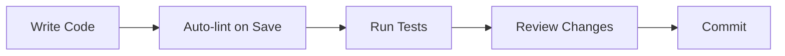

# Frontend Development Guide

This document provides a comprehensive guide for developing the Frontend service, including setup, workflow, testing, and best practices.

## Prerequisites

- **Node.js** 20+ (LTS recommended)
- **npm** or **pnpm** package manager
- **Git** for version control
- **VS Code** recommended editor

### Recommended VS Code Extensions

- ESLint
- Tailwind CSS IntelliSense
- Biome
- TypeScript Vue Plugin (Volar)
- GitLens

---

## Getting Started

### 1. Clone and Install

```bash
# Clone the repository
git clone https://github.com/your-org/TFG-Chatbot.git
cd TFG-Chatbot/frontend

# Install dependencies
npm install
```

### 2. Environment Setup

```bash
# Copy development environment (if not exists)
cp .env.development .env.local

# Edit local overrides if needed
vim .env.local
```

Default `.env.development`:
```dotenv
VITE_API_URL=http://localhost:8000
```

### 3. Start Development Server

```bash
npm run dev
```

The application will be available at `http://localhost:5173`.

### 4. Backend Requirements

The frontend requires the backend service running:

```bash
# From project root
docker compose up backend -d

# Or run backend directly
cd backend
uvicorn api:app --reload --port 8000
```

---

## Development Workflow

### Typical Development Flow



### File Watching

Vite provides instant HMR (Hot Module Replacement):
- Changes to components update in < 100ms
- State is preserved during updates
- CSS changes apply instantly

### Creating New Components

#### 1. UI Component (shadcn/ui style)

```bash
# Add a new shadcn component
npx shadcn@latest add tooltip
```

This creates `src/components/ui/tooltip.tsx`.

#### 2. Feature Component

```bash
# Create component file
touch src/components/chat/NewComponent.tsx
```

Follow the structure:

```tsx
// src/components/chat/NewComponent.tsx
import { cn } from "@/lib/utils";

interface NewComponentProps {
  title: string;
  className?: string;
}

export function NewComponent({ title, className }: NewComponentProps) {
  return (
    <div className={cn("base-classes", className)}>
      {title}
    </div>
  );
}
```

#### 3. Page Component

```bash
# Create page with folder
mkdir -p src/pages/feature
touch src/pages/feature/FeaturePage.tsx
```

```tsx
// src/pages/feature/FeaturePage.tsx
export default function FeaturePage() {
  return (
    <div className="p-6">
      <h1 className="text-2xl font-bold">Feature Page</h1>
    </div>
  );
}
```

### Creating Custom Hooks

```bash
touch src/hooks/useFeature.ts
```

```typescript
// src/hooks/useFeature.ts
import { useQuery, useMutation, useQueryClient } from "@tanstack/react-query";
import api from "@/lib/api";

export function useFeatureData() {
  return useQuery({
    queryKey: ["feature"],
    queryFn: async () => {
      const response = await api.get("/feature");
      return response.data;
    },
  });
}

export function useCreateFeature() {
  const queryClient = useQueryClient();

  return useMutation({
    mutationFn: async (data: FeatureData) => {
      const response = await api.post("/feature", data);
      return response.data;
    },
    onSuccess: () => {
      queryClient.invalidateQueries({ queryKey: ["feature"] });
    },
  });
}
```

### Adding Types

```typescript
// src/types/feature.ts
export interface Feature {
  id: string;
  name: string;
  createdAt: string;
}

export interface CreateFeatureRequest {
  name: string;
}
```

---

## Testing

### Running Tests

```bash
# Run all tests
npm run test

# Watch mode (recommended during development)
npm run test -- --watch

# Run specific test file
npm run test -- src/hooks/useChat.test.ts

# With coverage
npm run test -- --coverage
```

### Writing Tests

#### Component Tests

```tsx
// src/components/chat/MessageBubble.test.tsx
import { render, screen } from "@testing-library/react";
import { describe, expect, it } from "vitest";
import { MessageBubble } from "./MessageBubble";

describe("MessageBubble", () => {
  it("renders user message", () => {
    const message = {
      id: "1",
      role: "user" as const,
      content: "Hello",
      timestamp: new Date(),
    };

    render(<MessageBubble message={message} />);
    
    expect(screen.getByText("Hello")).toBeInTheDocument();
  });

  it("renders assistant message with markdown", () => {
    const message = {
      id: "2",
      role: "assistant" as const,
      content: "**Bold text**",
      timestamp: new Date(),
    };

    render(<MessageBubble message={message} />);
    
    expect(screen.getByText("Bold text")).toBeInTheDocument();
  });
});
```

#### Hook Tests

```tsx
// src/hooks/useChat.test.ts
import { renderHook, act } from "@testing-library/react";
import { describe, expect, it, vi } from "vitest";
import { useChat } from "./useChat";

// Mock api
vi.mock("@/lib/api", () => ({
  default: {
    post: vi.fn(),
    get: vi.fn(),
  },
}));

describe("useChat", () => {
  it("initializes with empty messages", () => {
    const { result } = renderHook(() => useChat(null));
    
    expect(result.current.messages).toEqual([]);
    expect(result.current.isLoading).toBe(false);
  });
});
```

### Test Utilities

```typescript
// src/__test-utils__/render.tsx
import { QueryClient, QueryClientProvider } from "@tanstack/react-query";
import { render } from "@testing-library/react";
import { BrowserRouter } from "react-router-dom";
import { AuthProvider } from "@/context/AuthContext";

export function renderWithProviders(ui: React.ReactElement) {
  const queryClient = new QueryClient({
    defaultOptions: {
      queries: { retry: false },
    },
  });

  return render(
    <QueryClientProvider client={queryClient}>
      <AuthProvider>
        <BrowserRouter>{ui}</BrowserRouter>
      </AuthProvider>
    </QueryClientProvider>
  );
}
```

---

## Linting and Formatting

### Biome (Primary)

```bash
# Check for issues
npx @biomejs/biome check .

# Fix auto-fixable issues
npx @biomejs/biome check --fix .

# Format only
npx @biomejs/biome format --write .
```

### ESLint (Legacy)

```bash
npm run lint
```

### Pre-commit Hooks

Consider adding husky for pre-commit checks:

```bash
npx husky install
npx husky add .husky/pre-commit "npx @biomejs/biome check --fix . && npm run test -- --run"
```

---

## Debugging

### Browser DevTools

1. **React DevTools** - Inspect component tree and state
2. **TanStack Query DevTools** - Monitor query cache

Enable Query DevTools:
```tsx
// src/main.tsx
import { ReactQueryDevtools } from "@tanstack/react-query-devtools";

createRoot(document.getElementById("root")!).render(
  <QueryClientProvider client={queryClient}>
    <App />
    <ReactQueryDevtools initialIsOpen={false} />
  </QueryClientProvider>
);
```

### Console Debugging

```typescript
// Temporary debug logging
console.log("Debug:", { variable, state });

// Conditional logging
if (import.meta.env.DEV) {
  console.log("Development only log");
}
```

### Network Debugging

Use browser Network tab to:
- Inspect API requests/responses
- Check request headers (auth token)
- Monitor WebSocket connections

---

## Common Tasks

### Adding a New Route

1. Create page component:
```tsx
// src/pages/new-feature/NewFeaturePage.tsx
export default function NewFeaturePage() {
  return <div>New Feature</div>;
}
```

2. Add route in App.tsx:
```tsx
// src/App.tsx
<Route element={<RequireAuth />}>
  <Route element={<AppLayout />}>
    <Route path="/new-feature" element={<NewFeaturePage />} />
  </Route>
</Route>
```

3. Add navigation item (if needed):
```tsx
// src/components/layout/AppLayout.tsx
const navItems = [
  // ... existing items
  { to: "/new-feature", label: "New Feature", icon: Star },
];
```

### Adding an API Endpoint

1. Add type definitions:
```typescript
// src/types/newFeature.ts
export interface NewFeature {
  id: string;
  data: string;
}
```

2. Create hook:
```typescript
// src/hooks/useNewFeature.ts
export function useNewFeature() {
  return useQuery({
    queryKey: ["newFeature"],
    queryFn: async () => {
      const response = await api.get("/new-feature");
      return response.data;
    },
  });
}
```

3. Use in component:
```tsx
function NewFeaturePage() {
  const { data, isLoading, error } = useNewFeature();
  // ...
}
```

### Adding a Form

1. Define schema:
```typescript
const formSchema = z.object({
  name: z.string().min(1, "Required"),
  email: z.string().email("Invalid email"),
});
```

2. Create form component:
```tsx
function MyForm() {
  const form = useForm({
    resolver: zodResolver(formSchema),
    defaultValues: { name: "", email: "" },
  });

  return (
    <Form {...form}>
      <form onSubmit={form.handleSubmit(onSubmit)}>
        <FormField
          control={form.control}
          name="name"
          render={({ field }) => (
            <FormItem>
              <FormLabel>Name</FormLabel>
              <FormControl>
                <Input {...field} />
              </FormControl>
              <FormMessage />
            </FormItem>
          )}
        />
        <Button type="submit">Submit</Button>
      </form>
    </Form>
  );
}
```

---

## Project Structure Conventions

### File Naming

| Type | Convention | Example |
|------|------------|---------|
| Components | PascalCase | `MessageBubble.tsx` |
| Hooks | camelCase with `use` prefix | `useChat.ts` |
| Types | PascalCase | `chat.ts` (exports `Message`) |
| Utilities | camelCase | `utils.ts`, `errors.ts` |
| Tests | `.test.tsx` suffix | `MessageBubble.test.tsx` |

### Import Order

```typescript
// 1. React/external libraries
import { useState, useEffect } from "react";
import { useQuery } from "@tanstack/react-query";

// 2. Internal absolute imports (@/)
import { Button } from "@/components/ui/button";
import { useAuth } from "@/context/AuthContext";
import api from "@/lib/api";

// 3. Relative imports
import { MessageBubble } from "./MessageBubble";

// 4. Types
import type { Message } from "@/types/chat";
```

Biome auto-organizes imports on save.

---

## Performance Tips

### Memoization

```tsx
// Memoize expensive computations
const sortedItems = useMemo(() => 
  items.sort((a, b) => a.date - b.date),
  [items]
);

// Memoize callbacks passed to children
const handleClick = useCallback(() => {
  // handler logic
}, [dependency]);
```

### Query Optimization

```typescript
// Set appropriate stale times
useQuery({
  queryKey: ["static-data"],
  queryFn: fetchStaticData,
  staleTime: 5 * 60 * 1000, // 5 minutes
});

// Disable unnecessary refetches
useQuery({
  queryKey: ["data"],
  queryFn: fetchData,
  refetchOnWindowFocus: false,
});
```

### Lazy Loading

```tsx
// Lazy load heavy components
const HeavyChart = lazy(() => import("./HeavyChart"));

function Dashboard() {
  return (
    <Suspense fallback={<Skeleton />}>
      <HeavyChart />
    </Suspense>
  );
}
```

---

## Troubleshooting

### Common Issues

#### "Module not found" errors
- Check import path (use `@/` for src imports)
- Restart TypeScript server (`Ctrl+Shift+P` → "TypeScript: Restart")

#### HMR not working
- Check for syntax errors in console
- Try hard refresh (`Ctrl+Shift+R`)
- Restart dev server

#### Auth issues
- Clear localStorage: `localStorage.clear()`
- Check token in Network tab
- Verify backend is running

#### Type errors
- Run `npm run build` to see all errors
- Check for missing type definitions
- Update `@types/*` packages

---

## Related Documentation

- [Configuration](configuration.md) - Environment and build config
- [Deployment](deployment.md) - Production deployment
- [Architecture](architecture.md) - Application structure
- [Components](components.md) - Component reference
