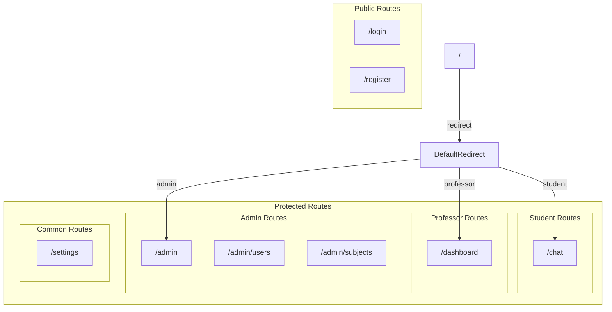
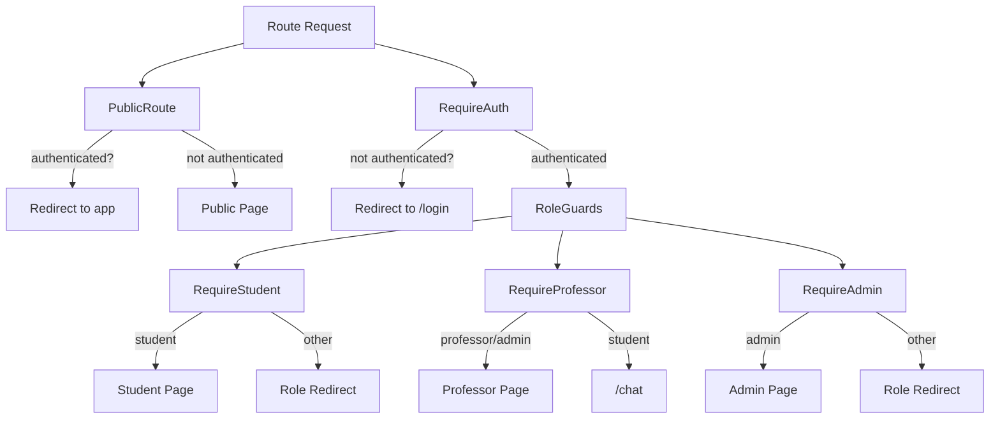
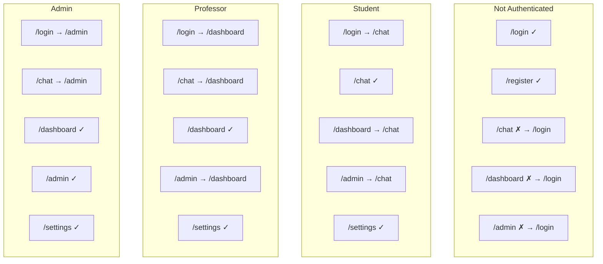

# Frontend Routing

This document describes the routing configuration, route guards, and navigation patterns in the Frontend service.

## Overview

The application uses React Router DOM v7 with a role-based routing system. Routes are protected by guard components that check authentication status and user roles.

## Route Structure



## Route Configuration

```tsx
// src/App.tsx

function App() {
  return (
    <Router>
      <Routes>
        {/* Public routes */}
        <Route element={<PublicRoute />}>
          <Route path="/login" element={<LoginPage />} />
          <Route path="/register" element={<RegisterPage />} />
        </Route>

        {/* Protected routes with AppLayout */}
        <Route element={<RequireAuth />}>
          <Route element={<AppLayout />}>
            {/* Student-only routes */}
            <Route element={<RequireStudent />}>
              <Route path="/chat" element={<ChatPage />} />
            </Route>

            {/* Professor/Admin routes */}
            <Route element={<RequireProfessor />}>
              <Route path="/dashboard" element={<DashboardPage />} />
            </Route>

            {/* Admin-only routes */}
            <Route element={<RequireAdmin />}>
              <Route path="/admin" element={<AdminDashboard />} />
            </Route>

            {/* Common protected routes */}
            <Route path="/settings" element={<SettingsPage />} />

            {/* Default redirect based on role */}
            <Route path="/" element={<DefaultRedirect />} />
          </Route>
        </Route>

        {/* Catch-all redirect */}
        <Route path="*" element={<Navigate to="/" replace />} />
      </Routes>
    </Router>
  );
}
```

## Route Table

| Path | Component | Access | Description |
|------|-----------|--------|-------------|
| `/login` | `LoginPage` | Public only | User login form |
| `/register` | `RegisterPage` | Public only | User registration |
| `/chat` | `ChatPage` | Student | AI chat interface |
| `/dashboard` | `DashboardPage` | Professor, Admin | Course management |
| `/admin` | `AdminDashboard` | Admin | Platform administration |
| `/settings` | `SettingsPage` | All authenticated | User preferences |
| `/` | `DefaultRedirect` | All authenticated | Role-based redirect |

---

## Route Guards

### Guard Hierarchy



### PublicRoute

Prevents authenticated users from accessing login/register pages.

```tsx
// src/components/layout/PublicRoute.tsx
import { Navigate, Outlet } from "react-router-dom";
import { useAuth } from "@/context/AuthContext";

export default function PublicRoute() {
  const { isAuthenticated, user } = useAuth();

  if (isAuthenticated) {
    // Redirect authenticated users to their default page
    switch (user?.role) {
      case "student":
        return <Navigate to="/chat" replace />;
      case "professor":
        return <Navigate to="/dashboard" replace />;
      case "admin":
        return <Navigate to="/admin" replace />;
      default:
        return <Navigate to="/" replace />;
    }
  }

  return <Outlet />;
}
```

### RequireAuth

Base authentication guard that redirects unauthenticated users.

```tsx
// src/components/layout/RequireAuth.tsx
import { Navigate, Outlet, useLocation } from "react-router-dom";
import { useAuth } from "@/context/AuthContext";

export default function RequireAuth() {
  const { isAuthenticated } = useAuth();
  const location = useLocation();

  if (!isAuthenticated) {
    // Save intended destination for redirect after login
    return <Navigate to="/login" state={{ from: location }} replace />;
  }

  return <Outlet />;
}
```

### RequireStudent

Restricts access to student role only.

```tsx
// src/components/layout/RequireStudent.tsx
import { Navigate, Outlet } from "react-router-dom";
import { useAuth } from "@/context/AuthContext";

export default function RequireStudent() {
  const { user } = useAuth();

  if (user?.role !== "student") {
    // Redirect non-students to their appropriate page
    return user?.role === "admin" 
      ? <Navigate to="/admin" replace />
      : <Navigate to="/dashboard" replace />;
  }

  return <Outlet />;
}
```

### RequireProfessor

Allows professors and admins (admins inherit professor permissions).

```tsx
// src/components/layout/RequireProfessor.tsx
import { Navigate, Outlet } from "react-router-dom";
import { useAuth } from "@/context/AuthContext";

export default function RequireProfessor() {
  const { user } = useAuth();

  if (user?.role !== "professor" && user?.role !== "admin") {
    return <Navigate to="/chat" replace />;
  }

  return <Outlet />;
}
```

### RequireAdmin

Restricts access to admin role only.

```tsx
// src/components/layout/RequireAdmin.tsx
import { Navigate, Outlet } from "react-router-dom";
import { useAuth } from "@/context/AuthContext";

export default function RequireAdmin() {
  const { user } = useAuth();

  if (user?.role !== "admin") {
    return user?.role === "professor" 
      ? <Navigate to="/dashboard" replace />
      : <Navigate to="/chat" replace />;
  }

  return <Outlet />;
}
```

### DefaultRedirect

Redirects to the appropriate page based on user role.

```tsx
// src/components/layout/DefaultRedirect.tsx
import { Navigate } from "react-router-dom";
import { useAuth } from "@/context/AuthContext";

export default function DefaultRedirect() {
  const { user, isAuthenticated } = useAuth();

  if (!isAuthenticated) {
    return <Navigate to="/login" replace />;
  }

  switch (user?.role) {
    case "student":
      return <Navigate to="/chat" replace />;
    case "professor":
      return <Navigate to="/dashboard" replace />;
    case "admin":
      return <Navigate to="/admin" replace />;
    default:
      return <Navigate to="/login" replace />;
  }
}
```

---

## Navigation

### Sidebar Navigation

The `AppLayout` component renders navigation based on user role:

```tsx
// Navigation items configuration
const navItems = [
  { 
    to: "/chat", 
    label: "Chat", 
    icon: MessageSquare, 
    roles: ["student"] 
  },
  {
    to: "/dashboard",
    label: "Mis Clases",
    icon: GraduationCap,
    roles: ["professor", "admin"],
    requiresSubjects: true, // Only show if user has subjects
  },
  { 
    to: "/admin", 
    label: "Admin", 
    icon: LayoutDashboard, 
    roles: ["admin"] 
  },
  { 
    to: "/settings", 
    label: "Configuración", 
    icon: Settings 
    // No roles = visible to all
  },
];

// Filter logic
const filteredNavItems = navItems.filter((item) => {
  const roleAllowed = !item.roles || item.roles.includes(user?.role);
  const subjectsAllowed = !item.requiresSubjects || user?.subjects?.length > 0;
  return roleAllowed && subjectsAllowed;
});
```

### Navigation by Role

| Role | Visible Nav Items |
|------|-------------------|
| Student | Chat, Settings |
| Professor | Dashboard*, Settings |
| Admin | Dashboard*, Admin, Settings |

*Only if user has subjects assigned

### Active Link Styling

```tsx
<NavLink
  to={item.to}
  className={({ isActive }) =>
    cn(
      "flex items-center gap-3 px-3 py-2 rounded-md",
      isActive
        ? "bg-primary text-primary-foreground"
        : "text-muted-foreground hover:bg-muted"
    )
  }
>
  <item.icon className="h-4 w-4" />
  {item.label}
</NavLink>
```

---

## Programmatic Navigation

### Using useNavigate

```tsx
import { useNavigate } from "react-router-dom";

function LoginPage() {
  const navigate = useNavigate();
  const { login } = useAuth();

  const onSubmit = async (data) => {
    const { token, user } = await authenticate(data);
    login(token, user);
    
    // Navigate after login
    navigate("/chat");
  };
}
```

### Post-Login Redirect

```tsx
// In RequireAuth, save the intended destination
<Navigate to="/login" state={{ from: location }} replace />

// In LoginPage, redirect to saved location
const location = useLocation();
const from = location.state?.from?.pathname || "/";

const onLoginSuccess = () => {
  navigate(from, { replace: true });
};
```

### Logout Navigation

```tsx
function AppLayout() {
  const { logout } = useAuth();
  const navigate = useNavigate();

  const handleLogout = () => {
    logout();
    navigate("/login");
  };
}
```

---

## Route Access Matrix



| Route | Not Auth | Student | Professor | Admin |
|-------|----------|---------|-----------|-------|
| `/login` | ✓ | → /chat | → /dashboard | → /admin |
| `/register` | ✓ | → /chat | → /dashboard | → /admin |
| `/chat` | → /login | ✓ | → /dashboard | → /admin |
| `/dashboard` | → /login | → /chat | ✓ | ✓ |
| `/admin` | → /login | → /chat | → /dashboard | ✓ |
| `/settings` | → /login | ✓ | ✓ | ✓ |
| `/` | → /login | → /chat | → /dashboard | → /admin |

---

## Deep Linking

The application supports deep linking for:

### Session Links
```
/chat?session=<session-id>
```

### Admin Tabs
```
/admin?tab=users
/admin?tab=subjects
```

### Example Implementation

```tsx
function AdminDashboard() {
  const [searchParams, setSearchParams] = useSearchParams();
  const activeTab = searchParams.get("tab") || "overview";

  const handleTabChange = (tab: string) => {
    setSearchParams({ tab });
  };

  return (
    <Tabs value={activeTab} onValueChange={handleTabChange}>
      <TabsList>
        <TabsTrigger value="overview">Overview</TabsTrigger>
        <TabsTrigger value="users">Users</TabsTrigger>
        <TabsTrigger value="subjects">Subjects</TabsTrigger>
      </TabsList>
      {/* ... */}
    </Tabs>
  );
}
```

---

## Error Handling

### 404 Handling

```tsx
// Catch-all route redirects to home
<Route path="*" element={<Navigate to="/" replace />} />
```

### Auth State Changes

When auth state changes (e.g., token expires), the user is redirected:

```tsx
// In api.ts interceptor
api.interceptors.response.use(
  (response) => response,
  (error) => {
    if (error.response?.status === 401) {
      // Token expired or invalid
      localStorage.removeItem("token");
      localStorage.removeItem("user");
      window.location.href = "/login";
    }
    return Promise.reject(error);
  }
);
```

---

## Mobile Navigation

On mobile devices, the sidebar is collapsible:

```tsx
function AppLayout() {
  const [sidebarOpen, setSidebarOpen] = useState(false);

  return (
    <div className="flex h-screen">
      {/* Mobile overlay */}
      {sidebarOpen && (
        <div
          className="fixed inset-0 bg-black/50 z-40 md:hidden"
          onClick={() => setSidebarOpen(false)}
        />
      )}

      {/* Sidebar */}
      <aside
        className={cn(
          "fixed md:static inset-y-0 left-0 z-50 w-64",
          "transform transition-transform duration-200",
          sidebarOpen ? "translate-x-0" : "-translate-x-full md:translate-x-0"
        )}
      >
        {/* Sidebar content */}
      </aside>

      {/* Main content */}
      <main className="flex-1">
        {/* Mobile menu button */}
        <button
          className="md:hidden"
          onClick={() => setSidebarOpen(true)}
        >
          <Menu />
        </button>
        <Outlet />
      </main>
    </div>
  );
}
```

---

## Related Documentation

- [Architecture](architecture.md) - Application structure
- [Components](components.md) - Layout components
- [State Management](state-management.md) - Auth context
