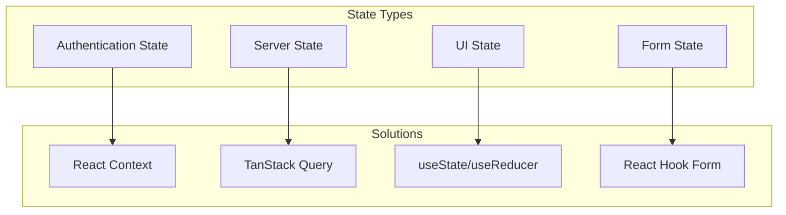
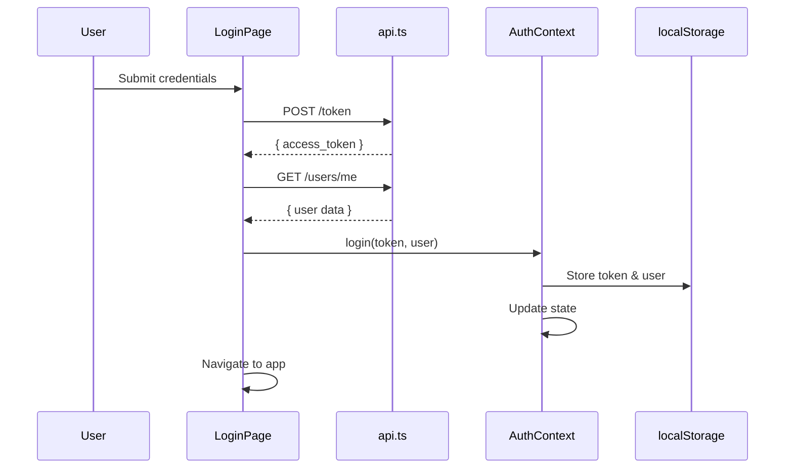
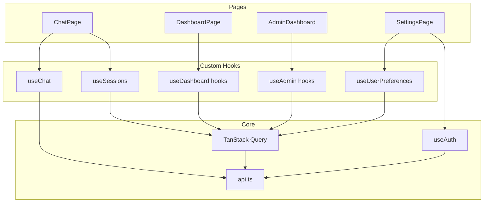
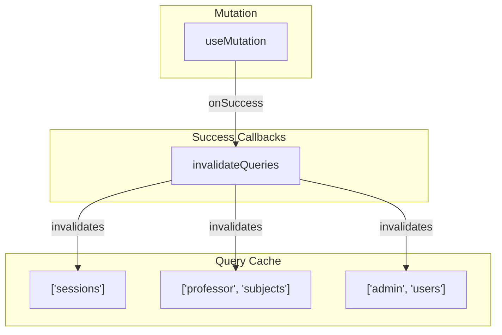

# State Management

This document describes the state management patterns used in the Frontend service, including React Context, custom hooks, and TanStack Query integration.

## State Categories

The application uses different strategies for different types of state:



| State Type | Tool | Examples | Persistence |
|------------|------|----------|-------------|
| **Authentication** | React Context | User, token | localStorage |
| **Server Data** | TanStack Query | Sessions, messages, users | Cache (memory) |
| **UI State** | useState | Modals, tabs, selections | None |
| **Form State** | React Hook Form | Input values, validation | None |

---

## Authentication Context

The `AuthContext` provides global authentication state across the application.

### Implementation

```typescript
// src/context/AuthContext.tsx

interface User {
  username: string;
  email: string;
  role: "student" | "professor" | "admin";
  subjects: string[];
}

interface AuthContextType {
  user: User | null;
  token: string | null;
  login: (token: string, user: User) => void;
  logout: () => void;
  isAuthenticated: boolean;
}

const AuthContext = createContext<AuthContextType | undefined>(undefined);

export function AuthProvider({ children }: { children: ReactNode }) {
  const [user, setUser] = useState<User | null>(null);
  const [token, setToken] = useState<string | null>(null);

  // Initialize from localStorage on mount
  useEffect(() => {
    const storedToken = localStorage.getItem("token");
    const storedUser = localStorage.getItem("user");
    if (storedToken && storedUser) {
      setToken(storedToken);
      setUser(JSON.parse(storedUser));
    }
  }, []);

  const login = (newToken: string, newUser: User) => {
    localStorage.setItem("token", newToken);
    localStorage.setItem("user", JSON.stringify(newUser));
    setToken(newToken);
    setUser(newUser);
  };

  const logout = () => {
    localStorage.removeItem("token");
    localStorage.removeItem("user");
    setToken(null);
    setUser(null);
  };

  return (
    <AuthContext.Provider
      value={{
        user,
        token,
        login,
        logout,
        isAuthenticated: !!token && !!user,
      }}
    >
      {children}
    </AuthContext.Provider>
  );
}

export function useAuth() {
  const context = useContext(AuthContext);
  if (!context) {
    throw new Error("useAuth must be used within AuthProvider");
  }
  return context;
}
```

### Usage

```tsx
// In components
function Header() {
  const { user, logout, isAuthenticated } = useAuth();
  
  return (
    <header>
      {isAuthenticated && <span>Welcome, {user.username}</span>}
      <button onClick={logout}>Logout</button>
    </header>
  );
}

// In route guards
function RequireAuth() {
  const { isAuthenticated } = useAuth();
  
  if (!isAuthenticated) {
    return <Navigate to="/login" />;
  }
  
  return <Outlet />;
}
```

### Authentication Flow



---

## TanStack Query

TanStack Query (React Query) manages all server state with automatic caching, refetching, and synchronization.

### Query Client Setup

```tsx
// src/main.tsx
import { QueryClient, QueryClientProvider } from "@tanstack/react-query";

const queryClient = new QueryClient({
  defaultOptions: {
    queries: {
      staleTime: 30_000, // 30 seconds
      retry: 1,
      refetchOnWindowFocus: false,
    },
  },
});

createRoot(document.getElementById("root")!).render(
  <QueryClientProvider client={queryClient}>
    <AuthProvider>
      <App />
    </AuthProvider>
  </QueryClientProvider>
);
```

### Query Keys Convention

Query keys follow a hierarchical pattern:

```typescript
// Pattern: [domain, resource, ...identifiers]
["sessions"]                      // All sessions
["sessions", sessionId]           // Single session
["sessions", sessionId, "messages"] // Session messages

["professor", "subjects"]         // Professor's subjects
["professor", "students", subjectName] // Students in subject

["admin", "users"]               // All users
["admin", "users", role]         // Users by role
["admin", "subjects"]            // All subjects
```

---

## Custom Hooks

### useChat

Manages chat state and messaging for the active session.

```typescript
// src/hooks/useChat.ts

export function useChat(sessionId: string | null) {
  const [messages, setMessages] = useState<Message[]>([]);
  const [isLoading, setIsLoading] = useState(false);
  const [isTestMode, setIsTestMode] = useState(false);

  // Load history when session changes
  useEffect(() => {
    if (sessionId) {
      loadHistory(sessionId);
    } else {
      setMessages([]);
    }
  }, [sessionId]);

  const loadHistory = async (id: string) => {
    const response = await api.get(`/chat/${id}/history`);
    setMessages(convertHistory(response.data.messages));
  };

  const sendMessage = async (content: string, asignatura: string) => {
    if (!sessionId) return;
    
    // Optimistic update
    const userMessage: Message = {
      id: crypto.randomUUID(),
      role: "user",
      content,
      timestamp: new Date(),
    };
    setMessages(prev => [...prev, userMessage]);
    setIsLoading(true);

    try {
      const response = await api.post("/chat", {
        id: sessionId,
        message: content,
        asignatura,
      });

      const assistantMessage: Message = {
        id: crypto.randomUUID(),
        role: "assistant",
        content: response.data.response,
        timestamp: new Date(),
      };
      setMessages(prev => [...prev, assistantMessage]);
      
      // Check if test mode started
      if (response.data.is_test) {
        setIsTestMode(true);
      }
    } catch (error) {
      // Remove optimistic message on error
      setMessages(prev => prev.filter(m => m.id !== userMessage.id));
      throw error;
    } finally {
      setIsLoading(false);
    }
  };

  const resumeTest = async (answer: string) => {
    if (!sessionId) return;
    
    setIsLoading(true);
    try {
      const response = await api.post("/resume_chat", {
        id: sessionId,
        answer,
      });

      const assistantMessage: Message = {
        id: crypto.randomUUID(),
        role: "assistant",
        content: response.data.response,
        timestamp: new Date(),
      };
      setMessages(prev => [...prev, assistantMessage]);
      
      // Check if test ended
      if (!response.data.is_test) {
        setIsTestMode(false);
      }
    } finally {
      setIsLoading(false);
    }
  };

  return {
    messages,
    sendMessage,
    resumeTest,
    isLoading,
    isTestMode,
    clearMessages: () => setMessages([]),
  };
}
```

### useSessions

Manages chat session CRUD operations.

```typescript
// src/hooks/useSessions.ts

export function useSessions() {
  return useQuery({
    queryKey: ["sessions"],
    queryFn: async () => {
      const response = await api.get("/sessions");
      return response.data;
    },
  });
}

export function useCreateSession() {
  const queryClient = useQueryClient();

  return useMutation({
    mutationFn: async (asignatura: string) => {
      const response = await api.post("/sessions", { asignatura });
      return response.data;
    },
    onSuccess: () => {
      queryClient.invalidateQueries({ queryKey: ["sessions"] });
    },
  });
}

export function useDeleteSession() {
  const queryClient = useQueryClient();

  return useMutation({
    mutationFn: async (sessionId: string) => {
      await api.delete(`/sessions/${sessionId}`);
    },
    onSuccess: () => {
      queryClient.invalidateQueries({ queryKey: ["sessions"] });
    },
  });
}

export function useRenameSession() {
  const queryClient = useQueryClient();

  return useMutation({
    mutationFn: async ({ sessionId, title }: { sessionId: string; title: string }) => {
      const response = await api.patch(`/sessions/${sessionId}`, { title });
      return response.data;
    },
    onSuccess: () => {
      queryClient.invalidateQueries({ queryKey: ["sessions"] });
    },
  });
}
```

### useDashboard

Professor dashboard data hooks.

```typescript
// src/hooks/useDashboard.ts

export function useSubjects() {
  return useQuery({
    queryKey: ["professor", "subjects"],
    queryFn: async () => {
      const response = await api.get("/professor/subjects");
      return response.data;
    },
  });
}

export function useStudents(subject: string) {
  return useQuery({
    queryKey: ["professor", "students", subject],
    queryFn: async () => {
      const response = await api.get(`/professor/students/${subject}`);
      return response.data;
    },
    enabled: !!subject,
  });
}

export function useDocuments(subject: string) {
  return useQuery({
    queryKey: ["professor", "documents", subject],
    queryFn: async () => {
      const response = await api.get(`/professor/subjects/${subject}/documents`);
      return response.data;
    },
    enabled: !!subject,
  });
}

export function useUploadDocument() {
  const queryClient = useQueryClient();

  return useMutation({
    mutationFn: async ({
      subject,
      file,
      tipoDocumento,
      autoIndex,
    }: {
      subject: string;
      file: File;
      tipoDocumento: string;
      autoIndex: boolean;
    }) => {
      const formData = new FormData();
      formData.append("file", file);
      formData.append("tipo_documento", tipoDocumento);
      formData.append("auto_index", String(autoIndex));

      const response = await api.post(
        `/professor/subjects/${subject}/documents`,
        formData,
        { headers: { "Content-Type": "multipart/form-data" } }
      );
      return response.data;
    },
    onSuccess: (_, { subject }) => {
      queryClient.invalidateQueries({ queryKey: ["professor", "documents", subject] });
    },
  });
}

export function useStudentProgress(subject: string) {
  return useQuery({
    queryKey: ["professor", "progress", subject],
    queryFn: async () => {
      const response = await api.get(`/professor/subjects/${subject}/progress`);
      return response.data;
    },
    enabled: !!subject,
  });
}
```

### useAdmin

Admin panel hooks.

```typescript
// src/hooks/useAdmin.ts

export function useAdminStats() {
  return useQuery<AdminStats>({
    queryKey: ["admin", "stats"],
    queryFn: async () => {
      const response = await api.get("/admin/stats");
      return response.data;
    },
  });
}

export function useUsers(role?: "student" | "professor" | "admin") {
  return useQuery<UserInfo[]>({
    queryKey: ["admin", "users", role],
    queryFn: async () => {
      const params = role ? { role } : {};
      const response = await api.get("/admin/users", { params });
      return response.data;
    },
  });
}

export function useUserSearch(query: string, role?: string) {
  const [debouncedQuery, setDebouncedQuery] = useState(query);

  useEffect(() => {
    const timer = setTimeout(() => setDebouncedQuery(query), 300);
    return () => clearTimeout(timer);
  }, [query]);

  return useQuery<UserInfo[]>({
    queryKey: ["admin", "users", "search", debouncedQuery, role],
    queryFn: async () => {
      if (debouncedQuery.length < 2) return [];
      const params: Record<string, string> = { q: debouncedQuery };
      if (role) params.role = role;
      const response = await api.get("/admin/users/search", { params });
      return response.data;
    },
    enabled: debouncedQuery.length >= 2,
  });
}

export function useEnrollStudent() {
  const queryClient = useQueryClient();

  return useMutation({
    mutationFn: async (data: EnrollRequest) => {
      const response = await api.post("/admin/enroll", data);
      return response.data;
    },
    onSuccess: () => {
      queryClient.invalidateQueries({ queryKey: ["admin", "users"] });
      queryClient.invalidateQueries({ queryKey: ["professor", "subjects"] });
    },
  });
}

export function usePromoteUser() {
  const queryClient = useQueryClient();

  return useMutation({
    mutationFn: async (data: PromoteRequest) => {
      const response = await api.post("/admin/promote", data);
      return response.data;
    },
    onSuccess: () => {
      queryClient.invalidateQueries({ queryKey: ["admin", "users"] });
      queryClient.invalidateQueries({ queryKey: ["admin", "stats"] });
    },
  });
}

export function useSubjects() {
  return useQuery<{ subjects: SubjectInfo[]; total: number }>({
    queryKey: ["admin", "subjects"],
    queryFn: async () => {
      const response = await api.get("/admin/subjects");
      return response.data;
    },
  });
}

export function useCreateSubject() {
  const queryClient = useQueryClient();

  return useMutation({
    mutationFn: async (data: CreateSubjectRequest) => {
      const response = await api.post<SubjectInfo>("/admin/subjects", data);
      return response.data;
    },
    onSuccess: () => {
      queryClient.invalidateQueries({ queryKey: ["admin", "subjects"] });
      queryClient.invalidateQueries({ queryKey: ["admin", "stats"] });
    },
  });
}
```

### useUserPreferences

User settings and preferences.

```typescript
// src/hooks/useUserPreferences.ts

export function useUserPreferences() {
  return useQuery<UserPreferences>({
    queryKey: ["preferences"],
    queryFn: async () => {
      const response = await api.get("/users/me/preferences");
      return response.data;
    },
  });
}

export function useUpdatePreferences() {
  const queryClient = useQueryClient();

  return useMutation({
    mutationFn: async (preferences: UserPreferences) => {
      const response = await api.put("/users/me/preferences", preferences);
      return response.data;
    },
    onSuccess: () => {
      queryClient.invalidateQueries({ queryKey: ["preferences"] });
    },
  });
}
```

---

## Hooks Dependency Map



---

## Form State with React Hook Form

Forms use React Hook Form with Zod validation.

### Example: Login Form

```tsx
import { useForm } from "react-hook-form";
import { zodResolver } from "@hookform/resolvers/zod";
import { z } from "zod";

const loginSchema = z.object({
  username: z.string().min(1, "Username is required"),
  password: z.string().min(1, "Password is required"),
});

type LoginFormValues = z.infer<typeof loginSchema>;

function LoginPage() {
  const form = useForm<LoginFormValues>({
    resolver: zodResolver(loginSchema),
    defaultValues: {
      username: "",
      password: "",
    },
  });

  const onSubmit = async (data: LoginFormValues) => {
    // Submit logic
  };

  return (
    <Form {...form}>
      <form onSubmit={form.handleSubmit(onSubmit)}>
        <FormField
          control={form.control}
          name="username"
          render={({ field }) => (
            <FormItem>
              <FormLabel>Username</FormLabel>
              <FormControl>
                <Input {...field} />
              </FormControl>
              <FormMessage />
            </FormItem>
          )}
        />
        {/* ... */}
      </form>
    </Form>
  );
}
```

### Example: Create Subject Form

```tsx
const createSubjectSchema = z.object({
  name: z.string()
    .min(1, "Name is required")
    .regex(/^[a-z0-9-]+$/, "Use lowercase letters, numbers, and hyphens"),
  display_name: z.string().min(1, "Display name is required"),
  guia_url: z.string().url().optional().or(z.literal("")),
});

type CreateSubjectValues = z.infer<typeof createSubjectSchema>;
```

---

## Cache Invalidation Strategy



### Invalidation Patterns

| Action | Invalidated Queries |
|--------|---------------------|
| Create session | `['sessions']` |
| Delete session | `['sessions']` |
| Upload document | `['professor', 'documents', subject]` |
| Enroll student | `['admin', 'users']`, `['professor', 'subjects']` |
| Promote user | `['admin', 'users']`, `['admin', 'stats']` |
| Create subject | `['admin', 'subjects']`, `['admin', 'stats']` |

---

## Error Handling in State

### API Error Utility

```typescript
// src/lib/errors.ts
export function getErrorMessage(error: unknown, fallback: string): string {
  if (isApiError(error)) {
    return error.response?.data?.detail || 
           error.response?.data?.message || 
           fallback;
  }
  if (error instanceof Error) {
    return error.message;
  }
  return fallback;
}
```

### Toast Notifications

```tsx
import { toast } from "sonner";

// In mutation handlers
const createSession = useCreateSession();

const handleCreate = async () => {
  try {
    await createSession.mutateAsync(subject);
    toast.success("Session created");
  } catch (error) {
    toast.error(getErrorMessage(error, "Failed to create session"));
  }
};
```

---

## Related Documentation

- [Architecture](architecture.md) - Application structure
- [Components](components.md) - Component documentation
- [Configuration](configuration.md) - Environment setup
