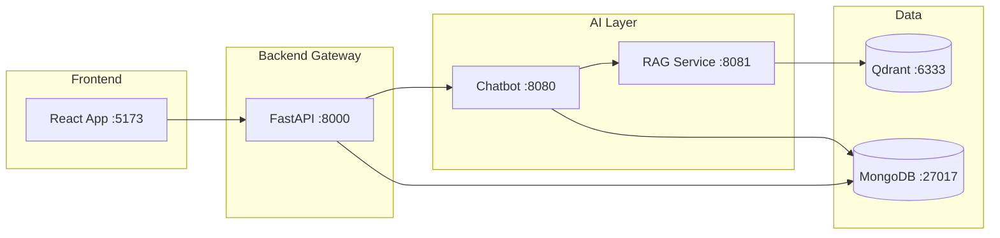

# Services Documentation

Detailed technical documentation for each microservice in the TFG-Chatbot architecture.

## Architecture Overview

## Microservices

### 📁 Backend Gateway Service

**Main API gateway with authentication, authorization, and request routing.**

- **Port**: 8000
- **Documentation**: [backend/](backend/)
- **Quick Start**: [backend/README.md](backend/README.md)
- **Navigation Guide**: [backend/NAVIGATION.md](backend/NAVIGATION.md)

| Document | Description |
|----------|-------------|
| [README](backend/README.md) | Overview and quick start |
| [Architecture](backend/architecture.md) | System design |
| [API Endpoints](backend/api-endpoints.md) | 30+ endpoint reference |
| [Authentication](backend/authentication.md) | JWT, RBAC, security |
| [Configuration](backend/configuration.md) | Environment variables |
| [Database](backend/database.md) | MongoDB schema |
| [Development](backend/development.md) | Local setup |
| [Deployment](backend/deployment.md) | Production deployment |

---

### 📁 Chatbot Service (NEW!)

**LangGraph-powered AI conversational agent with RAG and interactive tests.**

- **Port**: 8080
- **Documentation**: [chatbot/](chatbot/)
- **Quick Start**: [chatbot/README.md](chatbot/README.md)

| Document | Description |
|----------|-------------|
| [README](chatbot/README.md) | Overview and quick start |
| [Architecture](chatbot/architecture.md) | System design |
| [API Endpoints](chatbot/api-endpoints.md) | Chat, test, analytics APIs |
| [Configuration](chatbot/configuration.md) | LLM providers, MongoDB |
| [LangGraph Agent](chatbot/langgraph.md) | State machine, nodes, flows |
| [Tools](chatbot/tools.md) | RAG, guias, test generation |
| [Development](chatbot/development.md) | Local setup, testing |
| [Deployment](chatbot/deployment.md) | Docker, production |
| [INDEX](chatbot/INDEX.md) | Complete documentation index |

**Key Features**:
- 🧠 Multi-LLM support (Gemini, Mistral, vLLM)
- 📚 RAG integration for document search
- 📖 Teaching guide (guía docente) retrieval
- 📝 Interactive test sessions with interrupts
- 📊 Student profile tracking
- 🔍 Phoenix observability + Prometheus metrics

---

### � Frontend Service (NEW!)

**React 19 + TypeScript + Vite user interface with role-based access.**

- **Port**: 5173 (dev) / 80 (prod)
- **Documentation**: [frontend/](frontend/)
- **Quick Start**: [frontend/README.md](frontend/README.md)

| Document | Description |
|----------|-------------|
| [README](frontend/README.md) | Overview and quick start |
| [Architecture](frontend/architecture.md) | Component structure, data flow |
| [Components](frontend/components.md) | UI, chat, dashboard components |
| [State Management](frontend/state-management.md) | Context, hooks, TanStack Query |
| [Routing](frontend/routing.md) | Routes, guards, navigation |
| [Configuration](frontend/configuration.md) | Vite, TypeScript, Tailwind |
| [Development](frontend/development.md) | Local setup, testing |
| [Deployment](frontend/deployment.md) | Docker, nginx, production |
| [INDEX](frontend/INDEX.md) | Complete documentation index |

**Key Features**:
- ⚛️ React 19 with concurrent features
- 🎨 Tailwind CSS 4 + shadcn/ui components
- 🔐 Role-based routing (student/professor/admin)
- 💬 Real-time chat with markdown rendering
- 📊 Professor dashboard with analytics
- 🔧 Admin panel for user/subject management

---

### 📄 RAG Service (NEW!)

**Document processing and semantic search with Qdrant and Ollama embeddings.**

- **Port**: 8081
- **Documentation**: [rag_service/](rag_service/)
- **Quick Start**: [rag_service/README.md](rag_service/README.md)

| Document | Description |
|----------|-------------|
| [README](rag_service/README.md) | Overview and quick start |
| [Architecture](rag_service/architecture.md) | System design and data flow |
| [API Endpoints](rag_service/api-endpoints.md) | Complete API reference |
| [Embeddings](rag_service/embeddings.md) | Ollama embedding service |
| [Vector Store](rag_service/vector-store.md) | Qdrant integration |
| [Document Processing](rag_service/document-processing.md) | Chunking and file loading |
| [Configuration](rag_service/configuration.md) | Environment variables |
| [Development](rag_service/development.md) | Local setup and testing |
| [Deployment](rag_service/deployment.md) | Docker and production |
| [INDEX](rag_service/INDEX.md) | Complete documentation index |

**Key Features**:
- 🔍 Semantic search with Qdrant vector database
- 🔢 Embedding generation via Ollama (nomic-embed-text)
- 📄 Document upload and indexing (PDF, TXT, MD)
- 🧩 Automatic text chunking for optimal retrieval
- 📊 Prometheus metrics instrumentation
- 🗂️ Subject-based document organization

---

### 🏗️ Infrastructure (NEW!)

**Docker orchestration, monitoring, logging, alerting, and CI/CD pipelines.**

- **Documentation**: [infrastructure/](infrastructure/)
- **Quick Start**: [infrastructure/README.md](infrastructure/README.md)

| Document | Description |
|----------|-------------|
| [README](infrastructure/README.md) | Overview and architecture |
| [Docker Compose](infrastructure/docker-compose.md) | Service orchestration (15+ services) |
| [Monitoring](infrastructure/monitoring.md) | Prometheus, Grafana dashboards |
| [Logging](infrastructure/logging.md) | Loki, Promtail log aggregation |
| [Alerting](infrastructure/alerting.md) | Alertmanager rules and routing |
| [CI/CD](infrastructure/ci-cd.md) | GitHub Actions pipelines |
| [INDEX](infrastructure/INDEX.md) | Complete documentation index |

**Key Components**:
- 🐳 Docker Compose with 15+ services
- 📈 Prometheus metrics collection
- 📊 Grafana dashboards (system health, logs)
- 📜 Loki + Promtail centralized logging
- 🚨 Alertmanager with alert rules
- 🔄 GitHub Actions (lint, test, build, security, release)
- 🔬 Phoenix for LLM observability

---

## Documentation Status

| Service | Status | Docs |
|---------|--------|------|
| Backend | ✅ Complete | 11 files |
| Chatbot | ✅ Complete | 9 files |
| Frontend | ✅ Complete | 8 files |
| RAG Service | ✅ Complete | 10 files |
| Infrastructure | ✅ Complete | 7 files |

## Quick Links

### For Developers

- [Backend Development](backend/development.md)
- [Chatbot Development](chatbot/development.md)
- [Frontend Development](frontend/development.md)
- [Adding New Tools](chatbot/tools.md#adding-new-tools)

### For DevOps

- [Backend Deployment](backend/deployment.md)
- [Chatbot Deployment](chatbot/deployment.md)
- [Frontend Deployment](frontend/deployment.md)
- [Configuration Reference](backend/configuration.md)

### For API Consumers

- [Backend API Reference](backend/api-endpoints.md)
- [Chatbot API Reference](chatbot/api-endpoints.md)
