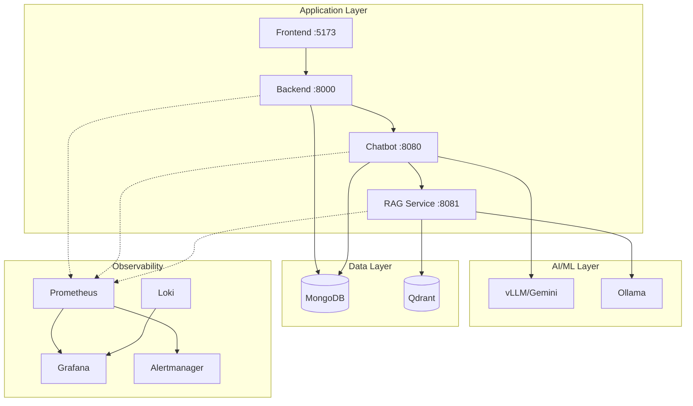

# Infrastructure Documentation

Quick navigation for infrastructure documentation.

## Contents

| Document | Description |
|----------|-------------|
| [README](README.md) | Overview and architecture |
| [Docker Compose](docker-compose.md) | Service orchestration and configuration |
| [Monitoring](monitoring.md) | Prometheus and Grafana setup |
| [Logging](logging.md) | Loki and Promtail log aggregation |
| [Alerting](alerting.md) | Alertmanager configuration |
| [CI/CD](ci-cd.md) | GitHub Actions pipelines |

## Quick Reference

### Common Commands

```bash
# Start all services
docker compose up -d

# View logs
docker compose logs -f chatbot backend rag_service

# Restart service
docker compose restart chatbot

# Check status
docker compose ps
```

### URLs

| Service | URL | Purpose |
|---------|-----|---------|
| Frontend | http://localhost:5173 | Web application |
| Backend API | http://localhost:8000 | Gateway API |
| Grafana | http://localhost:3001 | Dashboards |
| Prometheus | http://localhost:9093 | Metrics |
| Alertmanager | http://localhost:9094 | Alerts |
| Loki | http://localhost:3100 | Logs |
| Phoenix | http://localhost:6006 | LLM traces |

### Key Files

| File | Purpose |
|------|---------|
| `docker-compose.yml` | Service definitions |
| `prometheus.yml` | Metrics scraping config |
| `promtail-config.yml` | Log collection config |
| `alertmanager/` | Alert rules and routing |
| `grafana/provisioning/` | Dashboards and datasources |
| `.github/workflows/` | CI/CD pipelines |

## Architecture Diagram



---

[← Back to Services](../index.md)
