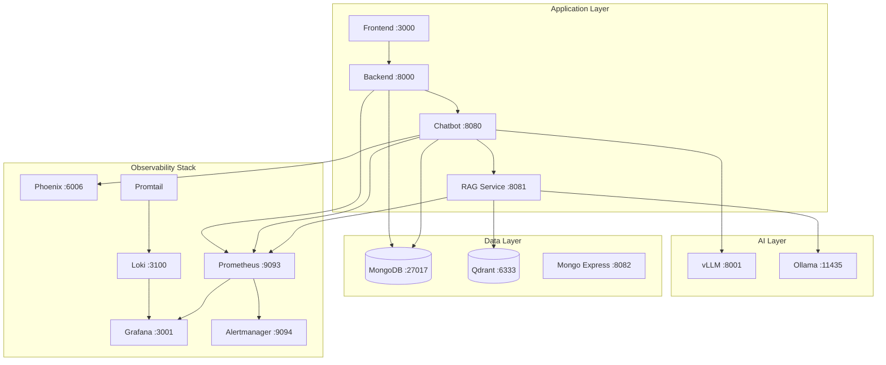

# Infrastructure Documentation

This documentation covers the infrastructure components of the TFG-Chatbot platform, including Docker orchestration, monitoring, logging, alerting, and CI/CD pipelines.

## Overview

The TFG-Chatbot uses a containerized microservices architecture with comprehensive observability:

| Category | Components |
|----------|------------|
| **Orchestration** | Docker Compose |
| **Databases** | MongoDB, Qdrant |
| **Monitoring** | Prometheus, Grafana |
| **Logging** | Loki, Promtail |
| **Alerting** | Alertmanager |
| **LLM Observability** | Phoenix (Arize AI) |
| **CI/CD** | GitHub Actions |

## Architecture Diagram



## Services Overview

### Application Services

| Service | Container | Port | Description |
|---------|-----------|------|-------------|
| Frontend | tfg-frontend | 3000 | React SPA with nginx |
| Backend | tfg-gateway | 8000 | FastAPI gateway |
| Chatbot | tfg-chatbot | 8080 | LangGraph agent |
| RAG Service | rag_service | 8081 | Document search |

### AI Services

| Service | Container | Port | Description |
|---------|-----------|------|-------------|
| vLLM | vllm-service | 8001 | GPU-accelerated LLM inference |
| Ollama | ollama-service | 11435 | Embedding generation |

### Data Services

| Service | Container | Port | Description |
|---------|-----------|------|-------------|
| MongoDB | mongo | 27017 | Document database |
| Mongo Express | mongo-express | 8082 | MongoDB web UI |
| Qdrant | qdrant-service | 6333/6334 | Vector database |

### Observability Services

| Service | Container | Port | Description |
|---------|-----------|------|-------------|
| Prometheus | prometheus | 9093 | Metrics collection |
| Grafana | grafana | 3001 | Visualization dashboards |
| Loki | loki | 3100 | Log aggregation |
| Promtail | promtail | 9080 | Log collection |
| Alertmanager | alertmanager | 9094 | Alert routing |
| Phoenix | phoenix | 6006 | LLM observability |

## Quick Start

### Start All Services

```bash
# Start everything
docker compose up -d

# View logs
docker compose logs -f

# Check status
docker compose ps
```

### Start Minimal Stack

```bash
# Start only core services (no vLLM, no monitoring)
docker compose up -d mongo qdrant ollama rag_service chatbot backend frontend
```

### Start Monitoring Stack

```bash
# Start observability services
docker compose up -d prometheus grafana loki promtail alertmanager phoenix
```

## Environment Configuration

Create a `.env` file from the example:

```bash
cp .env.example .env
```

Key variables:

| Variable | Description | Default |
|----------|-------------|---------|
| `LLM_PROVIDER` | LLM backend (vllm/gemini/mistral) | `mistral` |
| `SECRET_KEY` | JWT signing key | - |
| `MONGO_ROOT_PASSWORD` | MongoDB password | `example` |
| `GRAFANA_ADMIN_PASSWORD` | Grafana admin password | `admin` |
| `PHOENIX_ENABLED` | Enable LLM tracing | `true` |

## Resource Requirements

### Minimum (Development)

- **CPU**: 4 cores
- **RAM**: 8 GB
- **Disk**: 20 GB

### Recommended (Production with vLLM)

- **CPU**: 8+ cores
- **RAM**: 32 GB
- **GPU**: NVIDIA with 8+ GB VRAM
- **Disk**: 100 GB SSD

## Volumes

Persistent data is stored in Docker volumes:

| Volume | Service | Purpose |
|--------|---------|---------|
| `mongodb_data` | MongoDB | Database files |
| `qdrant_storage` | Qdrant | Vector indices |
| `ollama_models` | Ollama | Downloaded models |
| `rag_documents` | RAG Service | Uploaded documents |
| `vllm_cache` | vLLM | Model cache |
| `phoenix_data` | Phoenix | Trace data |
| `prometheus_data` | Prometheus | Metrics |
| `loki_data` | Loki | Logs |
| `grafana_data` | Grafana | Dashboards |

## Documentation Index

- [Docker Compose](docker-compose.md) - Container orchestration details
- [Monitoring](monitoring.md) - Prometheus and Grafana setup
- [Logging](logging.md) - Loki and Promtail configuration
- [Alerting](alerting.md) - Alertmanager and alert rules
- [CI/CD](ci-cd.md) - GitHub Actions workflows

## Related Documentation

- [Backend Deployment](../backend/deployment.md)
- [Chatbot Deployment](../chatbot/deployment.md)
- [Frontend Deployment](../frontend/deployment.md)
- [Services Overview](../index.md)

---

*This documentation is part of the TFG Chatbot project - a dual degree thesis (Computer Science + Mathematics) at the University of Granada.*
