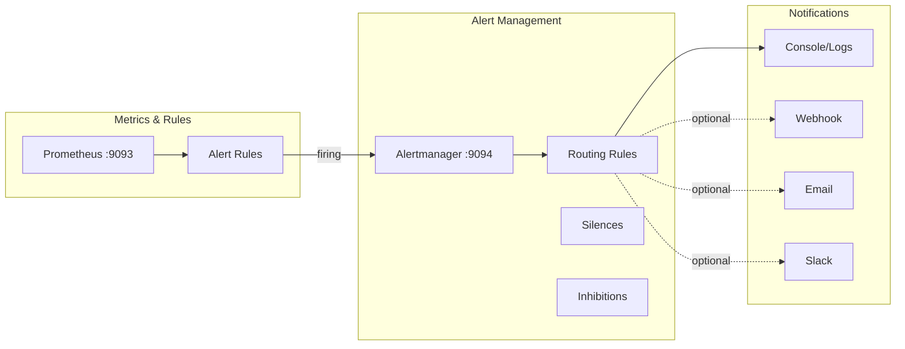
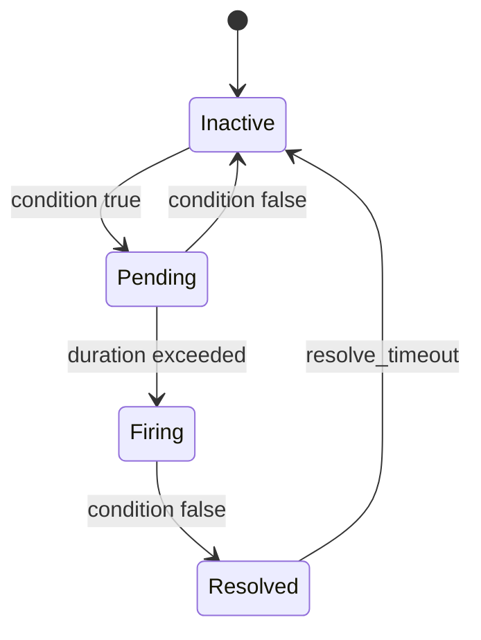

# Alerting with Alertmanager

This document describes the alerting infrastructure using Prometheus Alertmanager for alert routing, grouping, and notification management.

## Architecture



## Components

### Prometheus Alert Rules

Alert rules are defined in `alertmanager/alert_rules.yml` and loaded by Prometheus.

```yaml
# alert_rules.yml
groups:
  - name: ServiceAlerts
    rules:
      # Service availability
      - alert: ServiceDown
        expr: up == 0
        for: 1m
        labels:
          severity: critical
        annotations:
          summary: "Service {{ $labels.job }} is down"
          description: "The {{ $labels.job }} service has been down for more than 1 minute."

      # High error rate
      - alert: HighErrorRate
        expr: rate(http_requests_total{status=~"5.."}[5m]) / rate(http_requests_total[5m]) > 0.01
        for: 5m
        labels:
          severity: warning
        annotations:
          summary: "High error rate on {{ $labels.job }}"
          description: "Error rate is {{ $value | humanizePercentage }} over the last 5 minutes."

      # High latency
      - alert: HighLatency
        expr: histogram_quantile(0.95, rate(http_request_duration_seconds_bucket[5m])) > 2
        for: 5m
        labels:
          severity: warning
        annotations:
          summary: "High latency on {{ $labels.job }}"
          description: "P95 latency is {{ $value | humanizeDuration }} over the last 5 minutes."
```

### Alertmanager Configuration

```yaml
# alertmanager/alertmanager.yml
global:
  resolve_timeout: 5m

route:
  group_by: ['alertname', 'job']
  group_wait: 30s
  group_interval: 5m
  repeat_interval: 3h
  receiver: 'console'
  
  routes:
    - match:
        severity: critical
      receiver: 'console'
      continue: true

receivers:
  - name: 'console'
    # Logs to Alertmanager console/logs
    # Add webhook_configs, email_configs, or slack_configs for notifications

inhibit_rules:
  - source_match:
      severity: 'critical'
    target_match:
      severity: 'warning'
    equal: ['alertname', 'job']
```

---

## Alert Rules Reference

### Current Alerts

| Alert | Condition | Duration | Severity |
|-------|-----------|----------|----------|
| `ServiceDown` | `up == 0` | 1m | critical |
| `HighErrorRate` | Error rate > 1% | 5m | warning |
| `HighLatency` | P95 > 2s | 5m | warning |

### Alert States



| State | Description |
|-------|-------------|
| **Inactive** | Alert condition not met |
| **Pending** | Condition met, waiting for `for` duration |
| **Firing** | Alert active, notifications sent |
| **Resolved** | Condition no longer met |

---

## Routing Configuration

### Route Matching

```yaml
route:
  # Root route (default)
  receiver: 'default'
  
  routes:
    # Critical alerts go to on-call
    - match:
        severity: critical
      receiver: 'on-call'
      
    # Warning alerts during business hours
    - match:
        severity: warning
      receiver: 'team'
      active_time_intervals:
        - business_hours
        
    # Specific service routing
    - match_re:
        job: 'chatbot|backend'
      receiver: 'app-team'
```

### Grouping

Group related alerts to reduce noise:

```yaml
route:
  group_by: ['alertname', 'job', 'severity']
  group_wait: 30s       # Wait before first notification
  group_interval: 5m    # Wait before adding to group
  repeat_interval: 3h   # Re-notify for ongoing alerts
```

---

## Notification Receivers

### Console (Default)

Current setup logs to Alertmanager console:

```bash
# View alert notifications
docker compose logs alertmanager
```

### Webhook (Custom Integration)

```yaml
receivers:
  - name: 'webhook'
    webhook_configs:
      - url: 'http://webhook-service:8080/alerts'
        send_resolved: true
        http_config:
          basic_auth:
            username: 'alertmanager'
            password_file: '/etc/alertmanager/secrets/webhook_password'
```

### Email

```yaml
receivers:
  - name: 'email'
    email_configs:
      - to: 'team@example.com'
        from: 'alertmanager@example.com'
        smarthost: 'smtp.example.com:587'
        auth_username: 'alertmanager@example.com'
        auth_password: '$SMTP_PASSWORD'
        send_resolved: true
```

### Slack

```yaml
receivers:
  - name: 'slack'
    slack_configs:
      - api_url: 'https://hooks.slack.com/services/xxx/yyy/zzz'
        channel: '#alerts'
        send_resolved: true
        title: '{{ .Status | toUpper }}: {{ .CommonAnnotations.summary }}'
        text: '{{ .CommonAnnotations.description }}'
```

---

## Managing Alerts

### View Active Alerts

**Prometheus UI:**
```
http://localhost:9093/alerts
```

**Alertmanager UI:**
```
http://localhost:9094/#/alerts
```

### Silence Alerts

Create silences for maintenance windows:

**Via UI:**
1. Go to http://localhost:9094/#/silences
2. Click "New Silence"
3. Add matchers (e.g., `alertname="ServiceDown"`, `job="backend"`)
4. Set duration
5. Add comment

**Via API:**
```bash
curl -X POST http://localhost:9094/api/v2/silences \
  -H "Content-Type: application/json" \
  -d '{
    "matchers": [
      {"name": "alertname", "value": "ServiceDown", "isRegex": false}
    ],
    "startsAt": "2024-01-15T10:00:00Z",
    "endsAt": "2024-01-15T12:00:00Z",
    "createdBy": "admin",
    "comment": "Planned maintenance"
  }'
```

### Inhibition Rules

Suppress alerts when related critical alert is firing:

```yaml
inhibit_rules:
  # If ServiceDown is firing, suppress HighErrorRate and HighLatency
  - source_match:
      alertname: ServiceDown
    target_match_re:
      alertname: 'HighErrorRate|HighLatency'
    equal: ['job']
```

---

## Custom Alert Rules

### Adding New Rules

1. Edit `alertmanager/alert_rules.yml`
2. Add rule to appropriate group
3. Reload Prometheus:
   ```bash
   curl -X POST http://localhost:9093/-/reload
   ```

### Rule Syntax

```yaml
- alert: AlertName
  expr: prometheus_query > threshold
  for: duration
  labels:
    severity: critical|warning|info
    team: backend|frontend|infra
  annotations:
    summary: "Short description with {{ $labels.job }}"
    description: "Detailed description with {{ $value }}"
    runbook_url: "https://wiki.example.com/runbooks/AlertName"
```

### Common Patterns

**Memory Usage:**
```yaml
- alert: HighMemoryUsage
  expr: |
    (container_memory_usage_bytes / container_spec_memory_limit_bytes) * 100 > 90
  for: 5m
  labels:
    severity: warning
  annotations:
    summary: "High memory usage on {{ $labels.container }}"
```

**Request Rate Drop:**
```yaml
- alert: LowTraffic
  expr: |
    rate(http_requests_total[5m]) < 1
  for: 10m
  labels:
    severity: info
  annotations:
    summary: "Low traffic on {{ $labels.job }}"
```

**Database Connection Issues:**
```yaml
- alert: DatabaseConnectionFailure
  expr: |
    mongodb_up == 0
  for: 1m
  labels:
    severity: critical
  annotations:
    summary: "MongoDB connection lost"
```

---

## Testing Alerts

### Manually Trigger Alert

1. Create test rule:
   ```yaml
   - alert: TestAlert
     expr: vector(1)
     labels:
       severity: info
     annotations:
       summary: "Test alert"
   ```

2. Add to rules file and reload

3. Check alert fires in Prometheus/Alertmanager

4. Remove test rule when done

### Validate Rules

```bash
# Using promtool (requires Prometheus installed)
docker compose exec prometheus promtool check rules /etc/prometheus/alert_rules.yml

# Check Prometheus config
docker compose exec prometheus promtool check config /etc/prometheus/prometheus.yml
```

---

## Alerting on Logs

While Alertmanager works with Prometheus metrics, you can also alert on log patterns:

### Using Loki Recording Rules

```yaml
# In Loki config
ruler:
  alertmanager_url: http://alertmanager:9094
  
  rule_files:
    - /etc/loki/rules/*.yml
```

### Log-based Alert Rule

```yaml
# loki-rules.yml
groups:
  - name: LogAlerts
    rules:
      - alert: HighErrorLogRate
        expr: |
          sum(rate({project="tfg-chatbot"} |= "ERROR" [5m])) > 10
        for: 5m
        labels:
          severity: warning
        annotations:
          summary: "High rate of error logs"
```

---

## Grafana Integration

### Alert Annotations

View alerts as annotations on Grafana dashboards:

1. Dashboard Settings → Annotations
2. Add annotation query from Alertmanager
3. Alerts appear as vertical lines on panels

### Alert Panel

Add alert status panel:

```json
{
  "title": "Active Alerts",
  "type": "alertlist",
  "datasource": "Alertmanager",
  "options": {
    "alertInstanceLabelFilter": "job=~\"backend|chatbot|rag_service\"",
    "alertName": "",
    "dashboardAlerts": false,
    "groupBy": ["alertname"],
    "stateFilter": {
      "firing": true,
      "pending": true
    }
  }
}
```

---

## Best Practices

### Alert Design

1. **Alert on symptoms, not causes**
   - Good: "API error rate > 1%"
   - Avoid: "CPU > 90%" (unless it causes issues)

2. **Include runbook links**
   - Add `runbook_url` annotation
   - Document troubleshooting steps

3. **Appropriate severity**
   - `critical`: Immediate action required
   - `warning`: Investigate soon
   - `info`: Informational, no action

4. **Meaningful names**
   - Descriptive alert names
   - Include service/component

### Reducing Noise

1. **Tune thresholds** based on baseline
2. **Use appropriate `for` duration**
3. **Group related alerts**
4. **Implement inhibition rules**
5. **Review and refine regularly**

---

## Troubleshooting

### Alerts Not Firing

1. Check rule in Prometheus:
   ```
   http://localhost:9093/rules
   ```

2. Evaluate expression manually:
   ```
   http://localhost:9093/graph?g0.expr=up==0
   ```

3. Check for syntax errors:
   ```bash
   docker compose logs prometheus | grep "rule"
   ```

### Notifications Not Sent

1. Check Alertmanager logs:
   ```bash
   docker compose logs alertmanager
   ```

2. Verify routing matches:
   ```
   http://localhost:9094/#/status
   ```

3. Test receiver connectivity:
   ```bash
   curl -X POST http://localhost:9094/api/v2/alerts \
     -H "Content-Type: application/json" \
     -d '[{"labels":{"alertname":"test"}}]'
   ```

---

## Related Documentation

- [Monitoring](monitoring.md) - Prometheus metrics
- [Logging](logging.md) - Loki log aggregation
- [Docker Compose](docker-compose.md) - Service configuration
