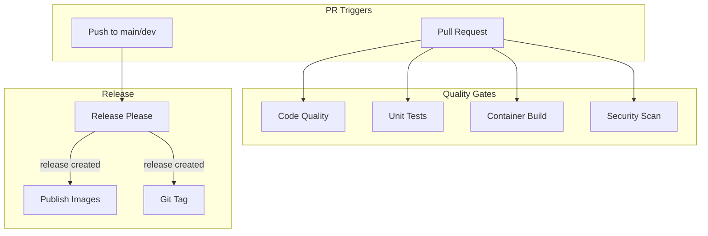
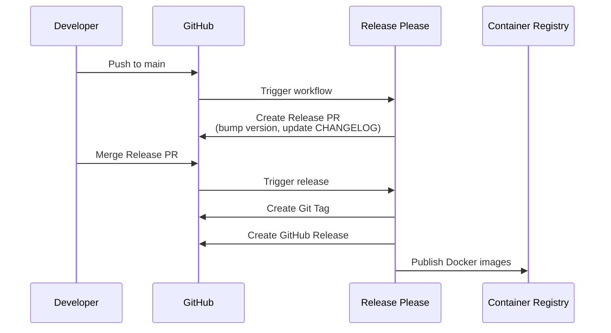

# CI/CD with GitHub Actions

This document describes the Continuous Integration and Continuous Deployment pipelines implemented with GitHub Actions.

## Overview



## Workflows

| Workflow | File | Trigger | Purpose |
|----------|------|---------|---------|
| PR Checks | `ci.yml` | PR to main/dev | Information summary |
| Code Quality | `lint.yml` | PR/Push | Linting, formatting |
| Unit Tests | `unit-tests.yml` | PR/Push (path-filtered) | Service tests |
| Build Containers | `build-containers.yml` | PR/Push (path-filtered) | Docker validation |
| Security | `security.yml` | PR/Push + weekly | Vulnerability scanning |
| Release Please | `release-please.yml` | Push to main | Automated releases |
| Jekyll | `jekyll.yml` | Push to main | Documentation site |

---

## Code Quality (`lint.yml`)

Validates code formatting and style across Python and TypeScript.

### Python Checks

```yaml
jobs:
  lint-python:
    steps:
      - name: Ruff check
        run: ruff check . --output-format=github
        
      - name: Black check
        run: black --check --diff .
        
      - name: isort check
        run: isort --check --diff .
        
      - name: Type check with mypy
        run: mypy backend/ rag_service/
        continue-on-error: true  # Non-blocking
```

### Frontend Checks

```yaml
jobs:
  lint-frontend:
    working-directory: frontend
    steps:
      - name: Biome lint
        run: npx @biomejs/biome lint .
        
      - name: Biome format check
        run: npx @biomejs/biome format . --write
        
      - name: TypeScript check
        run: npx tsc --noEmit
```

### Tools Used

| Tool | Language | Purpose |
|------|----------|---------|
| **Ruff** | Python | Fast linter |
| **Black** | Python | Code formatter |
| **isort** | Python | Import sorting |
| **mypy** | Python | Type checker |
| **Biome** | TypeScript | Lint + format |
| **tsc** | TypeScript | Type checker |

### Running Locally

```bash
# Python
ruff check . && black --check . && isort --check .

# Frontend
cd frontend
npm run lint
npm run format:check
npm run typecheck
```

---

## Unit Tests (`unit-tests.yml`)

Path-filtered workflow that runs only when relevant files change.

### Change Detection

```yaml
jobs:
  changes:
    outputs:
      backend: ${{ steps.filter.outputs.backend }}
      rag_service: ${{ steps.filter.outputs.rag_service }}
      chatbot: ${{ steps.filter.outputs.chatbot }}
      frontend: ${{ steps.filter.outputs.frontend }}
```

### Path Filters

| Service | Trigger Paths |
|---------|---------------|
| Backend | `backend/**/*.py`, `backend/pyproject.toml`, `backend/tests/**` |
| RAG Service | `rag_service/**/*.py`, `rag_service/pyproject.toml` |
| Chatbot | `chatbot/**/*.py`, `chatbot/pyproject.toml` |
| Frontend | `frontend/**/*.ts`, `frontend/**/*.tsx`, `frontend/package.json` |

### Test Execution

```yaml
unit-tests-backend:
  needs: changes
  if: needs.changes.outputs.backend == 'true'
  steps:
    - uses: actions/setup-python@v6
      with:
        python-version: '3.13'
        
    - run: pip install "./backend[dev]"
    
    - name: Run tests
      run: |
        cd backend
        pytest tests/ -v --tb=short \
          --cov=. --cov-report=xml --cov-report=term
          
    - uses: codecov/codecov-action@v5
      with:
        flags: backend
```

### Coverage Reporting

Coverage reports are uploaded to [Codecov](https://codecov.io) with service-specific flags:
- `backend`
- `rag-service`
- `chatbot`
- `frontend`

### Running Locally

```bash
# Backend
cd backend && pytest tests/ -v --cov=.

# RAG Service
cd rag_service && pytest tests/ -m "not integration" -v

# Chatbot
cd chatbot && pytest tests/ -v

# Frontend
cd frontend && npm test
```

---

## Container Builds (`build-containers.yml`)

Validates Docker images build correctly and can start.

### Build Jobs

```yaml
build-backend:
  steps:
    - uses: docker/setup-buildx-action@v3
    
    - uses: docker/build-push-action@v6
      with:
        context: .
        file: ./backend/Dockerfile
        push: false
        load: true
        tags: tfg-backend:test
        cache-from: type=gha
        cache-to: type=gha,mode=max
        build-args: |
          INSTALL_DEV=true

    - name: Test image can run
      run: |
        docker run -d -e GEMINI_API_KEY=test tfg-backend:test
        sleep 5
        docker logs "$CONTAINER_ID"
```

### Services Validated

| Service | Dockerfile | Test |
|---------|------------|------|
| Backend | `backend/Dockerfile` | Container starts, uvicorn runs |
| RAG Service | `rag_service/Dockerfile` | Container starts |
| Chatbot | `chatbot/Dockerfile` | Container starts |
| Frontend | `frontend/Dockerfile` | Build succeeds, nginx ready |

### Build Caching

Uses GitHub Actions cache for faster builds:

```yaml
cache-from: type=gha
cache-to: type=gha,mode=max
```

---

## Security Scanning (`security.yml`)

Scans dependencies for known vulnerabilities.

### Schedule

- On PR/Push when dependency files change
- Weekly on Mondays at 8 AM (cron: `0 8 * * 1`)
- Manual trigger via `workflow_dispatch`

### pip-audit Scan

```yaml
security-scan-backend:
  steps:
    - run: pip install pip-audit
    
    - name: Install dependencies
      run: pip install ./backend
      
    - name: Run pip-audit
      run: |
        pip-audit --format=json --output=audit-backend.json || true
        
    - name: Check for critical vulnerabilities
      run: |
        if [ -f audit-backend.json ]; then
          CRITICAL=$(cat audit-backend.json | jq '[.[] | select(.vulnerability.severity == "CRITICAL")] | length')
          if [ "$CRITICAL" -gt 0 ]; then
            echo "❌ Found $CRITICAL critical vulnerabilities!"
            exit 1
          fi
        fi
```

### Services Scanned

- Backend (`backend/pyproject.toml`)
- RAG Service (`rag_service/pyproject.toml`)
- Chatbot (`chatbot/pyproject.toml`)

### Failure Criteria

- **Fail**: Critical vulnerabilities found
- **Warn**: Non-critical vulnerabilities (informational)

---

## Release Please (`release-please.yml`)

Automates semantic versioning and changelog generation.

### How It Works



### Configuration

```json
// release-please-config.json
{
  "$schema": "https://raw.githubusercontent.com/googleapis/release-please/main/schemas/config.json",
  "packages": {
    ".": {
      "release-type": "python",
      "changelog-path": "CHANGELOG.md",
      "bump-minor-pre-major": true,
      "bump-patch-for-minor-pre-major": true
    }
  }
}
```

### Commit Convention

Uses [Conventional Commits](https://conventionalcommits.org):

| Prefix | Version Bump | Example |
|--------|--------------|---------|
| `feat:` | Minor | `feat: add test generation` |
| `fix:` | Patch | `fix: resolve auth bug` |
| `feat!:` or `BREAKING CHANGE:` | Major | `feat!: new API` |
| `chore:`, `docs:`, `style:` | None | `docs: update README` |

### Docker Image Publishing

On release, images are published to GitHub Container Registry:

```yaml
build-and-publish:
  needs: release-please
  if: needs.release-please.outputs.release_created == 'true'
  steps:
    - uses: docker/login-action@v3
      with:
        registry: ghcr.io
        username: ${{ github.actor }}
        password: ${{ secrets.GITHUB_TOKEN }}
        
    - uses: docker/build-push-action@v6
      with:
        push: true
        tags: |
          ghcr.io/${{ github.repository }}/backend:${{ version }}
          ghcr.io/${{ github.repository }}/backend:latest
```

---

## PR Checks Summary (`ci.yml`)

Informational workflow that provides PR context.

### Features

- Shows which checks will run
- Generates step summary with local run commands
- Provides visibility into automated checks

### Step Summary

```markdown
## 📊 PR Check Information

### Automated Checks
- **Code Quality**: Ruff, Black, isort, mypy
- **Unit Tests**: Backend, RAG Service and Chatbot
- **Container Builds**: Docker image validation

### 🔍 Run locally:
```bash
# Format and lint
ruff check . && black --check . && isort --check .

# Unit tests
pytest backend/tests/ -m unit
pytest rag_service/tests/ -m unit
pytest chatbot/tests/ -m unit
```
```

---

## Concurrency Control

Prevents duplicate workflow runs:

```yaml
concurrency:
  group: ${{ github.workflow }}-${{ github.event.pull_request.number || github.ref }}
  cancel-in-progress: true
```

Benefits:
- Cancels in-progress runs when new commits pushed
- Saves CI minutes
- Always runs latest code

---

## Caching Strategy

### Python Dependencies

```yaml
- uses: actions/cache@v5
  with:
    path: ~/.cache/pip
    key: ${{ runner.os }}-pip-backend-${{ hashFiles('backend/pyproject.toml') }}
    restore-keys: |
      ${{ runner.os }}-pip-backend-
```

### Node.js Dependencies

```yaml
- uses: actions/setup-node@v6
  with:
    node-version: '22'
    cache: 'npm'
    cache-dependency-path: frontend/package-lock.json
```

### Docker Layers

```yaml
cache-from: type=gha
cache-to: type=gha,mode=max
```

---

## Required Status Checks

Recommended branch protection rules for `main`:

1. **Required checks:**
   - `Python Lint and Format`
   - `Frontend Lint and Type Check`
   - `Backend Unit Tests` (when backend changes)
   - `Build Backend Container` (when backend changes)

2. **Settings:**
   - Require branches to be up to date
   - Require signed commits (optional)
   - Dismiss stale reviews on new commits

---

## Troubleshooting

### Tests Not Running

Check path filters match your changes:
```bash
# See what paths trigger backend tests
grep -A10 "backend:" .github/workflows/unit-tests.yml
```

### Cache Not Working

Clear cache manually:
1. Actions → Caches
2. Delete relevant cache entries
3. Re-run workflow

### Docker Build Fails

```bash
# Reproduce locally
docker build -f backend/Dockerfile -t test . --build-arg INSTALL_DEV=true
```

### Security Scan False Positives

Check if vulnerability is relevant:
```bash
pip-audit --ignore-vuln PYSEC-2023-XXX
```

---

## Adding New Workflows

1. Create `.github/workflows/new-workflow.yml`
2. Define triggers and jobs
3. Test on feature branch
4. Update this documentation

### Template

```yaml
name: New Workflow

on:
  pull_request:
    branches: [ main, development ]
    paths:
      - 'relevant/paths/**'

jobs:
  job-name:
    runs-on: ubuntu-latest
    steps:
      - uses: actions/checkout@v6
      - name: Run step
        run: echo "Hello"
```

---

## Related Documentation

- [Docker Compose](docker-compose.md) - Local development
- [Monitoring](monitoring.md) - Production observability
- [Alerting](alerting.md) - Alert configuration
