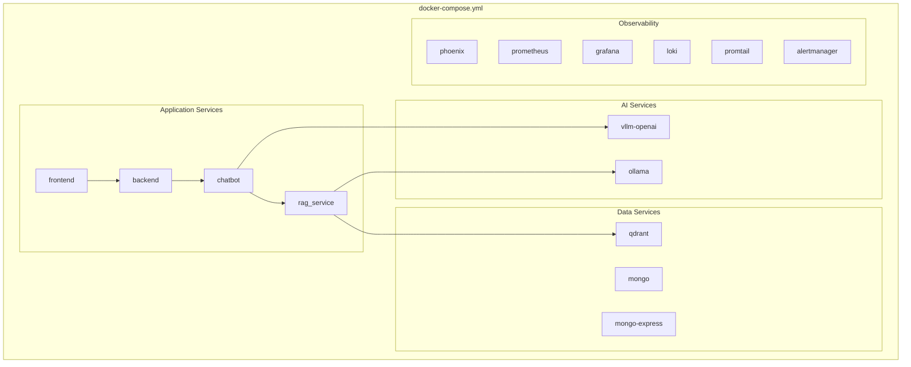
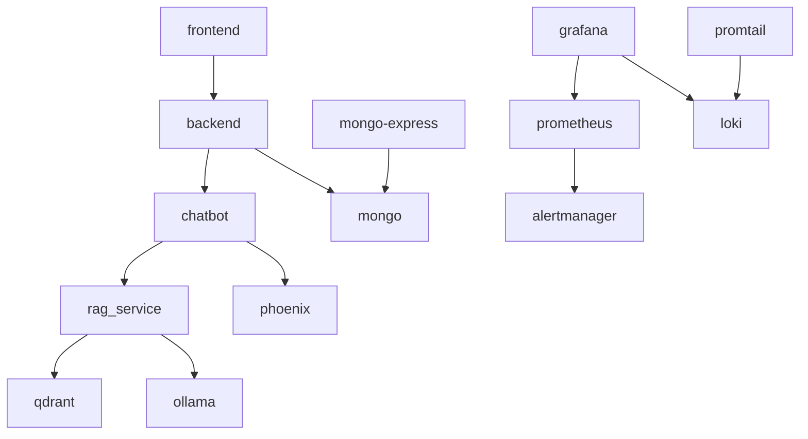

# Docker Compose Configuration

This document details the Docker Compose configuration for the TFG-Chatbot platform.

## Overview

The `docker-compose.yml` defines all services, networks, and volumes for the platform. Services are organized into logical groups.



## Service Definitions

### Application Services

#### Frontend

```yaml
frontend:
  build:
    context: .
    dockerfile: frontend/Dockerfile
    args:
      VITE_API_URL: ${VITE_API_URL:-/api}
  container_name: tfg-frontend
  ports:
    - "3000:80"
  depends_on:
    - backend
  restart: unless-stopped
```

**Key Points:**
- Builds from `frontend/Dockerfile`
- Exposes port 3000 (nginx)
- Build-time environment variable for API URL
- Depends on backend being available

#### Backend

```yaml
backend:
  build:
    context: .
    dockerfile: backend/Dockerfile
    args:
      INSTALL_DEV: ${INSTALL_DEV:-false}
  container_name: tfg-gateway
  env_file:
    - .env
  ports:
    - "8000:8000"
  depends_on:
    - chatbot
    - mongo
  restart: unless-stopped
```

**Key Points:**
- Build context is project root (for shared dependencies)
- `INSTALL_DEV=true` installs test dependencies
- Loads all environment from `.env`
- Depends on chatbot and mongo

#### Chatbot

```yaml
chatbot:
  build:
    context: .
    dockerfile: chatbot/Dockerfile
    args:
      INSTALL_DEV: ${INSTALL_DEV:-false}
  container_name: tfg-chatbot
  env_file:
    - .env
  environment:
    VLLM_HOST: vllm-openai
    PHOENIX_HOST: phoenix
    PHOENIX_PORT: "6006"
    PHOENIX_PROJECT_NAME: tfg-chatbot
  ports:
    - "8080:8080"
  depends_on:
    - rag_service
    - phoenix
  restart: unless-stopped
```

**Key Points:**
- Environment variables override `.env` for Docker networking
- Phoenix integration for LLM observability
- Depends on RAG service and Phoenix

#### RAG Service

```yaml
rag_service:
  build:
    context: .
    dockerfile: rag_service/Dockerfile
    args:
      INSTALL_DEV: ${INSTALL_DEV:-false}
  container_name: rag-service
  env_file:
    - .env
  environment:
    QDRANT_HOST: qdrant
    OLLAMA_HOST: ollama
  ports:
    - "8081:8081"
  volumes:
    - rag_documents:/app/documents
  depends_on:
    - qdrant
    - ollama
  restart: unless-stopped
```

**Key Points:**
- Persistent volume for uploaded documents
- Connects to Qdrant for vectors, Ollama for embeddings
- Override hosts for Docker networking

### AI Services

#### vLLM (GPU Inference)

```yaml
vllm-openai:
  image: docker.io/vllm/vllm-openai:latest
  container_name: vllm-service
  deploy:
    resources:
      reservations:
        devices:
          - driver: nvidia
            device_ids: ['0']
            capabilities:
              - gpu
  volumes:
    - "./models:/models"
    - "vllm_cache:/root/.cache/vllm"
  env_file:
    - .env
  environment:
    HUGGING_FACE_HUB_TOKEN: ${HF_TOKEN}
    TORCH_CUDA_ARCH_LIST: "8.9"
  ports:
    - 8001:8000
  command: >
    --model ${MODEL_PATH}
    --max-num-seqs 4
    --max-model-len 2048
    --gpu-memory-utilization 0.6
    --port ${VLLM_MAIN_PORT}
    --tool-call-parser hermes
    --enable-auto-tool-choice
    --swap-space 3
  restart: unless-stopped
```

**Key Points:**
- Requires NVIDIA GPU with Docker GPU support
- Models mounted from `./models` directory
- Configurable memory utilization and context length
- Tool calling enabled for function calls

#### Ollama (Embeddings)

```yaml
ollama:
  image: docker.io/ollama/ollama:latest
  container_name: ollama-service
  ports:
    - "11435:11434"
  volumes:
    - ollama_models:/root/.ollama
  restart: unless-stopped
```

**Key Points:**
- Persistent volume for downloaded models
- External port 11435 to avoid conflicts
- Initialize embeddings model after startup:
  ```bash
  docker exec ollama-service ollama pull nomic-embed-text
  ```

### Data Services

#### MongoDB

```yaml
mongo:
  image: docker.io/mongo:8.0
  container_name: mongo
  restart: unless-stopped
  environment:
    MONGO_INITDB_ROOT_USERNAME: ${MONGO_ROOT_USERNAME}
    MONGO_INITDB_ROOT_PASSWORD: ${MONGO_ROOT_PASSWORD}
  ports:
    - "27017:27017"
  volumes:
    - mongodb_data:/data/db
  healthcheck:
    test: ["CMD", "mongo", "--eval", "db.runCommand(\"ping\").ok", "--quiet"]
    interval: 10s
    timeout: 5s
    retries: 5
```

**Key Points:**
- MongoDB 8.0 with authentication
- Health check for dependency ordering
- Persistent data volume

#### Mongo Express

```yaml
mongo-express:
  image: docker.io/mongo-express:1.0.0
  container_name: mongo-express
  restart: unless-stopped
  ports:
    - "8082:8081"
  environment:
    ME_CONFIG_MONGODB_ADMINUSERNAME: ${MONGO_ROOT_USERNAME}
    ME_CONFIG_MONGODB_ADMINPASSWORD: ${MONGO_ROOT_PASSWORD}
    ME_CONFIG_MONGODB_SERVER: ${MONGO_HOSTNAME:-mongo}
    ME_CONFIG_BASICAUTH_ENABLED: "${MONGO_EXPRESS_BASICAUTH_ENABLED:-true}"
    ME_CONFIG_BASICAUTH_USERNAME: ${MONGO_EXPRESS_BASICAUTH_USERNAME}
    ME_CONFIG_BASICAUTH_PASSWORD: ${MONGO_EXPRESS_BASICAUTH_PASSWORD}
  depends_on:
    - mongo
```

**Key Points:**
- Web-based MongoDB admin interface
- Optional basic auth protection
- Access at http://localhost:8082

#### Qdrant

```yaml
qdrant:
  image: docker.io/qdrant/qdrant:latest
  container_name: qdrant-service
  ports:
    - "6333:6333"  # HTTP API
    - "6334:6334"  # gRPC API
  volumes:
    - qdrant_storage:/qdrant/storage
  restart: unless-stopped
```

**Key Points:**
- Vector database for RAG
- HTTP and gRPC APIs exposed
- Persistent storage volume

### Observability Services

#### Phoenix (LLM Observability)

```yaml
phoenix:
  image: docker.io/arizephoenix/phoenix:latest
  container_name: phoenix
  ports:
    - "6006:6006"  # Web UI
    - "4317:4317"  # OTLP gRPC
  environment:
    PHOENIX_WORKING_DIR: /data
  volumes:
    - phoenix_data:/data
  restart: unless-stopped
```

**Key Points:**
- Arize Phoenix for LLM call tracing
- Web UI at http://localhost:6006
- OTLP endpoint for trace ingestion

#### Prometheus

```yaml
prometheus:
  image: docker.io/prom/prometheus:latest
  container_name: prometheus
  ports:
    - "9093:9090"
  volumes:
    - ./prometheus.yml:/etc/prometheus/prometheus.yml
    - ./alertmanager/alert_rules.yml:/etc/prometheus/alert_rules.yml
    - prometheus_data:/prometheus
  command:
    - '--config.file=/etc/prometheus/prometheus.yml'
    - '--storage.tsdb.path=/prometheus'
  healthcheck:
    test: ["CMD", "wget", "-q", "--spider", "http://localhost:9090/-/healthy"]
    interval: 10s
    timeout: 5s
    retries: 5
  restart: unless-stopped
```

**Key Points:**
- Metrics collection from all services
- Alert rules configuration
- Health check for Grafana dependency

#### Grafana

```yaml
grafana:
  image: docker.io/grafana/grafana:latest
  container_name: grafana
  ports:
    - "3001:3000"
  environment:
    GF_SECURITY_ADMIN_PASSWORD: ${GRAFANA_ADMIN_PASSWORD:-admin}
    GF_USERS_ALLOW_SIGN_UP: "false"
  volumes:
    - grafana_data:/var/lib/grafana
    - ./grafana/provisioning:/etc/grafana/provisioning
  depends_on:
    prometheus:
      condition: service_healthy
    loki:
      condition: service_started
  restart: unless-stopped
```

**Key Points:**
- Visualization dashboards
- Pre-provisioned datasources and dashboards
- Access at http://localhost:3001

#### Loki

```yaml
loki:
  image: docker.io/grafana/loki:latest
  container_name: loki
  ports:
    - "3100:3100"
  command: -config.file=/etc/loki/local-config.yaml
  volumes:
    - loki_data:/loki
  restart: unless-stopped
```

#### Promtail

```yaml
promtail:
  image: docker.io/grafana/promtail:latest
  container_name: promtail
  ports:
    - "9080:9080"
  volumes:
    - ./promtail-config.yml:/etc/promtail/config.yml
    - /var/lib/docker/containers:/var/lib/docker/containers:ro
    - /var/run/docker.sock:/var/run/docker.sock:ro
  command: -config.file=/etc/promtail/config.yml
  restart: unless-stopped
```

**Key Points:**
- Collects logs from Docker containers
- Requires access to Docker socket
- Forwards to Loki

#### Alertmanager

```yaml
alertmanager:
  image: docker.io/prom/alertmanager:latest
  container_name: alertmanager
  ports:
    - "9094:9093"
  volumes:
    - ./alertmanager/alertmanager.yml:/etc/alertmanager/alertmanager.yml
  command:
    - '--config.file=/etc/alertmanager/alertmanager.yml'
    - '--storage.path=/alertmanager'
  restart: unless-stopped
```

---

## Volumes

```yaml
volumes:
  mongodb_data:      # MongoDB data
  qdrant_storage:    # Qdrant vectors
  ollama_models:     # Ollama models
  rag_documents:     # RAG uploaded files
  vllm_cache:        # vLLM model cache
  phoenix_data:      # Phoenix traces
  prometheus_data:   # Prometheus metrics
  loki_data:         # Loki logs
  grafana_data:      # Grafana dashboards
```

---

## Common Commands

### Service Management

```bash
# Start all services
docker compose up -d

# Start specific services
docker compose up -d backend chatbot

# Stop all services
docker compose down

# Stop and remove volumes (CAUTION: data loss)
docker compose down -v

# Rebuild specific service
docker compose build --no-cache backend
docker compose up -d backend

# View logs
docker compose logs -f chatbot

# Execute command in container
docker exec -it tfg-chatbot bash
```

### Health Checks

```bash
# Check all service status
docker compose ps

# Check specific service health
docker inspect --format='{{.State.Health.Status}}' tfg-gateway

# Watch resource usage
docker stats
```

### Scaling (Development)

```bash
# Scale a service (not for stateful services)
docker compose up -d --scale rag_service=2
```

---

## Dependency Graph



**Startup Order:**
1. Data services: mongo, qdrant, ollama
2. Observability: phoenix, prometheus, loki, promtail, alertmanager
3. AI services: vllm-openai (if enabled)
4. Application: rag_service → chatbot → backend → frontend
5. Management UIs: mongo-express, grafana

---

## Profiles (Optional)

You can add profiles to selectively start services:

```yaml
# Example profile usage
services:
  vllm-openai:
    profiles: ["gpu"]
    # ... rest of config

  prometheus:
    profiles: ["monitoring"]
    # ... rest of config
```

```bash
# Start with specific profile
docker compose --profile monitoring up -d

# Start without GPU services
docker compose up -d  # vllm-openai won't start
```

---

## Environment Variables Reference

| Variable | Service | Default | Description |
|----------|---------|---------|-------------|
| `INSTALL_DEV` | all Python | `false` | Install dev dependencies |
| `VITE_API_URL` | frontend | `/api` | Backend API URL |
| `LLM_PROVIDER` | chatbot | - | LLM provider selection |
| `MONGO_ROOT_USERNAME` | mongo | `root` | MongoDB admin user |
| `MONGO_ROOT_PASSWORD` | mongo | `example` | MongoDB admin password |
| `GRAFANA_ADMIN_PASSWORD` | grafana | `admin` | Grafana admin password |
| `HF_TOKEN` | vllm | - | HuggingFace token |
| `MODEL_PATH` | vllm | - | Model path in container |

---

## Related Documentation

- [Monitoring](monitoring.md) - Prometheus and Grafana
- [Logging](logging.md) - Loki and Promtail
- [Alerting](alerting.md) - Alert rules and routing
