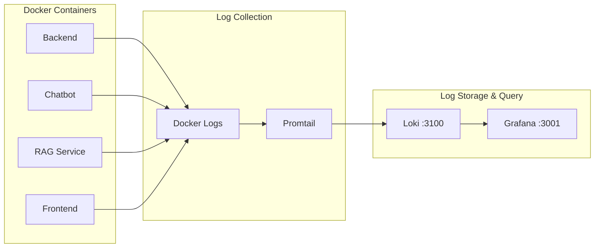

# Logging with Loki and Promtail

This document describes the centralized logging infrastructure using Grafana Loki for log aggregation and Promtail for log collection.

## Architecture



## Components

### Loki

Loki is a horizontally-scalable, highly-available log aggregation system inspired by Prometheus.

**Key Features:**
- Indexes labels only (not full log content)
- Uses same label model as Prometheus
- Efficient storage and querying

**Configuration:**

```yaml
# docker-compose.yml
loki:
  image: docker.io/grafana/loki:latest
  container_name: loki
  ports:
    - "3100:3100"
  command: -config.file=/etc/loki/local-config.yaml
  volumes:
    - loki_data:/loki
  restart: unless-stopped
```

### Promtail

Promtail is the log collector agent that ships logs to Loki.

**Configuration:**

```yaml
# promtail-config.yml
server:
  http_listen_port: 9080
  grpc_listen_port: 0

positions:
  filename: /tmp/positions.yaml

clients:
  - url: http://loki:3100/loki/api/v1/push

scrape_configs:
  # Scrape Docker container logs
  - job_name: docker
    static_configs:
      - targets:
          - localhost
        labels:
          job: docker
          __path__: /var/lib/docker/containers/*/*-json.log

    pipeline_stages:
      # Parse Docker JSON log format
      - json:
          expressions:
            log: log
            stream: stream
            time: time
      
      # Extract container info from file path
      - regex:
          source: filename
          expression: '/var/lib/docker/containers/(?P<container_id>[^/]+)/.*'
      
      # Set the log line as output
      - output:
          source: log

      # Add labels
      - labels:
          stream:
          container_id:

  # Docker Compose service discovery
  - job_name: docker-compose
    docker_sd_configs:
      - host: unix:///var/run/docker.sock
        refresh_interval: 5s
    relabel_configs:
      - source_labels: ['__meta_docker_container_id']
        target_label: container_id
      - source_labels: ['__meta_docker_container_name']
        regex: '/(.+)'
        target_label: container
      - source_labels: ['__meta_docker_container_log_stream']
        target_label: stream
      - source_labels: ['__meta_docker_container_label_com_docker_compose_service']
        target_label: service
      - source_labels: ['__meta_docker_container_label_com_docker_compose_project']
        target_label: project
```

---

## Label Structure

Promtail adds labels to each log line for efficient querying:

| Label | Source | Example |
|-------|--------|---------|
| `container` | Docker container name | `tfg-chatbot` |
| `container_id` | Docker container ID | `abc123...` |
| `service` | Docker Compose service | `chatbot` |
| `project` | Docker Compose project | `tfg-chatbot` |
| `stream` | Log stream | `stdout`, `stderr` |
| `job` | Promtail job name | `docker-compose` |

---

## Querying Logs in Grafana

### Access

1. Open Grafana: http://localhost:3001
2. Navigate to **Explore**
3. Select **Loki** datasource

### LogQL Query Language

LogQL is Loki's query language, similar to PromQL.

#### Basic Queries

```logql
# All logs from chatbot
{container="tfg-chatbot"}

# Logs from all services in project
{project="tfg-chatbot"}

# Error stream only
{container="tfg-chatbot", stream="stderr"}

# Multiple containers
{container=~"tfg-chatbot|tfg-backend|tfg-rag-service"}
```

#### Filtering Logs

```logql
# Contains text
{container="tfg-chatbot"} |= "error"

# Does not contain
{container="tfg-chatbot"} != "debug"

# Regex match
{container="tfg-chatbot"} |~ "ERROR|WARNING"

# Case insensitive
{container="tfg-chatbot"} |~ "(?i)exception"
```

#### JSON Parsing

```logql
# Parse JSON logs
{container="tfg-chatbot"} | json

# Extract specific field
{container="tfg-chatbot"} | json | level="ERROR"

# Filter by parsed field
{container="tfg-chatbot"} 
  | json 
  | duration > 1000
```

#### Log Metrics

```logql
# Count errors per minute
count_over_time({container="tfg-chatbot"} |= "error" [1m])

# Error rate
sum(rate({container="tfg-chatbot"} |= "error" [5m]))

# Log volume by service
sum by (service) (rate({project="tfg-chatbot"}[5m]))
```

---

## Common Queries

### Application Debugging

```logql
# Chatbot errors
{service="chatbot", stream="stderr"}

# LLM-related logs
{service="chatbot"} |= "LLM" or |= "llm"

# RAG query logs
{service="rag_service"} |= "query"

# Authentication failures
{service="backend"} |= "401" or |= "authentication"
```

### Performance Investigation

```logql
# Slow requests (>2s)
{service="backend"} | json | duration_ms > 2000

# Database queries
{service="backend"} |= "mongo" or |= "MongoDB"

# Vector search
{service="rag_service"} |= "qdrant" or |= "search"
```

### Error Analysis

```logql
# All errors across services
{project="tfg-chatbot"} |= "error" or |= "ERROR" or |= "Error"

# Stack traces
{project="tfg-chatbot"} |= "Traceback"

# Specific exception
{service="chatbot"} |= "ValidationError"
```

---

## Grafana Logs Dashboard

A pre-configured logs dashboard is available at:
`grafana/provisioning/dashboards/json/logs.json`

### Panels

1. **Log Volume** - Time series of log lines per service
2. **Log Stream** - Live log viewer with filters
3. **Error Count** - Error logs over time
4. **Service Selector** - Filter by Docker Compose service

### Creating Custom Log Panels

```json
{
  "title": "Error Logs",
  "type": "logs",
  "datasource": {
    "type": "loki",
    "uid": "loki"
  },
  "targets": [
    {
      "expr": "{project=\"tfg-chatbot\"} |= \"error\" or |= \"ERROR\"",
      "refId": "A"
    }
  ],
  "options": {
    "showTime": true,
    "showLabels": true,
    "wrapLogMessage": true
  }
}
```

---

## Application Logging Best Practices

### Structured Logging

Use structured (JSON) logging in applications for better parsing:

```python
# Python example with structlog
import structlog

logger = structlog.get_logger()

logger.info(
    "chat_message_received",
    session_id=session_id,
    user_id=user_id,
    message_length=len(message)
)
```

Output:
```json
{
  "event": "chat_message_received",
  "session_id": "abc123",
  "user_id": "user1",
  "message_length": 42,
  "timestamp": "2024-01-15T10:30:00Z"
}
```

### Log Levels

Use appropriate log levels:

| Level | Use Case |
|-------|----------|
| `DEBUG` | Detailed debugging info |
| `INFO` | Normal operations |
| `WARNING` | Unexpected but handled |
| `ERROR` | Failures requiring attention |
| `CRITICAL` | System-wide failures |

### Include Context

Always include relevant context:
- Request/session IDs
- User identifiers (anonymized)
- Service/component name
- Duration for timed operations

---

## Retention and Storage

### Loki Retention

Configure retention in Loki config:

```yaml
# loki-config.yaml (if using custom config)
compactor:
  retention_enabled: true
  retention_delete_delay: 2h

limits_config:
  retention_period: 720h  # 30 days
```

### Volume Management

Monitor Loki storage:

```bash
# Check volume size
docker system df -v | grep loki

# Prune old data (if needed)
docker compose exec loki wget -q -O- http://localhost:3100/ready
```

---

## Troubleshooting

### Promtail Not Collecting Logs

1. Check Promtail status:
   ```bash
   docker compose logs promtail
   ```

2. Verify Docker socket access:
   ```bash
   docker exec promtail ls -la /var/run/docker.sock
   ```

3. Check positions file:
   ```bash
   docker exec promtail cat /tmp/positions.yaml
   ```

### Logs Not Appearing in Grafana

1. Verify Loki is receiving logs:
   ```bash
   curl http://localhost:3100/ready
   ```

2. Check datasource in Grafana:
   - Configuration → Data Sources → Loki → Test

3. Query with broad filter:
   ```logql
   {job="docker-compose"}
   ```

### High Cardinality Warning

If Loki warns about high cardinality:
- Avoid using unique values as labels (IDs, timestamps)
- Use log content filtering instead of labels
- Review Promtail relabel configs

---

## Integration with Prometheus

Correlate logs with metrics:

1. In Grafana, create a dashboard
2. Add Prometheus panel (metrics)
3. Add Loki panel (logs)
4. Use same time range and label filters
5. Enable **Exemplars** if available

Example: When latency spikes, view corresponding logs:

```logql
# Logs during high latency period
{service="chatbot"} 
  | json 
  | __error__="" 
  | line_format "{{.message}}"
```

---

## Related Documentation

- [Monitoring](monitoring.md) - Prometheus and Grafana
- [Alerting](alerting.md) - Alert on log patterns
- [Docker Compose](docker-compose.md) - Service configuration
