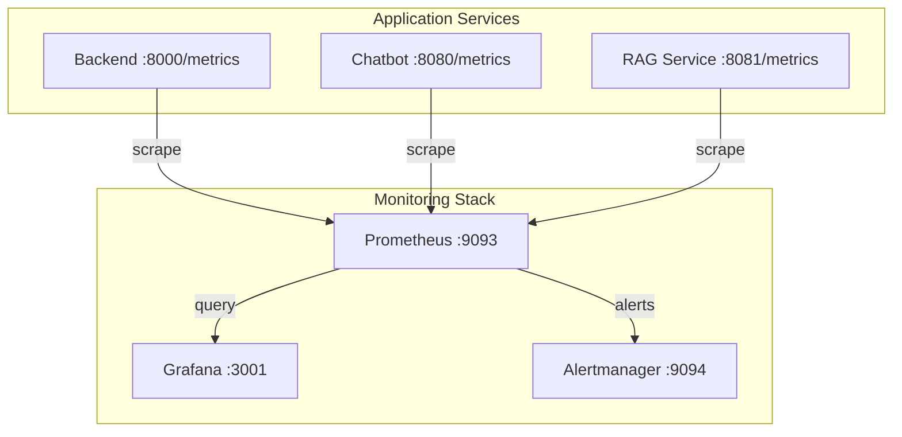
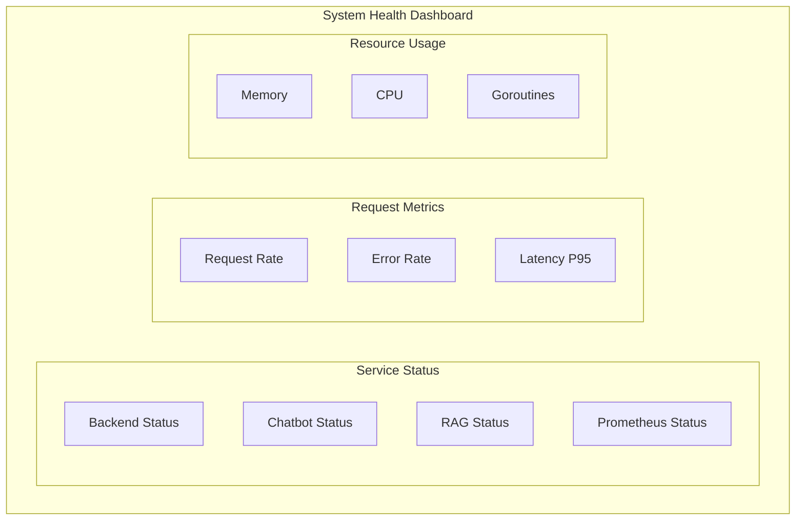

# Monitoring with Prometheus and Grafana

This document describes the monitoring infrastructure using Prometheus for metrics collection and Grafana for visualization.

## Architecture



## Prometheus

### Configuration

```yaml
# prometheus.yml
global:
  scrape_interval: 15s      # How often to scrape targets
  evaluation_interval: 15s  # How often to evaluate rules

rule_files:
  - /etc/prometheus/alert_rules.yml

alerting:
  alertmanagers:
    - static_configs:
        - targets:
            - alertmanager:9093

scrape_configs:
  - job_name: 'prometheus'
    static_configs:
      - targets: ['localhost:9090']

  - job_name: 'backend-gateway'
    static_configs:
      - targets: ['backend:8000']

  - job_name: 'rag_service'
    static_configs:
      - targets: ['rag_service:8081']

  - job_name: 'chatbot'
    static_configs:
      - targets: ['tfg-chatbot:8080']
```

### Scrape Jobs

| Job Name | Target | Metrics Endpoint |
|----------|--------|------------------|
| `prometheus` | localhost:9090 | Self-monitoring |
| `backend-gateway` | backend:8000 | `/metrics` |
| `rag_service` | rag_service:8081 | `/metrics` |
| `chatbot` | tfg-chatbot:8080 | `/metrics` |

### Accessing Prometheus

- **URL**: http://localhost:9093
- **Expression Browser**: Query metrics directly
- **Targets**: http://localhost:9093/targets (check scrape status)

### Common Queries

```promql
# Service availability
up{job="backend-gateway"}

# Request rate (last 5 minutes)
rate(http_requests_total[5m])

# 95th percentile latency
histogram_quantile(0.95, rate(http_request_duration_seconds_bucket[5m]))

# Error rate percentage
sum(rate(http_requests_total{status=~"5.."}[5m])) 
/ 
sum(rate(http_requests_total[5m])) * 100

# Active sessions
tfg_active_sessions_total

# Chat messages per minute
rate(tfg_chat_messages_total[1m]) * 60
```

---

## Grafana

### Access

- **URL**: http://localhost:3001
- **Username**: admin
- **Password**: Set via `GRAFANA_ADMIN_PASSWORD` (default: `admin`)

### Provisioned Datasources

Datasources are automatically configured via provisioning:

```yaml
# grafana/provisioning/datasources/datasources.yml
apiVersion: 1

datasources:
  - name: Prometheus
    type: prometheus
    uid: prometheus
    access: proxy
    url: http://prometheus:9090
    isDefault: true
    jsonData:
      httpMethod: POST
      manageAlerts: true
      prometheusType: Prometheus

  - name: Loki
    type: loki
    uid: loki
    access: proxy
    url: http://loki:3100
    jsonData:
      maxLines: 1000
```

### Provisioned Dashboards

Dashboards are automatically loaded from JSON files:

```yaml
# grafana/provisioning/dashboards/dashboards.yml
apiVersion: 1
providers:
  - name: 'TFG Chatbot Dashboards'
    orgId: 1
    folder: 'TFG Chatbot'
    folderUid: 'tfg-chatbot'
    type: file
    disableDeletion: false
    updateIntervalSeconds: 10
    options:
      path: /etc/grafana/provisioning/dashboards/json
```

### Available Dashboards

#### System Health Dashboard

Location: `grafana/provisioning/dashboards/json/system-health.json`



**Panels:**
- **Service Status**: UP/DOWN indicators for each service
- **Request Rate**: Requests per second graph
- **Error Rate**: 5xx errors over time
- **Latency**: P50, P95, P99 latency graphs
- **Resource Usage**: Memory and CPU per container

#### Logs Dashboard

Location: `grafana/provisioning/dashboards/json/logs.json`

**Panels:**
- **Log Volume**: Logs per service over time
- **Log Stream**: Live log viewer
- **Error Logs**: Filtered error messages
- **Service Filter**: Filter by container/service

---

## Metrics Reference

### Application Metrics

FastAPI services expose metrics via `prometheus-fastapi-instrumentator`:

| Metric | Type | Description |
|--------|------|-------------|
| `http_requests_total` | Counter | Total HTTP requests |
| `http_request_duration_seconds` | Histogram | Request latency |
| `http_requests_in_progress` | Gauge | Current active requests |

### Custom Chatbot Metrics

| Metric | Type | Labels | Description |
|--------|------|--------|-------------|
| `tfg_chat_messages_total` | Counter | `role`, `subject` | Messages sent |
| `tfg_chat_response_time_seconds` | Histogram | `subject` | LLM response time |
| `tfg_test_sessions_total` | Counter | `subject` | Tests started |
| `tfg_rag_queries_total` | Counter | `subject` | RAG queries |

### Phoenix LLM Metrics

Phoenix provides additional LLM-specific observability:

- Token usage per request
- LLM latency breakdown
- Tool call frequency
- Error categorization

Access Phoenix UI at http://localhost:6006

---

## Setting Up Alerts

Alerts are configured in `alertmanager/alert_rules.yml` and evaluated by Prometheus.

### Service Health Alerts

```yaml
groups:
  - name: service_health
    interval: 30s
    rules:
      - alert: ServiceDown
        expr: up == 0
        for: 1m
        labels:
          severity: critical
        annotations:
          summary: "Service {{ $labels.job }} is down"
```

### Performance Alerts

```yaml
      - alert: HighErrorRate
        expr: |
          (sum(rate(http_requests_total{status=~"5.."}[5m])) by (job)
           / sum(rate(http_requests_total[5m])) by (job)) > 0.01
        for: 5m
        labels:
          severity: warning
        annotations:
          summary: "High error rate on {{ $labels.job }}"

      - alert: HighLatency
        expr: |
          histogram_quantile(0.95, 
            sum(rate(http_request_duration_seconds_bucket[5m])) by (le, job)
          ) > 2
        for: 5m
        labels:
          severity: warning
        annotations:
          summary: "High latency on {{ $labels.job }}"
```

---

## Creating Custom Dashboards

### 1. Using Grafana UI

1. Navigate to http://localhost:3001
2. Click **+** → **Dashboard**
3. Add panels with Prometheus queries
4. Save and optionally export as JSON

### 2. Export to Provisioning

1. Create dashboard in UI
2. Dashboard Settings → JSON Model → Copy
3. Save to `grafana/provisioning/dashboards/json/`
4. Restart Grafana or wait for auto-reload

### Example Panel Configuration

```json
{
  "title": "Chat Messages Rate",
  "type": "timeseries",
  "datasource": {
    "type": "prometheus",
    "uid": "prometheus"
  },
  "targets": [
    {
      "expr": "rate(tfg_chat_messages_total[5m])",
      "legendFormat": "{{role}} - {{subject}}"
    }
  ],
  "fieldConfig": {
    "defaults": {
      "unit": "reqps"
    }
  }
}
```

---

## Troubleshooting

### Prometheus Not Scraping

1. Check target status: http://localhost:9093/targets
2. Verify service is running: `docker compose ps`
3. Check network connectivity:
   ```bash
   docker exec prometheus wget -O- http://backend:8000/metrics
   ```

### Grafana Cannot Connect to Prometheus

1. Verify datasource: Configuration → Data Sources → Prometheus → Test
2. Check URL is `http://prometheus:9090` (Docker network)
3. Verify Prometheus is healthy:
   ```bash
   docker inspect --format='{{.State.Health.Status}}' prometheus
   ```

### Missing Metrics

1. Verify metrics endpoint:
   ```bash
   curl http://localhost:8000/metrics
   ```
2. Check for `/metrics` route in application
3. Ensure prometheus-fastapi-instrumentator is configured

### Dashboard Not Loading

1. Check Grafana logs: `docker compose logs grafana`
2. Verify JSON syntax in dashboard files
3. Check folder permissions in container

---

## Best Practices

### Metric Naming

Follow Prometheus naming conventions:
- Use `_total` suffix for counters
- Use `_seconds` or `_bytes` for units
- Use `_info` for metadata labels

### Label Cardinality

Avoid high-cardinality labels:
- ❌ User IDs, session IDs, timestamps
- ✅ Service names, status codes, methods

### Retention

Configure retention based on needs:
```yaml
# In docker-compose.yml
prometheus:
  command:
    - '--storage.tsdb.retention.time=15d'
    - '--storage.tsdb.retention.size=10GB'
```

---

## Related Documentation

- [Alerting](alerting.md) - Alert configuration
- [Logging](logging.md) - Loki integration
- [Docker Compose](docker-compose.md) - Service configuration
