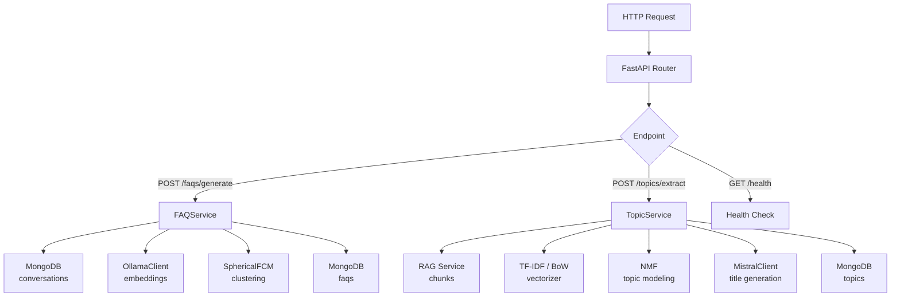

# Math Service Documentation

El **Math Service** es el microservicio de análisis matemático del TFG. Aplica los algoritmos de clustering y topic modeling implementados _desde cero_ en `math_investigation/` para generar FAQs automáticas y extraer los tópicos principales de los documentos de una asignatura.

## Quick Overview

| Aspecto | Detalles |
|---------|---------|
| **Tecnología** | FastAPI, Python 3.13+ |
| **Base de datos** | MongoDB (colecciones `faqs`, `topics`) |
| **Puerto** | 8083 |
| **Propósito** | Generación de FAQs, extracción de tópicos, mapa conceptual |
| **Contenedor** | Docker (Docker Compose) |

## Estructura de directorios

```
math_service/
├── __main__.py              # Punto de entrada
├── api.py                   # Aplicación FastAPI, middlewares, routers
├── config.py                # Configuración (pydantic-settings)
├── logging_config.py        # Logging estructurado JSON
├── Dockerfile               # Definición del contenedor
├── pyproject.toml           # Metadatos y dependencias
├── models/
│   └── __init__.py          # Modelos Pydantic (FAQ, TopicResult, …)
├── routes/
│   ├── general.py           # GET /, GET /health
│   ├── faqs.py              # CRUD + POST /faqs/generate
│   └── topics.py            # POST /topics/extract, GET /topics/{subject}
├── services/
│   ├── clustering.py        # Wrapper sobre math_investigation (K óptimo, centroides)
│   ├── faq_service.py       # Lógica de negocio: generación de FAQs
│   ├── topic_service.py     # Lógica de negocio: extracción de tópicos
│   ├── fcm.py               # SphericalFuzzyCMeans (variante interna)
│   ├── nlp_client.py        # Clientes HTTP: Ollama y Mistral
│   └── nlp/                 # TF-IDF, BoW y NMF internos
└── tests/
    ├── test_api_faqs.py
    ├── test_api_topics.py
    ├── test_clustering.py
    └── test_faq.py
```

## Características principales

- **FAQ automáticas**: Agrupa preguntas históricas de estudiantes con Fuzzy C-Means y selecciona preguntas representativas por clúster.
- **Extracción de tópicos**: Aplica NMF sobre fragmentos RAG para descubrir los temas principales de una asignatura.
- **Mapa conceptual**: Genera un grafo de relaciones entre conceptos para visualización en el dashboard del profesor.
- **Algoritmos desde cero**: Integra las implementaciones del TFG-Matemáticas (sin scikit-learn), incluyendo K-Means, FCM y NMF.
- **Prometheus Metrics**: Instrumentación integrada vía `prometheus-fastapi-instrumentator`.
- **Health Check detallado**: Verifica MongoDB, Ollama y RAG service.

## Documentación

1. **[README.md](./README.md)** — Este archivo, visión general y quick start
2. **[architecture.md](./architecture.md)** — Diseño del sistema, componentes y flujo de datos
3. **[api-endpoints.md](./api-endpoints.md)** — Referencia completa de la API con ejemplos
4. **[algorithms.md](./algorithms.md)** — Algoritmos matemáticos: FCM, NMF, vectorizadores
5. **[configuration.md](./configuration.md)** — Variables de entorno y ajustes
6. **[development.md](./development.md)** — Setup local, tests y flujo de desarrollo
7. **[deployment.md](./deployment.md)** — Docker, producción y dependencias de arranque

## Quick Start

### Prerrequisitos

- Python 3.13+
- uv (gestor de paquetes)
- MongoDB corriendo (o Docker Compose para el stack completo)
- Ollama con modelo `nomic-embed-text`
- RAG Service arrancado

### Setup local

```bash
# Instalar dependencias del servicio
cd math_service
uv sync

# También necesario el módulo de investigación
uv pip install -e "../math_investigation"
```

### Ejecutar localmente

```bash
# Desde la raíz del proyecto
python -m math_service
```

El servicio estará disponible en `http://localhost:8083`.

### Ejecutar tests

```bash
# Todos los tests del servicio
uv run pytest math_service/tests/ -v

# Tests unitarios con cobertura
uv run pytest math_service/tests/ --cov=math_service --cov-report=term-missing

# Solo tests de clustering
uv run pytest math_service/tests/test_clustering.py -v
```

### Docker

```bash
# Build
docker build -t tfg-math-service:latest -f math_service/Dockerfile .

# Run con variables de entorno
docker run -p 8083:8083 --env-file .env tfg-math-service:latest
```

## Documentación de la API

Una vez arrancado el servicio, acceder a:
- **Swagger UI**: http://localhost:8083/docs
- **ReDoc**: http://localhost:8083/redoc
- **Métricas Prometheus**: http://localhost:8083/metrics

## Flujo de solicitudes



## Dependencia de math_investigation

El servicio importa directamente los algoritmos del módulo de investigación matemática:

```python
from math_investigation.clustering.fcm import FuzzyCMeans
from math_investigation.clustering.kmeans import KMeans
from math_investigation.topic_modeling.nmf import NMF
from math_investigation.nlp.tfidf import TFIDFVectorizer
```

Ver [algorithms.md](./algorithms.md) para la referencia completa de algoritmos.

## Tareas comunes

### Generar FAQs para una asignatura

```bash
curl -X POST http://localhost:8083/faqs/generate \
  -H "Content-Type: application/json" \
  -d '{"subject": "iv", "min_cluster_size": 3}'
```

### Extraer tópicos

```bash
curl -X POST http://localhost:8083/topics/extract \
  -H "Content-Type: application/json" \
  -d '{"subject": "iv", "vectorizer_type": "tfidf", "k": null}'
```

### Health check

```bash
curl http://localhost:8083/health
```

## Troubleshooting

### No questions found para generar FAQs

- Verificar que existan conversaciones en MongoDB para la asignatura indicada.
- Comprobar que el campo `query` no esté vacío y `was_test` no sea `true`.

### Ollama no disponible

- Comprobar que Ollama esté corriendo: `curl http://localhost:11434/api/tags`
- Verificar las variables `OLLAMA_HOST` y `OLLAMA_PORT` en `.env`.
- El servicio arrancará igualmente pero `/health` mostrará `status: "degraded"`.

### RAG Service no responde

- Comprobar que `RAG_SERVICE_URL` apunte al servicio correcto.
- Los tópicos no se podrán extraer sin los fragmentos de documentos.

## Servicios relacionados

- **[RAG Service](../rag_service/README.md)** — Proporciona los fragmentos de documentos para extracción de tópicos
- **[Backend](../backend/README.md)** — Gateway que expone los resultados de este servicio al frontend
- **[Chatbot](../chatbot/README.md)** — Utiliza las FAQs publicadas para enriquecer respuestas
- **[math_investigation/](../../../math_investigation/)** — Módulo matemático con las implementaciones de algoritmos
