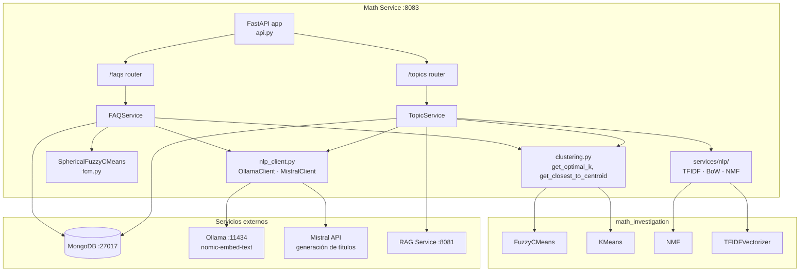
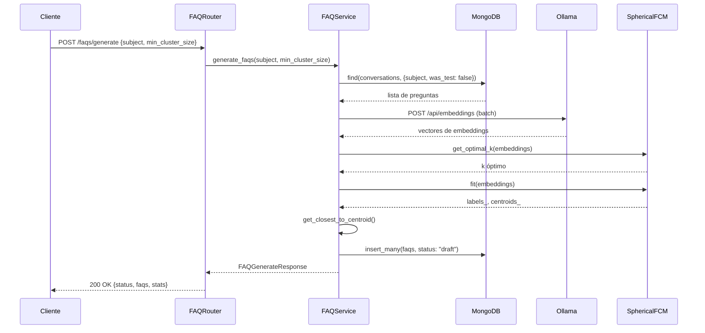
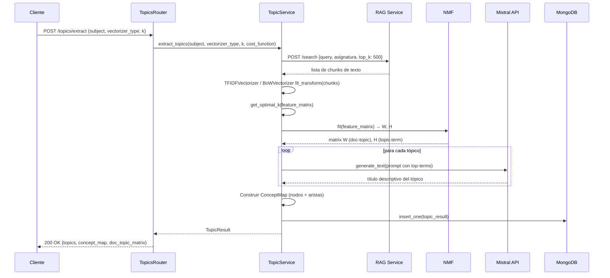

# Math Service — Arquitectura

Este documento describe el diseño arquitectónico del Math Service, incluyendo componentes, modelos de datos y cómo interactúan entre sí.

## Arquitectura del sistema

### Vista de alto nivel



## Componentes principales

### 1. Aplicación FastAPI (`api.py`)

Punto de entrada de la aplicación. Se encarga de:
- Registrar todos los routers (`/faqs`, `/topics`, general)
- Configurar middleware CORS
- Instrumentar Prometheus con `prometheus-fastapi-instrumentator`
- Añadir middleware de Correlation ID para trazabilidad en logs JSON

```python
app = FastAPI(title="Math Service", version="0.1.0")
Instrumentator().instrument(app).expose(app)
app.add_middleware(CorrelationIdMiddleware)
app.include_router(faqs_router)
app.include_router(topics_router)
```

**Endpoints expuestos:**
- `GET /` — Información del servicio
- `GET /health` — Health check detallado (MongoDB + Ollama + RAG)
- `GET /metrics` — Métricas Prometheus
- `POST /faqs/generate` — Generación de FAQs
- `GET /faqs/{subject}` — Listado de FAQs
- `PUT|PATCH|DELETE /faqs/{subject}/{id}` — CRUD de FAQs
- `POST /topics/extract` — Extracción de tópicos
- `GET /topics/{subject}` — Historial de extracciones

---

### 2. Configuración (`config.py`)

Usa `pydantic-settings BaseSettings` para gestión de configuración type-safe. Carga variables desde `.env` con defaults sensatos para Docker Compose.

Grupos de configuración:
- **MongoDB**: `mongo_uri`, `mongo_hostname`, `mongo_port`, credenciales
- **Ollama**: `ollama_host`, `ollama_port`, `ollama_model`, `ollama_generation_model`
- **Mistral**: `mistral_api_key`, `mistral_model`
- **RAG Service**: `rag_service_url`
- **API**: `api_host`, `api_port`, `cors_origins`

Ver [configuration.md](./configuration.md) para la referencia completa.

---

### 3. Rutas (`routes/`)

#### `routes/general.py`

Endpoints de estado e información:
- `GET /` → nombre, versión, descripción, status
- `GET /health` → verifica MongoDB, Ollama y RAG Service de forma independiente

#### `routes/faqs.py`

Gestión de FAQs:
- `POST /faqs/generate` → delega a `FAQService.generate_faqs()`
- `GET /faqs/{subject_id}` → consulta directa a MongoDB, ordenado por `cluster_size` desc
- `PUT /faqs/{subject_id}/{faq_id}` → actualización parcial de campos
- `PATCH /faqs/{subject_id}/{faq_id}/publish` → cambia status a `"published"`
- `PATCH /faqs/{subject_id}/{faq_id}/unpublish` → cambia status a `"draft"`
- `DELETE /faqs/{subject_id}/{faq_id}` → eliminación por ObjectId

#### `routes/topics.py`

Extracción de tópicos:
- `POST /topics/extract` → delega a `TopicService.extract_topics()`
- `GET /topics/{subject_id}` → historial de extracciones de MongoDB

---

### 4. Servicios de negocio (`services/`)

#### `services/faq_service.py` — FAQService

Orquesta el pipeline completo de generación de FAQs:

```
MongoDB(conversations) → embeddings(Ollama) → K óptimo → SphericalFCM → representativas → MongoDB(faqs)
```

Métodos clave:
- `gather_student_questions(subject, limit)` — Obtiene preguntas reales (filtra `was_test=True`, longitud > 5)
- `generate_faqs(subject, min_cluster_size)` — Pipeline completo de FAQs

#### `services/topic_service.py` — TopicService

Orquesta el pipeline de extracción de tópicos:

```
RAG Service(chunks) → TF-IDF/BoW → NMF → términos top → Mistral(título) → ConceptMap → MongoDB(topics)
```

Métodos clave:
- `get_subject_chunks(subject, top_k)` — Obtiene fragmentos del RAG Service vía POST `/search`
- `extract_topics(subject, vectorizer_type, k, cost_function)` — Pipeline completo

#### `services/clustering.py`

Utilidades de clustering que hacen de wrapper sobre `math_investigation`:
- `get_optimal_k(X, max_k)` — Determina k óptimo mediante método del codo (SSE)
- `get_closest_to_centroid(X, labels, centroids)` — Selecciona el índice del punto más cercano a cada centroide

#### `services/fcm.py` — SphericalFuzzyCMeans

Variante interna de FCM optimizada para embeddings de texto (datos en alta dimensión):
- Normaliza embeddings a la esfera unitaria antes del clustering
- Usa distancia coseno en lugar de euclidiana
- Más robusta para representaciones semánticas densas

#### `services/nlp_client.py`

Clientes HTTP a servicios de IA externos:
- `OllamaClient` — Genera embeddings via `POST /api/embeddings` de Ollama
- `MistralClient` — Genera texto (títulos de tópicos) via la API de Mistral

#### `services/nlp/`

Implementaciones internas de vectorizadores y NMF para topic modeling (alternativas más ligeras a `math_investigation` para uso en producción):
- `tfidf.py` — TFIDFVectorizer con stopwords en español/inglés
- `bow.py` — BoWVectorizer (Bag of Words)
- `nmf.py` — NMF con reglas de actualización multiplicativa, costes Frobenius y KL

---

### 5. Modelos de datos (`models/__init__.py`)

Todos los modelos Pydantic del servicio:

| Modelo | Descripción |
|--------|-------------|
| `HealthCheckResponse` | Resultado del health check (status, flags por servicio) |
| `FAQ` | Pregunta frecuente con asignatura, tamaño y estado |
| `FAQGenerateRequest` | Parámetros de generación (subject, min_cluster_size) |
| `FAQGenerateResponse` | Resultado de la generación (stats + lista de FAQs) |
| `TopicExtractRequest` | Parámetros de extracción (subject, vectorizer, k, cost_function) |
| `TopicDetails` | Un tópico: índice, nombre, términos, peso |
| `ConceptNode` | Nodo del mapa conceptual (id, grupo, etiqueta) |
| `ConceptLink` | Arista del mapa conceptual (source, target, value) |
| `ConceptMap` | Grafo completo de conceptos |
| `TopicResult` | Resultado completo de extracción (tópicos + mapa + matriz doc-tópico) |

---

## Flujo de generación de FAQs



---

## Flujo de extracción de tópicos



---

## Colecciones MongoDB

El servicio usa la base de datos `tfg_chatbot` (compartida entre microservicios). Escribe exclusivamente en `faqs` y `topics`. Lee de `conversations`.

### `conversations` (solo lectura)

```json
{
  "_id": ObjectId,
  "subject": "iv",
  "query": "¿Cómo funciona Docker Compose?",
  "was_test": false,
  "timestamp": ISODate
}
```

### `faqs` (escritura propia)

```json
{
  "_id": ObjectId,
  "question": "¿Cómo funciona Docker Compose?",
  "answer": "",
  "subject": "iv",
  "cluster_size": 12,
  "status": "draft",
  "created_at": ISODate
}
```

Estado (`status`): `"draft"` → requiere revisión antes de publicar. `"published"` → visible en el sistema.

### `topics` (escritura propia)

```json
{
  "_id": ObjectId,
  "subject": "iv",
  "clusters_formed": 5,
  "topics": [{"cluster": 0, "topic_name": "contenedores_docker", "terms": [...], "weight": 0.34}],
  "concept_map": {"nodes": [...], "links": [...]},
  "doc_topic_matrix": [[0.8, 0.1, ...]],
  "created_at": ISODate,
  "source_chunks": 142
}
```

---

## Integración con math_investigation

El servicio integra los algoritmos del TFG-Matemáticas siguiendo la decisión de arquitectura [ADR 0039](../../devlog/adr/0039-math-investigation-production-integration.md):

- `math_investigation` se instala como paquete Python editable en el mismo entorno
- Los algoritmos se importan directamente (sin wrappers intermedios salvo `clustering.py`)
- Las implementaciones internas en `services/nlp/` son variantes ligeras para casos específicos de producción

Ver [algorithms.md](./algorithms.md) para la documentación detallada de los algoritmos.

## Consideraciones de seguridad

- El servicio **no implementa autenticación** propia — se accede internamente desde el backend y desde el frontend a través del backend
- Las credenciales de MongoDB y la API key de Mistral se gestionan via variables de entorno (`SecretStr`)
- Los inputs de asignatura son strings simples; los ObjectIds se validan con `ObjectId.is_valid()` antes de usarlos en queries
- El CORS está configurado via `cors_origins` (por defecto `["*"]` para desarrollo; restringir en producción)

## ADRs relacionadas

- [ADR 0036](../../devlog/adr/0036-clustering-algorithms.md) — Selección de algoritmos (FCM vs K-Means)
- [ADR 0038](../../devlog/adr/0038-math-service-microservice.md) — Decisión de crear math_service como microservicio
- [ADR 0039](../../devlog/adr/0039-math-investigation-production-integration.md) — Estrategia de integración de math_investigation
