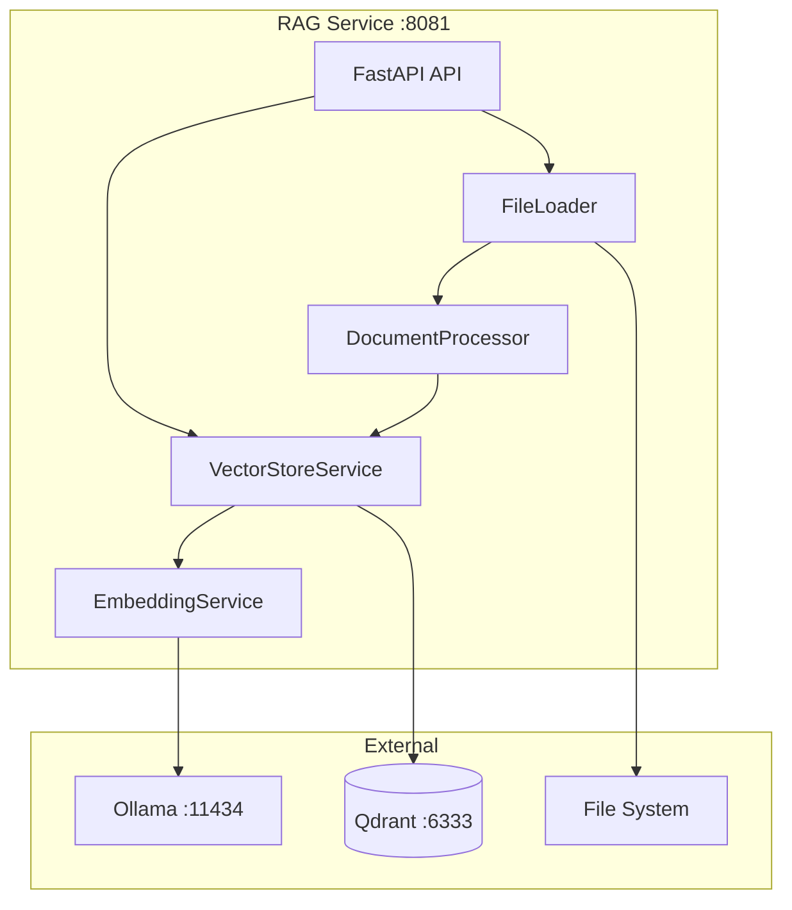

# RAG Service Documentation

Quick navigation for RAG service documentation.

## Contents

| Document | Description |
|----------|-------------|
| [README](README.md) | Overview and quick start |
| [Architecture](architecture.md) | System design and data flow |
| [API Endpoints](api-endpoints.md) | Complete API reference |
| [Embeddings](embeddings.md) | Ollama embedding service |
| [Vector Store](vector-store.md) | Qdrant integration |
| [Document Processing](document-processing.md) | Chunking and file loading |
| [Configuration](configuration.md) | Environment variables |
| [Development](development.md) | Local setup and testing |
| [Deployment](deployment.md) | Docker and production |

## Quick Reference

### Start Service

```bash
# With Docker Compose
docker compose up -d qdrant ollama rag_service

# Initialize model
docker exec ollama ollama pull nomic-embed-text

# Local development
cd rag_service
pip install -e ".[dev]"
uvicorn rag_service.api:app --reload --port 8081
```

### Key URLs

| URL | Purpose |
|-----|---------|
| http://localhost:8081 | API root |
| http://localhost:8081/health | Health check |
| http://localhost:8081/docs | Swagger UI |
| http://localhost:8081/metrics | Prometheus metrics |
| http://localhost:6333/dashboard | Qdrant UI |

### Common API Calls

```bash
# Health check
curl http://localhost:8081/health

# Semantic search
curl -X POST http://localhost:8081/search \
  -H "Content-Type: application/json" \
  -d '{"query": "fuzzy logic", "asignatura": "logica-difusa"}'

# Upload file
curl -X POST http://localhost:8081/upload \
  -F "file=@document.pdf" \
  -F 'metadata={"asignatura":"iv","tipo_documento":"teoria","auto_index":true}'

# List files
curl http://localhost:8081/files

# List subjects
curl http://localhost:8081/subjects
```

### Configuration

| Variable | Default | Description |
|----------|---------|-------------|
| `QDRANT_HOST` | `qdrant` | Vector DB host |
| `OLLAMA_HOST` | `ollama` | Embedding host |
| `OLLAMA_MODEL` | `nomic-embed-text` | Embedding model |
| `TOP_K_RESULTS` | `5` | Search results |
| `SIMILARITY_THRESHOLD` | `0.5` | Min score |

## Architecture Diagram



## Data Flow

1. **Upload**: File → FileLoader → Document
2. **Process**: Document → DocumentProcessor → Chunks
3. **Embed**: Chunks → EmbeddingService → Vectors
4. **Store**: Vectors → VectorStoreService → Qdrant
5. **Search**: Query → Embedding → Qdrant → Results

---

[← Back to Services](../index.md)
