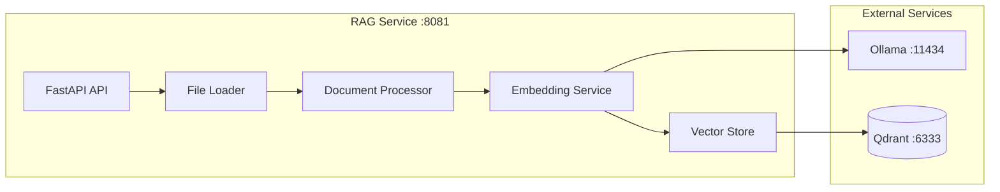

# RAG Service

Retrieval-Augmented Generation service for the TFG educational chatbot. Provides document management, semantic search, and vector storage using Qdrant and Ollama embeddings.

## Overview



## Key Features

- 📄 **Document Management**: Upload, list, and organize documents by subject and type
- 🔍 **Semantic Search**: Find relevant content using natural language queries
- 🧩 **Automatic Chunking**: Split documents for optimal retrieval
- 🔢 **Embedding Generation**: Convert text to vectors via Ollama (nomic-embed-text)
- 🗃️ **Vector Storage**: Efficient similarity search with Qdrant
- 📊 **Prometheus Metrics**: Built-in monitoring and instrumentation

## Quick Start

### Local Development

```bash
# Install dependencies
cd rag_service
pip install -e ".[dev]"

# Set environment variables
export QDRANT_HOST=localhost
export OLLAMA_HOST=localhost

# Start the service
uvicorn rag_service.api:app --reload --port 8081
```

### Docker

```bash
# Start with dependencies
docker compose up -d qdrant ollama rag_service

# Initialize embedding model
docker exec ollama ollama pull nomic-embed-text
```

### API Access

- **API**: http://localhost:8081
- **Health**: http://localhost:8081/health
- **Metrics**: http://localhost:8081/metrics

## API Endpoints

| Method | Endpoint | Description |
|--------|----------|-------------|
| GET | `/health` | Health check with Qdrant status |
| POST | `/search` | Semantic search with filters |
| POST | `/index` | Index documents |
| GET | `/files` | List available files |
| POST | `/upload` | Upload and index file |
| POST | `/load-file` | Index existing file |
| GET | `/subjects` | List subjects |
| GET | `/subjects/{asignatura}/types` | List document types |
| GET | `/collection/info` | Qdrant collection stats |

## Document Organization

```
documents/
├── logica-difusa/
│   ├── apuntes/
│   │   └── tema1.pdf
│   └── ejercicios/
│       └── practica1.md
├── iv/
│   ├── teoria/
│   │   └── docker.pdf
│   └── examenes/
│       └── examen-2024.pdf
```

## Configuration

| Variable | Default | Description |
|----------|---------|-------------|
| `QDRANT_HOST` | `qdrant` | Qdrant server hostname |
| `QDRANT_PORT` | `6333` | Qdrant server port |
| `OLLAMA_HOST` | `ollama` | Ollama server hostname |
| `OLLAMA_PORT` | `11434` | Ollama API port |
| `OLLAMA_MODEL` | `nomic-embed-text` | Embedding model |
| `EMBEDDING_DIMENSION` | `768` | Vector dimension |
| `TOP_K_RESULTS` | `5` | Default search results |
| `SIMILARITY_THRESHOLD` | `0.5` | Minimum similarity score |
| `CHUNK_SIZE` | `1000` | Document chunk size |
| `CHUNK_OVERLAP` | `200` | Chunk overlap |

## Dependencies

- **Qdrant**: Vector database for similarity search
- **Ollama**: Local LLM inference for embeddings
- **LangChain**: Document processing and chunking

## Documentation

| Document | Description |
|----------|-------------|
| [Architecture](architecture.md) | System design and data flow |
| [API Endpoints](api-endpoints.md) | Complete API reference |
| [Embeddings](embeddings.md) | Embedding service and models |
| [Vector Store](vector-store.md) | Qdrant integration |
| [Document Processing](document-processing.md) | Chunking and loading |
| [Configuration](configuration.md) | Environment variables |
| [Development](development.md) | Local setup and testing |
| [Deployment](deployment.md) | Docker and production |

---

[← Back to Services](../index.md)
