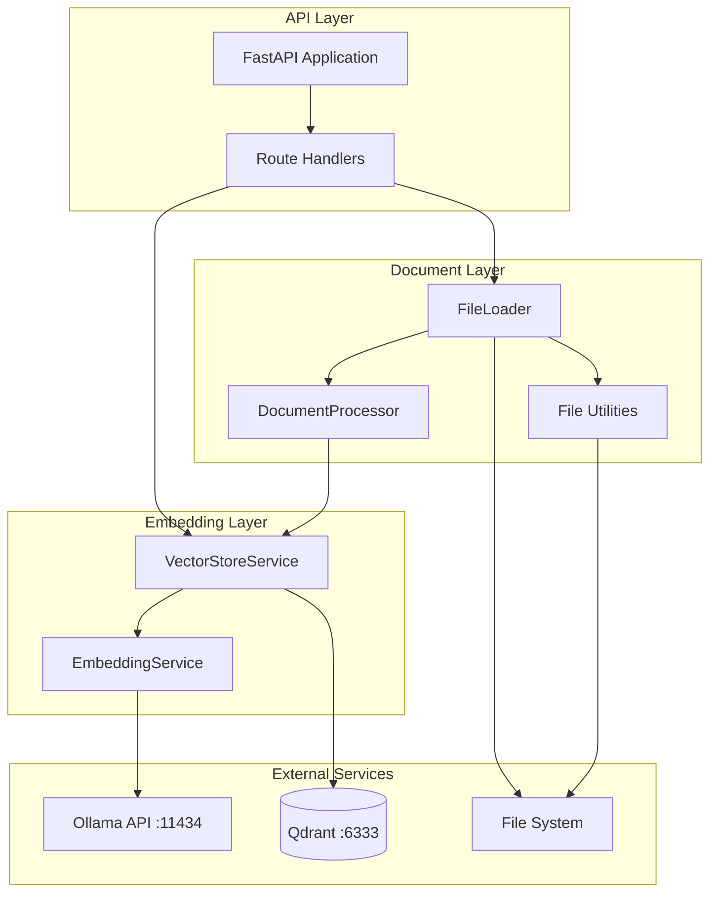
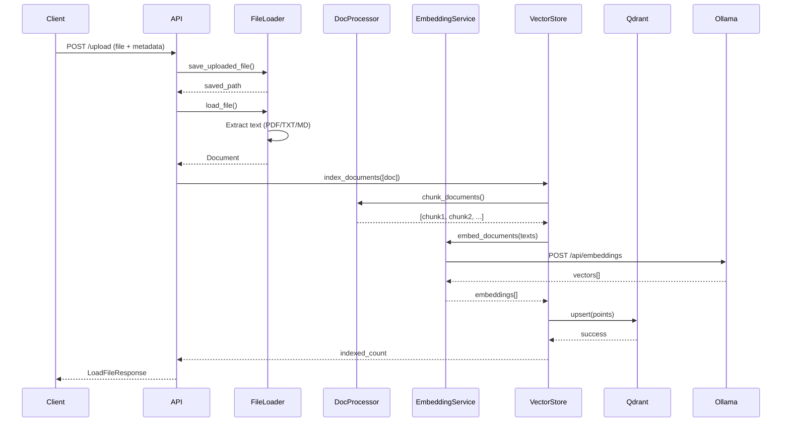
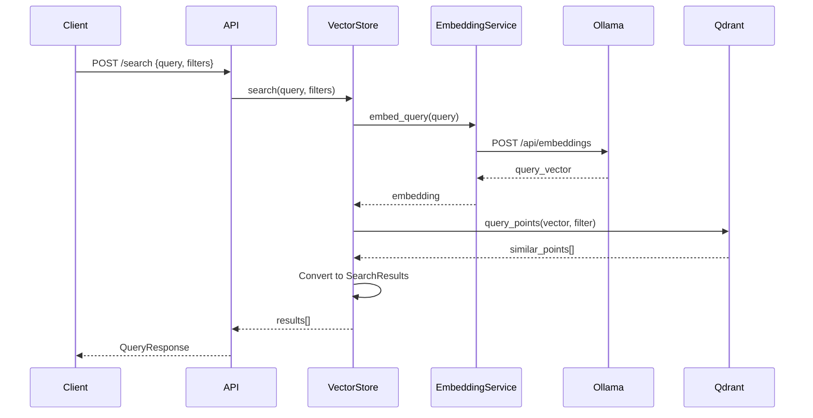
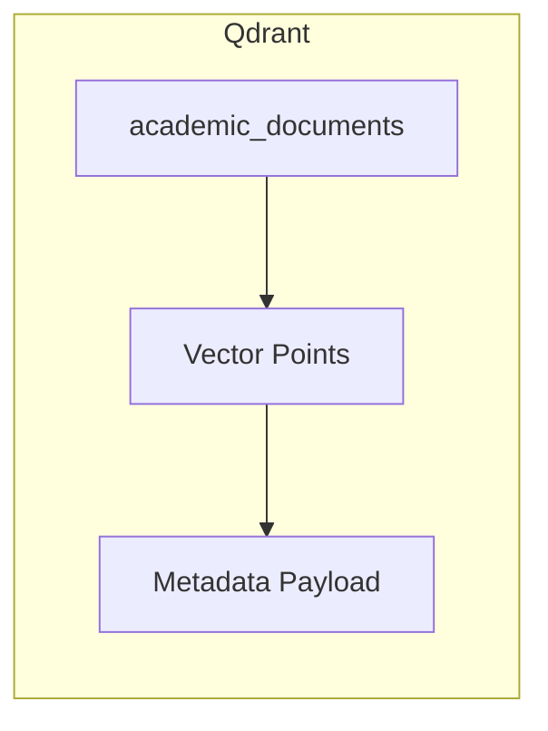
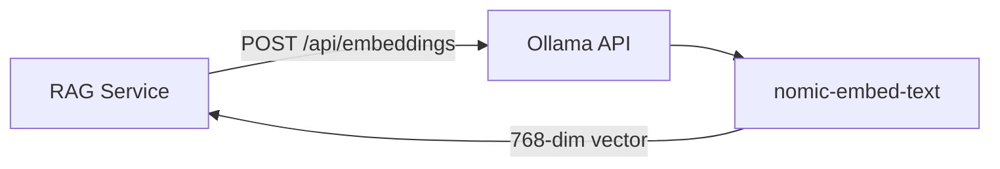

# RAG Service Architecture

This document describes the internal architecture and data flow of the RAG (Retrieval-Augmented Generation) service.

## High-Level Architecture



## Component Overview

### API Layer

| Component | File | Purpose |
|-----------|------|---------|
| FastAPI App | `api.py` | Application entry point, middleware |
| General Routes | `routes/general.py` | Health check, root endpoint |
| Search Routes | `routes/search_index.py` | Search and indexing |
| File Routes | `routes/files.py` | File management, upload |
| Subject Routes | `routes/subjects.py` | Subject discovery |

### Document Layer

| Component | File | Purpose |
|-----------|------|---------|
| FileLoader | `documents/file_loader.py` | Load files (PDF, TXT, MD) |
| DocumentProcessor | `documents/document_processor.py` | Text chunking |
| File Utilities | `documents/file_utils.py` | File system operations |

### Embedding Layer

| Component | File | Purpose |
|-----------|------|---------|
| EmbeddingService | `embeddings/embeddings.py` | Generate text embeddings |
| VectorStoreService | `embeddings/store.py` | Qdrant operations |

---

## Data Flow

### Document Indexing Flow



### Semantic Search Flow



---

## Module Structure

```
rag_service/
├── api.py                    # FastAPI application
├── config.py                 # Settings (pydantic-settings)
├── models.py                 # Pydantic request/response models
├── logging_config.py         # Structured logging setup
│
├── routes/                   # API endpoints
│   ├── general.py            # / and /health
│   ├── search_index.py       # /search, /index, /collection/info
│   ├── files.py              # /files, /upload, /load-file
│   └── subjects.py           # /subjects
│
├── documents/                # Document processing
│   ├── file_loader.py        # FileLoader class
│   ├── document_processor.py # DocumentProcessor (chunking)
│   └── file_utils.py         # list_files, list_subjects, etc.
│
├── embeddings/               # Vector operations
│   ├── embeddings.py         # EmbeddingService (Ollama)
│   └── store.py              # VectorStoreService (Qdrant)
│
└── tests/                    # Unit and integration tests
```

---

## Key Design Patterns

### Singleton Services

Global service instances ensure single connections:

```python
# embeddings/store.py
_vector_store: VectorStoreService | None = None

def get_vector_store() -> VectorStoreService:
    global _vector_store
    if _vector_store is None:
        _vector_store = VectorStoreService()
    return _vector_store
```

Used for:
- `VectorStoreService` - Single Qdrant connection
- `EmbeddingService` - Single Ollama connection
- `DocumentProcessor` - Consistent chunking config
- `FileLoader` - Single file system root

### Metadata Schema

All documents use consistent metadata:

```python
class DocumentMetadata(BaseModel):
    filename: str | None
    asignatura: str           # Subject (required)
    tipo_documento: str       # Document type (required)
    fecha: str | None         # Date (ISO format)
    tema: str | None          # Topic
    autor: str | None         # Author
    fuente: str = "PRADO UGR" # Source
    idioma: str = "es"        # Language
    chunk_id: int | None      # Chunk index
    licencia: str | None      # License
```

### Layered Processing

Documents flow through three layers:

```
Raw File → FileLoader → Document → DocProcessor → Chunks → VectorStore → Qdrant
```

Each layer has single responsibility:
1. **FileLoader**: Extract text from files
2. **DocProcessor**: Split into optimal chunks
3. **VectorStore**: Embed and store in Qdrant

---

## External Dependencies

### Qdrant

Vector database for similarity search:



Configuration:
- Collection: `academic_documents`
- Distance: COSINE
- Vector size: 768 (nomic-embed-text)

### Ollama

Local embedding generation:



Model: `nomic-embed-text` (768 dimensions)

---

## Error Handling

### HTTP Exceptions

```python
# Standard error responses
HTTPException(404, "File not found")
HTTPException(400, "Unsupported file type")
HTTPException(500, "Search failed: {error}")
```

### Health Check

Returns service status with Qdrant connection:

```python
HealthCheckResponse(
    status="healthy" | "unhealthy",
    qdrant_connected=True | False,
    collection={...} | None,
    message="..."
)
```

---

## Observability

### Prometheus Metrics

Auto-instrumented via `prometheus-fastapi-instrumentator`:

- `http_requests_total` - Request count
- `http_request_duration_seconds` - Latency histogram
- `http_requests_in_progress` - Active requests

Access: `GET /metrics`

### Structured Logging

JSON logs with correlation IDs:

```json
{
  "timestamp": "2024-01-15T10:30:00Z",
  "level": "INFO",
  "message": "Search called",
  "correlation_id": "abc123",
  "query": "What is Docker?",
  "top_k": 5
}
```

---

## Related Documentation

- [API Endpoints](api-endpoints.md) - Complete API reference
- [Embeddings](embeddings.md) - Embedding service details
- [Vector Store](vector-store.md) - Qdrant integration
- [Document Processing](document-processing.md) - Chunking strategies
