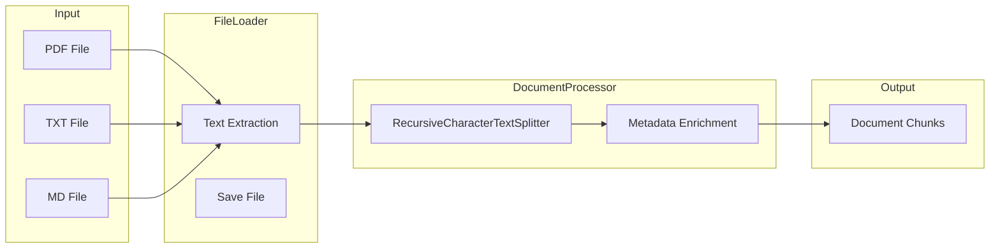
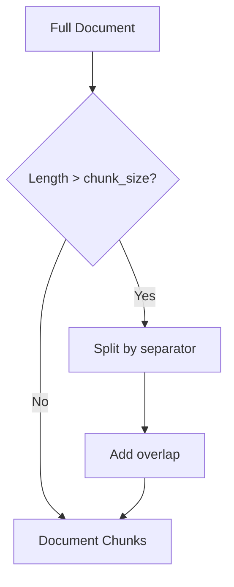
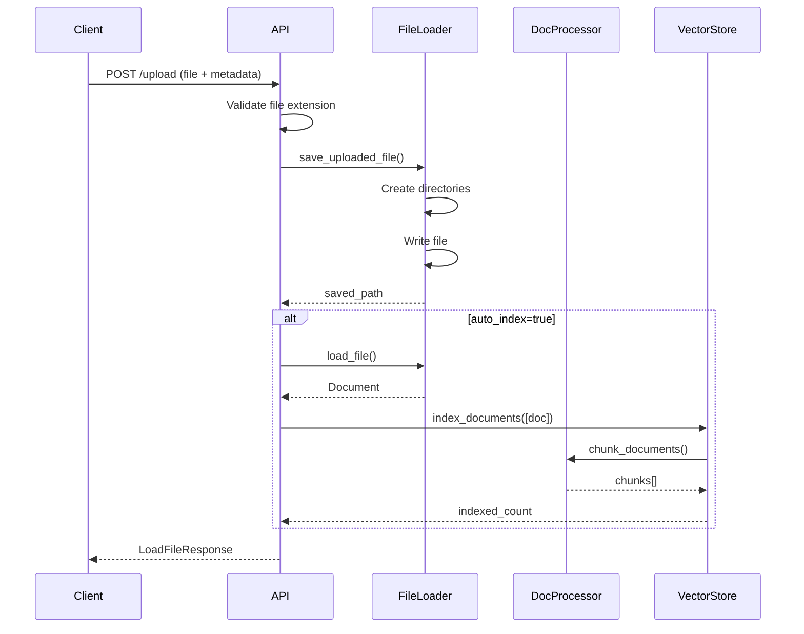

# Document Processing

This document describes the document loading, text extraction, and chunking system.

## Overview

The document processing pipeline handles:
1. **File Loading**: Extract text from PDF, TXT, MD files
2. **Text Chunking**: Split documents into optimal chunks
3. **Metadata Enrichment**: Add chunk IDs and preserve metadata



---

## File Organization

Documents are organized by subject and type:

```
documents/
├── logica-difusa/
│   ├── apuntes/
│   │   ├── tema1.pdf
│   │   └── tema2.pdf
│   ├── ejercicios/
│   │   └── practica1.md
│   └── examenes/
│       └── examen-2024.pdf
├── iv/
│   ├── teoria/
│   │   └── docker.pdf
│   └── practicas/
│       └── practica1.md
```

### Directory Structure

| Level | Purpose | Example |
|-------|---------|---------|
| Root | `documents/` | Base directory |
| 1st | Subject (asignatura) | `logica-difusa/` |
| 2nd | Document type | `apuntes/` |
| 3rd | Files | `tema1.pdf` |

---

## FileLoader Class

Located in `documents/file_loader.py`:

```python
class FileLoader:
    """Service for loading documents from files."""
    
    def load_file(self, filename: str, metadata: DocumentMetadata) -> Document:
        """Load a file and create a Document object."""
        
    def load_text_file(self, filepath: Path, metadata: DocumentMetadata) -> Document:
        """Load a plain text file."""
        
    def load_pdf_file(self, filepath: Path, metadata: DocumentMetadata) -> Document:
        """Load a PDF file and extract text."""
        
    def save_uploaded_file(self, file_content: bytes, filename: str,
                          asignatura: str, tipo_documento: str) -> Path:
        """Save an uploaded file to the documents directory."""
```

### Supported File Types

| Extension | Handler | Library |
|-----------|---------|---------|
| `.txt` | `load_text_file` | Built-in |
| `.pdf` | `load_pdf_file` | `pypdf` |
| `.md`, `.markdown` | `load_text_file` | Built-in |
| `.docx` | Planned | `python-docx` |

### Usage

```python
from rag_service.documents.file_loader import get_file_loader
from rag_service.models import DocumentMetadata

loader = get_file_loader()

# Define metadata
metadata = DocumentMetadata(
    asignatura="logica-difusa",
    tipo_documento="apuntes",
    tema="Conjuntos difusos",
    autor="Profesor"
)

# Load file
document = loader.load_file("logica-difusa/apuntes/tema1.pdf", metadata)
print(f"Content length: {len(document.content)}")
```

### PDF Extraction

```python
def load_pdf_file(self, filepath: Path, metadata: DocumentMetadata) -> Document:
    from pypdf import PdfReader
    
    reader = PdfReader(filepath)
    content = ""
    for page in reader.pages:
        content += page.extract_text() + "\n"
    
    return Document(
        content=content,
        metadata=metadata,
        doc_id=filepath.stem
    )
```

---

## DocumentProcessor Class

Located in `documents/document_processor.py`:

```python
class DocumentProcessor:
    """Service for processing and chunking documents."""
    
    def chunk_document(self, document: Document) -> list[Document]:
        """Split a single document into chunks."""
        
    def chunk_documents(self, documents: list[Document]) -> list[Document]:
        """Split multiple documents into chunks."""
        
    def estimate_tokens(self, text: str) -> int:
        """Estimate token count for text."""
```

### Chunking Parameters

| Parameter | Default | Description |
|-----------|---------|-------------|
| `chunk_size` | 1000 | Maximum characters per chunk |
| `chunk_overlap` | 200 | Overlap between chunks |
| `separators` | See below | Split hierarchy |

### Default Separators

```python
separators = [
    "\n\n",  # Paragraph breaks
    "\n",    # Line breaks
    ". ",    # Sentences
    ", ",    # Clauses
    " ",     # Words
    "",      # Characters
]
```

### Chunking Strategy

Uses LangChain's `RecursiveCharacterTextSplitter`:



### Usage

```python
from rag_service.documents.document_processor import get_document_processor
from rag_service.models import Document, DocumentMetadata

processor = get_document_processor(
    chunk_size=500,
    chunk_overlap=100
)

# Create a long document
doc = Document(
    content="Very long document text..." * 100,
    metadata=DocumentMetadata(
        asignatura="iv",
        tipo_documento="teoria"
    )
)

# Chunk it
chunks = processor.chunk_document(doc)
print(f"Split into {len(chunks)} chunks")

# Each chunk has updated metadata
for chunk in chunks:
    print(f"Chunk {chunk.metadata.chunk_id}: {len(chunk.content)} chars")
```

### Chunk Metadata

Each chunk inherits parent metadata with added `chunk_id`:

```python
# Original document metadata
{
    "asignatura": "iv",
    "tipo_documento": "teoria",
    "tema": "Docker"
}

# Chunk metadata
{
    "asignatura": "iv",
    "tipo_documento": "teoria",
    "tema": "Docker",
    "chunk_id": 0,  # Added
    "filename": "docker.pdf"  # Preserved
}
```

---

## File Utilities

Located in `documents/file_utils.py`:

### List Files

```python
from rag_service.documents.file_utils import list_files

# All files
files = list_files()

# Filter by subject
files = list_files(asignatura="iv")

# Filter by subject and type
files = list_files(asignatura="iv", tipo_documento="teoria")
```

### List Subjects

```python
from rag_service.documents.file_utils import list_subjects

subjects = list_subjects()
# ['iv', 'logica-difusa', 'ingenieria-software']
```

### List Document Types

```python
from rag_service.documents.file_utils import list_document_types

types = list_document_types("iv")
# ['teoria', 'practicas', 'examenes']
```

### File Info

```python
from rag_service.documents.file_utils import get_file_info

info = get_file_info("iv/teoria/docker.pdf")
# {
#     "filename": "docker.pdf",
#     "size_bytes": 245678,
#     "size_kb": 239.92,
#     "extension": "pdf",
#     "modified": "2024-01-15T10:30:00Z"
# }
```

### Delete File

```python
from rag_service.documents.file_utils import delete_file

delete_file("iv/teoria/old-doc.pdf")
```

---

## Configuration

### Chunking Settings

| Variable | Default | Description |
|----------|---------|-------------|
| `CHUNK_SIZE` | `1000` | Characters per chunk |
| `CHUNK_OVERLAP` | `200` | Overlap between chunks |

### Documents Path

| Variable | Default | Description |
|----------|---------|-------------|
| `DOCUMENTS_PATH` | `/app/documents` | Base directory |

---

## Upload Workflow

### Complete Upload Flow



### Save Uploaded File

```python
def save_uploaded_file(self, file_content: bytes, filename: str,
                      asignatura: str, tipo_documento: str) -> Path:
    # Create directory structure
    dir_path = self.documents_path / asignatura / tipo_documento
    dir_path.mkdir(parents=True, exist_ok=True)
    
    # Save file
    file_path = dir_path / filename
    with open(file_path, 'wb') as f:
        f.write(file_content)
    
    return file_path
```

---

## Best Practices

### Chunk Size Selection

| Use Case | Chunk Size | Overlap |
|----------|------------|---------|
| Q&A | 500-1000 | 100-200 |
| Summarization | 1500-2000 | 200-300 |
| Code | 1000-1500 | 100-150 |

### Metadata Guidelines

Always include:
- `asignatura` (required)
- `tipo_documento` (required)
- `tema` (recommended)
- `fuente` (recommended)

### File Naming

- Use lowercase
- Replace spaces with hyphens
- Avoid special characters
- Include topic in name: `tema1-conjuntos-difusos.pdf`

---

## Testing

### Unit Tests

```python
# tests/test_document_processor.py

def test_chunk_small_document():
    """Small documents should not be chunked."""
    processor = DocumentProcessor(chunk_size=1000)
    doc = Document(content="Short text", metadata=...)
    
    chunks = processor.chunk_document(doc)
    assert len(chunks) == 1
    assert chunks[0].content == "Short text"

def test_chunk_large_document():
    """Large documents should be split."""
    processor = DocumentProcessor(chunk_size=100, chunk_overlap=20)
    doc = Document(content="x" * 500, metadata=...)
    
    chunks = processor.chunk_document(doc)
    assert len(chunks) > 1
    for chunk in chunks:
        assert len(chunk.content) <= 100 + 20  # Allow for overlap
```

### File Loader Tests

```python
# tests/test_file_loader.py

def test_load_text_file(tmp_path):
    # Create test file
    test_file = tmp_path / "test.txt"
    test_file.write_text("Test content")
    
    loader = FileLoader(str(tmp_path))
    doc = loader.load_text_file(test_file, metadata)
    
    assert doc.content == "Test content"
    assert doc.doc_id == "test"
```

---

## Error Handling

### Common Errors

| Error | Cause | Solution |
|-------|-------|----------|
| `FileNotFoundError` | File doesn't exist | Check path |
| `UnsupportedFileType` | Invalid extension | Use supported format |
| `PermissionError` | Can't write | Check permissions |
| `PDFExtractionError` | Corrupt PDF | Try different PDF |

### Validation

```python
def _validate_file_extension(filename: str) -> str:
    extension = filename.split(".")[-1].lower()
    supported = ["txt", "pdf", "md", "markdown"]
    
    if extension not in supported:
        raise HTTPException(
            status_code=400,
            detail=f"Unsupported: {extension}. Use: {supported}"
        )
    
    return extension
```

---

## Related Documentation

- [Vector Store](vector-store.md) - Document indexing
- [API Endpoints](api-endpoints.md) - File endpoints
- [Architecture](architecture.md) - System design
