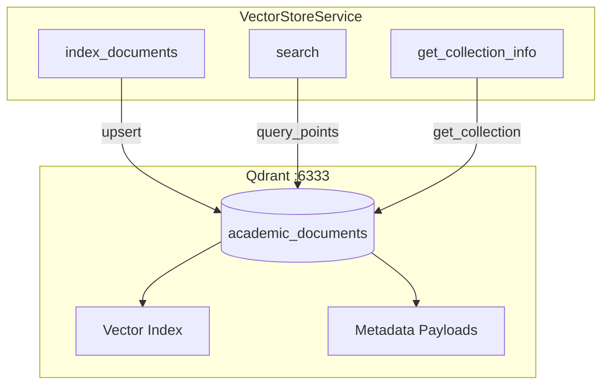
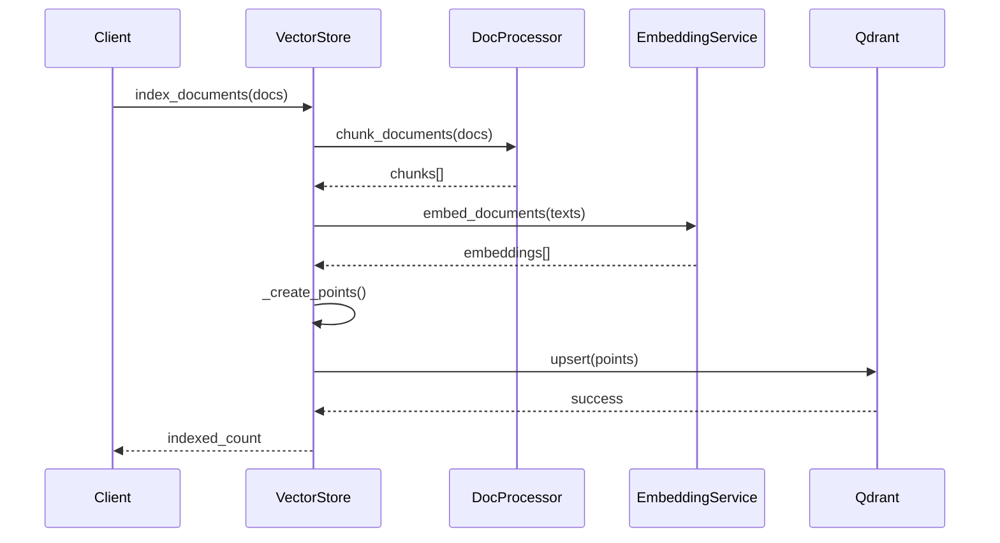

# Vector Store with Qdrant

This document describes the vector storage and retrieval system using Qdrant for semantic search.

## Overview

The RAG service uses Qdrant as the vector database for storing document embeddings and performing similarity searches.



## VectorStoreService Class

Located in `embeddings/store.py`:

```python
class VectorStoreService:
    """Service for managing Qdrant vector store."""
    
    def index_documents(self, documents: list[Document], auto_chunk: bool = True) -> int:
        """Index documents into the vector store."""
        
    def search(self, query: str, top_k: int = 5, 
               score_threshold: float = 0.5,
               filters: dict[str, str] | None = None) -> list[SearchResult]:
        """Perform semantic search over indexed documents."""
        
    def get_collection_info(self) -> dict[str, Any]:
        """Get information about the Qdrant collection."""
        
    def delete_collection(self):
        """Delete the collection and all its data."""
```

---

## Collection Configuration

### Default Settings

| Setting | Value | Description |
|---------|-------|-------------|
| **Name** | `academic_documents` | Collection name |
| **Distance** | `COSINE` | Similarity metric |
| **Vector Size** | `768` | Embedding dimensions |

### Collection Initialization

The collection is created automatically on first access:

```python
def _init_collection(self):
    collections = self.client.get_collections().collections
    collection_names = [c.name for c in collections]
    
    if self.collection_name not in collection_names:
        self.client.create_collection(
            collection_name=self.collection_name,
            vectors_config=VectorParams(
                size=settings.embedding_dimension,
                distance=Distance.COSINE,
            ),
        )
```

---

## Document Indexing

### Indexing Flow



### Usage

```python
from rag_service.embeddings.store import get_vector_store
from rag_service.models import Document, DocumentMetadata

vector_store = get_vector_store()

# Create document
doc = Document(
    content="Fuzzy logic is a form of many-valued logic...",
    metadata=DocumentMetadata(
        asignatura="logica-difusa",
        tipo_documento="apuntes",
        tema="Introducción"
    )
)

# Index with automatic chunking
indexed_count = vector_store.index_documents([doc], auto_chunk=True)
print(f"Indexed {indexed_count} chunks")
```

### Point Structure

Each document chunk is stored as a Qdrant point:

```python
PointStruct(
    id=idx,
    vector=embedding,  # 768-dim float array
    payload={
        "content": "Document text content...",
        "filename": "tema1.pdf",
        "asignatura": "logica-difusa",
        "tipo_documento": "apuntes",
        "tema": "Introducción",
        "chunk_id": 0,
        # ... other metadata
    }
)
```

---

## Semantic Search

### Search Parameters

| Parameter | Type | Default | Description |
|-----------|------|---------|-------------|
| `query` | string | required | Natural language query |
| `top_k` | int | 5 | Maximum results |
| `score_threshold` | float | 0.5 | Minimum similarity (0-1) |
| `filters` | dict | None | Metadata filters |

### Basic Search

```python
results = vector_store.search(
    query="What is a membership function?",
    top_k=5
)

for result in results:
    print(f"Score: {result.score:.2f}")
    print(f"Content: {result.content[:100]}...")
    print(f"Subject: {result.metadata['asignatura']}")
```

### Filtered Search

```python
# Filter by subject
results = vector_store.search(
    query="Docker containers",
    filters={"asignatura": "iv"}
)

# Filter by subject and document type
results = vector_store.search(
    query="Practice exercises",
    filters={
        "asignatura": "logica-difusa",
        "tipo_documento": "ejercicios"
    }
)
```

### Score Threshold

Adjust the minimum similarity score:

```python
# High precision (fewer, more relevant results)
results = vector_store.search(
    query="fuzzy sets",
    score_threshold=0.8
)

# High recall (more results, some less relevant)
results = vector_store.search(
    query="fuzzy sets",
    score_threshold=0.3
)
```

---

## Filter Implementation

Filters are converted to Qdrant conditions:

```python
def search(self, query, filters=None):
    qdrant_filter = None
    
    if filters:
        conditions = []
        for key, value in filters.items():
            conditions.append(
                FieldCondition(
                    key=key,
                    match=MatchValue(value=value),
                )
            )
        qdrant_filter = Filter(must=conditions)
    
    results = self.client.query_points(
        collection_name=self.collection_name,
        query=query_embedding,
        query_filter=qdrant_filter,
        ...
    )
```

### Available Filter Fields

| Field | Type | Example |
|-------|------|---------|
| `asignatura` | string | `"logica-difusa"` |
| `tipo_documento` | string | `"apuntes"` |
| `tema` | string | `"Conjuntos difusos"` |
| `autor` | string | `"Profesor"` |
| `fuente` | string | `"PRADO UGR"` |
| `idioma` | string | `"es"` |

---

## Collection Management

### Get Collection Info

```python
info = vector_store.get_collection_info()
print(info)
# {
#     "name": "academic_documents",
#     "vectors_count": 156,
#     "points_count": 156,
#     "status": "green"
# }
```

### Delete Collection

⚠️ **Warning**: This permanently deletes all indexed documents.

```python
vector_store.delete_collection()
# Collection will be recreated on next index operation
```

---

## Configuration

Environment variables:

| Variable | Default | Description |
|----------|---------|-------------|
| `QDRANT_HOST` | `qdrant` | Qdrant server hostname |
| `QDRANT_PORT` | `6333` | Qdrant server port |
| `QDRANT_COLLECTION_NAME` | `academic_documents` | Collection name |
| `TOP_K_RESULTS` | `5` | Default search results |
| `SIMILARITY_THRESHOLD` | `0.5` | Default score threshold |

---

## Qdrant Client Usage

### Direct Client Access

```python
from qdrant_client import QdrantClient

client = QdrantClient(host="localhost", port=6333)

# List collections
collections = client.get_collections()
print([c.name for c in collections.collections])

# Get collection details
info = client.get_collection("academic_documents")
print(f"Points: {info.points_count}")
print(f"Status: {info.status}")
```

### Qdrant Web UI

Access the Qdrant dashboard:
```
http://localhost:6333/dashboard
```

Features:
- Browse collections
- View points and payloads
- Test searches
- Monitor performance

---

## Performance Optimization

### Indexing Batch Size

For large document sets:

```python
# Process in batches to avoid memory issues
BATCH_SIZE = 100
for i in range(0, len(documents), BATCH_SIZE):
    batch = documents[i:i + BATCH_SIZE]
    vector_store.index_documents(batch)
```

### Search Optimization

1. **Use filters**: Narrow search scope
2. **Tune top_k**: Request only needed results
3. **Adjust threshold**: Balance precision/recall

### Index Configuration

For production, consider:

```python
# In Qdrant config
{
    "optimizers_config": {
        "indexing_threshold": 10000,
        "memmap_threshold": 50000
    },
    "hnsw_config": {
        "m": 16,
        "ef_construct": 100
    }
}
```

---

## Error Handling

### Common Errors

| Error | Cause | Solution |
|-------|-------|----------|
| `Connection refused` | Qdrant not running | Start Qdrant container |
| `Collection not found` | Collection deleted | Will auto-create on index |
| `Dimension mismatch` | Wrong embedding model | Delete collection, re-index |

### Retry Logic

```python
from tenacity import retry, stop_after_attempt, wait_exponential

@retry(stop=stop_after_attempt(3), wait=wait_exponential(multiplier=1))
def robust_search(query):
    return vector_store.search(query)
```

---

## Testing

### Unit Tests

```python
# tests/test_vector_store.py

def test_index_documents(vector_store, sample_documents):
    count = vector_store.index_documents(sample_documents)
    assert count > 0

def test_search(vector_store):
    results = vector_store.search("test query")
    assert isinstance(results, list)
    for result in results:
        assert hasattr(result, 'content')
        assert hasattr(result, 'score')
        assert 0 <= result.score <= 1
```

### Integration Tests

```python
@pytest.mark.integration
def test_full_pipeline():
    # Index
    doc = Document(content="Test content", metadata=...)
    indexed = vector_store.index_documents([doc])
    assert indexed > 0
    
    # Search
    results = vector_store.search("Test")
    assert len(results) > 0
    assert "Test" in results[0].content
```

---

## Docker Setup

### Qdrant Container

```yaml
# docker-compose.yml
qdrant:
  image: qdrant/qdrant:latest
  container_name: qdrant
  ports:
    - "6333:6333"
    - "6334:6334"  # gRPC
  volumes:
    - qdrant_storage:/qdrant/storage
  restart: unless-stopped
```

### Verify Connection

```bash
# Check Qdrant health
curl http://localhost:6333/healthz

# List collections
curl http://localhost:6333/collections
```

---

## Related Documentation

- [Embeddings](embeddings.md) - Embedding service
- [Document Processing](document-processing.md) - Chunking
- [API Endpoints](api-endpoints.md) - Search API
- [Architecture](architecture.md) - System design
